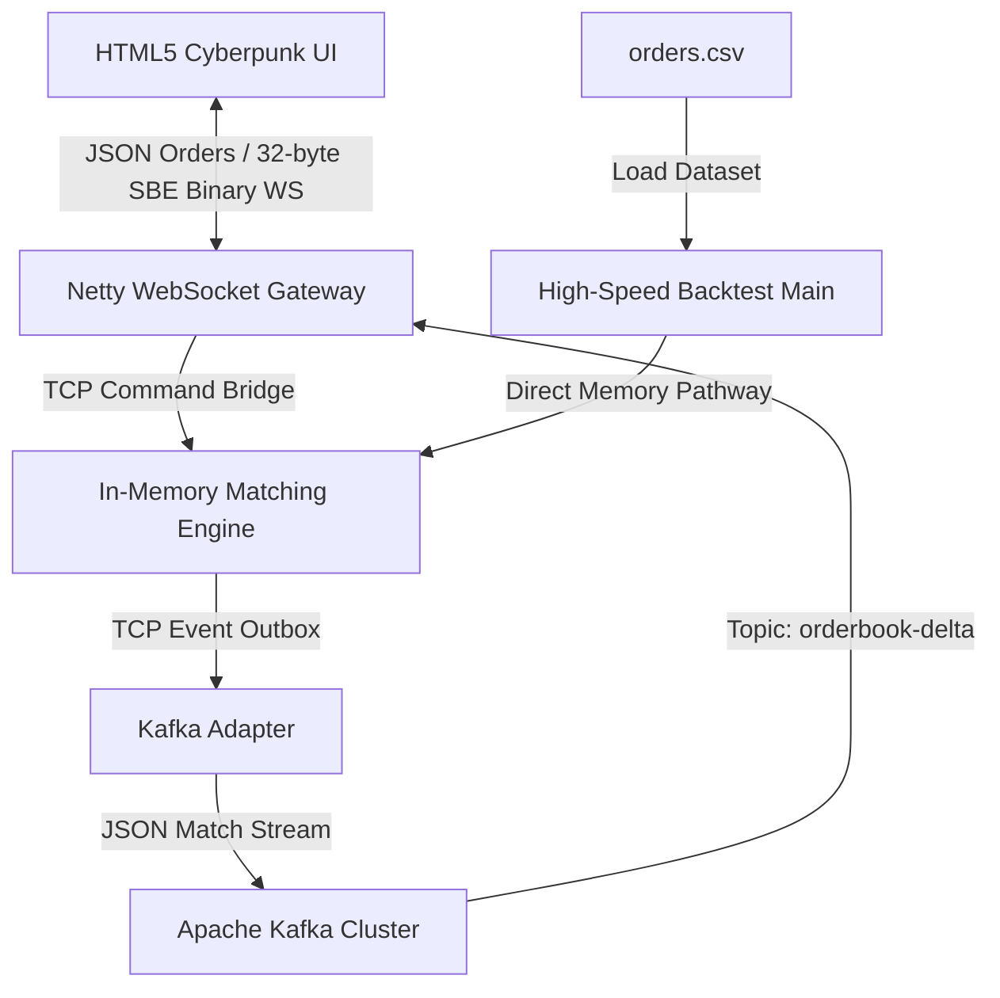

# 🌌 Quantum Exchange (HF-X)

초저지연(Ultra-Low Latency) 인메모리 가격-시간 우선(FIFO) 매칭 엔진, 실시간 시세 분배 웹소켓 게이트웨이, 초고속 오프라인 백테스팅 프레임워크를 갖춘 차세대 암호화폐/증권 거래소 백엔드 플랫폼.

---

## 🚀 주요 성능 지표 (Benchmark)

로컬 머신(OpenJDK 17 환경)에서 오프라인 백테스터를 구동해 측정한 매칭 엔진의 순수 처리 한계 성능.

| 지표 (Metric) | 측정 결과 (Performance Metrics) |
| :--- | :--- |
| **초당 주문 처리량 (Throughput)** | **1,885,547.64 orders/sec** (초당 188만+ 건 매칭) |
| **평균 매칭 지연 시간 (Latency)** | **530.35 nanoseconds/order** (건당 0.53마이크로초) |
| **JVM JIT 예열 기능 (JIT Warmup)** | 지원 (JIT 최적화 컴파일 경로 반영) |
| **동적 시뮬레이션 데이터** | 10,000건의 실시간 주문 및 체결 시나리오 (`orders.csv` 자동 생성) |

---

## 🏛️ 플랫폼 시스템 아키텍처



---

## 📂 프로젝트 모듈 구성 및 역할

Gradle 멀티 모듈 및 Docker Compose 환경 기반의 분산 아키텍처.

```text
exchange-be/
├─ engine-core/       # [Core] 인메모리 단일 스레드 매칭 엔진 (FIFO 우선순위 호가창 관리)
│                     # - Port 9999: 실시간 주문/취소 명령어 수신 (TCP)
│                     # - Port 9998: 실시간 체결/잔량 이벤트 브로드캐스트 (TCP)
├─ adapter-kafka/     # [Adapter] 엔진 TCP 이벤트를 수집하여 Apache Kafka 토픽으로 발행
├─ adapter-ws/        # [Gateway] Netty 비동기 기반 웹소켓 게이트웨이 (Port 8080)
│                     # - 시세 이벤트를 32바이트 이진 데이터로 직렬화하여 클라이언트에 브로드캐스트
│                     # - 클라이언트 주문 접수/취소 JSON을 엔진 수신 포트(9999)로 라우팅 (양방향 브릿지)
├─ order-generator/   # [Simulator] 시장 유동성을 공급하는 실시간 모의 거래 스크립트
├─ frontend/          # [Client] HTML5 Canvas 기반의 60FPS 실시간 초고속 거래 터미널 (index.html)
└─ backtest/          # [Profile] 인메모리 매칭 속도 프로파일링용 초고속 오프라인 백테스터
```

---

## 💻 클라이언트 이진 데이터 포맷 (32-Byte Binary Frame)

Netty 웹소켓 게이트웨이는 대역폭 소모 및 가비지 컬렉터(GC) 부하 최소화를 위해 데이터를 고정 **32바이트 이진(Binary)** 포맷으로 직렬화해 전송함.

```text
+-----------------------+-------------------+--------------------+-------------------+-------------------+
|  SymbolId (4 Bytes)   |   Seq (8 Bytes)   |   Price (8 Bytes)  |   Qty (8 Bytes)   |   Side (4 Bytes)  |
|      (Int32 BE)       |    (Int64 BE)     |     (Int64 BE)     |    (Int64 BE)     |    (Int32 BE)     |
+-----------------------+-------------------+--------------------+-------------------+-------------------+
```
*   **SymbolId**: 거래 페어 해시 ID
*   **Seq**: 매칭 트랜잭션 시퀀스 번호
*   **Price**: 정수 스케일링 가격 (실제 가격 × 100)
*   **Qty**: 가격 변동 수량 (신규 매수/매도 시 `+`, 매칭 및 체결 시 `-`)
*   **Side**: `0` (매수/Bid), `1` (매도/Ask)

---

## ⚙️ 다중 프로파일 개발 환경 분리 (Multi-Profile Architecture)

성능 튜닝, 가상 네트워크 격리, 로그 I/O 오버헤드 통제를 위해 외부 프레임워크(Spring Cloud Config 등) 없이 **순수 Java 기반** 다중 프로파일 설정 시스템(`ConfigLoader.java`)으로 구현함.

### 🌟 지원 프로파일 종류
1. **`local` (`.env.local`)**: 로컬 호스트 단독 개발 및 디버깅용. 루프백 주소(`localhost`)로 바인딩되며 최상위 상세 로그(`LOG_LEVEL=DEBUG`)를 출력함.
2. **`dev` (`.env.dev`)**: 컨테이너 클러스터 기동용. 컨테이너 내부 브릿지 DNS 주소(`kafka`, `engine`) 기반으로 상호 연결됨.
3. **`qa` (`.env.qa`)**: 부하 및 성능 벤치마킹용. 텔레메트리 및 HDR 히스토그램(`TELEMETRY_ENABLED=true` / `HDR_HISTOGRAM_ENABLED=true`) 활성화.
4. **`prd` (`.env.prd`)**: 초저지연 운영용. 로그 출력을 최소화(`LOG_LEVEL=WARN`)해 디스크 I/O 병목을 배제하고, 저지연 ZGC 튜닝 힌트를 포함함.

### ⚙️ 계층식 변수 확인 및 우선순위 (Resolution Precedence)
`ConfigLoader`는 기동 시 다음 우선순위에 따라 설정을 탐색하고 첫 번째 매칭값을 적용함:
1. **JVM 시스템 프로퍼티** (예: `-Denv.profile=local` 혹은 `-DCOMMAND_PORT=9999`) [최우선]
2. **OS 환경 변수** (예: `ENV_PROFILE=local`)
3. **프로파일별 `.env.<profile>` 설정 파일** [최하위]

---

## 🛠️ 시작 가이드 (Quick Start)

### 🚀 1. 분산 마이크로서비스 가동 (Docker Compose)
Kafka, Zookeeper, 매칭 엔진, 어댑터, 주문 제너레이터 등 전체 스택을 로컬 도커 가상 네트워크에 기동함.
- `docker-compose.yml`은 내부적으로 개발용 `.env.dev` 설정을 자동 매핑하여 구동함.

1. Docker Desktop 실행 상태 확인.
2. 프로젝트 루트 폴더(`c:\git\exchange_be\`)에서 다음 명령 실행:
   ```powershell
   docker compose up --build -d
   ```
3. 서비스 구동 상태 확인:
   ```powershell
   docker compose ps
   ```

---

### 📊 2. 실시간 사이버펑크 거래 터미널 실행 (Frontend)
1. 도커 컴포즈 가동 중인 상태에서 `frontend/index.html`을 브라우저로 엶.
2. 우측 상단의 연결 표시등이 **`CONNECTED` (녹색)** 상태인지 확인.
3. 시뮬레이터가 유입하는 실시간 오더북 호가 변동 및 **HTML5 Canvas 깊이 차트** 확인.
4. 좌측 **주문 터미널(Order Terminal)**을 통해 직접 주문을 제출하고 실시간으로 즉시 매칭 및 호가 반영이 일어나는 피드백 루프 검증.

---

### ⏱️ 3. 초고속 인메모리 매칭 오프라인 백테스트 구동
외부 지연 요소(네트워크, 디스크 I/O)를 배제한 순수 엔진 핵심 성능 벤치마크.

**1) 소스코드 컴파일 (Javac):**
```powershell
javac -d build_backtest -sourcepath "engine-core\src\main\java;backtest\src\main\java" backtest\src\main\java\exchange\backtest\BacktestMain.java
```

**2) 백테스트 시뮬레이션 수행:**
```powershell
java -cp build_backtest exchange.backtest.BacktestMain
```

> **참고**: 루트 디렉터리에 `orders.csv` 파일이 없을 경우, 백테스트 프레임워크(`CsvFeed.java`)가 즉시 10,000건 규모의 가상 HFT 주문 데이터셋을 자동으로 생성하고 시뮬레이션을 실행함.

---

## 🎨 프론트엔드 터미널 디자인 하이라이트
*   **Ambient Glow Layout**: 네온 시안과 네온 핑크의 선명한 대비로 오더북 시각성 극대화.
*   **60FPS Canvas Depth Polygon**: 실시간 누적 매수/매도 깊이를 다각형 면적으로 시각화 렌더링.
*   **Micro-interactions**: 부드러운 마우스 오버 반응 및 주문 처리 시 팝업 버블 알림 탑재.
