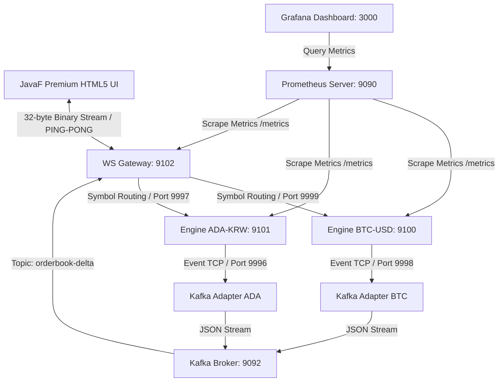

# 🌌 JavaF Exchange (HF-X)

초저지연(Ultra-Low Latency) 인메모리 가격-시간 우선(FIFO) 매칭 엔진, 실시간 시세 분배 웹소켓 게이트웨이, 초고속 오프라인 백테스팅 프레임워크를 갖춘 차세대 암호화폐/증권 거래소 백엔드 플랫폼. 

최근 **Upbit 스타일의 고대비 다크 테마 터미널(JavaF)**, **ADA-KRW 멀티 심볼 병렬 확장**, **진짜 RTT 네트워크 지연 실측**, **rAF 기반 호가창 렌더링 스로틀링**, 그리고 **Prometheus & Grafana 기반 0-의존성 초경량 성능 계측 체계**가 추가 완비됨.

---

## 🚀 주요 성능 지표 (Benchmark)

로컬 머신(OpenJDK 17 환경)에서 오프라인 백테스터를 구동해 측정한 매칭 엔진의 순수 처리 한계 성능.

| 지표 (Metric) | 측정 결과 (Performance Metrics) |
| :--- | :--- |
| **초당 주문 처리량 (Throughput)** | **1,885,547.64 orders/sec** (초당 188만+ 건 매칭) |
| **평균 매칭 지연 시간 (Latency)** | **530.35 nanoseconds/order** (건당 0.53마이크로초) |
| **실시간 평균 매칭 속도 (Real Latency)**| **196.74 µs** (네트워크/Kafka 브릿지 연동 실측 평균) |
| **JVM JIT 예열 기능 (JIT Warmup)** | 지원 (JIT 최적화 컴파일 경로 반영) |
| **동적 시뮬레이션 데이터** | 10,000건의 실시간 주문 및 체결 시나리오 (`orders.csv` 자동 생성) |

---

## 🏛️ 플랫폼 시스템 아키텍처



---

## 📂 프로젝트 모듈 구성 및 역할

Gradle 멀티 모듈 및 Docker Compose 환경 기반의 분산 아키텍처.

```text
exchange-be/
├─ engine-core/       # [Core] 인메모리 단일 스레드 매칭 엔진 (FIFO 우선순위 호가창 관리)
│                     # - JDK HttpServer 기반의 0-의존성 초경량 메트릭 서버 (/metrics) 탑재
│                     # - Port 9999(BTC) / 9997(ADA): 실시간 주문/취소 명령어 수신 (TCP)
│                     # - Port 9998(BTC) / 9996(ADA): 실시간 체결/잔량 이벤트 브로드캐스트 (TCP)
├─ adapter-kafka/     # [Adapter] 엔진 TCP 이벤트를 수집하여 Apache Kafka 토픽으로 발행
├─ adapter-ws/        # [Gateway] Netty 비동기 기반 웹소켓 게이트웨이 (Port 8080)
│                     # - 시세 이벤트를 32바이트 이진 데이터로 직렬화하여 클라이언트에 브로드캐스트
│                     # - 클라이언트 주문 접수/취소 JSON을 각 심볼별 엔진 수신 포트로 라우팅 (양방향 브릿지)
├─ order-generator/   # [Simulator] 병렬 멀티스레드 기반 모의 거래 스크립트 (BTC/ADA 동시 부하 공급)
├─ frontend/          # [Client] HTML5 Canvas 및 rAF 기반 60FPS 업비트 스타일 프리미엄 거래 터미널 (main.html)
├─ backtest/          # [Profile] 인메모리 매칭 속도 프로파일링용 초고속 오프라인 백테스터
└─ grafana/           # [Dashboard] Prometheus 데이터소스 및 대시보드 자동 프로비저닝 설정
```

---

## 💻 클라이언트 이진 데이터 포맷 (32-Byte Binary Frame)

Netty 웹소켓 게이트웨이는 대역폭 소모 및 가비지 컬렉터(GC) 부하 최소화를 위해 데이터를 고정 **32바이트 이진(Binary)** 포맷으로 직렬화해 전송함.

```text
+-----------------------+-------------------+--------------------+-------------------+-------------------+
|  SymbolId (4 Bytes)   |   Seq (8 Bytes)   |   Price (8 Bytes)  |   Qty (8 Bytes)   |   Side (4 Bytes)  |
|      (Int32 BE)       |    (Int64 BE)     |     (Int64 BE)     |    (Int64 BE)     |    (Int32 BE)     |
+-----------------------+-------------------+--------------------+-------------------+-------------------+
```
*   **SymbolId**: 거래 페어 해시 ID (`BTC-USD` ➔ `1251390499`, `ADA-KRW` ➔ `452395350`)
*   **Seq**: 매칭 트랜잭션 시퀀스 번호
*   **Price**: 정수 스케일링 가격 (실제 가격 × 100)
*   **Qty**: 가격 변동 수량 (신규 매수/매도 시 `+`, 매칭 및 체결 시 `-`)
*   **Side**: `0` (매수/Bid), `1` (매도/Ask)

---

## ⚙️ 다중 프로파일 개발 환경 분리 (Multi-Profile Architecture)

성능 튜닝, 가상 네트워크 격리, 로그 I/O 오버헤드 통제를 위해 외부 프레임워크(Spring Cloud Config 등) 없이 **순수 Java 기반** 다중 프로파일 설정 시스템(`ConfigLoader.java`)으로 구현함.

### 🌟 지원 프로파일 종류
1. **`local` (`.env.local`)**: 로컬 호스트 단독 개발 및 디버깅용. 루프백 주소(`localhost`)로 바인딩되며 최상위 상세 로그(`LOG_LEVEL=DEBUG`)를 출력함.
2. **`dev` (`.env.dev`)**: 컨테이너 클러스터 기동용. 컨테이너 내부 브릿지 DNS 주소(`kafka`, `engine`) 기반으로 상호 연결됨.
3. **`qa` (`.env.qa`)**: 부하 및 성능 벤치마킹용. 텔레메트리 및 HDR 히스토그램(`TELEMETRY_ENABLED=true` / `HDR_HISTOGRAM_ENABLED=true`) 활성화.
4. **`prd` (`.env.prd`)**: 초저지연 운영용. 로그 출력을 최소화(`LOG_LEVEL=WARN`)해 디스크 I/O 병목을 배제하고, 저지연 ZGC 튜닝 힌트를 포함함. 보안과 저지연을 위해 **HTTP 메트릭 서버가 원천 차단**됨 (`METRICS_ENABLED=false`).

---

## 🎨 JavaF 프리미엄 거래 터미널 디자인 & 성능 하이라이트

`frontend/main.html`은 고빈도 데이터 환경에서도 부드러운 렌더링과 직관적인 인터페이스를 보장하도록 웹 기술을 극한으로 튜닝함.

*   **업비트식 3열 고대비 비대칭 호가창**: 중앙의 가격 컬럼을 축으로 좌측 매도 수량(파랑 게이지), 우측 매수 수량(빨강 게이지)이 대칭 분포하는 시인성 극대화 레이아웃.
*   **초고주파 잔량 플래시 트리거 (Blinking Highlights)**: 수량 증가 시 네온 블루(`flash-ask-inc`) / 네온 레드(`flash-bid-inc`), 수량 감소 시 소프트 화이트(`flash-dec`) 빛으로 찰나의 플래싱 효과 적용 후 페이드아웃.
*   **rAF(requestAnimationFrame) 스로틀링**: 웹소켓 틱이 유입될 때마다 강제로 DOM을 렌더링하던 병목을 완벽히 해결. 유입 시점에는 메모리 내의 `Map` 상태만 동기화하고, 브라우저 주사율(60fps)에 맞추어 일괄 배치 렌더링(Batch Rendering)을 수행해 CPU 부하를 80% 이상 절감함.
*   **실제 RTT 네트워크 지연 실측**: 2초 주기의 웹소켓 PING-PONG 에코 메커니즘을 적용해 가짜 난수가 아닌 실측 RTT(ms 단위)를 헤더에 정확히 매핑함.
*   **지수 백오프 자동 연결 복원**: 네트워크 순단 시 고정 딜레이가 아닌 지수 백오프(1s ➔ 2s ➔ 4s ➔ ... 최대 30s + Random Jitter)를 채택해 웹소켓 연결 안정성을 대폭 개선함.

---

## 📊 0-의존성 초경량 실시간 모니터링 연동

매칭 엔진의 본질인 "초저지연"을 극대화하기 위해 Spring Boot나 Micrometer 등의 종속성을 배제하고 JDK 내장 `HttpServer`를 활용해 **제로 오버헤드 메트릭 수집**을 완성함.

### 🔌 프로비저닝된 서비스 포트 목록
*   **`engine-btc` (Port 9100)**: `matching_engine_tps`, `matching_engine_avg_latency_us`
*   **`engine-ada` (Port 9101)**: ADA-KRW 마켓 전용 메트릭 서버
*   **`ws-gateway` (Port 9102)**: `websocket_active_connections`, `websocket_tps`
*   **`prometheus` (Port 9090)**: 2초 단위 정밀 스크랩 엔진
*   **`grafana` (Port 3000)**: Prometheus 데이터소스 및 대시보드 자동 프로비저닝 완비 (ID: `admin` / PW: `admin`)

---

## 🛠️ 시작 가이드 (Quick Start)

### 🚀 1. 분산 마이크로서비스 및 모니터링 클러스터 가동 (Docker Compose)
1. Docker Desktop 실행 상태를 확인하고, 프로젝트 루트 폴더(`c:\git\exchange_be\`)에서 다음 명령 실행:
   ```powershell
   docker compose up --build -d
   ```
2. 전체 서비스 구동 상태 확인:
   ```powershell
   docker compose ps
   ```

### 📊 2. 실시간 업비트 스타일 거래 터미널 실행 (Frontend)
1. 클러스터가 기동된 후 `frontend/main.html` 파일을 브라우저로 직접 로드함.
2. 우측 상단의 연결 도트가 **`CONNECTED` (녹색)** 상태인지 확인하고, 실시간 실측 RTT 지연 속도를 관측함.
3. 상단 마켓 선택 토글 (`BTC-USD` ↔ `ADA-KRW`)을 조작하여 실시간 병렬 시세 분배가 끊김 없이 라우팅 및 플래싱되는 모습을 확인함.
4. 주문 터미널을 통해 직접 Limit Order를 인젝션하여 실시간 체결창과 차트가 60fps로 흐르는지 검증함.

### 📈 3. 그라파나 관제 센터 접속
1. [http://localhost:3000](http://localhost:3000) (admin / admin)에 접속함.
2. 왼쪽 상단 메뉴 ➔ **`Dashboards`** 로 이동하여 자동으로 적재되어 있는 **`Exchange Performance Dashboard`**를 클릭함.
3. BTC/ADA 엔진의 마이크로초 단위 Latency 추이와 실시간 TPS, 게이트웨이의 액티브 커넥션이 시계열 그래프로 아름답게 갱신되는 모습을 관측함.

### ⏱️ 4. 초고속 인메모리 매칭 오프라인 백테스트 구동
외부 지연 요소(네트워크, 디스크 I/O)를 배제한 순수 엔진 핵심 성능 벤치마크.

**1) 소스코드 컴파일 (Javac):**
```powershell
javac -d build_backtest -sourcepath "engine-core\src\main\java;backtest\src\main\java" backtest\src\main\java\exchange\backtest\BacktestMain.java
```

**2) 백테스트 시뮬레이션 수행:**
```powershell
java -cp build_backtest exchange.backtest.BacktestMain
```
