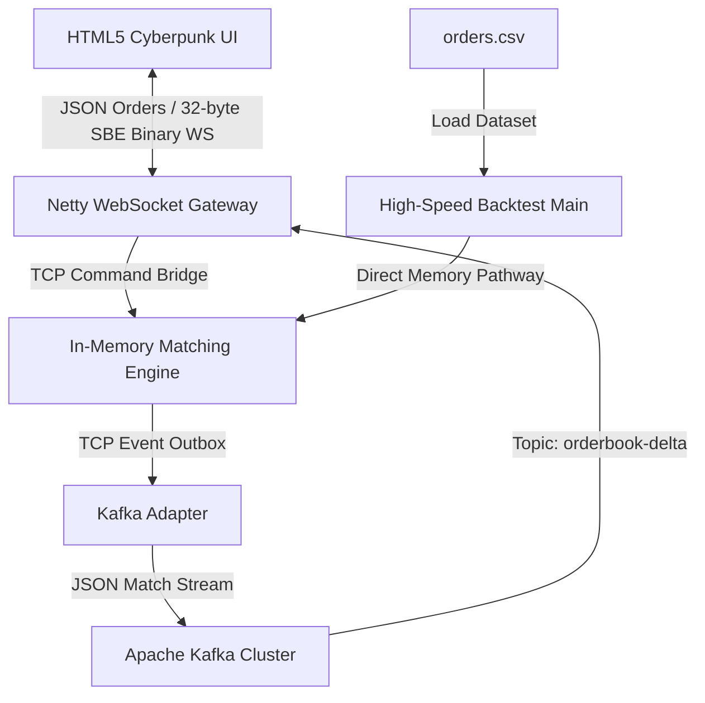

# 🌌 Quantum Exchange (HF-X)

초저지연(Ultra-Low Latency) 인메모리 가격-시간 우선(FIFO) 매칭 엔진과 실시간 시세 분배 웹소켓 게이트웨이, 그리고 초고속 오프라인 백테스팅 프레임워크를 갖춘 차세대 암호화폐/증권 거래소 시스템 벡엔드 플랫폼입니다.

---

## 🚀 주요 성능 지표 (Benchmark)

로컬 머신(OpenJDK 17 환경)에서 오프라인 백테스터를 구동하여 매칭 엔진의 순수 처리 한계를 측정한 결과입니다.

| 지표 (Metric) | 측정 결과 (Performance Metrics) |
| :--- | :--- |
| **초당 주문 처리량 (Throughput)** | **1,885,547.64 orders/sec** (초당 188만+ 건 매칭) |
| **평균 매칭 지연 시간 (Latency)** | **530.35 nanoseconds/order** (건당 0.53마이크로초) |
| **JVM JIT 예열 기능 (JIT Warmup)** | 지원함 (JIT 최적화 경로 반영) |
| **동적 시뮬레이션 데이터** | 10,000건의 실시간 주문 및 체결 시나리오 (`orders.csv` 자동 생성) |

---

## 🏛️ 플랫폼 시스템 아키텍처



---

## 📂 프로젝트 모듈 구성 및 역할

이 프로젝트는 Gradle 멀티 모듈 및 Docker Compose 환경으로 완벽히 설계되어 있습니다.

```text
exchange-be/
├─ engine-core/       # [Core] 인메모리 단일 스레드 매칭 엔진 (FIFO 우선순위 책 관리)
│                     # - Port 9999: 실시간 주문/취소 명령어 수신 (TCP)
│                     # - Port 9998: 실시간 체결/잔량 이벤트 브로드캐스트 (TCP)
├─ adapter-kafka/     # [Adapter] 엔진 TCP 이벤트를 수집하여 Apache Kafka 토픽으로 발행
├─ adapter-ws/        # [Gateway] Netty 비동기 엔진 기반 웹소켓 게이트웨이 (Port 8080)
│                     # - 시세 이벤트를 32바이트 SBE 스타일 압축 이진 데이터로 직렬화하여 클라이언트에 브로드캐스트
│                     # - 클라이언트로부터 받은 주문 접수/취소 JSON 메시지를 엔진 수신 포트(9999)로 라우팅 (양방향 브릿지)
├─ order-generator/   # [Simulator] 시장 유동성을 공급하는 실시간 의사 거래 스크립트
├─ frontend/          # [Client] HTML5 Canvas 기반의 60FPS 실시간 초고속 거래 터미널 (index.html)
└─ backtest/          # [Profile] 인메모리 매칭 속도 프로파일링용 초고속 오프라인 백테스터
```

---

## 💻 클라이언트 이진 데이터 포맷 (32-Byte Binary Frame)

Netty 웹소켓 게이트웨이는 대역폭 소모 및 가비지 컬렉터(GC) 부하를 극한으로 낮추기 위해 웹소켓 데이터를 고정 **32바이트 이진(Binary)** 형태로 인코딩하여 전송합니다.

```text
+-----------------------+-------------------+--------------------+-------------------+-------------------+
|  SymbolId (4 Bytes)   |   Seq (8 Bytes)   |   Price (8 Bytes)  |   Qty (8 Bytes)   |   Side (4 Bytes)  |
|      (Int32 BE)       |    (Int64 BE)     |     (Int64 BE)     |    (Int64 BE)     |    (Int32 BE)     |
+-----------------------+-------------------+--------------------+-------------------+-------------------+
```
*   **SymbolId**: 거래 페어 해시 ID
*   **Seq**: 매칭 트랜잭션 시퀀스 번호
*   **Price**: 정수 스케일링 가격 (실제 가격 × 100)
*   **Qty**: 가격 변동 수량 (신규 매수/매도 시 `+`, 매칭 및 체결 시 `-`)
*   **Side**: `0` (매수/Bid), `1` (매도/Ask)

---
---

## ⚙️ 다중 프로파일 개발 환경 분리 (Multi-Profile Architecture)

성능 튜닝, 가상 네트워크 격리, 로그 I/O 오버헤드 통제를 위해 별도의 외부 설정 프레임워크(Spring Cloud Config 등) 없이 **순수 Java 설계 기반**의 다중 프로파일 설정 시스템(`ConfigLoader.java`)을 구축하였습니다.

### 🌟 지원 프로파일 종류
1. **`local` (`.env.local`)**: 로컬 호스트 단독 개발 및 테스트용. 네트워크 주소가 Loopback(`localhost:29092` / `localhost:9998` / `localhost:9999`)으로 정렬되며 최상위 상세 디버그 로그(`LOG_LEVEL=DEBUG`)를 출력합니다.
2. **`dev` (`.env.dev`)**: 컨테이너 클러스터 기동용. 컨테이너 브릿지 DNS 주소(`kafka:9092` / `engine:9998` / `engine:9999`) 기반으로 상호 연결됩니다.
3. **`qa` (`.env.qa`)**: 부하 및 한계 성능 테스트 프로파일. 성능 텔레메트리(`TELEMETRY_ENABLED=true` / `HDR_HISTOGRAM_ENABLED=true`)가 활성화됩니다.
4. **`prd` (`.env.prd`)**: 베어메탈 초저지연 운영 프로파일. 최저 수준의 로깅 수준(`LOG_LEVEL=WARN`)을 적용해 디스크 I/O 병목을 제거하고 최상급 가비지 컬렉터(ZGC) 기동 힌트를 내포합니다.

### ⚙️ 계층식 변수 확인 및 우선순위 (Resolution Precedence)
`ConfigLoader`는 애플리케이션 기동 시 아래 순서로 환경 설정을 탐색하며 가장 먼저 발견된 값을 채택합니다:
1. **JVM 시스템 프로퍼티** (예: `-Denv.profile=local` 혹은 `-DCOMMAND_PORT=9999`) [가장 높음]
2. **OS 시스템 환경 변수** (예: `ENV_PROFILE=local`)
3. **프로파일별 `.env.<profile>` 설정 파일** [가장 낮음]

---

## 🛠️ 시작 가이드 (Quick Start)

### 🚀 1. 분산 마이크로서비스 가동 (Docker Compose)
시스템 전체(Kafka, Zookeeper, Engine, Adapters, Generator)를 로컬 도커 가상 네트워크 환경에 기동합니다.
- `docker-compose.yml`은 내부적으로 개발용 `.env.dev` 프로파일 환경 변수를 자동 매핑하여 구동합니다.

1.  **도커 데스크톱(Docker Desktop)** 실행 상태를 확인합니다.
2.  프로젝트 루트 폴더(`c:\git\exchange_be\`)에서 아래 명령어를 실행합니다:
    ```powershell
    docker compose up --build -d
    ```
3.  모든 서비스가 온전하게 구동되었는지 검사합니다:
    ```powershell
    docker compose ps
    ```

---

### 📊 2. 실시간 사이버펑크 거래 터미널 실행 (Frontend)
1.  도커 컴포즈가 구동 중인 상태에서 `frontend/index.html` 파일을 크롬 등 웹브라우저로 직접 엽니다.
2.  상단의 연결 표시등이 **`CONNECTED` (녹색)**으로 깜빡이는 것을 확인합니다.
3.  `order-generator`에 의해 실시간으로 요동치는 오더북 호가창과 **HTML5 Canvas 유동성 차트**를 감상하세요.
4.  좌측 **주문 터미널(Order Terminal)**을 이용해 실시간 매수/매도 Limit 주문을 접수하고, 엔진이 이를 밀리초 미만 단위로 매칭하여 호가창을 즉각 갱신하는 실시간 트랜잭션 피드백 루프를 확인하세요.

---

### ⏱️ 3. 초고속 인메모리 매칭 오프라인 백테스트 구동
외부 지연 시간(네트워크, 디스크 I/O)을 완벽히 제거한 상태에서 엔진의 한계 속도를 측정합니다.

**1) 소스코드 컴파일 (Javac):**
```powershell
javac -d build_backtest -sourcepath "engine-core\src\main\java;backtest\src\main\java" backtest\src\main\java\exchange\backtest\BacktestMain.java
```

**2) 백테스트 시뮬레이션 수행:**
```powershell
java -cp build_backtest exchange.backtest.BacktestMain
```

> **참고**: 루트 디렉터리에 `orders.csv` 파일이 존재하지 않는 경우, 백테스트 프레임워크(`CsvFeed.java`)가 즉각 10,000건 규모의 현실적인 모의 주문 내역을 동적으로 자동 생성한 뒤 시뮬레이션을 재개합니다.

---

## 🎨 프론트엔드 터미널 디자인 하이라이트
*   **Ambient Glow Layout**: 네온 시안 및 네온 핑크의 대조를 이용한 가시성 극대화 오더북 디자인.
*   **60FPS Canvas Depth Polygon**: 실시간 누적 깊이를 다각형 면적으로 시각화하는 부드러운 하이차트 렌더링.
*   **Micro-interactions**: 버튼 마우스 오버 효과 및 주문 제출 성공 시 화면 하단 알림 버블 애니메이션 지원.
