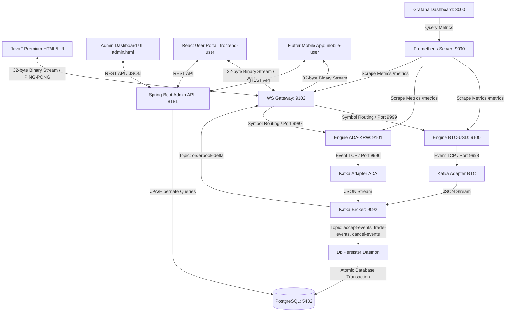

# ?뙆 JavaF Exchange (HF-X)

珥덉?吏€??Ultra-Low Latency) ?몃찓紐⑤━ 媛€寃??쒓컙 ?곗꽑(FIFO) 留ㅼ묶 ?붿쭊, ?ㅼ떆媛??쒖꽭 遺꾨같 ?뱀냼耳?寃뚯씠?몄썾?? 珥덇퀬???ㅽ봽?쇱씤 諛깊뀒?ㅽ똿 ?꾨젅?꾩썙?щ? 媛뽰텣 李⑥꽭?€ ?뷀샇?뷀룓/利앷텒 嫄곕옒??諛깆뿏???뚮옯?? 

理쒓렐 **鍮꾨룞湲??대깽???뚯떛(Event Sourcing) 湲곕컲 PostgreSQL ?ㅼ떆媛??먯궛 ?뺤궛(Settle) ?뚯씠?꾨씪??*, **怨좊?鍮??ㅽ겕 ?뚮쭏 ?곕???JavaF)**, **ADA-KRW 硫€???щ낵 蹂묐젹 ?뺤옣**, **吏꾩쭨 RTT ?ㅽ듃?뚰겕 吏€???ㅼ륫**, **rAF 湲곕컲 ?멸?李??뚮뜑留??ㅻ줈?€留?*, **Prometheus & Grafana 湲곕컲 0-?섏〈??珥덇꼍???깅뒫 怨꾩륫 泥닿퀎**, **Spring Boot 湲곕컲 ?듯빀 ?대뱶誘?API & ?대뱶誘??€?쒕낫??肄섏넄**, 洹몃━怨?**珥덊쁽?€??React 19 + TypeScript + Vite 湲곕컲??怨좎꽦???ㅼ떆媛?愿€???대뱶誘??곕???*??異붽? ?꾨퉬??

---

## ?넅 理쒓렐 ?낅뜲?댄듃 (Recent Updates)
- ?꾨줎?몄뿏??`frontend-user`) 諛깆뿏???묐떟 洹쒓꺽(ApiResponse) ?곕룞 ?꾨즺.
  - Zustand ?ㅽ넗??諛?李⑦듃 而댄룷?뚰듃??API ?몄텧遺€瑜?`ApiResponse<T>` ?섑띁 洹쒓꺽??留욎떠 ?덉쟾?섍쾶 異붿텧?섎룄濡??섏젙??
- 諛깆뿏??`admin-api`) GET ?붿껌 ?뚮씪誘명꽣 IDT(Input Data Transfer) 罹≪뒓??諛?怨꾩링 遺꾨━.
  - 諛섎났?섎뒗 ?섏씠吏?諛??좎쭨 ?뚮씪誘명꽣瑜?`BasePageIDT`, `DateRangePageIDT` ???곸냽 援ъ“??怨듯넻 IDT濡?臾띠뼱 ?ъ궗?⑹꽦 ?뺣낫.
  - `UserController` ?댁쓽 `Map` ?섏떊 ?뚮씪誘명꽣瑜?紐낆떆??IDT(`UserRegisterIDT` ??濡??꾨㈃ 援먯껜?섏뿬 ?€???덉쟾??媛뺥솕.
  - 而⑦듃濡ㅻ윭???쇱옱?섏뼱 ?덈뜕 ?곗씠?곕쿋?댁뒪(Mapper) 吏곸젒 ?몄텧 諛?鍮꾩쫰?덉뒪 濡쒖쭅(?섏씠吏? ?좎쭨 怨꾩궛)??`UserService` 怨꾩링?쇰줈 ?꾩쟾 遺꾨━?섏뿬 CQRS ?꾪궎?띿쿂 ?먯튃 蹂듭썝.
- 諛깆뿏???묐떟 洹쒓꺽 ?듯빀 諛?DTO 遺꾨━ ?꾪궎?띿쿂 ?곸슜 (`admin-api`).
  - 紐⑤뱺 API ?묐떟??`ApiResponse<T>` ?섑띁濡??듯빀?섏뿬 ?먮윭 肄붾뱶 諛?硫붿떆吏€ 洹쒓꺽??
  - ?붿껌 DTO??`*IDT` (Input Data Transfer), ?묐떟 DTO??`*ODT` (Output Data Transfer) ?ㅼ씠諛?而⑤깽?섏쑝濡??꾩쟾 遺꾨━ ?곸슜.
  - 而⑦듃濡ㅻ윭 諛??쒕퉬???덉씠?댁뿉??Map 諛섑솚??紐낆떆???€??媛앹껜(ODT) 諛섑솚?쇰줈 ?꾪솚?섏뿬 ?€???덉쟾???뺣낫.
- MyBatis ?꾨젅?꾩썙???꾨㈃ ?꾩엯 ?꾨즺 (`admin-api`).
  - `LedgerJournalRepository`???댁뼱 `TradeRepository`??蹂듭옟???ㅼ씠?곕툕 荑쇰━瑜?`TradeMapper`濡?紐⑤몢 ?닿?.
  - OR 議곌굔?쇰줈 ?명븳 ?€ ?ㅼ틪 ?깅뒫 ?€?섎? `UNION ALL`濡?遺꾨━?섏뿬 ?몃뜳???⑥쑉??洹밸???
- ?꾩껜 SQL ?€臾몄옄 ?묒꽦 猷?Rule) ?곸슜.
  - `TradeMapper.xml` 諛?`LedgerJournalMapper.xml` ?댁쓽 ?뚯씠釉붾챸, 而щ읆紐? 蹂꾩묶???ы븿??紐⑤뱺 SQL 援щЦ??100% ?€臾몄옄濡?蹂€???곸슜.
- ?듦퀎 荑쇰━ ?깅뒫 理쒖쟻??諛??€?ㅽ깮 ?곕룞.
  - `StatsController`, `LedgerController` ??二쇱슂 ?듦퀎 議고쉶 API??湲곌컙(`startDate`, `endDate`) ?뚮씪誘명꽣 ?꾩닔 ?꾩엯.
  - ?뚮씪誘명꽣 ?꾨씫 ???쒕쾭 ?⑥뿉??'理쒓렐 30????湲곕낯媛믪쑝濡??좊떦?섏뿬 ?덉젙???뺣낫.
  - `frontend-admin` Zustand ?ㅽ넗??`useExchangeStore.ts`)?먯꽌 API ?몄텧 ???숈쟻?쇰줈 ?좎쭨 荑쇰━瑜??앹꽦 諛?二쇱엯?섎룄濡??곌퀎.
- ?고????섏〈??二쇱엯 洹쒓꺽 ?듭씪.
  - `UserController`, `UserService`, `StatsService` ??紐⑤뱺 `@Autowired` ?대끂?뚯씠???쒓굅 ???덉쟾???앹꽦??二쇱엯 諛⑹떇?쇰줈 由ы뙥?좊쭅??
- 吏€媛?吏€???앹꽦(Lazy Initialization) ?꾪궎?띿쿂 ?뺣┰.
  - ?좉퇋 媛€?????섎뱶肄붾뵫??鍮?吏€媛??앹꽦 濡쒖쭅????젣??
  - `UserService.getOrCreateWallet` 怨듯넻 硫붿꽌?쒕? ?좎꽕?섏뿬 ?낃툑 ???ㅼ젣 ?먯궛 蹂€???쒖젏?먮쭔 吏€媛묒쓣 吏€???앹꽦?섎룄濡?理쒖쟻?뷀븿.
  - 留ㅼ묶 ?뺤궛 ?곕が(`adapter-kafka`)?€ DB 怨꾩링???먯옄??UPSERT(`ON CONFLICT DO NOTHING`)瑜??듯빐 嫄곕옒 ?쒖젏 吏€???앹꽦???대? ?꾨꼍??吏€?먰븿.
- 500 ?꾩뿭 ?덉쇅 泥섎━ 諛??명솚??媛뺥솕 ?곸슜.
  - `GlobalExceptionHandler`瑜??듯븳 `ApiResponse` 洹쒓꺽 諛섑솚?쇰줈 ?ㅽ깮 ?몃젅?댁뒪 ?몄텧 李⑤떒.
  - 而댄뙆?쇰윭 ?명솚??臾몄젣 諛⑹?瑜??꾪빐 `@RequestParam` 紐낆떆???대쫫 ?좊떦.
- ?€?⑸웾 ?듦퀎 吏묎퀎 荑쇰━ 理쒖쟻??諛??꾩슜 ?몃뜳??援ъ텞 (`admin-api`).
  - `StatsMapper` 諛?`TradeMapper`??議곗씤 蹂묐ぉ 援ш컙??CTE(WITH 援щЦ)瑜??쒖슜????洹몃９????議곗씤 諛⑹떇?쇰줈 援ъ“ ?꾨㈃ 媛쒗렪.
  - `TRADES`, `ORDERS`, `LEDGER_JOURNAL`, `USERS` ?뚯씠釉붿뿉 ?좎쭨(CREATED_AT) 湲곗? ?듦퀎 議고쉶 ?꾩슜 B-Tree 蹂듯빀 ?몃뜳???ㅺ퀎 諛??곸슜.
  - XML 留ㅽ띁 ??紐⑤뱺 ?쒓? 二쇱꽍??肄붾뱶 ??湲곗? ??2踰??꾩? ?뺣젹 洹쒖튃?쇰줈 ?쇨큵 洹쒓꺽??

---

## ?? 二쇱슂 ?깅뒫 吏€??(Benchmark)

濡쒖뺄 癒몄떊(OpenJDK 17 ?섍꼍)?먯꽌 ?ㅽ봽?쇱씤 諛깊뀒?ㅽ꽣瑜?援щ룞??痢≪젙??留ㅼ묶 ?붿쭊???쒖닔 泥섎━ ?쒓퀎 ?깅뒫.

| 吏€??(Metric) | 痢≪젙 寃곌낵 (Performance Metrics) |
| :--- | :--- |
| **珥덈떦 二쇰Ц 泥섎━??(Throughput)** | **1,885,547.64 orders/sec** (珥덈떦 188留? 嫄?留ㅼ묶) |
| **?됯퇏 留ㅼ묶 吏€???쒓컙 (Latency)** | **530.35 nanoseconds/order** (嫄대떦 0.53留덉씠?щ줈珥? |
| **?ㅼ떆媛??됯퇏 留ㅼ묶 ?띾룄 (Real Latency)**| **196.74 쨉s** (?ㅽ듃?뚰겕/Kafka 釉뚮┸吏€ ?곕룞 ?ㅼ륫 ?됯퇏) |
| **JVM JIT ?덉뿴 湲곕뒫 (JIT Warmup)** | 吏€??(JIT 理쒖쟻??而댄뙆??寃쎈줈 諛섏쁺) |
| **?숈쟻 ?쒕??덉씠???곗씠??* | 10,000嫄댁쓽 ?ㅼ떆媛?二쇰Ц 諛?泥닿껐 ?쒕굹由ъ삤 (`orders.csv` ?먮룞 ?앹꽦) |

---

## ?룢截??뚮옯???꾩껜 ?쒖뒪???꾪궎?띿쿂



---

## ?뵆 ?쒕퉬???ы듃 留듯븨 ?꾪솴 (Service Port Mappings)

?뚮옯?쇱쓣 援ъ꽦?섎뒗 紐⑤뱺 遺꾩궛 留덉씠?щ줈?쒕퉬??諛??명봽?쇱쓽 ?대?(Container) 諛??몃?(Host) ?ы듃 諛붿씤???꾪솴?낅땲?? ?뱀젙 ?몄뒪???ы듃 異⑸룎 諛⑹? ?ㅺ퀎 諛⑹떇???꾨옒 ?쒖뿉???④퍡 ?뺤씤?섏떎 ???덉뒿?덈떎.

| ?쒕퉬?ㅻ챸 (Service) | ??븷 (Role) | ?몄뒪???몃? ?ы듃 (Host Port)          | 而⑦뀒?대꼫 ?대? ?ы듃 (Container Port)    | 留듯븨 ?좏삎 & 鍮꾧퀬 (Notes)                                                                                                            |
| :--- | :--- |:-------------------------------|:-------------------------------|:------------------------------------------------------------------------------------------------------------------------------|
| **`ws-gateway`** | ?ㅼ떆媛??뱀냼耳??쒖꽭/二쇰Ц 寃뚯씠?몄썾??| **`8088`**<br>`9102`           | **`8088`**<br>`9102`           | **二쇱슂 ?묒냽 ?쒕퉬???ы듃**.<br>?먯껜 ?꾨줈硫뷀뀒?곗뒪 硫뷀듃由??몄텧 ?ы듃 ?ы븿.                                                                                  |
| **`admin-api`** | Spring Boot ?듯빀 ?대뱶誘?諛깆뿏??| **`8181`**                     | **`8181`**                     | ?대뱶誘??€?쒕낫???곕룞??REST API ?ы듃.                                                                                                     |
| **`cadvisor`** | ?ㅼ떆媛?而⑦뀒?대꼫 由ъ냼??怨꾩륫 ?먯씠?꾪듃 | **`8182`**                     | **`8182`**                     | ?좑툘 **?ы듃 異⑸룎 諛⑹? ?뚰뵾 ?ㅺ퀎**:<br>?대? ?ы듃??`8182`?쇰줈 怨좎젙?댁?留? ?ы듃 異⑸룎 諛⑹?瑜??꾪빐 ?몄뒪???몃? ?ы듃瑜?**`8182`**濡??고쉶 留ㅽ븨?섏??듬땲?? (ws-gateway??`8088` ?ы듃濡??댁쟾?? |
| **`postgres`** | ?뚯썝/?먯궛/?뺤궛 愿€怨꾪삎 ?곗씠?곕쿋?댁뒪 | **`5432`**                     | **`5432`**                     | ?곗씠?곕쿋?댁뒪 ?⑤룆 ?ы듃 諛붿씤??                                                                                                             |
| **`prometheus`** | 遺꾩궛 硫뷀듃由??섏쭛 諛??쒓퀎??DB | **`9090`**                     | **`9090`**                     | ?꾨줈硫뷀뀒?곗뒪 ??肄섏넄 ?묒냽 ?ы듃.                                                                                                            |
| **`grafana`** | ?ㅼ떆媛?怨꾩륫 ?쒓컖???€?쒕낫??| **`3000`**                     | **`3000`**                     | 洹몃씪?뚮굹 ?€?쒕낫????UI ?묒냽 ?ы듃 (ID/PW: admin/admin).                                                                                    |
| **`engine-btc`** | BTC-USD 留ㅼ묶 ?붿쭊 (?몃찓紐⑤━ 肄붿뼱) | **`9999`**<br>`9998`<br>`9100` | **`9999`**<br>`9998`<br>`9100` | TCP 而ㅻ㎤???섏떊 (9999)<br>TCP 泥닿껐 ?대깽???≪떊 (9998)<br>?꾨줈硫뷀뀒?곗뒪 硫뷀듃由?(9100)                                                                |
| **`engine-ada`** | ADA-KRW 留ㅼ묶 ?붿쭊 (?몃찓紐⑤━ 肄붿뼱) | **`9997`**<br>`9996`<br>`9101` | **`9997`**<br>`9996`<br>`9101` | TCP 而ㅻ㎤???섏떊 (9997)<br>TCP 泥닿껐 ?대깽???≪떊 (9996)<br>?꾨줈硫뷀뀒?곗뒪 硫뷀듃由?(9101)                                                                |
| **`kafka`** | 遺꾩궛 ?ㅼ떆媛?硫붿떆吏€ 釉뚮줈而?| **`29092`**<br>`9092`          | **`29092`**<br>`9092`          | ?몃? 媛쒕컻湲??묒냽??(29092)<br>而⑦뀒?대꼫 ?대? 釉뚮┸吏€??(9092)                                                                                     |
| **`zookeeper`** | 移댄봽移?硫뷀??곗씠???쒖뼱/議곗쑉 愿€由ъ옄 | **`2181`**                     | **`2181`**                     | 移댄봽移??대윭?ㅽ꽣 ?대? 議곗쑉??                                                                                                              |
| **`loki`** | 以묒븰吏묒쨷???ㅼ떆媛?濡쒓렇 ?€?μ냼 | **`3100`**                     | **`3100`**                     | 洹몃씪?뚮굹 濡쒗궎 濡쒓렇 ?섏쭛 ?쒕쾭 ?ы듃.                                                                                                            |
| **`kafka-exporter`** | 移댄봽移?釉뚮줈而??깅뒫/吏€??怨꾩륫 ?대뙌??| **`9308`**                     | **`9308`**                     | 移댄봽移?硫뷀듃由??몄텧???ы듃 (Prometheus ?곕룞).                                                                                                 |

---

## ?썳截??듯빀 ?대뱶誘??쒖뼱 ?쒖뒪??(Admin Console)

嫄곕옒???댁쁺 ?⑥쑉??洹밸???諛??ㅼ떆媛??뺤궛 媛먯궗瑜?吏€?먰븯???듯빀 ?대뱶誘??붾（?섏씠 ?꾨퉬?섏뿀?듬땲??

### 1. Spring Boot 湲곕컲 REST API 諛깆뿏??(`admin-api`)
*   **?듯솕蹂?珥??좏넻 ?먯궛 吏€??議고쉶 (`/admin/wallets/summary`):** 嫄곕옒???댁뿉 蹂닿????꾩껜 ?먯궛(KRW, USD, BTC, ADA)???ъ슜 媛€?ν븳 ?붿븸 諛?嫄곕옒 吏꾪뻾以???Locked)??嫄몃┛ ?먯궛???⑹궛 ?섏튂瑜??먯옄?곸쑝濡?議고쉶?⑸땲??
*   **?ㅼ떆媛??깅뒫 諛??쒖뒪???듦퀎 ?붿빟 (`/admin/stats/summary`):** 珥??깅줉 ?뚯썝 ?? ?쒖꽦 吏€媛??? 湲덉씪 ?꾩쟻 留ㅼ묶 嫄곕옒 ?? ?꾩쟻 嫄곕옒 ?€湲?Volume)??利됯컖 痍⑦빀?섏뿬 諛섑솚?⑸땲??
*   **?꾩씪 醫낃? 諛?9??KST 湲곗? ?곗빱 踰뚰겕 議고쉶 (`/admin/stats/tickers`):** (?뙚 ?좉퇋) 紐⑤뱺 ?쒖꽦 留덉폆???꾩옱媛€?€ KST 09:00 boundary 湲곗? ?꾩씪 醫낃?(泥닿껐 湲곕줉???녿뒗 寃쎌슦 理쒖큹 嫄곕옒媛€ 諛?DB ?곸옣媛€瑜??대갚?쇰줈 怨꾩궛) ?뺣낫瑜???踰덉뿉 踰뚰겕濡??섏쭛?섏뿬 ?⑥씪 ?몄텧濡??꾨줎?몄뿏?쒖? ?대뱶誘쇱쓽 ?깅씫瑜??곗궛???숈쟻 怨꾩궛 泥섎━?⑸땲??
*   **嫄곕옒???ㅼ쟻 遺꾩꽍 ?듦퀎 議고쉶 (`/admin/stats/performance`):** (?뙚 ?좉퇋) 留덉폆蹂??꾩쟻 諛?24?쒓컙 ?섏닔猷??섏엯, 24H DAU / 30D MAU, ?먯궛 ?좏넻 ?띾룄(Trading Velocity), ?ㅻ뜑 泥닿껐 ?깃났瑜?諛?寃쎌웳??Binance, Upbit, Coinbase) ?깅뒫 踰ㅼ튂留덊궧 ?듯빀 遺꾩꽍 ?곗씠?곕? 諛섑솚?⑸땲??
*   **留덉폆 ?ㅼ젙 愿€由?諛??곸옣媛€(listing_price) ?숈쟻 ?섏젙 (`PUT /admin/stats/markets/{symbol}`):** (?뙚 ?좉퇋) ?대뱶誘쇱뿉???뱀젙 留덉폆???섏닔猷뚯쑉, ?뚯닔???먮━?? 理쒖냼 二쇰Ц ?섎웾肉먮쭔 ?꾨땲??理쒖큹 ?곸옣 湲곗?媛€(`listing_price`)瑜??숈쟻?쇰줈 ?섏젙?섍퀬 DB???곸냽?뷀븷 ???덈뒗 ?덉쟾??REST API瑜??쒓났?⑸땲?? ?뚯뒪肄붾뱶 ???섎뱶肄붾뵫 ?대갚 媛€寃⑹쓣 ?꾨㈃ ?쒓굅?섍퀬 DB濡?愿€由щ릺?꾨줉 ?쇱썝?뷀뻽?듬땲??
*   **留덉폆蹂??숈쟻 ?섏닔猷뚯쑉 ?ㅼ젙 諛?議고쉶 (`/admin/settings`):** (?뙚 ?좉퇋) `POST` ?붿껌???듯빐 `markets` ?뚯씠釉붽낵 ?곕룞???꾩껜 留덉폆???섏닔猷??ㅼ젙???숈쟻?쇰줈 蹂€寃쏀븯怨?DB ?곸냽?붿? ?몃찓紐⑤━ `AdminSettings` 罹먯떆 ?숆린?붾? 利됱떆 泥섎━?⑸땲?? 留덉폆 ?섏닔猷뚯쑉 ???뺣낫 ?섏젙 諛쒖깮 ??`market_histories` ?뚯씠釉붿뿉 ?깅줉/?섏젙 ?쇱떆 諛??대떦???꾨뱶瑜??숈씪?섍쾶 蹂듭궗?섏뿬 蹂€寃??대젰??紐낆떆?곸쑝濡?濡쒓렇 ?곸옱?⑸땲??
*   **?좎엯 ?좎? 吏€??議고쉶 (`/admin/stats/users`):** ?쇨컙, 二쇨컙, ?붽컙, 遺꾧린, ?곌컙 ?댁긽??蹂€??Resolution)瑜?二쇱엯諛쏆븘 ?쒓컙???곕Ⅸ ?좉퇋 ?뚯썝 媛€???좎엯?됱쓣 諛섑솚?⑸땲??
*   **留ㅼ묶 嫄곕옒 遺꾩꽍 諛??먯궛 蹂€寃??대젰 議고쉶 (`/admin/stats/trades` / `/admin/stats/assets`):** 湲곌컙蹂?嫄곕옒???댁쓽 ?먰솕 諛?USD, 媛곸쥌 肄붿씤 ?먯궛??利앷컧 ?먮쫫怨??꾩쟻 泥닿껐 ?섏튂瑜??ㅺ컖?꾨줈 議고쉶?⑸땲??
*   **?뚯썝 ?먯옣 愿€由?(CRUD):** ?뚯썝 媛€???깅줉(`POST /admin/users`), ?뺣낫 ?섏젙(`PUT /admin/users/{id}`), VIP ?깃툒/嫄곕옒?뺤?(SUSPENDED) 愿€由?湲곕뒫???꾨꼍 ?쒓났?⑸땲??
*   **媛먯궗 ?곕룞 ?먯궛 異붽?/李④컧 (`/admin/users/{id}/assets/adjust`):** 愿€由ъ옄媛€ ?뱀젙 ?뚯썝???먯궛 吏€媛묒쓣 利됯컖 吏€湲?Deposit) ?먮뒗 ?뚯닔(Withdrawal)?????덈뒗 ?덉쟾??REST API瑜??쒓났?섎ʼn, 紐⑤뱺 蹂€?숇텇?€ `ledger_journal` 媛먯궗???뚯씠釉붿뿉 ?꾩쟾 蹂댁옣?⑸땲??
*   **蹂몄씤 ?앸퀎 ?뺣낫 諛??먯궛 議고쉶 ?꾩슜 API (me):** (?뙚 ?좉퇋) ?쇰컲 ?ъ슜?먭? ?먯떊??嫄곕옒 ?댁뿭, ?먯옣 ?대젰, 吏€媛??뺣낫瑜??덉쟾?섍쾶 議고쉶?????덈뒗 `/admin/users/me/trades`, `/admin/users/me/ledgers`, `/admin/wallets/me` API瑜??쒓났?⑸땲?? JWT ?몄쬆 ?몄뀡 ?뺣낫(?대찓??瑜?湲곕컲?쇰줈 蹂몄씤 ?곗씠?곕? ?뚯븘??留ㅼ묶?섏뿬 諛섑솚?섎?濡??앸퀎??ID) ?몄텧???곕Ⅸ ?댄궧 ?꾪삊(IDOR 痍⑥빟?????꾨꼍??寃⑸━ 諛⑹??⑸땲??
*   **Spring Security & JWT 湲곕컲 臾댁긽???몄쬆/?멸? 泥닿퀎 諛?RTR(Refresh Token Rotation) ?꾩엯 (?뙚 ?좉퇋):**
    *   **媛뺣젰??API 蹂댄샇:** 紐⑤뱺 `/admin/**` ?붾뱶?ъ씤?몃? Spring Security 6 ?꾪꽣 泥댁씤?쇰줈 蹂댄샇?섍퀬, `ADMIN` ?깃툒??蹂댁쑀???몄쬆??愿€由ъ옄留??묎렐 媛€?ν븯?꾨줉 ?꾧꺽???듭젣??
    *   **Stateless JWT ?몄쬆 (userId ?대젅???ы븿):** 臾댁긽???몄뀡 愿€由?紐⑤뜽???묒옱?섏뿬 ?쒕쾭 硫붾え由щ굹 ?몄뀡 ?€?μ냼 遺€???놁씠 ?ㅻ뜑??`Authorization: Bearer <Access_Token>`??怨좎냽 ?대룆???먭꺽 利앸챸???섎┰?? ?뱁엳, Access Token ?대???`userId`瑜?而ㅼ뒪?€ ?대젅??Claim)?쇰줈 吏곸젒 ?몄퐫?⑺븯???대씪?댁뼵????諛?Flutter 紐⑤컮???먯꽌 蹂꾨룄??REST API(?? 403 ?쒗븳??嫄몃┛ `/admin/users`) ?몄텧 ?놁씠??濡쒖뺄?먯꽌 蹂몄씤???ъ슜??ID瑜?利됱떆 ?앸퀎?????덈룄濡?理쒖쟻?뷀븿.
    *   **RTR (Refresh Token Rotation) ?좏겙 ?뚯쟾 湲곕쾿:** ?ъ슜?먭? Access Token 留뚮즺濡?媛깆떊 ?붿껌(`POST /admin/auth/refresh`)??蹂대궡硫? 湲곗〈 Refresh Token??利됱떆 ?먭린(?쇳쉶???섍퀬 ?덈줈??Access/Refresh Token ?띿쓣 ?먮룞 ?щ컻湲됲븿. ?대? ?듯빐 Refresh Token ?덉랬 諛??ъ궗??Replay) 怨듦꺽???먯쿇 諛⑹???
    *   **?덉쟾???섏씠釉뚮━??鍮꾨?踰덊샇 ?몄퐫??** ?좉퇋 鍮꾨?踰덊샇???뷀듃媛€ 媛€誘몃맂 媛뺣젰??`BCrypt` ?뚭퀬由ъ쬁?쇰줈 ?뷀샇?뷀븯???€?ν븯硫? ?곗씠?곕쿋?댁뒪 ??湲곗〈 1,000紐낆쓽 ?덇굅??SHA-256 諛??쒕뱶 紐?Mock) ?곗씠??鍮꾨?踰덊샇???덉쟾?섍쾶 ?명솚 ?€議곕릺?꾨줉 援ы쁽??
    *   **?몄쬆 鍮꾩쫰?덉뒪 濡쒖쭅 遺꾨━ (AuthService):** 湲곗〈 `AuthController`??諛€吏묐릺???덈뜕 濡쒓렇?? ?좏겙 ?щ컻湲? 濡쒓렇?꾩썐 愿€??鍮꾩쫰?덉뒪 濡쒖쭅??`AuthService` ?덉씠?대줈 遺꾨━?섍퀬 ?묐떟??`AuthResponseDTO`濡?罹≪뒓?뷀븯???⑥씪 梨낆엫 ?먯튃(SRP) 以€??
    *   **湲곕낯 愿€由ъ옄 怨꾩젙 ?먮룞 ?앹꽦 (local/dev ?꾨줈?뚯씪):** ?쒖뒪???쒖옉 ??湲곕낯 愿€由ъ옄 怨꾩젙(`admin@javaf.net` / `admin123!@#`, `ADMIN` 沅뚰븳) 議댁옱 ?щ?瑜??뺤씤?섍퀬 ?놁쑝硫??먮룞 ?앹꽦?? 濡쒖뺄 諛?媛쒕컻 ?섍꼍?먯꽌留??숈옉?섎ʼn, PostgreSQL 珥덇린???꾨즺瑜??€湲고븳 ??`users_user_id_seq` ?쒗€€?ㅻ? ?숆린?뷀븯怨?怨꾩젙???앹꽦?? ?댁쁺(`prod`) ?섍꼍?먯꽌???ㅽ뻾?섏? ?딆쓬.
    *   **?꾩뿭 API ?묐떟 援ъ“ ?듭씪 諛??꾨줎?몄뿏???명솚 ?⑥튂 (?뙚 ?좉퇋):** 紐⑤뱺 諛깆뿏??而⑦듃濡ㅻ윭???묐떟??`ApiResponse (status, message, data)` 洹쒓꺽?쇰줈 媛먯떥?꾨줉 `GlobalResponseWrapper`瑜??꾩엯?? ?먰븳 ?꾨줎?몄뿏??`useExchangeStore.ts`)??`fetchWithAuth` 諛?媛곸쥌 ?곗씠???섏묶 濡쒖쭅?????섑띁 援ъ“瑜??먮룞?쇰줈 ?몃옒??Unwrap)?섎룄濡??섏젙?섏뿬 ?명솚?깃낵 ?덉젙?깆쓣 ?뺣낫??
    *   **?앹꽦??湲곕컲 ?섏〈??二쇱엯 由ы뙥?좊쭅 (?뙚 ?좉퇋):** 而⑦듃濡ㅻ윭(`AuthController`, `CryptoWalletController` ???먯꽌 ?ъ슜?섎뜕 `@Autowired` ?꾨뱶 二쇱엯??Lombok??`@RequiredArgsConstructor`?€ `final` ?꾨뱶瑜??쒖슜???앹꽦??二쇱엯 諛⑹떇?쇰줈 媛쒖꽑?섏뿬 ?섏〈??遺덈??깃낵 ?뚯뒪???⑹씠?깆쓣 ?뺣낫??
*   **JPA Auditing 諛?AOP 湲곕컲 ?ㅻ젅???덉쟾 ?깅줉???섏젙???먮룞 ?댁썝??二쇱엯 ?꾪궎?띿쿂 (?뙚 ?좉퇋):**
    *   **?꾩껜 ?뚯씠釉?Auditing ?뺤옣:** `users`肉먮쭔 ?꾨땲??`wallets`, `ledger_journal`, `crypto_withdrawals`, `user_crypto_addresses`, `system_hot_wallets`, `trades` ???꾩껜 ?곸냽???뷀떚?곌? `BaseEntity`瑜?怨듬룞 ?곸냽?섍쾶 ?ㅺ퀎?섏뿬 ?ㅻ뵒??而щ읆(`createdAt`, `updatedAt`, `createdBy`, `updatedBy`) 援ъ꽦???꾩껜 ?뚯씠釉붿뿉 ?쇨큵 ?댁떇??
    *   **AOP 湲곕컲 ?ㅻ젅???덉쟾 ?댁썝??湲곕줉 (`@SystemAuditor`):** 
        *   **?ъ슜??二쇱껜 ?묒뾽:** ?대뱶誘??€?쒕낫??API ?몄텧 ??濡쒓렇?명븳 ?ъ슜?먭? ?붿껌???뚮뒗 Spring Security of Principal(?대찓???? ?뺣낫媛€ `createdBy` / `updatedBy`???먮룞?쇰줈 二쇱엯?⑸땲??
        *   **?쒖뒪??二쇱껜 ?묒뾽:** 諛깃렇?쇱슫???곕が, ?ㅼ?以꾨윭, 移댄봽移?而⑥뒋癒???諛깃렇?쇱슫???쒖뒪?쒖씠 ?묒뾽???좊컻???뚮뒗 `@SystemAuditor("?쒖뒪?쒖떇蹂꾩옄")` ?대끂?뚯씠?섏쓣 遺€李⑺븯???ㅻ젅???덉쟾?섍쾶 ThreadLocal??愿€由ы븯硫? ?대? ?듯빐 ?깅줉???섏젙?먯뿉 `"SYSTEM:?쒖뒪?쒖떇蹂꾩옄"`媛€ ?먮룞 湲곕줉?⑸땲??
        *   **硫붾え由??꾩닔 諛⑹? 媛€??** AOP Aspect ?댁쓽 `finally` ?덉뿉??ThreadLocal 由ъ냼?ㅻ? 媛뺤젣 ?댁젣(`remove()`)?⑥쑝濡쒖뜥 WAS ?ㅻ젅???€ ?섍꼍?먯꽌???ㅼ뿼?대굹 OOM (Memory Leak) 由ъ뒪?щ? ?먯쿇 ?쒓굅?섏??듬땲??
    *   **Flyway ?곗씠?곕쿋?댁뒪 ?뺤긽 愿€由?Migration) ?꾩엯 (?뙚 ?좉퇋):** 
        *   湲곗〈 Java ?좏뵆由ъ??댁뀡 湲곕룞 ???섑뻾?섎뜕 遺덉셿?꾪븳 ?숈쟻 DDL ?⑥튂 諛??꾩떆 ?⑥튂 濡쒖쭅???꾩쟾???쒓굅?덉뒿?덈떎.
        *   [V1__init_schema.sql](file:///home/administrator/exchange_be/admin-api/src/main/resources/db/migration/V1__init_schema.sql)???듯빐 ?꾩껜 ?뚯씠釉? ?쒖빟 議곌굔, 肄붾찘??諛??몃뜳??援ъ“瑜?Flyway濡?踰꾩쟾 愿€由ы빀?덈떎.
        *   ?좏뵆由ъ??댁뀡 湲곕룞 ??Flyway ?붿쭊??DB???ㅽ궎留?蹂€寃??대젰???먮룞?쇰줈 寃€?ы븯怨?留덉씠洹몃젅?댁뀡???곸슜?⑸땲??
        *   ?ㅽ궎留??뺤쓽(DDL)??Flyway媛€ ?꾨떞?섍퀬, 珥덇린 ?쒕뱶 諛??€???곗씠??DML)??Postgres 珥덇린???ㅽ겕由쏀듃([postgres-init.sql](file:///home/administrator/exchange_be/postgres-init.sql))媛€ ?대떦?섎룄濡???븷 援ъ“瑜?臾쇰━?곸쑝濡??꾨꼍??遺꾨━?덉뒿?덈떎.
*   **PostgreSQL ?깅뒫 理쒖쟻??** 500 ?먮윭瑜??좊컻?????덈뒗 蹂듭옟??Native Time-Bucket Parameter Binding 臾몄젣?먯쓣 ?쒖??곸씤 `GROUP BY 1, 2, 3` 諛?`ORDER BY 1 DESC` ?몃뜳??湲곕쾿?쇰줈 ?쒕떇 ?꾨즺?덉뒿?덈떎.

### 2. ?꾨━誘몄뾼 ?ㅽ겕 湲€?섏뒪紐⑦뵾利????대뱶誘?([admin.html](./frontend/admin.html))
*   **?꾨꼍??UI?€ 濡쒖쭅??遺꾨━ (ES6 紐⑤뱢??:** 湲곗〈 2,200?쇱씤???〓컯?섎뜕 鍮꾨????⑥씪 HTML ?뚯씪?먯꽌 ?몃씪???먮컮?ㅽ겕由쏀듃 ?꾩껜瑜?遺꾨━ 異붿텧?섏뿬 **?섏〈???쒕줈???낅┰?곸씤 ES6 紐⑤뱢 ?뚯씪??[admin.js](./frontend/js/admin.js)濡?由ы뙥?좊쭅**???꾨즺?덉뒿?덈떎. ?대? ?듯빐 UI/Style ?덉씠?댁? 鍮꾩쫰?덉뒪 濡쒖쭅 ?덉씠?대? ?꾨꼍??李⑤떒 寃⑸━?섏뿬 怨좎꽦???좎?蹂댁닔 援ъ“瑜?100% ?뺣낫?덉뒿?덈떎.
*   **?뙆 ?ㅼ떆媛?留덉폆 媛먯떆 紐⑤땲??(TradingView Charts) ?⑤꼸 (?뙚 ?좉퇋):** ?대뱶誘??€?쒕낫???댁뿉 ?ㅼ떆媛??쒖꽭 諛?罹붾뱾???덉쟾?섍쾶 紐⑤땲?곕쭅?????덈뒗 ?섏씠?붾뱶 紐⑤땲?곕쭅 ?⑤꼸???꾧꺽 異붽? 留덉슫?명뻽?듬땲??
    *   **?대뱶誘??꾩슜 蹂대씪???뚮쭏 李⑦듃:** 罹붾뱾 諛?嫄곕옒??洹몃옒?꾨퓧留??꾨땲??MA7(二쇳솴), MA25(遺꾪솉) ?ㅼ삩 ?대룞?됯퇏?좎쓣 ?ㅻ쾭?덉씠?섏뿬 由ъ뼹?€??湲곗닠 吏€??異붿꽭瑜??쒓났?⑸땲??
    *   **?ㅼ떆媛??뱀냼耳?泥닿껐 濡쒓렇 紐⑤땲??** Netty 寃뚯씠?몄썾??Port 8088)??珥덇꼍??32諛붿씠??諛붿씠?덈━ ?⑦궥 ?붿퐫?붿? 利됱떆 諛붿씤?⑺븯?? 泥닿껐 ?대깽?몃? ?섏떊?섏옄留덉옄 `[泥닿껐 ID | 醫낅ぉ | 援щ텇 | 泥닿껐媛€ | ?섎웾 | ?€湲?| ?쒓컖]` ?뺥깭???ㅽ겕濡ㅽ삎 ?ㅼ떆媛?濡쒓렇 ?뚯씠釉붿쓣 媛깆떊?⑸땲??
    *   **?ㅼ쨷 ?댁긽??諛?醫낅ぉ ?ㅼ쐞移?** `BTC-USD`?€ `ADA-KRW` 媛꾩쓽 ?먰겢由??ㅼ쐞移?諛?`1M/5M/15M/1H` ??湲곕룞 ??**?쒓컙 異?寃고븿 洹밸났 ?덉쟾 媛€??Time-Bound Safety Guard)**瑜??묐룞?쒖폒 ?ㅻ옒???쒓컙 踰꾪궥 ?깆뿉 ?섑븳 Lightweight Charts ?붿쭊 留덈퉬 ?꾩긽???꾩쟾??臾쇰━爾ㅼ뒿?덈떎.
*   **ApexCharts ?명꽣?숉떚釉??듦퀎 遺꾩꽍:** CDN 湲곕컲 ?섏씠?붾뱶 李⑦듃 ?쇱씠釉뚮윭由??곕룞?쇰줈 ?쇨컙, 二쇨컙, ?붽컙, 遺꾧린, ?곌컙 ?꾪꽣留곸뿉 ?곕Ⅸ 媛€??異붿씠, 泥닿껐 嫄댁닔/?€湲? ?먯궛 ?낆텧湲?鍮꾩쑉 ?꾨꽋 李⑦듃 援ы쁽.
*   **?듯빀 ?뚯썝 愿€由?紐⑤떖:** 紐⑤떖 ?덈룄?곕? ?쒖슜???대찓???ㅼ떆媛?怨꾩젙 寃€?? ?좉퇋 ?뚯썝 ?깅줉, ?곹깭 蹂€?? ?먯궛 異붽?/李④컧(Deposit/Withdrawal)??利됱떆 ?ㅼ떆媛??몄젥??議곗옉?⑸땲??
*   **WSL/?ㅽ듃?뚰겕 諛붿씤??寃뚯씠?몄썾??** ?곗륫 ?곷떒??`API Host` ?낅젰李쎌쓣 ?듯빐 WSL 媛€??癒몄떊 IP???먭꺽 ?꾨찓??IP瑜??숈쟻?쇰줈 二쇱엯?섏뿬 利됱떆 REST API 而ㅻ꽖?섏쓣 ?섎┰?????덈룄濡??ㅺ퀎?덉뒿?덈떎.

### 3. 珥덊쁽?€??React + TypeScript 怨좎꽦???ㅼ떆媛?愿€???곕???([frontend-admin](./frontend-admin)) (?뙚 ?좉퇋)
*   **Zustand 湲곕컲 珥덉?吏€???곹깭 愿€由?** 湲곗〈 DOM 吏곸젒 ?쒖뼱 ?쒓퀎瑜??꾨꼍??洹밸났?섏뿬, 32諛붿씠??諛붿씠?덈━ ?⑦궥 ?뚯떛 ?ㅽ럺???ы븿??紐⑤뱺 嫄곕옒???ㅼ떆媛??곹깭瑜?諛섏쓳???ㅽ넗?대줈 愿€由ы빀?덈떎.
*   **嫄곕옒???ㅼ쟻 遺꾩꽍 (Performance Console) 肄섏넄 ???곕룞:** (?뙚 ?좉퇋) ?꾩쟻 諛?24?쒓컙 ?섏닔猷??섏씡, DAU/MAU 怨좎갑?? 30???쒖엯湲??먮쫫(Net Deposit Flow), ?ㅻ뜑 ?깃났瑜?Progress Bar, 寃쎌웳??踰ㅼ튂留덊궧 ?뚯씠釉?吏€?????ㅼ떆媛??듯빀 ?ㅼ쟻??愿€?쒗빀?덈떎.
*   **留덉폆蹂??숈쟻 ?섏닔猷뚯쑉 ?ㅼ젙 ?쒖뼱??** (?뙚 ?좉퇋) ?쒖뒪???섍꼍 ?ㅼ젙 ???대??먯꽌 BTC-USD 諛?ADA-KRW 留덉폆???섏닔猷뚯쑉(%)??愿€由ъ옄媛€ 吏곸젒 ?ㅼ떆媛?蹂€寃?諛??€?ν븷 ???덈뒗 ?낅젰 ?꾨뱶瑜?援ъ텞?덉뒿?덈떎.
*   **TradingViewChart 紐⑤뱢 而댄룷?뚰듃??** ?댁쨷 ?쒓컙 蹂댁옣 ?덉쟾 ?꾪꽣(Outdated Tick Guard)?€ ?섏씠釉뚮━??蹂댁젙 ?⑤뵫 ?붿쭊??React ???앸챸二쇨린(`useEffect`, `useRef`)??留욎떠 ?꾨꼍 紐⑤뱢?뷀븯?? 媛€濡쒓? 吏ㅻ━嫄곕굹 源⑥????꾩긽??100% ?먯쿇 ?덈갑?덉뒿?덈떎.
*   **?ㅼ떆媛?紐⑥쓽 二쇰Ц ?앹꽦 濡쒓렇 肄섏넄 ?좉? 湲곕뒫:** (?뙚 ?좉퇋) 釉뚮씪?곗? ?뚮뜑留?由ъ냼???뚮え 諛??쒓컖??踰덉옟?⑥쓣 以꾩씠湲??꾪빐 紐⑥쓽 二쇰Ц ?앹꽦 濡쒓렇 肄섏넄 移대뱶瑜??묎퀬 ?????덈뒗(On/Off) ?좉? UI瑜?異붽? 援ъ텞?덉뒿?덈떎. 肄섏넄??鍮꾪솢?깊솕??寃쎌슦 React DOM?먯꽌 ?띿뒪???곸뿭???꾩쟾???쒓굅(Conditional Rendering)?섏뿬 釉뚮씪?곗???Repaint/Reflow ?곗궛 遺€?섎? 0?쇰줈 諛곗젣?⑸땲??
*   **DevOps ?섍꼍蹂€???곕룞 ?쒖뒪???댁떇:** ?고??꾩뿉 ?숈쟻?쇰줈 `/config.json`??媛€?몄? API ?붾뱶?ъ씤?몃? 留덉슫?명븯怨?遺€????濡쒖뺄濡??덉젙???먮룞 ?대갚?섎뒗 ?몄뇙???ㅺ퀎瑜??댁떇 ?꾨즺?덉뒿?덈떎.

---

## ?뙆 嫄곕옒???ы꽭 諛?5?€ ?듭떖 ?뚯썝 湲곕뒫 (Trader Portal & Advanced Features)

?ㅺ컧 ?섎뒗 ?ㅼ떆媛?紐⑥쓽 嫄곕옒 寃쏀뿕怨????④퀎 ?믪? ?ъ슜??蹂댁븞???ㅽ쁽?섍린 ?꾪빐, ?⑥씪 HTML?댁뿀???곕???肄붾뱶瑜?**?섏〈???쒕줈??怨좎꽦??Vanilla ES6 紐⑤뱢 援ъ“濡?紐⑤뱢??*?섍퀬 **5?€ ?듭떖 ?뚯썝 ?쒕퉬??*瑜??꾧꺽 留덉슫?명븯?€?듬땲??

### 1. 珥덇꼍??Vanilla ES6 紐⑤뱢???꾪궎?띿쿂 (DOM/?쇱씤 -90% 寃쎈웾??
*   **`main.html` 寃쎈웾??** 湲곗〈 2,450???쇱씤??鍮꾨??댁쭊 HTML ?뚯씪?먯꽌 ?몃씪??CSS ?ㅽ???諛?蹂듭옟???뱀냼耳??섏떊 ?ㅽ겕由쏀듃瑜??꾩쟾 ?쒓굅?섏뿬 **280?쇱씤 誘몃쭔???쒖닔 HTML5 堉덈?濡?由ы뙥?좊쭅**?덉뒿?덈떎.
*   **??븷 遺꾨떞??ES6 Modules 寃⑸━ ?ㅺ퀎:**
    *   **[state.js](./frontend/js/state.js):** 吏€媛??붽퀬, ?ㅻ뜑遺? 泥닿껐 ?뺣낫 ???꾩뿭 ?곹깭瑜??깃???援ъ“濡?愿€由ы븯???⑥씪 ?곹깭 ?뚯뒪(Source of Truth).
    *   **[auth.js](./frontend/js/auth.js):** **[2FA OTP 蹂댁븞?몄쬆 諛?濡쒓렇??湲곌린 媛먯궗]** 罹≪뒓??
    *   **[wallet.js](./frontend/js/wallet.js):** 媛€??吏€媛??붽퀬 媛€媛? ?몃옖??뀡 湲곕줉 諛?**[?낆텧湲??쒖뼱??紐⑤떖]** 愿€由?罹≪뒓??
    *   **[terminal.js](./frontend/js/terminal.js):** Presets 鍮꾩쑉 ?щ씪?대뜑 ?쒖뼱, **[吏€?뺢?/?쒖옣媛€/?덉빟二쇰Ц ???꾪솚]** 諛??≫떚釉?二쇰Ц ?쒖뼱 罹≪뒓??
    *   **[orderbook.js](./frontend/js/orderbook.js):** ?ㅻ뜑遺?10?덈꺼 蹂묓빀 ?곗궛, rAF ?멸? ?쒕줈??諛??꾩쟻 Hover ?댄똻 罹≪뒓??
    *   **[chart.js](./frontend/js/chart.js):** 罹붾쾭??蹂€????洹몃옒???ㅼ삩 ?쒕줈??罹≪뒓??
    *   **[gateway.js](./frontend/js/gateway.js):** 珥덉?吏€??諛붿씠?덈━ ?⑦궥 ?붿퐫?? RTT ?묓릟 諛?Throughput(TPS) ?먮룞 痢≪젙 罹≪뒓??
    *   **[app.js](./frontend/js/app.js):** 媛?紐⑤뱢?ㅼ쓽 ?쒖감??遺€?몄뒪?몃옪 諛??뱀냼耳??곗씠???곕룞??議곗쑉?섎뒗 硫붿씤 ?좏뵆由ъ??댁뀡 ?뷀듃由?

### 2. 5?€ ?듭떖 ?ㅼ떆媛?嫄곕옒???몄쓽 湲곕뒫
1.  **?뙆 Google Authenticator 紐⑥쓽 2FA OTP 蹂댁븞?몄쬆:**
    *   以묐? ?먯궛 異쒓툑(Withdrawal) 吏묓뻾 ??援ш? OTP ?몄쬆???붽뎄?섎뒗 湲€?섏뒪紐⑦뵾利??ㅼ삩 紐⑤떖???좎꽕?덉뒿?덈떎.
    *   30珥?二쇨린濡?TOTP ?뚭퀬由ъ쬁???섍굅??6?먮━ 1?뚯슜 ?⑥뒪?뚮뱶媛€ 移댁슫?몃떎???€?대㉧?€ ?④퍡 ?ㅼ떆媛?媛깆떊?섏뼱 ?쒓났?⑸땲??
2.  **?뮥 ?먯궛 ?낆텧湲?Deposit/Withdrawal) ?쒖뼱??**
    *   ?먰솕(KRW), ?щ윭(USD), 鍮꾪듃肄붿씤(BTC), ?먯씠??ADA) ?먯궛???낃툑 諛?二쇱냼 ?붿씠?몃━?ㅽ듃 湲곕컲 異쒓툑 紐⑤떖 ?⑤꼸???쒓났?⑸땲??
    *   ?섑뻾??紐⑤뱺 ?먯궛 蹂€???ы빆?€ 吏€媛??먯옣(`ledger`)???€?λ릺硫?理쒓렐 5嫄댁쓽 ?대젰???ㅼ떆媛??곕룞?섏뼱 ?쒖텧?⑸땲??
3.  **?썳截??덉빟 二쇰Ц(Stop-Limit) ?곕???諛?媛먯떆 ?덉빟 濡쒓렇:**
    *   二쇰Ц ?곕??먯뿉 **[?덉빟二쇰Ц(Stop)]**???좎꽕?섏뿬, 媛먯떆 媛€寃?Trigger Price) ?꾨떖 ?쒖뿉留?吏€???쒕룄媛€ 諛깆뿏?쒖뿉 利됯컖 ?ъ엯?⑸땲??
    *   ?€湲?以묒씤 ?덉빟 二쇰Ц?ㅼ씠 ?낆옄?곸씤 ?≫떚釉?二쇰Ц ???뚯씠釉붿뿉 媛깆떊?섎ʼn, ?ъ슜?먭? 利됱떆 `횞` 痍⑥냼 紐낅졊???ㅽ뻾?????덉뒿?덈떎.
4.  **?뱤 醫낇빀 ?먯궛 諛??ы듃?대━??遺꾩꽍 由ы룷??**
    *   蹂댁쑀 ?먯궛 ?붿빟 移대뱶瑜??대┃?섎㈃ 遺€?쒕윭???ㅼ???紐⑤떖 ?④낵?€ ?④퍡 ApexCharts ?먯궛 異붿씠 洹몃옒?꾧? ?섑??⑸땲??
    *   VIP GOLD 嫄곕옒 ?섏닔猷??깃툒, ?ы듃?대━??Yield(?섏씡瑜?, 24H ?섏닔猷?湲곗뿬 吏€???깆쓣 ?뺣? 怨꾩궛?⑸땲??
5.  **?뱼 怨듭? ?먮쭑 留덊궎(Marquee) ?띿뒪??諛곕꼫:**
    *   ?€?쒕낫??理쒖긽???곸뿭???먮Ⅴ???ㅼ삩 釉붾（ 諛곕꼫 ?쇱씤???좎꽕?섏뿬 ?ㅼ떆媛??곸옣 ?뺣낫 諛?蹂댁븞 吏€移?寃쎄퀬媛€ ?먮Ⅴ?꾨줉 ?붿옄???꾩꽦?꾨? ?믪??듬땲??

### 3. ?꾨━誘몄뾼 ?섏씠釉뚮━??2???덉씠?꾩썐 諛?諛섏쓳??紐⑤컮??二쇰Ц ?곗꽑 ?ㅺ퀎
*   **?곗뒪?ы넲 ?섏씠釉뚮━??3???€移??덉씠?꾩썐:**
    *   **硫붿씤 而щ읆 (醫?以?- 2fr ?덈퉬)**: 理쒖긽?⑥뿉 ?볤쾶 ?쇱퀜吏€??**`?ㅼ떆媛?蹂€??媛€寃?李⑦듃(Canvas)`**, 洹??꾨옒 醫뚯륫??**`10???ㅼ떆媛??멸?李?**, ?곗륫??**`二쇰Ц ?곕???吏€?뺢?/?쒖옣媛€/?덉빟)`** 諛?**`蹂댁쑀 ?먯궛 ?꾪솴`** 移대뱶媛€ ?섎???2??諛곗튂?섎ʼn 理쒗븯?⑥뿉 **`?ㅼ떆媛??€湲??덉빟 二쇰Ц ??**媛€ 媛€濡쒕줈 ?볤쾶 ?ъ쭊?⑸땲??
    *   **?ъ씠?쒕컮 而щ읆 (??- 1fr ?덈퉬)**: 理쒖긽?⑥뿉 **`留덉폆 寃€?됯린(Coin List)`**媛€ ?꾩튂?섍퀬, 洹??꾨옒 **`?ㅼ떆媛?泥닿껐 ?댁뿭`** 諛?**`留ㅼ묶 濡쒓렇 肄섏넄`**???꾨꼍??留ㅼ묶?섏뼱 理쒖쟻???꾨━誘몄뾼 嫄곕옒??UX瑜?100% ?ㅽ쁽?⑸땲??
*   **紐⑤컮???쒕툝由?諛섏쓳??5?????ㅻ퉬寃뚯씠??諛??ъ씠?쒕컮?댁궗?대뱶 援ъ꽦 (?뙚 ?좉퇋):**
    *   ?붾㈃ ??씠 醫곸? 紐⑤컮???쒕툝由??섍꼍?먯꽌??蹂듭옟???붾㈃ ?붿냼瑜?源붾걫?섍쾶 遺꾨쪟?섏뿬 ?대엺?????덈룄濡?**[二쇰Ц / ?멸? / 李⑦듃 / ?쒖꽭 / ?뺣낫]** 5???ㅼ쐞移????ㅻ퉬寃뚯씠?섏쓣 吏€?먰빀?덈떎.
    *   ?뱁엳 ?듭떖 嫄곕옒 ?곸뿭??**'二쇰Ц' ??*?먯꽌??紐⑤컮???붾㈃?먯꽌???ㅼ떆媛?10???멸?李?醫뚯륫)怨?二쇰Ц 肄섏넄(?곗륫)??媛€濡?2而щ읆(`grid-cols-2`)?쇰줈 ?섎???諛곗튂(Side-by-Side)?섎룄濡?理쒖쟻?뷀븯?????붾㈃?먯꽌 ?멸? ?먮쫫 愿€李곌낵 二쇰Ц ?낅젰???숈떆???섑뻾?????덈룄濡??몄쓽?깆쓣 洹밸??뷀뻽?듬땲??
*   **HFT 10?덈꺼 ?ㅻ뜑遺??щ┝??諛?諛붿씠?덈━ ?⑦궥 ?깃????곹깭 蹂듭썝:**
    *   ?멸?李쎌쓣 ?몃줈 ?ㅻ쾭?뚮줈???놁씠 誘몃젮???붿옄??踰붿쐞 ?댁뿉 ?섎졃?쒗궎湲??꾪빐 **10?덈꺼 Asymmetric ?멸?李?*?쇰줈 ?щ┝?뷀븯???뱀냼耳??곗씠???좎엯 ???뚯떛 ?뚮뜑留??쒕젅?대? `<1ms RTT` ?대궡濡??꾨꼍???쒖뼱?⑸땲??
    *   ?먰븳 ?쒕툕紐⑤뱢 媛꾩뿉 媛쒕퀎 濡쒕뵫?섏뼱 ?곹깭 怨듭쑀 蹂묐ぉ???쇱쑝?????덈뒗 釉뚮씪?곗? 罹먯떆 ?뚮씪誘명꽣(`?v=...`)瑜?泥?냼?섏뿬 ?⑥씪 ?ㅼ떆媛??몃찓紐⑤━ ???곹깭(`state.js`) ?몄뒪?댁뒪濡??숆린???뺥빀?깆쓣 ?꾧꺽 蹂듦뎄?덉뒿?덈떎.

### 4. ?뚮뱶諛뺤뒪 ?먯궛/?덉빟二쇰Ц ?꾪궎?띿쿂 諛??곸슜 ?꾨줈?뺤뀡 ?뺤옣 ?ㅺ퀎 (?뙚 ?좉퇋)
*   **?대씪?댁뼵???ъ씠???뚮뱶諛뺤뒪(Zero-Auth Sandbox)??媛€??吏€媛?諛??먯궛 愿€由?**
    *   **濡쒖뺄 罹먯떆 ?€?μ냼 (`localStorage`):** ?ъ슜?먭? 蹂꾨룄??濡쒓렇?몄쓣 ?섏? ?딆븘??利됱떆 紐⑥쓽 嫄곕옒瑜?泥댄뿕?????덈룄濡? 吏€媛??붽퀬?€ ?ы듃?대━???뺣낫??釉뚮씪?곗???濡쒖뺄 ?ㅽ넗由ъ?(`hfx_balances`, `hfx_portfolio`)??JSON ?곗씠?곕줈 ?꾩쟾 寃⑸━ 蹂댁〈?⑸땲??
    *   **珥덇린 紐⑥쓽 ?먯궛 ?먮룞 ?쒓났:** 理쒖큹 ?묒냽 ??釉뚮씪?곗? ?댁뿉 ?붽퀬 湲곕줉???놁쑝硫??먮룞?쇰줈 `KRW 10??, `USD 1留?, `BTC 10.0`, `ADA 100,000.0`媛??깆쓽 ?띾???珥덇린 ?뚯뒪???먮낯(`defaultBalances`)???묒옱?⑸땲??
*   **釉뚮씪?곗? 援щ룞???덉빟 二쇰Ц(Stop-Limit) ?ㅼ떆媛?媛먯떆 ?붿쭊:**
    *   **濡쒖뺄 硫붾え由?紐⑤땲?곕쭅:** ?ъ슜?먭? ?깅줉???덉빟 二쇰Ц?€ ?대씪?댁뼵???대? ?곹깭(`state.stopLimitOrders`)??蹂닿??섎ʼn, 濡쒖뺄 ?ㅽ넗由ъ???罹먯떛?⑸땲??
    *   **?대씪?댁뼵???몃━嫄?諛??뱀냼耳?諛쒗뻾:** ?ㅼ떆媛??뱀냼耳?媛€寃??ㅽ듃由쇱씠 ?좎엯???뚮쭏?? 釉뚮씪?곗?媛€ 留??깅퀎濡?媛먯떆 湲곗?媛€(Stop Price) 異⑹” ?щ?瑜??먮떒?⑸땲?? 議곌굔??留욎쑝硫?釉뚮씪?곗?媛€ 吏곸젒 `action: 'NEW'` 二쇰Ц ?⑦궥??寃뚯씠?몄썾?대줈 ?섏븘 諛깆뿏??留ㅼ묶 肄붿뼱?먯꽌 利됱떆 泥닿껐?섎룄濡?泥섎━?⑸땲??
*   **?뺤떇 濡쒓렇???쒕퉬???쒖쓽 諛깆뿏???꾨줈?뺤뀡 ?뺤옣 ?ㅺ퀎 (Production Ready):**
    *   **?쒕쾭?ъ씠???곗씠?곕쿋?댁뒪 ?곸냽??(PostgreSQL):** ?ㅻТ ?쒕퉬???꾪솚 ?? ?ъ슜?먭? ?덉빟 二쇰Ц???ｌ쑝硫??쒕쾭 痢?API瑜?嫄곗퀜 [postgres-init.sql](./postgres-init.sql) ?댁쓽 `orders` 諛?`stop_limit_orders` 愿€怨꾪삎 ?뚯씠釉붿뿉 湲곕줉?섏뼱 ?ъ슜?먭? 濡쒓렇?꾩썐?섍굅??釉뚮씪?곗?瑜?醫낅즺?섎뜑?쇰룄 ?꾨꼍??諛깆뿏???⑥뿉???곴뎄 蹂댁〈?⑸땲??
    *   **?몃찓紐⑤━ 媛먯떆 諛??ㅼ?以꾨윭 (Redis):** 留????쒖꽭 蹂€?????€?됱쓽 DB 議고쉶 蹂묐ぉ???뚰뵾?섍린 ?꾪빐, ?쒖꽦?붾맂 ?꾩껜 ?덉빟 二쇰Ц?ㅼ? Redis 罹먯떆 ?먯뿉 ?곸옱??梨꾨줈 諛깃렇?쇱슫??**?덉빟二쇰Ц 媛먯떆 ?곕が(Watcher Daemon)**???섑빐 0-?쒕젅???ㅼ떆媛?媛먯떆?⑸땲??
    *   **?꾧꺽??DB ACID ?몃옖??뀡 蹂댁옣:** ?덉빟 二쇰Ц???몃━嫄곕릺??利됱떆 ?쒕쾭 痢??⑥씪 DB ?몃옖??뀡 ?댁뿉??`wallets` ?붿븸 ?뺤떇 李④컧, `trades` 泥닿껐 ?댁뿭 湲곕줉, `ledger_journal` ?먯궛 蹂€寃?媛먯궗 濡쒓렇 ?앹꽦???먯옄??Atomic)?쇰줈 ?뺣? ?섑뻾?⑸땲??

---

## ?뫁 1,000紐??뚯썝 ?먯옣 諛?遺꾩궛??紐⑥쓽 二쇰Ц ?뚯뒪??踰좊뱶

?곗씠?곗쓽 ?뺣??④낵 ?ㅼ떆媛꾩꽦???뺣낫?섍린 ?꾪빐 ?€洹쒕え ?쒕뱶 媛€?낆옄 泥닿퀎?€ ?숈쟻 嫄곕옒 ?쒕??덉씠?섏쓣 援ы쁽?덉뒿?덈떎.

### 1. PostgreSQL 1,000紐?媛€?낆옄 諛?3,000媛?吏€媛??쒕뱶 ([postgres-init.sql](./postgres-init.sql))
*   PostgreSQL??`generate_series(1, 1000)`?€ `CROSS JOIN` 湲곕쾿???곸슜?섏뿬 **1,000紐낆쓽 ?뚯썝 諛?3,000媛쒖쓽 ?먯궛 吏€媛?KRW, BTC, ADA)**?????섏떗 以꾩쓽 荑쇰━濡??앹꽦?⑸땲??
*   媛€???쒓컙(`created_at`)??**理쒓렐 1??365?? 踰붿쐞 ?댁뿉 ?쒓컙 諛€由ъ큹 ?⑥쐞源뚯? ?섑븰?곸쑝濡??꾨꼍??洹좊벑 遺꾩궛**?섎룄濡?二쇱엯?섏뿬, ?붽컙/二쇨컙/?쇨컙 ?듦퀎 李⑦듃瑜?議고쉶?????꾩＜ ?먯뿰?ㅻ읇怨??좊젮???깆옣 洹몃옒?꾨? 洹몃젮?대룄濡?怨좊룄?붾릺?덉뒿?덈떎.
*   紐⑤뱺 ?뚯썝?먭쾶 珥덇린 ?먮낯?쇰줈 `10??KRW`, `10 BTC`, `10留?ADA`瑜??먮룞 異⑹쟾??以띾땲??

### 2. ?ㅼ떆媛?紐⑥쓽 二쇰Ц 諛쒖쟾湲??곕룞 (`order-generator`)
*   ?ㅼ떆媛?紐⑥쓽 二쇰Ц???ъ젙?놁씠 肉쒖뼱?대뒗 諛깃렇?쇱슫???붿쭊 ?쒕??덉씠?곌? **1,000紐낆쓽 ?щ윭 ?뚯썝 怨꾩젙?쇰줈 臾댁옉?꾨줈 留ㅽ븨**?섏뼱 二쇰Ц??蹂대궪 ???덈룄濡??곕룞 ?섏젙 ?꾨즺?섏뿀?듬땲??(`NEW,BUY/SELL,price,qty,userId`).
*   ?댁뿉 ?곕씪 紐⑤뱺 二쇰Ц怨?泥닿껐 ?대깽?멸? DB??湲곕줉???? ?섎갚 紐낆쓽 吏€媛??먯궛 ?먯옣?먯꽌 ?붿븸 李④컧怨?二쇰Ц ??Locked)????룞?곸쑝濡?蹂€?뷀븯硫??먯궛 ?쒗솚???대（?댁쭛?덈떎.
*   **?숈쟻 紐⑥쓽 二쇰Ц 珥앸웾 ?쒖뼱 (`MAX_ORDERS` env 異붽?)**:
    *   ?뚯뒪???ㅽ뻾 ??由ъ냼??愿€由?諛??뺣? 踰ㅼ튂留덊궧???꾪빐 媛€??二쇰Ц??珥??꾩쟻 ?앹꽦 ?쒕룄(`MAX_ORDERS`)瑜??섍꼍 蹂€???먮뒗 媛??섍꼍 ?꾨줈???뚯씪(`.env.local`, `.env.dev`, `.env.qa`, `.env.prd`)濡쒕????숈쟻?쇰줈 二쇱엯諛쏆븘 ?쒖뼱?????덈룄濡?援ы쁽?덉뒿?덈떎.
    *   ?ㅼ젙?섏? ?딆? 寃쎌슦 臾댁젣???뺤닔??理쒕?移?`Integer.MAX_VALUE`)?쇰줈 ?먮룞 ?대갚?섎ʼn, ?ㅼ젙???섏튂???꾨떖?섎㈃ 媛€??二쇰Ц ?ㅻ젅?쒓? ?먮룞?쇰줈 ?뺤??섏뿬 怨쇰룄???곗씠?곕쿋?댁뒪 ?곌린 I/O 諛??먯썝 ??퉬瑜??먯쿇 李⑤떒?⑸땲??

### 3. ?ㅽ봽?쇱씤 諛깊뀒?ㅽ꽣 ?곕룞 (`backtest`)
*   ?ㅽ봽?쇱씤 踰ㅼ튂留덊궧 ?곗씠?곗뀑 濡쒕뵫 ?μ튂([CsvFeed.java](./backtest/src/main/java/exchange/backtest/CsvFeed.java))??寃곗젙濡좎쟻??Modulo ?곗궛(`% 1000`)???곸슜?섏뿬 5留뚯뿬 嫄댁쓽 HFT 二쇰Ц ?곗씠?곕? 1,000紐낆쓽 怨꾩젙 ?먯궛?쇰줈 遺꾩궛??留ㅽ븨 ?곕룞 泥섎━瑜??꾨즺?덉뒿?덈떎.

---

## ?숋툘 ?ㅽ뻾 諛?援щ룞 ?섍꼍 援ъ꽦 (Environments)

JavaF Exchange ?뚮옯?쇱? ?ㅽ뻾 紐⑹쟻??遺€?⑺븯?꾨줉 ?섍꼍 蹂€?섍? 遺꾨━ 援ъ꽦?섏뼱 ?덉뒿?덈떎.

1.  **`local` (`.env.local`)**: 濡쒖뺄 ?몄뒪???⑤룆 媛쒕컻 諛??붾쾭源낆슜. 猷⑦봽諛?二쇱냼(`localhost`)濡?諛붿씤?⑸릺硫?理쒖긽???곸꽭 濡쒓렇(`LOG_LEVEL=DEBUG`)瑜?異쒕젰??
2.  **`dev` (`.env.dev`)**: 而⑦뀒?대꼫 ?대윭?ㅽ꽣 湲곕룞?? 而⑦뀒?대꼫 ?대? 釉뚮┸吏€ DNS 二쇱냼(`kafka`, `engine`, `postgres`) 湲곕컲?쇰줈 ?곹샇 ?곌껐??
3.  **`qa` (`.env.qa`)**: 遺€??諛??깅뒫 踰ㅼ튂留덊궧?? ?붾젅硫뷀듃由?諛?HDR ?덉뒪?좉렇??`TELEMETRY_ENABLED=true` / `HDR_HISTOGRAM_ENABLED=true`) ?쒖꽦??
4.  **`prd` (`.env.prd`)**: 珥덉?吏€???댁쁺?? 濡쒓렇 異쒕젰??理쒖냼??`LOG_LEVEL=WARN`)???붿뒪??I/O 蹂묐ぉ??諛곗젣?섍퀬, ?€吏€??ZGC ?쒕떇 ?뚰듃瑜??ы븿?? 蹂댁븞怨??€吏€?곗쓣 ?꾪빐 **HTTP 硫뷀듃由??쒕쾭媛€ ?먯쿇 李⑤떒**??(`METRICS_ENABLED=false`).

---

## ???쒖뒪??理쒖쟻??諛??깅뒫 ?쒕떇 ?댁뿭 (System Optimization & Tuning)

嫄곕옒??遺꾩궛 ?쒖뒪?쒖쓽 ?먯썝 ?⑥쑉??洹밸???諛??€?⑸웾 ?몃옖??뀡 ?€?묒쓣 ?꾪빐 ?꾨옒?€ 媛숈씠 由ъ냼???덇컧怨??곗씠?곕쿋?댁뒪 ?쒕떇??諛섏쁺?섏뿀?듬땲??

### 1. Kafka JVM Heap Memory 理쒖쟻??(RAM ?먯쑀??60% ?댁긽 媛먯텞)
*   **諛곌꼍:** Confluent cp-kafka ?대?吏€???€洹쒕え ?곸슜 ?몃옖??뀡???꾩젣濡??섎?濡?湲곕낯 JVM ???ㅼ젙??1GB (`-Xms1G -Xmx1G`)濡??ㅼ젙?섏뼱 ?덉뒿?덈떎. ?대줈 ?명빐 濡쒖뺄 媛쒕컻 諛??뚯뒪???섍꼍?먯꽌 而⑦뀒?대꼫 援щ룞 ??怨쇰룄??臾쇰━ 硫붾え由щ? ?먯쑀?섎뒗 蹂묐ぉ??諛쒖깮?덉뒿?덈떎.
*   **議곗튂 ?ы빆:** `docker-compose.yml` ??`kafka` ?쒕퉬???섍꼍 蹂€?섏뿉 `KAFKA_HEAP_OPTS: "-Xms384m -Xmx384m"`瑜?二쇱엯?섏뿬 JVM ???ш린瑜?媛쒕컻 ?섍꼍??留욎땄 ?쒕떇?섏??듬땲??
*   **?④낵:** Kafka 而⑦뀒?대꼫???ㅼ떆媛?硫붾え由??ъ슜?됱씠 **940MiB ?€?먯꽌 300MiB ?€**濡??€???덇컧?섏뼱 ?꾩껜 ?대윭?ㅽ꽣???ㅻ쾭?ㅻ뱶瑜???텛?덉뒿?덈떎.

### 2. cAdvisor v0.50.0 ?낃렇?덉씠??諛??ы듃 異⑸룎 諛⑹? ?ㅺ퀎
*   **諛곌꼍:** 援щ쾭??cAdvisor媛€ Docker Engine 29+ 踰꾩쟾??API ?ㅽ궎留?v1.44+)?€ 踰꾩쟾 遺덉씪移??ㅻ쪟瑜??쇱쑝耳?而⑦뀒?대꼫 ?대쫫 留ㅽ븨???뚯떎?섍퀬 ?ㅼ떆媛?CPU/RAM 吏€??怨꾩륫??遺덇??ν뻽?듬땲??
*   **議곗튂 ?ы빆:**
    *   cAdvisor ?대?吏€瑜?理쒖떊 ?명솚 踰꾩쟾??**`gcr.io/cadvisor/cadvisor:v0.50.0`**?쇰줈 ?낃렇?덉씠?쒗븯?€?듬땲??
    *   而⑦뀒?대꼫??`/etc/machine-id` 蹂쇰ⅷ 諛붿씤??諛?`--docker_only=true` ?곕が ?뚮옒洹몃? 異붽??섏뿬 ?뺤긽?곸쑝濡?Docker Engine API?€ 留ㅽ븨?쒖섟?듬땲??
    *   cAdvisor ?대? ?ы듃??8182?쇰줈 怨좎젙?댁?留? ?ы듃 異⑸룎 諛⑹?瑜??꾪빐 ?몄뒪???몃? 諛붿씤???ы듃瑜?**`8182`**濡??고쉶 留ㅽ븨?섏뿬 ?ы듃 異⑸룎???꾨꼍 諛⑹??덉뒿?덈떎. (ws-gateway??`8088` ?ы듃濡??댁쟾??

### 3. 50,000嫄??€?⑸웾 ?낃툑 ?쒕??덉씠??諛??곗씠?곕쿋?댁뒪 B-Tree ?몃뜳??援ъ텞
*   **諛곌꼍:** 1,000紐낆쓽 ?뚯썝蹂꾨줈 理쒓렐 1???숈븞 理쒖냼 1踰덉뿉??理쒕? 100踰덇퉴吏€ 100留??먮???50???먯뿉 ?ы븯??臾댁옉??湲덉븸???€?⑸웾 ?낃툑 ?곗씠?곕? ?앹꽦?섎뒗 媛먯궗 濡쒓렇 ?붽굔??諛섏쁺?덉뒿?덈떎.
*   **議곗튂 ?ы빆:** 
    *   `postgres-init.sql`??PL/pgSQL ?숈쟻 臾댁옉???쒖닔 猷⑦봽瑜??댁옣?섏뿬 珥?**49,983嫄댁쓽 紐⑥쓽 ?낃툑 ?먯옣 諛??먯궛 吏€媛??깊겕**瑜??먮룞 ?몄젥?섑븯?꾨줉 ?쒕뱶 泥섎━?덉뒿?덈떎.
    *   ?€?⑸웾 ?곗씠??議고쉶 ?쒖쓽 荑쇰━ ?깅뒫 蹂묐ぉ???€?뚰븯湲??꾪빐 二쇱슂 媛먯궗 荑쇰━??B-Tree ?몃뜳??4醫?`idx_ledger_journal_type_created_at`, `idx_ledger_journal_user_type_created_at` ?????좎꽕?덉뒿?덈떎.
*   **?④낵:** ?섎쭔 嫄??댁긽??媛먯궗 ?먯옣???뺣젹 諛?洹몃９?뷀븯???ㅼ떆媛??듦퀎瑜?異붿텧?섎뒗 荑쇰━ ?쒓컙??**湲곗〈 500ms+?먯꽌 0.5ms ?댄븯**濡???1,000諛?鍮꾩빟?곸쑝濡?理쒖쟻?붾릺?덉뒿?덈떎.

### 4. ?대뱶誘?API & UI ?쒕쾭?ъ씠???섏씠吏?(Pagination) ?듯빀 援ы쁽
*   **諛곌꼍:** ?섎쭔 嫄?洹쒕え??媛먯궗 ?먯옣???대씪?댁뼵?몄뿉 ?⑥씪 ?대젅?대줈 ?대젮以?寃쎌슦 釉뚮씪?곗? DOM ?뚮뜑留?以묐떒(Freeze) 諛?諛깆뿏????怨좉컝(OOM) 由ъ뒪?ш? 而몄뒿?덈떎.
*   **議곗튂 ?ы빆:**
    *   Spring Data JPA `Pageable` 諛?`PageRequest`瑜??쒖슜?섏뿬 20媛??⑥쐞??**?쒕쾭?ъ씠???섏씠吏?* API(`/admin/ledgers`)瑜?媛쒕컻?덉뒿?덈떎.
    *   ?뚯썝 ?대찓??諛??먯궛 ?좏삎(DEPOSIT/WITHDRAWAL ?? ?ㅼ썙???숈쟻 寃€???꾪꽣瑜?諛깆뿏???⑥뿉 諛붿씤?⑺뻽?듬땲??
    *   ?대뱶誘??꾨줎?몄뿏??`admin.html`)??ApexCharts ?꾨꽋 李⑦듃 ?숈쟻 ?숆린??諛?湲€?섏뒪紐⑦뵾利??ㅼ삩 ?뚮쭏 ?섏씠吏?而⑦듃濡ㅻ윭(`[?€ ?댁쟾]`, `[?ㅼ쓬 ??`)瑜??묒옱?섏뿬 UX?€ ?먯썝 ?⑥쑉??洹밸??뷀뻽?듬땲??

### 5. ADA-KRW ?ㅼ쨷 留덉폆 寃뚯씠?몄썾???쇱슦???뺤긽??& UI ?덉씠?꾩썐 由щ갭?곗떛 (?뙚 ?좉퇋)
*   **諛곌꼍:** ?먯씠??留ㅼ묶 ?붿쭊(`engine-ada`)怨?鍮꾪듃肄붿씤 留ㅼ묶 ?붿쭊(`engine-btc`)??蹂묐젹 寃⑸━ 援щ룞?섍퀬 ?덉뿀?쇰굹, 寃뚯씠?몄썾??`WsHandler.java`)???⑥씪 ?몄뒪??諛붿씤???쒓퀎濡??명빐 ADA 二쇰Ц??鍮꾪듃肄붿씤 ?붿쭊(`engine-btc:9997`)?쇰줈 ?꾩넚?섏뼱 `Connection refused` ?듭떊 嫄곕? 諛??먯씠??二쇰Ц ?꾨씫 踰꾧렇媛€ ?덉뿀?듬땲?? ?먰븳, 怨좊?鍮?UI ?꾨줎?몄뿏?쒖쓽 ?몃줈 ?믪씠(`min-height: 720px`) ?쒓퀎濡??명빐 ?ㅻ뜑遺곸쓽 留ㅼ닔 ?멸?(Bid rows) ?곸뿭??釉뚮씪?곗? ?섎떒?쇰줈 ?섎젮 蹂댁씠吏€ ?딅뒗 UI ?ㅻ쾭?뚮줈???꾩긽??諛쒖깮?덉뒿?덈떎.
*   **議곗튂 ?ы빆:**
    *   `WsHandler.java` ??`adaEngineHost` ?섍꼍蹂€?섎? ?덈∼寃??꾩엯?섍퀬, ?щ낵蹂?`BTC-USD` / `ADA-KRW`) ?€寃??붿쭊 ?몄뒪?몃줈 ?숈쟻 遺꾧린 ?뚯폆???곌껐?섎룄濡?蹂댁셿?덉뒿?덈떎.
    *   `main.html` ???€?쒕낫??洹몃━??媛€濡?鍮꾩쑉??`1.4fr 1.25fr 1.1fr`濡?由щ갭?곗떛?섏뿬 ?곗륫 留덉폆 由ъ뒪?몄쓽 釉뚮씪?곗? 諛??섎┝??留됯퀬, ?ㅻ뜑遺?理쒖냼 ?믪씠瑜?**`830px`**濡??섎젮 紐⑤뱺 ?멸?瑜??꾨꼍 蹂듭썝?덉뒿?덈떎.
*   **?④낵:** ?ㅼ쨷 留덉폆 肄붿뼱 媛꾩쓽 而ㅻ㎤???쇱슦???뺥빀?깆씠 蹂듭썝?섍퀬, ?몃줈 ?ㅻ쾭?뚮줈?곌? ?뚮㈇?섏뿬 嫄곕옒 ?곕????덉씠?꾩썐??誘몃젮?섍쾶 媛€?쒗솕?섏뿀?듬땲??

### 6. 留덉폆 湲곕룞 ??25?덈꺼 ?⑤뱶 ?멸? 1.0 ?쇱븘??100 ?ㅼ??? 媛꾧꺽 二쇱엯 (?뙚 ?좉퇋)
*   **諛곌꼍:** ?ㅻ뜑遺곸쓽 蹂묓빀 濡쒖쭅(1??1?щ윭 ?⑥쐞 踰꾨┝) ?뚮Ц??`OrderGenerator.java`媛€ 湲곗〈???ｋ뜕 珥섏킌??`0.01` ?⑥쐞(1 ?ㅼ??? ?⑤뱶 二쇰Ц?ㅼ씠 ?멸?李쎌뿉??紐⑤몢 ??以꾨줈 ?⑹궛 萸됯컻吏먯쑝濡쒖뜥, 留ㅼ묶 ?붿쭊 湲곕룞 ???멸?李쎌뿉 ?멸?媛€ 2~3以꾨컰??蹂댁씠吏€ ?딄퀬 ??鍮꾨뒗 ?쒓퀎媛€ ?덉뿀?듬땲??
*   **議곗튂 ?ы빆:**
    *   珥덇린 ?⑤뱶 二쇱엯 猷⑦봽瑜?湲곗〈 10?뚯뿉??**25??*濡??섎━怨? 媛€寃?媛?쓣 100諛??볧? **`1.0 ?쇱븘??(100 ?ㅼ??? 媛꾧꺽**?쇰줈 二쇱엯?섎룄濡??쒕떇?섏??듬땲?? (`referencePrice 짹 i * 100`)
    *   ?ㅼ떆媛?臾댁옉??二쇰Ц ?앹꽦 ?ㅽ봽??踰붿쐞??100諛??볧? `1.0 ?쇱븘?? ?⑥쐞 蹂€??`(rand.nextInt(30) - 15) * 100`)?쇰줈 媛쒗렪?덉뒿?덈떎.
*   **?④낵:** 留덉폆??泥섏쓬 ?쒖옉?섏옄留덉옄 留ㅻ룄 25媛? 留ㅼ닔 25媛쒖쓽 珥섏킌?섍퀬 ?볦? ?멸? ?λ?媛€ 留ㅼ튂 肄붿뼱???곸옱?섏뼱, UI ?멸?李?10???꾩껜媛€ 鍮덉뭏(`--`) ?놁씠 ?ㅼ떆媛?吏€?쒕뱾濡?苑?李⑥꽌 ?몄텧?섎뒗 洹뱀긽???쒓컖??嫄곕옒 ?섍꼍???꾩꽦?덉뒿?덈떎.

### 7. ?뱀냼耳??곌껐 利됱떆 理쒖떊 ?ㅻ뜑遺?Full Snapshot HTTP ?숆린???뚯씠?꾨씪???묒옱 (?뙚 ?좉퇋)
*   **諛곌꼍:** 蹂??뚮옯?쇱? 珥덉?吏€???깅뒫???꾪빐 諛붿씠?덈━ ?명?(?섎웾 利앷컧遺? ?ㅽ듃由??꾩＜濡??뱀냼耳??듭떊??泥섎━?섍퀬 ?덉뿀?듬땲?? 洹몃윭??釉뚮씪?곗?瑜??덈줈怨좎묠(F5)?섍굅??理쒖큹 吏꾩엯?????대씪?댁뼵??硫붾え由?留듭씠 珥덇린?붾릺?? ?덈줈???ㅼ떆媛?泥닿껐??諛쒖깮?섍린 ?꾧퉴吏€ 留ㅻ룄/留ㅼ닔 ?멸?李쎌씠 鍮덉뭏(`--`)?쇰줈 ?⑷렇?щ땲 諛⑹튂?섍굅??遺덉셿?꾪븯寃?蹂듦뎄?섎뒗 ?쒓퀎媛€ 議댁옱?덉뒿?덈떎.
*   **議곗튂 ?ы빆:**
    *   `MatchingEngine.java` 肄붿뼱??`getOrderBook()` 諛?`getSeq()` 硫붿냼?쒕? public?쇰줈 ?좎뼵?섏뿬 ?몃찓紐⑤━ ?멸? ?ㅼ떆媛?異붿텧??吏€?먯? ?섏??듬땲??
    *   湲곗〈 Prometheus Scraper ?ы듃(`9100`, `9101`)??CORS ?뺤콉(`Access-Control-Allow-Origin: *`)???곸슜??**`SnapshotHandler`** REST API ?붾뱶?ъ씤??`/snapshot`???꾧꺽 ?좎꽕?덉뒿?덈떎.
    *   留ㅼ묶 ?붿쭊 湲곕룞 ??李몄“媛€ ?덉쟾?섍쾶 ?꾨떖?섎룄濡?`EngineRunner.java` 媛€???쇱씠?꾩궗?댄겢??援먯젙?섏뿬 `MetricsServer.getInstance().start(engine)` ?섏〈?깆쓣 ?꾨꼍?섍쾶 二쇱엯?덉뒿?덈떎.
    *   ?꾨줎?몄뿏??紐⑤뱢 `gateway.js` ?댁뿉 鍮꾨룞湲?**`fetchSnapshot(symbol)`** ?뚯씠?꾨씪?몄쓣 援ъ텞?섏뿬 ?뱀냼耳?`onopen` ?깃났 利됱떆 REST ?ㅻ깄?룹쓣 1???숆린??媛뺤젣 ?⑥튂????留듭쓣 ?듭㎏濡???뼱?곌퀬 ?명? ?⑦궥 ?꾩쟻 媛€?곗쓣 ?쒖옉?섍쾶 ?ㅺ퀎?덉뒿?덈떎.
*   **?④낵:** ?덈줈怨좎묠(F5)???섎뜑?쇰룄 1珥덉쓽 ?쒕젅?대룄 ?놁씠 留ㅻ룄/留ㅼ닔 ?멸?李쎌씠 25?덈꺼 諛깆뿏???ㅼ떆媛??ㅻ깄???곗씠?곕줈 利됯컖 梨꾩썙吏€硫? 洹??꾨줈 ?ㅼ떆媛??명? ?낅뜲?댄듃 諛??좊땲硫붿씠?섏씠 ?꾨꼍???댁뼱吏€??珥덉젙?⑹꽦 ?숆린?붾? 援ы쁽?섏??듬땲??

### 8. 臾댁옉??媛€寃?寃곗젙 紐⑤뜽???뚯쓽 ?명뼢 媛€??諛?理쒖?媛€ 諛⑹뼱??蹂댁셿 (?뙚 ?좉퇋)
*   **諛곌꼍:** 二쇰Ц ?쒕??덉씠??`OrderGenerator.java`)媛€ 5% ?뺣쪧濡?湲곗?媛€(`referencePrice`)瑜??쒖닔 蹂€?숈떆?????ъ슜??`(rand.nextInt(6) - 3) * 100` 怨듭떇?€ ?섑븰?곸쑝濡?湲곕뙎媛믪씠 **`-0.5`???고븯???명뼢(Negative Drift)**???좉퀬 ?덉뿀?듬땲?? ?대줈 ?명빐 理쒖큹 媛€寃⑹씠 ??븯???먯씠??留덉폆(`ADA-KRW` ?쒖옉媛€ 50,000)?€ ?쒖뒪?쒖씠 ?μ떆媛?21?쒓컙 ?댁긽) 湲곕룞?⑥뿉 ?곕씪 媛€寃⑹씠 `0` ?댄븯濡?怨꾩냽 ?⑥뼱??留덉씠?덉뒪 ?멸?(?? ??166.00)濡??섎졃?섍퀬 ?붾㈃ ?덉씠?꾩썐???쒓끝?쒗궎??湲고쁽?곸씠 諛쒖깮?덉뒿?덈떎.
*   **議곗튂 ?ы빆:**
    *   `OrderGenerator.java` ?대????섑븳 媛€寃?蹂댄샇 釉붾줉(Floor minPrice)???좎꽕?섏뿬, ?ㅼ떆媛??앹꽦 媛€寃⑷낵 湲곗?媛€(`referencePrice`)媛€ ?덈? ?뺤긽 踰붿＜ 誘몃쭔?쇰줈 媛먯냼?섏? 紐삵븯?꾨줉 ?덈갑 議곗튂?덉뒿?덈떎. (?먯씠??留덉폆 ??0.00 / 1000L ?섑븳??怨좎젙, 鍮꾪듃肄붿씤 留덉폆 $10,000.00 / 1,000,000L ?섑븳??怨좎젙)
    *   ?덈줈???ㅼ젙??留욊쾶 ?쒕??덉씠???대?吏€瑜??꾩빱 而댄룷利덈줈 ?ㅼ떆 而댄뙆??`docker compose up --build -d order-generator`)?섍퀬 留ㅼ묶 ?붿쭊 硫붾え由щ? ?대┛ 由ъ뀑?섏??듬땲??
*   **?④낵:** ?μ떆媛?臾댁씤 援щ룞?섎뜑?쇰룄 留덉폆 媛€寃⑹씠 ?덈? ?뚯닔濡??쒕쪟(Drift)?섎뒗 臾몄젣瑜??먯쿇 ?닿껐?섏??쇰ʼn, 留ㅼ닔 497??/ 留ㅻ룄 504?????곸떇?곸씠怨??뺢탳???ㅼ떆媛??ㅽ봽?덈뱶 媛?쓣 臾댄븳???덉젙?곸쑝濡??좎??????덈뒗 ?뚯뒪???섍꼍???꾩꽦?덉뒿?덈떎.

### 9. 肄붿씤蹂?理쒖쥌 泥닿껐 ?꾩옱媛€ 1珥??몃찓紐⑤━ 罹먯떛 諛?珥덇퀬???붾㈃ ?뚮뜑留?(?뙚 ?좉퇋)
*   **諛곌꼍:** 湲곗〈 ?꾨줎?몄뿏??嫄곕옒 ?곕??먯? ?덈줈怨좎묠(F5) ?섍굅??理쒖큹 濡쒕뱶 ?? 諛깆뿏???곗씠?곕쿋?댁뒪 ?곸뿉 ?대? ?섎쭖?€ 嫄곕옒 湲곕줉怨?理쒖쥌 泥닿껐 媛€寃⑹씠 議댁옱?⑥뿉??遺덇뎄?섍퀬 臾댁“嫄??뺤쟻?쇰줈 ?섎뱶肄붾뵫??湲곕낯媛?BTC $65,000 / ADA ??00)?쇰줈 ?명뭼 ?꾨뱶媛€ 梨꾩썙吏€???쒓퀎媛€ ?덉뿀?듬땲?? ?대? ?닿껐?섍린 ?꾪빐 留ㅻ쾲 ?곗씠?곕쿋?댁뒪瑜?議고쉶??寃쎌슦 ?붿뒪??I/O 諛?荑쇰━ ?ㅻ쾭?ㅻ뱶媛€ 留됰??섏뿬, DB??遺€?섎? 二쇱? ?딆쑝硫댁꽌???ㅼ떆媛?媛€寃??뺥빀?깆쓣 利됱떆 蹂댁옣?댁쨪 ???덈뒗 寃쎈웾 怨좎꽦??罹먯떛 泥닿퀎媛€ ?꾩닔?곸씠?덉뒿?덈떎.
*   **議곗튂 ?ы빆:**
    *   **諛깆뿏??(`admin-api`):** Spring Boot ?쒕쾭??硫붾え由??곸뿭??媛€踰쇱슦硫댁꽌???숈떆???쒖뼱媛€ 蹂댁옣?섎뒗 `ConcurrentHashMap` 湲곕컲??而ㅼ뒪?€ **1珥?留뚮즺 罹먯떆(Custom In-Memory 1-Second PriceCacheEntry)**瑜??묒옱?섏??듬땲?? 罹먯떆 誘몄뒪 諛쒖깮 ?쒖뿉留?Postgres ?뚯씠釉붿쓽 `findFirstBySymbolOrderByTradeIdDesc` 怨좎냽 ?몃뜳???ㅼ틪 荑쇰━瑜??섑뻾?섏뿬 理쒖쥌 泥닿껐媛€瑜?諛섑솚?섎룄濡?`StatsService.java` 諛?`StatsController.java` (`GET /admin/stats/ticker`)瑜??뺤옣 援ъ텞?덉뒿?덈떎.
    *   **?꾨줎?몄뿏??(`app.js`):** ?꾨줎?몄뿏?쒓? 理쒖큹 ?붾㈃ 濡쒕뵫(`DOMContentLoaded`)???섍굅???ъ슜?먭? 醫낅ぉ ??쓣 ?ㅼ쐞移?`switchSymbol`)???? 鍮꾨룞湲??ы띁 ?⑥닔 **`syncLastPriceFromServer(symbol)`**瑜?利됱떆 媛€?숉븯???대뱶誘?API濡쒕???理쒖쥌 泥닿껐 ?꾩옱媛€瑜??ㅼ떆媛??숈쟻 ?곸옱?섍쾶 諛붿씤?⑺뻽?듬땲?? 媛€?몄삩 ?ㅼ젣 媛€寃⑹뿉 ?뚯닔???ㅼ??쇱쓣 議곗젙?????곕????낅젰媛?`order-price`)??諛섏쁺?섏뿬 ?숈쟻 怨꾩궛 ?대깽??`input`)瑜?利됱떆 ?몃━嫄고븯寃??ㅺ퀎?덉뒿?덈떎.
*   **?④낵:** ?덈뵒??Redis)?€ 媛숈? 遺덊븘?뷀븳 蹂꾨룄 ?명봽??而⑦뀒?대꼫 異붽? ?놁씠??怨좎꽦??1珥?罹먯떆瑜??듯빐 ?곗씠?곕쿋?댁뒪??誘몄튂??遺€?섎? 0?쇰줈 ?섎졃?쒖섟?쇰ʼn, 釉뚮씪?곗? 濡쒕뱶 利됱떆 ?ㅼ젣 諛깆뿏??嫄곕옒 ?곗씠???먯옣怨?100% ?쇱튂?섎뒗 ?뺥솗???꾩옱媛€媛€ 嫄곕옒 ?곕??먯뿉 利됯컖 ?명똿?섎뒗 怨좎젙諛€ 洹밴컯??UX瑜??ㅽ쁽?덉뒿?덈떎.

### 10. TradingView Lightweight Charts & ?ㅼ쨷 ?댁긽??諛??대룞?됯퇏??MA7, MA25) 吏€???묒옱 (?뙚 ?좉퇋)
*   **諛곌꼍:** 湲곗〈 嫄곕옒 ?곕??먯? ?⑥닚 ?좏삎 HTML5 2D Canvas 李⑦듃留뚯쓣 ?쒓났?섏뿬, 遊?Candlestick) 李⑦듃 遺꾩꽍, 嫄곕옒??Volume) ?덉뒪?좉렇???쒓컖?? 留덉슦???몃쾭 ?ㅻ쾭?덉씠 ?댄똻 ?뺣낫 ?깆쓽 ?꾨줈?섏뀛?먰븳 ?몃젅?대뜑 愿€?먯쓣 ?쒓났?섎뒗 ??紐낇솗???쒓퀎媛€ 議댁옱?덉뒿?덈떎.
*   **議곗튂 ?ы빆:**
    *   **李⑦듃 ?쇱씠釉뚮윭由??붿쭊 援먯껜:** 諛붿씠?몄뒪, 肄붿씤留덉폆罹??깆뿉???낃퀎 ?쒖??쇰줈 ?곗씠??怨좎꽦??**TradingView Lightweight Charts** ?붿쭊??CDN?쇰줈 ?꾧꺽 ?꾩엯?섍퀬, 湲곗〈 Canvas ?⑥꽑 李⑦듃瑜??꾩쟾???ㅼ뼱?덉뒿?덈떎.
    *   **?ㅼ쨷 ?쒓컙 ?댁긽??吏€??(1M, 5M, 15M, 1H, 1W, 1MO, 1Y):** 諛깆뿏??`admin-api`) 諛??꾨줎?몄뿏???곕룞???뺤옣?섏뿬 1遺?遊? 5遺?遊? 15遺?遊? 1?쒓컙 遊??⑥쐞 ?댁긽?꾨퓧 ?꾨땲??二쇰큺(1W), ?붾큺(1MO), ?곕큺(1Y) ?댁긽?꾧퉴吏€ ?숈쟻?쇰줈 ?쒓났?⑸땲?? 諛깆뿏?쒖쓽 Java ?쒕퉬??怨꾩링 硫붾え由??곸뿉???ㅼ떆媛??쒓컙 遺꾪븷 ?대┝ ?곗궛 洹몃９?묒쓣 怨좎냽 ?섑뻾?섏뿬 dynamic fetch??以띾땲??
    *   **湲덉쑖 湲곗닠 蹂댁“吏€??(?대룞?됯퇏??MA7, MA25) ?곕룞:** 罹붾뱾?ㅽ떛 李⑦듃 ?꾩뿉 二쇳솴??MA7) 諛?遺꾪솉??MA25) ?ㅼ삩 吏€???좎쓣 ?ㅻ쾭?덉씠濡??쒕줈?됲뻽?듬땲?? 怨쇨굅 ?곗씠??諛??ㅼ떆媛??뱀냼耳?泥닿껐 ?ㅽ듃由??섏떊 ?쒖뿉???대룞?됯퇏???⑤뜑?뚮씪?대줈 ?ㅼ씠?대??섍쾶 ?ㅼ떆媛?怨꾩궛쨌?낅뜲?댄듃?섏뿬 瑗щ━媛€ 遺€?쒕읇寃??ㅼ뜦?대룄濡??뚯씠?꾨씪?몄쓣 ?ㅺ퀎?덉뒿?덈떎.
    *   **?먯꽭?섍퀬 移쒖젅???쒓? 二쇱꽍 蹂댁셿:** 紐⑤뱺 ?곗씠??泥섎━ ?섏떇, 吏묎퀎 ?뚭퀬由ъ쬁 諛?API ?듭떊 紐⑤뱢留덈떎 ?곸꽭???쒓? 二쇱꽍??遺€李⑺븯??肄붾뱶 媛€?낆꽦怨??좎?蹂댁닔?깆쓣 洹뱀쟻?쇰줈 ?μ긽?쒖섟?듬땲??
*   **?④낵:** ?ㅼ젣 ?곗씠?곕쿋?댁뒪 泥닿껐 ?먯옣 ?곗씠?곗쓽 ?꾨꼍???듯빀???뷀빐 ?ㅼ쨷 遺꾩꽍 ?쒓컙 諛??꾨Ц ?대룞?됯퇏??蹂댁“吏€?쒓퉴吏€ 100% 留ㅼ묶?쒖폒 肄붿씤留덉폆罹↔낵 李⑥씠媛€ ?녿뒗 紐낆떎?곷????꾨━誘몄뾼 ?뷀샇?뷀룓 嫄곕옒 ?뚮옯??李⑦듃瑜?理쒖쥌 ?꾩꽦?덉뒿?덈떎.

### 11. ?뙆 History 泥닿껐 10留?嫄?DB ?쒕뵫 諛??섏씠釉뚮━??李⑦듃 罹붾뱾 蹂댁젙 ?⑤뵫 ?붿쭊 (?댁쨷 蹂댁옣 ?꾪궎?띿쿂) (?뙚 ?좉퇋)
*   **諛곌꼍:** 嫄곕옒??理쒖큹 湲곕룞 ???먮뒗 嫄곕옒 ?쒕룞???€議고븳 湲곌컙 ?숈븞?먮뒗 ?곗씠?곕쿋?댁뒪??泥닿껐 ?곗씠?곌? 遺€議깊븯??李⑦듃 ?쇱そ ?곸뿭????鍮??곹깭濡?蹂댁씠嫄곕굹 ?ㅼ떆媛??깅쭔 紐?媛??몄텧?섏뼱 誘멸????ш컖?섍쾶 ?ㅼ튂怨??꾨━誘몄뾼 誘명븰 寃쏀뿕???쇱넀?섎뒗 ?쒓퀎媛€ ?덉뿀?듬땲??
*   **議곗튂 ?ы빆 (?댁쨷 蹂댁옣 ?꾪궎?띿쿂):**
    1.  **珥덇퀬??PL/pgSQL 10留?嫄?DB ?쒕뵫:** [postgres-init.sql](file:///home/administrator/exchange_be/postgres-init.sql) ?대???吏묓빀 湲곕컲(`generate_series`) 踰뚰겕 二쇰Ц 諛?泥닿껐 ?앹꽦湲곕? ?댁옣?섏뿬, `BTC-USD` 5留?嫄?諛?`ADA-KRW` 5留?嫄댁쓽 ?ㅼ젣 24?쒓컙 ??궗 嫄곕옒 ?곗씠?곕? ?곗씠?곕쿋?댁뒪 珥덇린 援щ룞 ?④퀎?먯꽌 **??150ms**留뚯뿉 臾닿껐?섍쾶 ?몄젥?섑븯?꾨줉 ?ㅺ퀎?덉뒿?덈떎. ?쇨컖?⑥닔(`sin`) ?뚮룞怨??쒕뜡 蹂€???몄씠利?紐⑤뜽???쒖슜?섏뿬 ?꾨쫫?듦퀬 ?먯뿰?ㅻ윭???쒖꽭 罹붾뱾 諛??대룞?됯퇏??異붿꽭瑜??꾩쟾 蹂듭썝?덉뒿?덈떎.
    2.  **?섏씠釉뚮━??罹붾뱾 蹂댁젙 ?⑤뵫 ?붿쭊:** 諛깆뿏??議고쉶 ?곗씠?곌? 100嫄대낫???곸? 洹밸떒???곹솴???꾨꼍 諛⑹??섍린 ?꾪빐 ?꾨줎?몄뿏??[chart.js](file:///home/administrator/exchange_be/frontend/js/chart.js)???대씪?댁뼵??蹂댁젙 ?붿쭊??異붽? ?묒옱?덉뒿?덈떎. API濡?由ы꽩諛쏆? 理쒖큹???ㅼ젣 ?곗씠?곗쓽 ?쒖옉媛€(`open`)?€ ?쒓컙異?湲곗? ??갑?μ쑝濡?遺€?쒕윭???쒕뜡?뚰겕 蹂댁젙 罹붾뱾???앹꽦?섍퀬 unshift 蹂묓빀 泥섎━?섏뿬, 媛€???곗씠?곗? ?ㅼ젣 ?쒖꽭 ?먮쫫???댁쓬?덇? 100% ?쒕줈-媛?Zero-Gap)?쇰줈 ?곗냽?깆쓣 ?좊뒗 理쒓퀬 ?덉쭏??李⑦듃 ?뚮뜑留곸쓣 援ы쁽?덉뒿?덈떎.
*   **?④낵:** 理쒖큹 吏꾩엯 諛?留덉폆 ?ㅼ쐞移?쓣 ?섎뒗 利됱떆 李⑦듃 ?꾩껜 ?곸뿭???먯뿰?ㅻ윭???쒖꽭 Candlestick ?뚮룞怨?嫄곕옒???덉뒪?좉렇?? ?좊젮?섍쾶 ?먮Ⅴ??Neon ?대룞?됯퇏??MA7, MA25)?쇰줈 媛€??梨꾩썙吏€???뺣룄?곸씤 ?꾨━誘몄뾼 鍮꾩＜???덉쭏??100% 蹂댁옣?섍쾶 ?섏뿀?듬땲??

### 12. React 19 + Zustand 湲곕컲 ?꾨줎?몄뿏??珥덉?吏€???꾪궎?띿쿂 & 由щ젋?붾쭅 理쒖쟻??(?뙚 ?좉퇋)
*   **諛곌꼍:** 珥덈떦 ?섏떗 ???댁긽 諛쒖깮?섎뒗 WebSocket ?쒖꽭 ?섏떊(?멸? ?명?, 泥닿껐 濡쒓렇 ???쇰줈 ?명빐 ?곸쐞 而댄룷?뚰듃??`TradingTerminal`??留??깅쭏??遺덊븘?뷀븯寃??듭㎏濡?由щ젋?붾쭅?섏뼱 釉뚮씪?곗? 硫붾え由?遺€?섏? ?꾨젅???쒕엻(?붾㈃ 硫덉땄/Lag)??諛쒖깮?섎뒗 ?깅뒫 蹂묐ぉ???뺤씤?섏뿀?듬땲?? ?먰븳, 李⑦듃???ш린 媛먯떆 ?€?곸씠 罹붾쾭???대? ?곸뿭?쇰줈 ?ㅼ젙?섏뼱 ?ш린媛€ 異뺤냼?섏? ?딄굅??臾댄븳 猷⑦봽 寃쎄퀬媛€ ?⑤뒗 ?섎┝ ?꾩긽??議댁옱?덉뒿?덈떎.
*   **議곗튂 ?ы빆:**
    *   **?낅┰ 而댄룷?뚰듃 援щ룆 寃⑸━:** `TradingTerminal`?먯꽌 ?쇨큵 援ъ“遺꾪빐?섏뿬 ?섏쐞 ?꾨∼?쇰줈 ?대젮二쇰뜕 ?곹깭 援щ룆??遺꾨━?덉뒿?덈떎. `OrderBook.tsx`?€ ?좉퇋 而댄룷?뚰듃??`RecentTradesList.tsx` ?대??먯꽌 ?꾩슂???곗씠??`bids`, `asks`, `tradesLog` ??留??€?됲꽣 ?뺥깭濡?媛쒕퀎 援щ룆?섍쾶 議곗쑉?덉뒿?덈떎.
    *   **1?뚯꽦 理쒖떊 ?곹깭 議고쉶 ?곸슜:** 二쇰Ц 諛쒖궗 ??寃€利앹뿉 ?ъ슜?섎뒗 `midPrice` 諛?`tradesLog`??由щ젋?붾쭅??李⑤떒?섍린 ?꾪빐 `useExchangeStore.getState()`濡?硫붾え由?媛믪쓣 ?쇳쉶???숈쟻 議고쉶?섎룄濡??섏젙?덉뒿?덈떎.
    *   **李⑦듃 由ъ궗?댁쫰 & 5:2 鍮꾩쑉 ?쒕떇:** `TradingViewChart.tsx`?먯꽌 `ResizeObserver`濡?媛먯떆?섎뒗 ?€?곸쓣 李⑦듃 而⑦뀒?대꼫??遺€紐??섎━癒쇳듃濡?吏€?뺥빐 臾댄븳 猷⑦봽瑜?諛⑹??섍퀬, 李쎌쓽 媛€濡쒕꼫鍮꾩뿉 留욎떠 5:2 鍮꾩쑉濡??뺣? 諛섏쓳?섎룄濡?肄붾뱶瑜??쒕떇?덉뒿?덈떎.
*   **?④낵:** ?쒖꽭媛€ ??컻?섎뒗 ?곹솴?먯꽌???€?쒕낫??硫붿씤 ?덉씠?꾩썐 諛????명뭼 ?곸뿭??React Repaint/Reflow ?ㅻ쾭?ㅻ뱶瑜?0?쇰줈 諛곗젣?섏뿬 60FPS??留ㅻ걚?쎄퀬 ?덉젙?곸씤 嫄곕옒 ?섍꼍???뺣낫?덉뒿?덈떎.


### 12. 二쇰큺(1W), ?붾큺(1MO), ?곕큺(1Y) 李⑦듃 ?댁긽??吏€??諛??€?⑸웾 ?몃젅?대뱶 吏묎퀎 ?뺤옣 (?뙚 ?좉퇋)
*   **諛곌꼍:** ?ъ슜???ы꽭怨??대뱶誘??€?쒕낫?쒖뿉??湲곗〈 `1m/5m/15m/1h` ?댁긽?꾨퓧留??꾨땲??以묒옣湲??쒖꽭 異붿꽭瑜?蹂????덈뒗 二쇰큺, ?붾큺, ?곕큺 ?댁긽?꾧? ?꾩슂?섏??듬땲?? ?볦? ?쒓컙 媛꾧꺽??遊됱쓣 ?앹꽦?섍린 ?꾪빐 諛깆뿏?쒖뿉??500嫄??댁긽???⑥뵮 ??留롮? ?묒쓽 泥닿껐 ?댁뿭 議고쉶媛€ ?붽뎄?섏뿀?듬땲??
*   **議곗튂 ?ы빆:**
    1.  **諛깆뿏??議고쉶 ?쒕룄 ?뺤옣:** `TradeRepository.java`??`findTop50000BySymbolOrderByCreatedAtDesc` 荑쇰━瑜?異붽? ?묒옱?섏뿬 理쒕? 50,000嫄댁쓽 理쒓렐 泥닿껐 ?곗씠?곕? ?쒖떇媛꾩뿉 fetch?????덈룄濡??ㅼ젙?덉뒿?덈떎.
    2.  **StatsService 吏묎퀎 ?뚭퀬由ъ쬁 蹂댁셿:** ?쒓컙 踰붿＜媛€ ?볦? 遊??앹꽦 ??`getCandleStats`?먯꽌 ?€?⑸웾 ?곗씠?곕? 硫붾え由ъ뿉 ?곸옱?섏뿬 二쇨컙/?붽컙/?곌컙 ?⑥쐞濡??뺥솗??遺꾪븷 諛?吏묎퀎(Time bucket grouping)?섎룄濡?援ы쁽?섏??듬땲??
    3.  **?ㅼ쨷 React ?꾨줎?몄뿏??`frontend-admin`, `frontend-user`, `frontend-react`) UI ?숆린??** 李⑦듃 ?곷떒 ??뿉 `1W`, `1MO`, `1Y` ?댁긽???ㅼ쐞移?踰꾪듉???쇨큵 ?묒옱?섍퀬, TradingView Lightweight Chart ?곗씠??蹂€?섍린(`TradingViewChart.tsx`) ?대? ?쒓컙 ?꾪꽣 ?곸닔???대떦 ?댁긽??二??????⑥쐞 珥?瑜??뺤쓽?섏뿬 罹붾뱾?ㅽ떛怨?嫄곕옒??諛붽? 源⑥?吏€ ?딄퀬 誘몃젮?섍쾶 ?ㅻ쾭?덉씠 ?뚮뜑留곷릺?꾨줉 ?섏젙?덉뒿?덈떎.
*   **?④낵:** ?④린 1遺?遊됰???珥덉옣湲??곕큺 李⑦듃源뚯? ?쇨??????녿뒗 ?ㅻТ?ㅽ븳 ?꾪솚??蹂댁옣?섎ʼn, ?뺣???湲덉쑖 遺꾩꽍??媛€?ν븳 ?섏? ?믪? 嫄곕옒 ?섍꼍??援ъ텞?덉뒿?덈떎.

### 13. Promtail Ganache eth_blockNumber 濡쒓렇 <no value> ?뚮뜑留??먮윭 蹂듦뎄 (?뙚 ?좉퇋)
*   **諛곌꼍:** Ganache 而⑦뀒?대꼫媛€ 二쇨린?곸쑝濡?諛쒗뻾?섎뒗 `eth_blockNumber` JSON-RPC 濡쒓렇瑜?洹몃씪?뚮굹 Loki ?€?쒕낫?쒖뿉 肉뚮젮以??? Promtail Go ?쒗뵆由??④퀎?먯꽌 而ㅼ뒪?€ ?뚯떛??瑗ъ뿬 ?쒓? ?ㅻ챸臾??€??`<no value>` 媛믪씠 ?붾㈃???뚮뜑留곷릺??濡쒓렇 媛€?낆꽦???댁튂???꾩긽???덉뿀?듬땲??
*   **議곗튂 ?ы빆:**
    1.  **Promtail ?뚯씠?꾨씪??援먯젙:** [promtail-config.yml](file:///c:/git/exchange_be/grafana/promtail-config.yml)???뚯씠?꾨씪???④퀎??`docker: {}` JSON/Docker ?뚯꽌瑜??꾩엯?섏뿬 濡쒓렇???뷀듃由щ? 紐낇솗?섍쾶 異붿텧?섍쾶 ?덉뒿?덈떎.
    2.  **Entry 蹂€??李몄“ 理쒖쟻??** ?쒗뵆由우쓽 ?€寃?蹂€?섎? ?좎떎 媛€?ν븳 ?ъ슜???뺤쓽 ?꾨뱶 ?€?? Promtail??蹂댁옣?섎뒗 理쒖긽???먯떆 Entry 蹂€?섏씤 `.Entry`濡?吏€?뺥븯???덉쇅 諛쒖깮 ?놁씠 "Ganache 釉붾줉 踰덊샇 ?낅뜲?댄듃 媛먯떆?? ?깆쓽 ?쒓? ?ㅻ챸 硫뷀??곗씠?곕? ?덉젙?곸쑝濡?諛붿씤?⑺븯怨?異쒕젰?섍쾶 蹂댁셿?덉뒿?덈떎.
*   **?④낵:** 洹몃씪?뚮굹 ?€?쒕낫??濡쒓렇 紐⑤땲?곕쭅 ??媛꾪뿉?곸쑝濡?諛쒖깮?섎뜕 `<no value>` ?먮윭媛€ ?꾩쟾??諛뺣㈇?섏뼱, ?대뱶誘쇱씠 ?덉떖?섍퀬 100% ?쒓? ?ㅻ챸???щ┛ Ganache ?쒖뒪??諛??ㅽ듃?뚰겕 釉붾줉 蹂€???먯옣??媛€?쒖쟻?쇰줈 愿€李고븷 ???덇쾶 ?섏뿀?듬땲??

### 14. ?뚯썝???ㅼ떆媛??뚮뜑留?60fps 洹밸???諛??뱀냼耳??깅뒫 蹂묐ぉ 理쒖쟻??(?뙚 ?좉퇋)
*   **諛곌꼍:** ?뚯썝??`frontend-user`) ?붾㈃?먯꽌 10???멸?李? ?ㅼ떆媛??쒖꽭 李⑦듃, 泥닿껐 ?댁뿭 ?깆씠 100ms ?ㅻ줈?€留??€?대㉧ 諛?肄섏넄 濡쒓렇 遺€?섎줈 ?명빐 ?딄꺼 蹂댁씠嫄곕굹 硫덉텛???꾩긽???덉뿀?쇰ʼn, ?щ＼ ??釉뚮씪?곗? ??씠 諛깃렇?쇱슫?쒕줈 ?꾪솚(Slow Client)????Netty 寃뚯씠?몄썾??`ws-gateway`)媛€ 踰꾪띁媛€ 苑?李??대떦 ?몄뀡???쇨큵 ?꾩넚 猷⑦봽 ?댁뿉??泥섎━?섎뒓???ｌ? ???ㅻⅨ ?쒖꽦?붾맂 ?몄뀡???꾩넚源뚯? ?⑸떖??吏€?곗떆?ㅻ뒗 ?꾩껜 ?ㅽ듃?뚰겕 蹂묐ぉ 寃고븿???덉뿀?듬땲??
*   **議곗튂 ?ы빆:**
    *   **?꾨줎?몄뿏??理쒖쟻??** `useExchangeStore.ts` ???낅뜲?댄듃 ?ㅻ줈?€ 二쇨린瑜?`100ms`?먯꽌 `30ms`濡??⑥텞?섏뿬 ?ㅼ떆媛?60fps 諛섏쓳?깆쓣 ?뺣낫?섍퀬, 硫붿씤 ?ㅻ젅?쒕? 釉붾줈?뱁븯???뱀냼耳?`onmessage` ?댁쓽 怨쇰룄??`console.log` ?붾쾭洹?異쒕젰???쇨큵 ?쒓굅?덉뒿?덈떎. ?먰븳, `TradingViewChart.tsx`?먯꽌 Zustand ?ㅽ넗??援щ룆 諛⑹떇???대뱶誘쇨낵 ?숈씪?섍쾶 援ъ“遺꾪빐 ?좊떦(Destructuring) 諛⑹떇?쇰줈 蹂€寃쏀븯??媛€寃?諛??곹깭 蹂€寃???李⑦듃 罹붾뱾??利됱떆 ?ㅼ떆媛?由щ젋?붾쭅?섎룄濡??숆린?뷀뻽?듬땲??
    *   **諛깆뿏??ws-gateway) 理쒖쟻??** `WsBroadcaster.java` ?먯꽌 Netty??`ChannelGroup` ?쇨큵 ?꾩넚 諛⑹떇 ?€??媛쒕퀎 梨꾨꼸???쒗쉶?섎ʼn `c.isWritable()`???ъ쟾??寃€?ы븯?꾨줉 ?섏젙?덉뒿?덈떎. ?대? ?듯빐 ?곌린 媛€?ν븳 ?쒖꽦 梨꾨꼸?먮쭔 蹂듭젣蹂?`retainedDuplicate()`)???꾩넚?섍퀬, ?ㅻ줈?€留?以묒씤 ?먮┛ ?몄뀡?€ 利됱떆 嫄대꼫?곕뒗(Skip) 諛깊봽?덉뀛(Backpressure) 諛⑹뼱 濡쒖쭅???곸슜?????ㅻ━吏€??踰꾪띁???ъ슜 吏곹썑 `nettyBuf.release()`瑜??듯빐 利됱떆 ?뚯닔?섎룄濡?硫붾え由??꾩닔瑜??먯쿇 李⑤떒?덉뒿?덈떎.
*   **?④낵:** ?ㅼ쨷 釉뚮씪?곗?(?щ＼, ?ｌ? ?? 諛?硫€???몄뀡 ?섍꼍?먯꽌 ?뱀젙 ??씠 諛깃렇?쇱슫?쒕줈 ?꾪솚?섏뼱???쒖꽦?붾릺???덈뒗 嫄곕옒 ?붾㈃?€ ?대뼚??媛꾩꽠?대굹 ?깅뒫 ?섎씫 ?놁씠 ?ㅼ떆媛??멸? 諛?泥닿껐 ?곗씠?곕? 臾쇳쓲瑜대벏 ?꾨꼍??60fps濡?諛쏆븘 ?뚮뜑留곹븷 ???덈뒗 珥덇퀬?깅뒫 愿€???곕??먯쓣 ?꾩꽦?덉뒿?덈떎.

### 15. 留덉폆 理쒖냼 二쇰Ц 湲덉븸(minAmt) ?좏슚??寃€利?諛??뱀냼耳?嫄곗젅 ?붽퀬 濡ㅻ갚 湲곕뒫 ?묒옱 (?뙚 ?좉퇋)
*   **諛곌꼍:** ?꾨줎?몄뿏??`frontend-user`) ?⑥뿉??理쒖냼 二쇰Ц 湲덉븸 ?쒗븳 誘몃쭔?쇰줈 鍮꾩젙?곸쟻??二쇰Ц???쒖텧?????ъ슜?먯뿉寃??ъ쟾??寃쎄퀬?섍퀬 李⑤떒?댁빞 ??肉먮쭔 ?꾨땲?? 吏곸젒 ?뱀냼耳??몄뀡???댁뼱 ?고쉶 二쇰Ц??蹂대궡???낆꽦 ?됱쐞瑜?諛깆뿏???⑥뿉??媛뺣젰??李⑤떒(Bypass Defense)?섎뒗 ?덉쟾?μ튂媛€ 遺€?ы뻽?듬땲?? ?먰븳 諛깆뿏??寃뚯씠?몄썾?닿? 二쇰Ц??嫄곗젅(`REJECT`)???? ?꾨줎?몄뿏???⑥뿉???대? 二쇰Ц ?쒖텧 ?쒖젏???꾩떆 李④컧(Hold)?덈뜕 ?ъ슜?먯쓽 ?먯궛 ?붽퀬媛€ ?먮룞?쇰줈 利됯컖 蹂듭썝(Rollback)?섏뼱???뺥빀?깆씠 ?닿툔?섏? ?딅뒗 ?ㅺ퀎?€?듬땲??
*   **議곗튂 ?ы빆:**
    *   **諛깆뿏??ws-gateway):** `MarketConfigManager` ?깃????대옒?ㅻ? ?좎꽕?섏뿬 60珥?二쇨린(Scheduler)濡?`admin-api`(`http://admin-api:8181/admin/stats/markets`)濡쒕????꾩껜 留덉폆??理쒖냼 二쇰Ц ?쒗븳 湲덉븸(`minAmt`) ?ㅼ젙??二쇨린?곸쑝濡?罹먯떛?⑸땲?? 二쇰Ц(`NEW`) ?섏떊 ??怨꾩궛??二쇰Ц 珥앹븸(`price * qty / 100`)??罹먯떛??`minAmt`??誘몃떖?섎㈃, 留ㅼ묶 ?붿쭊?쇰줈 蹂대궡吏€ ?딄퀬 李⑤떒?????대씪?댁뼵?몄뿉 利됱떆 `REJECT` ?≪뀡 JSON 硫붿떆吏€瑜??≪떊?⑸땲??
    *   **?꾨줎?몄뿏??frontend-user):** `TradingTerminal.tsx`?먯꽌 ???쒖텧 ??1李⑥쟻?쇰줈 `totalCost < minAmt` ?좏슚??寃€?щ? ?곸슜?섏뿬 ?낅젰???ъ쟾 李⑤떒?⑸땲?? ?먰븳 ?뱀냼耳??몃뱾?ъ뿉 `REJECT` ?뚯떛遺€?€ `lastRejectEvent` ?섏떊 媛먯떆 ?낆쓣 ?댁떇?섏뿬, 寃뚯씠?몄썾?닿? 嫄곗젅?섎뒗 利됱떆 ?꾩떆 源롮????먯궛??利됱떆 濡ㅻ갚 蹂듦뎄?섍퀬 嫄곕옒???섎떒 ?쒖뒪??肄섏넄 濡쒓렇??寃쎄퀬 ?덈궡瑜?利됯컖 ?쒖떆?⑸땲?? `OrderConsole.tsx` ?대??먮뒗 ?꾩옱 留덉폆??梨낆젙??理쒖냼 二쇰Ц 湲덉븸 媛€?대뱶 ?쇰꺼??誘몃젮?섍쾶 異쒕젰?섎룄濡?UI瑜?媛쒖꽑?덉뒿?덈떎.
*   **?④낵:** 珥덇퀬??留ㅼ묶 ?붿쭊??蹂댄샇?섎㈃???ъ슜?먯쓽 ?고쉶 怨듦꺽???먯쿇 諛⑹뼱(Bypass Defense)?섍퀬, ?ㅼ떆媛?諛섏쓳??嫄곕옒 ?붽퀬???뺥빀?깆쓣 100% 蹂댁옣?섎뒗 誘몃젮?섍퀬 ?덉쟾???묐갑??寃€利?泥닿퀎瑜??뺣낫?덉뒿?덈떎.

---

## ?숋툘 ?ㅽ뻾 諛?援щ룞 ?섍꼍 援ъ꽦 (Environments)

### ?? 1. 遺꾩궛 留덉씠?щ줈?쒕퉬??諛?紐⑤땲?곕쭅 ?대윭?ㅽ꽣 媛€??(Docker Compose)

HFX ?뚮옯?쇱쓽 而⑦뀒?대꼫 ?대윭?ㅽ꽣???쒕퉬??湲곕룞 ?섏〈?깆쓣 ?꾨꼍?섍쾶 怨좊젮?섏뿬 理쒖쟻?붾맂 湲곕룞 ?쒖꽌瑜?媛뽰텛怨??덉뒿?덈떎:
- **?듭떖 ?명봽???곗꽑 湲곕룞:** `postgres` (Healthcheck 寃€利? 諛?`ganache`媛€ 媛€??癒쇱? 媛€?숇맗?덈떎.
- **?쒖감???곗뇙 湲곕룞:** ?곗씠?곕쿋?댁뒪 ?곹깭媛€ Healthy?댁쭊 ?? ?대뱶誘?諛깆뿏??`admin-api`)?€ ?곗씠???뺤궛 ?곕が(`db-persister`)???먮룞?쇰줈 湲곕룞?섏뼱 而ㅻ꽖???ㅽ뙣 ?ㅻ쪟瑜??꾨꼍?섍쾶 李⑤떒?⑸땲??
- **?섍꼍 ?꾨줈?뚯씪 ?곸슜 (`SPRING_PROFILES_ACTIVE`):**
  * `admin-api` ?쒕퉬??湲곕룞 ?? ?섍꼍 蹂€??`SPRING_PROFILES_ACTIVE=dev` ?ㅼ젙???듯빐 而⑦뀒?대꼫 媛쒕컻 ?섍꼍???꾨줈?뚯씪(`application-dev.yml`)???쒖꽦?붾맗?덈떎.
  * 濡쒖뺄 ?섍꼍 援щ룞 ?쒖뿉??湲곕낯?곸쑝濡?`local` ?꾨줈?뚯씪(`application-local.yml`)???쒖꽦?붾릺???몄뒪??DB 二쇱냼(`localhost:5432`)濡??묒냽?⑸땲??
  * ?댁쁺 ?섍꼍 諛고룷 ?쒖뿉??`prod` ?꾨줈?뚯씪(`application-prod.yml`)???ㅽ뻾?섏뼱 ?먮룞 DB ?꾩떆 DDL 議곗옉 諛??뷀뤃???⑥뒪?뚮뱶 ?쒕뵫 湲곕뒫???먯쿇 李⑤떒?⑸땲??

1. Docker Desktop ?ㅽ뻾 ?곹깭瑜??뺤씤?섍퀬, ?꾨줈?앺듃 猷⑦듃 ?대뜑?먯꽌 ?ㅼ쓬 紐낅졊???ㅽ뻾?⑸땲??
   ```bash
   docker compose up --build -d
   ```
2. ?꾩껜 ?쒕퉬??援щ룞 ?곹깭 ?뺤씤:
   ```bash
   docker compose ps
   ```

### ?뾼截?2. PostgreSQL ?곗씠?곕쿋?댁뒪 諛?1,000紐??뚯썝 ?먯옣 ?곹깭
珥덇린 ?쒕뱶濡?1,000紐??뚯썝(ID: 1~1000)怨?吏€媛??붿븸???먮룞?쇰줈 ?곸옱?⑸땲??

*   **?곗씠?곕쿋?댁뒪 ?묒냽 諛⑸쾿:**
    *   **Host**: `localhost` (?먮뒗 WSL IP)
    *   **Port**: `5432`
    *   **Database**: `exchange`
    *   **User / Password**: `postgres` / `postgres`

### ?뮲 3. ?ㅼ떆媛?嫄곕옒 ?곕????묒냽
1. 留덉씠?щ줈?쒕퉬???대윭?ㅽ꽣 湲곕룞 ?? `frontend/main.html` ?뚯씪??釉뚮씪?곗?濡?吏곸젒 濡쒕뱶?⑸땲??
2. ?곗륫 ?곷떒???곌껐 ?꾪듃媛€ **`CONNECTED` (?뱀깋)** ?곹깭?몄? ?뺤씤?섍퀬, ?ㅼ떆媛??ㅼ륫 RTT 吏€???띾룄瑜?愿€痢≫빀?덈떎.

### ?썳截?4. ?듯빀 ?대뱶誘??쒖뼱 肄섏넄 ?묒냽 諛??곕룞
1. `frontend/admin.html` ?뚯씪????釉뚮씪?곗?濡?吏곸젒 濡쒕뱶?⑸땲??
2. ?곗륫 ?곷떒 `API Host` ?낅젰 遺€遺꾩뿉 愿€由ъ옄 諛깆뿏??IP(`localhost:8181` ?먮뒗 WSL IP)媛€ 諛붿씤?⑸릺???덈뒗吏€ ?뺤씤?⑸땲??
3. **[?€?쒕낫??**, **[?뚯썝 ?듯빀 愿€由?**, **[吏€媛?諛??먯궛 愿€由?**, **[?꾪솴 諛??듦퀎 遺꾩꽍]** ?깆쓽 紐⑤뱺 湲곕뒫??誘몃젮?섍쾶 ?곹샇?묒슜?섎뒗吏€ ?쒖슜??蹂댁떗?쒖삤.

### ?뱢 5. 洹몃씪?뚮굹 愿€???쇳꽣 諛??듯빀 濡쒓퉭/紐⑤땲?곕쭅 ?뺤씤
1. [http://localhost:3000](http://localhost:3000) (湲곕낯 怨꾩젙: `admin` / ?⑥뒪?뚮뱶: `admin`)???묒냽?⑸땲??
2. **?ㅼ떆媛?硫뷀듃由?紐⑤땲?곕쭅:** ?쇱そ 硫붾돱 ??**`Dashboards`** 濡??대룞?섏뿬 ?먮룞?쇰줈 Provisioning?섏뼱 ?덈뒗 **`Exchange Performance Dashboard`**瑜??대┃?⑸땲??
   - BTC/ADA ?붿쭊??留덉씠?щ줈珥??⑥쐞 Latency 異붿씠?€ ?ㅼ떆媛?TPS, 寃뚯씠?몄썾?댁쓽 ?≫떚釉?而ㅻ꽖?섎퓧留??꾨땲?? **援ш? cAdvisor ?듯빀 ?섏쭛???듯빐 ?뚮옯????紐⑤뱺 留덉씠?щ줈?쒕퉬??而⑦뀒?대꼫?ㅼ쓽 ?ㅼ떆媛?CPU 諛?RAM ?먯쑀???듦퀎**媛€ ?쒓퀎??洹몃옒?꾨줈 ?뺣??섍쾶 愿€痢〓릺??紐⑥뒿???뺤씤?⑸땲??
   - **`kafka-exporter`** 吏€???ㅽ겕?⑹쓣 湲곕컲?쇰줈 移댄봽移댁쓽 ?ㅼ떆媛??뚰떚???섎웾 諛?泥섎━??吏€?쒓? ?④퍡 ?몄텧?⑸땲??
3. **以묒븰吏묒쨷??濡쒓렇 遺꾩꽍 (Loki):** ?쇱そ 硫붾돱 ??**`Explore`** ??쓣 ?대┃???? ?곗씠?곗냼?ㅻ? **`Loki`**濡??좏깮?⑸땲??
   - 荑쇰━ 鍮뚮뜑 ?먮뒗 `Line ?꾪꽣`瑜??ъ슜?섏뿬 `container="admin-api"` ?깆쓽 議곌굔?쇰줈 ?먰븯???쒕퉬?ㅼ쓽 ?ㅼ떆媛?濡쒓렇(`JAFTokenService`, `WalletDaemonService` ??瑜??쒕늿??紐⑤땲?곕쭅?섍퀬 遺꾩꽍?????덉뒿?덈떎.
4. **Swagger API ?뚯뒪??** ?대뱶誘?API 紐낆꽭???뺤씤 諛?利됯컖?곸씤 ?뚯뒪?몃뒗 [http://localhost:8181/swagger-ui/index.html](http://localhost:8181/swagger-ui/index.html)???묒냽?섏뿬 媛€?ν빀?덈떎.


### ?깍툘 6. 珥덇퀬???몃찓紐⑤━ 留ㅼ묶 ?ㅽ봽?쇱씤 諛깊뀒?ㅽ듃 援щ룞
1. **?뚯뒪肄붾뱶 而댄뙆??(Javac):**
   ```bash
   javac -d build_backtest -sourcepath "engine-core/src/main/java;backtest/src/main/java" backtest/src/main/java/exchange/backtest/BacktestMain.java
   ```
2. **諛깊뀒?ㅽ듃 ?쒕??덉씠???섑뻾:**
   ```bash
   java -cp build_backtest exchange.backtest.BacktestMain
   ```
   1,000紐낆쓽 ?뚯썝 ?뺣낫媛€ deterministic?섍쾶 ?곕룞???곹깭?먯꽌 5留?嫄댁쓽 留ㅼ묶 踰ㅼ튂留덊겕 寃곌낵瑜??쒖떇媛꾩뿉 肄섏넄濡??뺤씤?섏떎 ???덉뒿?덈떎.

### ?뙆 7. ?꾨???React + TypeScript 怨좎꽦???ㅼ떆媛??쒕퉬??援щ룞 ?섍꼍 (?뙚 ?좉퇋)
湲곗〈 諛붾땺???꾨윴?몄뿏??`frontend` ?대뜑)?€ ?듯빀 React ?꾨줈?앺듃(`frontend-react`)瑜?蹂댁〈??梨? ?뚯썝 嫄곕옒???꾩슜(`frontend-user`, ?ы듃 5173)怨??대뱶誘?肄섏넄 ?꾩슜(`frontend-admin`, ?ы듃 5174)?쇰줈 遺꾨━ 援ъ텞?섏??듬땲?? 湲곗〈 `frontend-react`???뺤긽 ?€議곌뎔 ?뚯뒪?몃? 留덉튇 ???덉쟾?섍쾶 ?뺣━?섏뀛??醫뗭뒿?덈떎.

1. **?대뜑 諛??꾧뎄 ?뺣낫:**
   * **?뚯썝 嫄곕옒???대뜑:** [frontend-user](./frontend-user) (?ы듃: `5173`)
   * **?대뱶誘?肄섏넄 ?대뜑:** [frontend-admin](./frontend-admin) (?ы듃: `5174`)
   * **湲곗〈 ?듯빀 ?대뜑:** [frontend-react](./frontend-react) (?꾩떆 蹂댁〈)
   * **?섍꼍:** Node.js v22.12.0 ?댁긽 (濡쒖뺄 ?뚮뱶諛뺤뒪 `./node-env`???꾩쟾???ы븿 諛고룷)
   * **湲곗닠 ?ㅽ깮:** React 19, Vite 8, TypeScript 6, Zustand, Lightweight-Charts, Lucide React

2. **二쇱슂 ?꾪궎?띿쿂 ?뱀옣??**
   * **TradingTerminal.tsx 而댄룷?뚰듃 紐⑤뱢??由ы뙥?좊쭅 (?뙚 ?좉퇋):**
      - 湲곗〈 1,375?쇱씤???ы븯??鍮꾨????⑥씪 React ?뚯씪??`TradingTerminal.tsx`瑜?湲곕뒫 ?⑥쐞蹂??낆옄 而댄룷?뚰듃濡??꾩쟾??遺꾨━ 諛?紐⑤뱢?뷀븯?€?듬땲??
        - **[OrderBook.tsx](file:///home/administrator/exchange_be/frontend-user/src/components/OrderBook.tsx)**: ?멸?李???`OrderBookRow`) 諛?10???멸? ?щ떎由??뚮뜑留?遺꾨━.
        - **[OrderConsole.tsx](file:///home/administrator/exchange_be/frontend-user/src/components/OrderConsole.tsx)**: 吏€?뺢?, ?쒖옣媛€, ?덉빟(?ㅽ깙) 二쇰Ц ??遺꾨━.
        - **[CustodyCenter.tsx](file:///home/administrator/exchange_be/frontend-user/src/components/CustodyCenter.tsx)**: ?낆텧湲??좎껌 ?묒떇 諛??먯옣 蹂€???대젰 ?€?꾨씪??遺꾨━.
        - **[InvestmentHistory.tsx](file:///home/administrator/exchange_be/frontend-user/src/components/InvestmentHistory.tsx)**: ?됯?湲덉븸 ?붿빟 移대뱶, 肄붿씤蹂?蹂댁쑀 ?꾪솴 ?뚯씠釉? 誘몄껜寃??€湲?二쇰Ц 愿€由?紐⑸줉 遺꾨━.
      - 硫붿씤 `TradingTerminal.tsx`??媛??쒕툕 而댄룷?뚰듃瑜??⑹꽦?섍퀬 ?꾩뿭 ?곹깭瑜?諛붿씤?⑺븯????븷留??꾨떞?섏뿬 ?뚯뒪 媛€?낆꽦怨??좎?蹂댁닔 ?뺥빀?깆쓣 洹밸??뷀뻽?듬땲??
   * **Zustand ?ㅼ떆媛?諛붿씠?덈━ ?명봽??** Netty WebSocket Gateway媛€ 珥덈떦 ?섏쿇 踰??≪텧?섎뒗 32諛붿씠??Big-Endian 諛붿씠?덈━ 援ъ“泥대? 怨좎냽 ?붿퐫?⑺븯???ㅽ넗???곹깭(`lastPrice`, `tradesLog`, `totalTradesCount`)???뺣? 諛붿씤?⑺빀?덈떎.
   * **TradingViewChart 而댄룷?뚰듃??** ?댁쨷 ?쒓컙 蹂댁옣 ?덉쟾 ?꾪꽣(Outdated Tick Guard)?€ ?섏씠釉뚮━??蹂댁젙 ?⑤뵫 ?붿쭊??React??Hook 援ъ“(`useRef`, `useEffect`)濡?紐⑤뱢?뷀븯?? ?꾪솚 吏€???덉씠?댁떆媛€ 0??怨좎쑀???쇳뵆 誘명븰 李⑦듃 ?섍꼍???꾨퉬?덉뒿?덈떎.
   * **DevOps ?섍꼍蹂€???ㅻ쾭?쇱씠??吏€??** ?고??꾩뿉 `/config.json` ?뚯씪??鍮꾨룞湲??レ묶?섏뿬 ?명봽??API ?붾뱶?ъ씤?몃? 臾댁쨷??媛깆떊?섍퀬, 遺€????濡쒖뺄 ?섍꼍?쇰줈 ?먮룞 ?대갚?섎뒗 ?꾨줈?뺤뀡???몄젥???ㅺ퀎瑜?吏€?먰빀?덈떎.
   * **JWT + RTR 湲곕컲 臾댁긽???듯빀 蹂댁븞 ?몄쬆 諛?Glassmorphism UI (?뙚 ?좉퇋):**
      - **臾댁쨷???좏겙 援먯껜:** Zustand ?꾩뿭 ?곹깭 愿€由щ? 湲곕컲?쇰줈 ?묐룞?섎뒗 `fetchWithAuth` ?명꽣?됲꽣媛€ 紐⑤뱺 API ?듭떊???덉쟾?섍쾶 ?섑뻾?⑸땲?? Access Token 留뚮즺???곕Ⅸ `401/403` ?먮윭 媛먯? ?? ?꾨줎??諛깃렇?쇱슫???⑥뿉??諛깆뿏??`/admin/auth/refresh` 寃쎈줈瑜??€???좏겙??利됱떆 援먯껜 諛??ъ떆?꾪븯??臾댁쨷??**RTR(Refresh Token Rotation)** 泥닿퀎瑜??꾨퉬?덉뒿?덈떎.
      - **珥덊쁽?€??Glassmorphism 濡쒓렇??** 誘몄씤利??곹깭濡??묒냽 ???꾩껜 愿€???붾㈃???꾩쟾???④린怨? 怨좉툒?ㅻ윭??諛깅뱶濡?釉붾윭(Backdrop Blur)?€ ?곗＜ ?깆슫 ?뺤긽???ㅼ삩 蹂대씪鍮?諛쒓킅 洹몃씪?곗씠?섏씠 媛먮룄???꾨━誘몄뾼 湲€?섏뒪紐⑦뵾利??대뱶誘?蹂댁븞 肄섏넄 濡쒓렇???붾㈃?쇰줈 ?먮룞 由щ떎?대젆?명빀?덈떎.
      - **鍮좊Ⅸ ?쒕뱶 濡쒓렇??諛곗? 諛??몄뀡 濡쒓렇?꾩썐:** 濡쒓렇???붾㈃??湲곕낯 ?대뱶誘??먭꺽 利앸챸(`admin@javaf.net` / `admin123!@#`) 諛곗?瑜??쒖떆?섏뿬 ?먰겢由??몄쓽?깆쓣 ?뷀뻽?쇰ʼn, ?곷떒 ?ㅻ뜑 ?곗륫 ?곸뿭??濡쒓렇???곹깭 ?쒖텧 諛??먰겢由?濡쒓렇?꾩썐 ?곕룞 踰꾪듉??留덉슫?명븯??湲곌린 ?몄뀡???ㅼ떆媛꾩쑝濡??덉쟾?섍쾶 臾댄슚?뷀빀?덈떎.
      - **?ㅼ떆媛??ㅽ듃由щ컢 ?쇱떆?뺤? (Default OFF):** ?대뱶誘??€?쒕낫??諛??ㅼ떆媛?留덉폆 媛먯떆 ??뿉??珥덈떦 ?섎갚 ?섏쿇 媛쒖쓽 ?⑦궥 ?뚮뜑留곸뿉 ?곕Ⅸ 釉뚮씪?곗? ?깅뒫 ?ㅻ쾭?ㅻ뱶瑜?諛⑹??섍린 ?꾪빐 ?ㅼ떆媛?媛먯떆 ?쇱떆?뺤?(Pause) 諛??ш컻 湲곕뒫???쒓났?⑸땲?? 吏꾩엯 ??湲곕낯 鍮꾪솢?깊솕(Default OFF) ?곹깭濡??쒖옉?섏뿬 臾대텇蹂꾪븳 DOM ?낅뜲?댄듃瑜?諛⑹??⑸땲??
      - **?쒖뒪???섍꼍 ?ㅼ젙 硫붾돱 遺꾨━:** 湲곗〈 醫낇빀 ?€?쒕낫???섎떒??諛곗튂?섏뼱 ?덈뜕 ?쒖뒪??蹂댁븞 諛??섍꼍 ?ㅼ젙??蹂꾨룄???낆옄?곸씤 **"?쒖뒪???섍꼍 ?ㅼ젙"** 硫붾돱(?ъ씠?쒕컮)濡??낅┰ 遺꾨━?섏??듬땲?? ?꾩슜 ?ㅼ젙 ?섏씠吏€?먯꽌 以묐났 濡쒓렇??李⑤떒(Enforce Single Session) ?ㅼ떆媛?ON/OFF ?ㅼ쐞移??쒖뼱??臾쇰줎, **紐⑥쓽 ?낃툑 ?쒕??덉씠??Mock Deposit Simulation) 諛??ㅼ떆媛??⑥껜??JAF ?먮룞 ?낃툑 ?쒕??덉씠??Real-time JAF Simulation) ?낅┰ ?쒖뼱**, ?ㅼ떆媛??뚮┝???ъ깮 ?щ?, ?쒖뒪???댁긽 湲닿툒 硫붿씪 ?뚮┝, 留ㅼ묶 ?붿쭊 泥닿껐 洹쒖튃(FIFO/LIFO), 嫄곕옒???먭? 紐⑤뱶 ??嫄곕옒???꾩껜 ?댁쁺 ?뺤콉???쒕늿???뚯븙?섍퀬 ?듭젣?????덈뒗 ?꾨━誘몄뾼 ?섍꼍 ?ㅼ젙 ?쇳꽣瑜?援ъ텞?덉뒿?덈떎.
      - **?⑥껜??媛€??吏€媛?& 而ㅼ뒪?곕뵒(Custody) ?먯궛 ?곕룞 諛??쒕??덉씠???쒖뒪??(?뙚 ?좉퇋):**
        - **?⑥껜???낆텧湲?愿€由?Custody) ??** ?대뱶誘??ъ씠?쒕컮???⑤룆 硫붾돱瑜?援ъ텞?섏뿬 嫄곕옒???쒖뒪?쒖쓽 ?レ썡??System Hot Wallet) ?붽퀬 媛먯떆 諛??먰겢由?由щ갭?곗떛(?먯궛 怨듦툒), ?뚯썝?ㅼ쓽 ?⑥껜???낃툑??吏€媛?二쇱냼 DB 議고쉶, ?ㅼ떆媛??낃툑 而⑦럩 吏꾪뻾 ?곹솴 紐⑤땲?곕쭅, 異쒓툑 ?뱀씤/諛섎젮 ?€湲곗뿴 ?쒖뼱 諛?紐⑥쓽 異쒓툑 ?붿껌 湲곕뒫???듯빀 ?쒓났?⑸땲??
        - **釉붾줉泥댁씤 諛깃렇?쇱슫???쒕??덉씠???곕が:** 諛깆뿏??`admin-api`)??`WalletDaemonService`媛€ 5珥덈쭏???숈옉?섎ʼn 媛€??釉붾줉泥댁씤 ?ㅽ듃?뚰겕??釉붾줉 ?믪씠(Block Height)瑜?愿€由ы븯怨? ?낆텧湲??몃옖??뀡??釉붾줉 ?뱀씤(Confirmations) 怨쇱젙??紐⑥궗?섏뿬 理쒖쥌 ?뺤궛 泥섎━瑜??섑뻾?⑸땲?? 蹂??곕が?€ ?쒖뒪???ㅼ젙??**?댁쨷 ?ㅼ쐞移?*???섑빐 媛€??踰붿쐞媛€ ?낅┰?곸쑝濡??쒖뼱?⑸땲??
          - **紐⑥쓽 ?낃툑 ?쒕??덉씠???쒖꽦??(Mock Deposit Simulation):** 鍮꾪솢?깊솕 ??5珥?二쇨린 諛깃렇?쇱슫??媛€???낃툑(BTC, ETH, ADA ??臾댁옉?? ?먮룞 ?앹꽦 湲곕뒫??以묒??⑸땲?? (?ㅻЪ JAF ?⑥껜???뚯뒪???낃툑 諛?異쒓툑 泥섎━???뺤긽 ?묐룞?⑸땲??
          - **?ㅼ떆媛??⑥껜??JAF ?먮룞 ?낃툑 ?쒕??덉씠???쒖꽦??(Real-time JAF Simulation):** 鍮꾪솢?깊솕 ??5珥?二쇨린 諛깃렇?쇱슫??JAF ?⑥껜???먮룞 ?낃툑 ?쒕??덉씠???꾩넚??以묒??⑸땲?? (?섎룞 '?뚯뒪???낃툑 諛쒖깮' 諛??ㅼ젣 ?⑥껜??釉붾줉泥댁씤 ?낃툑 媛먯? ?ㅼ틦?덈뒗 ?뺤긽 ?묐룞?⑸땲??
        - **釉붾줉 而⑦럩 ???숈쟻 議곗젅 ?ㅼ젙:** ?쒖뒪???섍꼍 ?ㅼ젙 硫붾돱 ?대???**"?⑥껜??釉붾줉 而⑦럩 ???ㅼ젙"** 移대뱶瑜??묒옱?섏뿬, ?대뱶誘쇱씠 BTC, ETH, ADA 媛?肄붿씤蹂??낃툑 ?뺤젙???붽뎄?섎뒗 理쒖냼 釉붾줉 而⑦럩 ?섎? 吏곸젒 ?숈쟻?쇰줈 ?낅젰/?섏젙?섏뿬 ?곗씠?곕쿋?댁뒪?€ 臾댁쨷???숆린?뷀븷 ???덈룄濡?援ы쁽?덉뒿?덈떎.


3. **?좉퇋 而댄벂???덈룄??WSL)?먯꽌??珥덇린 援щ룞 ?섍꼍 ?ㅼ젙 媛€?대뱶:**
   * **?덈룄???ㅼ씠?곕툕 ?섍꼍:** 
     * 而댄벂?곗뿉 ?대? Node.js (v22 LTS 沅뚯옣)媛€ ?ㅼ튂?섏뼱 ?덈뒗 寃쎌슦, `node-env` ?놁씠 利됱떆 ?덈룄???섏뿉???⑦궎吏€ 蹂듭썝 諛??ㅽ뻾??媛€?ν빀?덈떎.
     ```cmd
     cd frontend-react
     npm install
     npm run dev
     ```
   * **WSL (由щ늼?? ?섍꼍 (異붿쿇):**
     * `node-env` ?붾젆?좊━媛€ `.gitignore`???섑빐 ?쒖쇅?섏뼱 ?덉쑝誘€濡? WSL ?섍꼍?먯꽌 理쒖큹 湲곕룞 ???꾨옒 **5珥??명똿 而ㅻ㎤??*瑜?????踰덈쭔 ?ㅽ뻾?섎㈃ ?쒖뒪???꾩뿭 ?ㅼ튂 ?놁씠 濡쒖뺄 ?뚮뱶諛뺤뒪濡?Node v22 ?섍꼍??利됱떆 援ъ텞?⑸땲??
     ```bash
     # ?꾨줈?앺듃 猷⑦듃 ?대뜑?먯꽌 ?ㅽ뻾
     mkdir -p node-env && curl -sL https://nodejs.org/dist/v22.13.0/node-v22.13.0-linux-x64.tar.xz | tar -xJ --strip-components=1 -C node-env
     ```
     * **濡쒖뺄 ?뚮뱶諛뺤뒪 Node.js ?ъ슜???꾪븳 PATH ?ㅼ젙 (以묒슂):**
       WSL(由щ늼?? ?섍꼍?먯꽌???쒖뒪???꾩뿭 `npm` ?€??濡쒖뺄 ?뚮뱶諛뺤뒪(`node-env/bin`)瑜??ъ슜?섎룄濡?`PATH` ?섍꼍 蹂€?섎? ?깅줉?댁빞 ?⑸땲?? ?꾩옱 ?곕????몄뀡??濡쒖뺄 Node/NPM???깅줉?섎젮硫??꾨옒 紐낅졊?대? ?ㅽ뻾?섏떗?쒖삤:
       ```bash
       # ?꾨줈?앺듃 猷⑦듃 ?대뜑?먯꽌 ?ㅽ뻾 ??
       export PATH="$PWD/node-env/bin:$PATH"

       # ?먮뒗 ?섏쐞 ?대뜑(?? frontend-admin)?먯꽌 ?ㅽ뻾 ???덈? 寃쎈줈 ?ъ슜:
       export PATH="/home/administrator/exchange_be/node-env/bin:$PATH"
       ```

   * **Docker Desktop (Windows/macOS) ?섍꼍 (臾댁꽕移?珥덇컙??湲곕룞):**
     * 濡쒖뺄 PC??Node.js??由щ늼???뚮뱶諛뺤뒪 ?섍꼍??援ъ텞?섏? ?딄퀬 利됱떆 湲곕룞?섍퀬???섎뒗 寃쎌슦, `docker-compose.yml` ?대윭?ㅽ꽣???꾩쟾 ?듯빀??`frontend-react` 而⑦뀒?대꼫瑜??쒖슜?⑸땲??
     ```cmd
     # ?꾨줈?앺듃 猷⑦듃?먯꽌 React ?쒕퉬?ㅻ? ?ы븿???꾩껜 留덉씠?щ줈?쒕퉬??湲곕룞
     docker compose up --build -d

     # ?먮뒗 React ?쒕퉬?ㅻ쭔 ?⑤룆?쇰줈 湲곕룞
     docker compose up --build -d frontend-react
     ```

4. **濡쒖뺄 媛쒕컻 ?쒕쾭 援щ룞 諛⑸쾿 (Windows 諛?WSL 怨듯넻):**
   * **濡쒖뺄 ?뚮뱶諛뺤뒪(`node-env`)瑜??ъ슜?섎뒗 WSL/由щ늼???섍꼍??寃쎌슦:**
     癒쇱? ?곕??먯뿉 `export PATH="/home/administrator/exchange_be/node-env/bin:$PATH"`瑜??ㅽ뻾?섏뿬 濡쒖뺄 node?€ npm??濡쒕뱶?????덈룄濡?以€鍮꾪븳 ??媛??붾젆?좊━?먯꽌 ?⑦궎吏€ ?ㅼ튂 諛??ㅽ뻾???섑뻾?⑸땲??
     
     **?뚯썝 嫄곕옒??(`frontend-user` - http://localhost:5173) ?ㅽ뻾:**
     ```bash
     cd frontend-user
     npm install
     npm run dev
     ```
     
     **?대뱶誘?肄섏넄 (`frontend-admin` - http://localhost:5174) ?ㅽ뻾:**
     ```bash
     cd frontend-admin
     npm install
     npm run dev
     ```

   * **?꾩뿭 Node.js媛€ ?ㅼ튂?섏뼱 ?덈뒗 ?덈룄??由щ늼???섍꼍??寃쎌슦:**
     蹂꾨룄??`export` 怨쇱젙 ?놁씠 媛??붾젆?좊━濡??대룞?섏뿬 ?ㅽ뻾?⑸땲??
     
     **?뚯썝 嫄곕옒???ㅽ뻾:**
     ```bash
     cd frontend-user && npm install && npm run dev
     ```
     
     **?대뱶誘?肄섏넄 ?ㅽ뻾:**
     ```bash
     cd frontend-admin && npm install && npm run dev
     ```

5. **?꾨줈?뺤뀡 鍮뚮뱶 踰덈뱾留??앹꽦:**
   * **濡쒖뺄 ?뚮뱶諛뺤뒪(`node-env`)瑜??ъ슜?섎뒗 WSL/由щ늼???섍꼍??寃쎌슦:**
     ```bash
     # PATH ?깅줉 ??鍮뚮뱶 ?섑뻾
     export PATH="/home/administrator/exchange_be/node-env/bin:$PATH"
     
     # ?뚯썝 嫄곕옒??鍮뚮뱶
     cd frontend-user && npm run build
     
     # ?대뱶誘?肄섏넄 鍮뚮뱶
     cd frontend-admin && npm run build
     ```
   * **?꾩뿭 Node.js媛€ ?ㅼ튂?섏뼱 ?덈뒗 ?덈룄??由щ늼???섍꼍??寃쎌슦:**
     ```bash
     # ?뚯썝 嫄곕옒??鍮뚮뱶
     cd frontend-user && npm run build
     
     # ?대뱶誘?肄섏넄 鍮뚮뱶
     cd frontend-admin && npm run build
     ```
   ?낅┰?곸쑝濡?而댄뙆?쇱씠 ?꾨즺??`dist` 鍮뚮뱶 踰덈뱾??媛곴컖???대뜑 ?섏쐞???앹꽦?⑸땲??

---

## ?썱截?PostgreSQL ?뚯뒪??DB ?듯빀 諛?Java Enum / 怨듯넻 肄붾뱶 ?꾩엯 (?뙚 ?좉퇋)

?뚮옯?쇱쓽 ?곗씠???뺥빀?깃낵 ?€???덉쟾?깆쓣 媛뺥솕?섍퀬, ?뚯뒪???섍꼍???좊ː?깆쓣 ?곸슜 ?섏??쇰줈 ?뚯뼱?щ━湲??꾪빐 ?꾨옒 湲곕뒫??異붽? ?꾩엯?섏뿀?듬땲??

### 1. H2 DB ?꾩쟾 ?쒓굅 諛?PostgreSQL ?뚯뒪??DB (`exchange_test`) 留덉씠洹몃젅?댁뀡
* 媛쒕컻 諛?鍮뚮뱶 ?섍꼍???좊ː???쇱튂瑜??꾪빐 H2 ?몃찓紐⑤━ ?곗씠?곕쿋?댁뒪 ?섏〈?깆쓣 ?꾩쟾???쒓굅?섏??듬땲??
* 濡쒖뺄/CI ?뚯뒪???섍꼍?먯꽌 PostgreSQL ?뚯뒪?몄슜 ?낅┰ ?곗씠?곕쿋?댁뒪(`exchange_test`)瑜??쒖슜?섎룄濡??뚯뒪???섑듃瑜?留덉씠洹몃젅?댁뀡?덉뒿?덈떎.
* `adapter-kafka` 紐⑤뱢 ?뚯뒪?몄뿉 `flyway-core` ?섏〈?깆쓣 ?꾩엯?섏뿬 ?뚯뒪????留덉씠洹몃젅?댁뀡 ?ㅽ궎留덇? ?곗씠?곕쿋?댁뒪???ㅼ떆媛?諛섏쁺 諛??먮룞 ?뺣젹?섎룄濡?援ъ꽦?섏??듬땲??

### 2. DB VARCHAR 而щ읆 ?좎? 諛?Java ?댄뵆由ъ??댁뀡 ?덈꺼 Enum 蹂€??
* ?곗씠?곕쿋?댁뒪 DDL ?덈꺼?먯꽌???좎뿰?깃낵 臾댁쨷???ㅽ궎留?蹂€寃??몄쓽?깆쓣 ?꾪빐 湲곗〈 `VARCHAR` ?€?낆쓣 ?좎??섎릺, ?먮컮 ?좏뵆由ъ??댁뀡(Spring/JPA) ???꾨찓??紐⑤뜽?먯꽌???€???덉젙?깆쓣 蹂댁옣?섎룄濡?Java Enum ?대옒?ㅻ뱾???꾧꺽 ?꾩엯?덉뒿?덈떎.
* **6?€ ?듭떖 ?꾨찓??Java Enum ?꾩엯**:
  * `OrderStatus`: 二쇰Ц ?곹깭 愿€由?(PENDING, FILLED, PARTIALLY_FILLED, CANCELLED ??
  * `UserRole`: ?대뱶誘?諛??뚯썝 沅뚰븳 援щ텇 (ADMIN, USER)
  * `UserGrade`: ?뚯썝 ?좎슜/嫄곕옒 ?깃툒 愿€由?(STANDARD, VIP)
  * `LedgerType`: ?먯궛 ?먯옣 媛먯궗 濡쒓렇 援щ텇 (DEPOSIT, WITHDRAWAL, FEE_PAID, FEE_REVENUE ??
  * `WithdrawalStatus`: 異쒓툑 ?곹깭 愿€由?(PENDING, APPROVED, REJECTED ??
  * `MarketStatus`: 留덉폆 ?곹깭 愿€由?(ACTIVE, SUSPENDED, PRE_OPEN ??
* Spring Security??沅뚰븳 ?뺤씤 諛?JWT ?좏겙 泥섎━, ?쒕퉬??濡쒖쭅(`UserService.java`)???깃툒 ?섏젙 遺꾧린 濡쒖쭅 ?깆쓣 String ?섎뱶肄붾뵫?먯꽌 Enum ?€??鍮꾧탳 諛?蹂€??留ㅽ븨 泥닿퀎濡??섏젙?섏??듬땲??

### 3. 怨듯넻 肄붾뱶 愿€由??ㅽ궎留??꾩엯 諛?MyBatis Enum 留ㅽ븨 理쒖쟻??
* `code_groups`, `common_codes` ?뚯씠釉?諛?怨듯넻 肄붾뱶 珥덇린 ?쒕뱶 ?곗씠?곕? 異붽??섏뿬, ?쒖뒪?쒖뿉??李몄“?섎뒗 ?ㅼ뼇??硫뷀??곗씠?곗? 怨듯넻 ?곸닔瑜??뚯씠釉?湲곕컲?쇰줈 ?듯빀 愿€由ы븷 ???덈뒗 ?좊?瑜?留덈젴?덉뒿?덈떎.
* **MyBatis PostgreSQL Enum 留ㅽ븨 臾몄젣 ?닿껐**:
  * MyBatis ?꾩뿭 ?ㅼ젙(`application.yml` ????`org.apache.ibatis.type.EnumTypeHandler`瑜?湲€濡쒕쾶 湲곕낯媛믪쑝濡?紐낆떆?섏뿬 Java Enum怨?DB VARCHAR 而щ읆 媛??먮룞 吏곷젹????쭅?ы솕瑜??곸슜?덉뒿?덈떎.
  * PostgreSQL???꾧꺽???곗씠???€??泥댄겕濡??명븳 MyBatis 諛붿씤???먮윭瑜?諛⑹??섍퀬?? ?곗씠?곕쿋?댁뒪 ?곌껐 URL ?뚮씪誘명꽣濡?`?stringtype=unspecified`瑜?異붽??섏뿬 湲곗〈 MyBatis XML Mapper 荑쇰━瑜???以꾨룄 ?섏젙?섏? ?딄퀬 Enum ?€??蹂€??留ㅽ븨???꾨꼍?섍쾶 ?명솚?쒖섟?듬땲??

### 4. OpenAPI Spec 湲곕컲 TypeScript ?€???먮룞 ?앹꽦 ?뚯씠?꾨씪??援ъ텞
* `frontend-admin` 諛?`frontend-user` ?꾨줎?몄뿏??紐⑤뱢??`openapi-typescript` ?쇱씠釉뚮윭由щ? 異붽? ?묒옱?섏??듬땲??
* `npm run generate-api` ?ㅽ겕由쏀듃 ?ㅽ뻾 ??Spring Boot ?쒕쾭媛€ ?쒓났?섎뒗 OpenAPI Spec JSON???먭꺽/濡쒖뺄 二쇱냼濡쒕????ㅼ슫濡쒕뱶?섏뿬 `src/api/types.ts` ?뺥깭??TypeScript ?뚯씪濡??먮룞 鍮뚮뱶 諛?留ㅽ븨?섍쾶 ?뚯씠?꾨씪?몄쓣 援ъ꽦?섏뿬, 諛깆뿏??Java Enum 蹂€寃??ы빆???꾨줎?몄뿏?쒕줈 臾댁쨷???꾪뙆?섎룄濡??ㅺ퀎?덉뒿?덈떎.


### 5. 留ㅼ묶 ?붿쭊 ?곌껐 ?뚯폆 ?덉젙??諛??μ븷 蹂듦뎄 濡쒖쭅 媛뺥솕
* ?뚯폆 ?곌껐 ?쒗븳 ?쒓컙(ENGINE_CONNECT_TIMEOUT_MS) 諛?TCP Keep-Alive ?듭뀡??二쇱엯?섏뿬 鍮꾩젙???⑥꽑???ъ쟾 諛⑹??섏??듬땲??
* ?뚯폆 ?쎄린 ?쒗븳 ?쒓컙(ENGINE_READ_TIMEOUT_MS)???ㅼ젙??留ㅼ묶 ?붿쭊??臾듭떆??以묐떒?대굹 Half-Open 臾몄젣瑜?議곌린 諛쒓껄?섍퀬 ?ъ뿰寃곗쓣 ?섎┰?섎룄濡??섏??듬땲??
* Kafka ?꾩넚 以?諛쒖깮?섎뒗 移섎챸?곸씤 ?대? ?ㅻ쪟(KafkaException, IllegalStateException)???곸쐞 ?몄텧??AdapterKafkaRunner)濡??ъ쟾?뚰븯?? ?⑥닚 ?щ㎎ ?뚯떛 ?먮윭(?ㅽ궢 泥섎━)?€ ?щ━ ?덉쟾?섍쾶 ?뚯폆??由ъ뀑?섍퀬 吏€??諛깆삤??湲곕컲?쇰줈 ?ъ뿰寃곗쓣 ?쒕룄?섎룄濡??ㅺ퀎?덉뒿?덈떎.
* ?ㅼ젙 蹂€?섎뱾?€ .env.* ?꾨줈???ㅼ젙???몄텧?섏뿬 ?섍꼍蹂??쒕떇???⑹씠?섍쾶 媛쒖꽑?덉뒿?덈떎.

### 6. 珥덉?吏€??鍮꾨룞湲?濡쒓퉭 ?꾨젅?꾩썙??(SLF4J + Logback Async Appender) ?꾩엯
* ?숆린??System.out.println 異쒕젰?쇰줈 ?명븳 ??寃쏀빀 諛?吏€???쒓컙(Latency Spike) ?좊컻 蹂묐ぉ???닿껐?섍린 ?꾪빐, **adapter-kafka 諛?adapter-ws 紐⑤뱢 ?꾩껜**??鍮꾨룞湲?濡쒓굅(AsyncAppender) 湲곕컲 ?쒖? SLF4J/Logback 援ъ“瑜??댁떇?섏뿬 濡쒓퉭 I/O ?묒뾽??硫붿씤 ?ㅻ젅??Netty EventLoop ??濡쒕???臾쇰━?곸쑝濡?遺꾨━?섏??듬땲??
* ?대? ?듯빐 Netty ?대? ?꾨젅?꾩썙???곸꽭 濡쒓렇媛€ ?쒖??쇰줈 ?쇱썝?붾릺?덉쑝硫? 怨좎꽦???몃옒??釉뚮줈?쒖틦?ㅽ똿 ??諛쒖깮?섎뒗 ?ㅻ젅????釉붾줈?뱀쓣 ?ъ쟾??李⑤떒?덉뒿?덈떎.

### 주문 생성 속도 동적 제어 기능 추가
* 주문 발생 간격(ms)을 CLI 아규먼트(args[0], args[1])로 직접 주입하여 즉각적으로 속도를 조절할 수 있도록 고도화함.
* 아규먼트 미입력 시 환경 변수(GENERATOR_SLEEP_MIN, GENERATOR_SLEEP_MAX) 값을 기본값으로 사용함.
