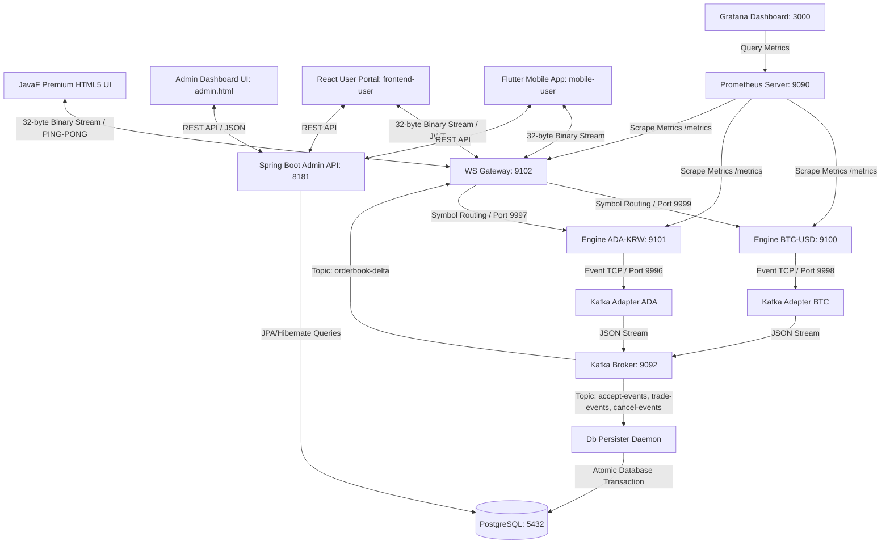

# 🌌 JavaF Exchange (HF-X)

초저지연(Ultra-Low Latency) 인메모리 가격-시간 우선(FIFO) 매칭 엔진, 실시간 시세 분배 웹소켓 게이트웨이, 초고속 오프라인 백테스팅 프레임워크를 갖춘 차세대 암호화폐/증권 거래소 백엔드 플랫폼. 

최근 **비동기 이벤트 소싱(Event Sourcing) 기반 PostgreSQL 실시간 자산 정산(Settle) 파이프라인**, **고대비 다크 테마 터미널(JavaF)**, **ADA-KRW 멀티 심볼 병렬 확장**, **진짜 RTT 네트워크 지연 실측**, **rAF 기반 호가창 렌더링 스로틀링**, **Prometheus & Grafana 기반 0-의존성 초경량 성능 계측 체계**, **Spring Boot 기반 통합 어드민 API & 어드민 대시보드 콘솔**, 그리고 **초현대식 React 19 + TypeScript + Vite 기반의 고성능 실시간 관제 어드민 터미널**이 추가 완비됨.

---

## 🆕 최근 업데이트 (Recent Updates)
- Docker Compose 인프라 및 애플리케이션 그룹 분리 구동 환경 구축.
  - `docker-compose.infra.yml`과 `docker-compose.app.yml` 최상단에 `name: exchange-infra` 및 `name: exchange-app`을 지정하여 Docker Desktop에서 `exchange_be` 단일 그룹으로 묶이던 현상을 인프라와 앱 그룹으로 깔끔하게 분리함.
  - 각 모듈을 독자적으로 빌드하고 독립 제어(Up/Down)할 수 있도록 구동 명령어를 현행화함.
- 회원 목록 서버사이드 페이징(Pageable) 규격 적용 및 프론트엔드 연동 안정화.
  - `UserController.java`의 회원 목록 조회(`getAllUsers`)를 JPA Pageable 구조로 전면 통합하여 Page 객체(`content`, `totalElements` 등)를 일관되게 반환하도록 함.
  - `useExchangeStore.ts`에서 `fetchWithAuth` 공통 응답 언래핑(`data` 필드 자동 추출) 특성에 맞춰 중복으로 `.data`를 추출하던 바인딩 에러를 해결하여 회원 목록 빈 화면 현상을 안정화시켰음.
  - `UserManagementTab.tsx`에서 하드 코딩된 페이지 사이즈 상수(10)를 `USER_PAGE_SIZE` 상수로 정의하여 아키텍처 규칙을 준수함.
- 사용자 회원가입 신청 및 어드민 가입 승인 워크플로우 구현.
  - 신규 가입 신청 API(`POST /admin/auth/signup`)를 추가하여 기본 `PENDING` 상태로 유저를 생성함.
  - `login` 및 `refresh` 시 유저의 상태가 `ACTIVE`가 아닐 경우 로그인을 제한하는 검증 가드를 신설함.
  - 프론트엔드 로그인 모달 내 회원가입 신청 화면 스위칭 및 승인 대기 완료 메시지 연동을 추가함.
  - 어드민 대시보드 회원 목록에 `PENDING` 상태 전용 점멸 배지 및 가입 승인 클릭 단추를 추가함.
  - E2E 테스트에서 가입 신청, 승인 전 로그인 실패 확인, 어드민 승인 및 최종 로그인/주문 전송 흐름을 풀 트랙으로 검증함.
- 백엔드(`admin-api`) 사용자 등록 및 권한 처리 강화.
  - 가입 엔드포인트에 `/register` 별칭 멀티 매핑을 추가해 E2E 테스트와 프론트엔드 통신 호환성 확보.
  - 회원가입 DTO 및 서비스 오버로딩을 통해 다중 권한(role) 지정 기능 신설.
  - 가입 시 이메일 중복 사전 검사 로직 추가 및 IllegalArgumentException 발생 시 400 Bad Request 반환 처리.
  - CustomUserDetailsService의 스프링 시큐리티 권한 생성 시 등급 대신 역할을 매핑하도록 수정.
- 프론트엔드(`frontend-user`) 백엔드 응답 규격(ApiResponse) 연동 완료.
  - Zustand 스토어 및 차트 컴포넌트의 API 호출부를 `ApiResponse<T>` 래퍼 규격에 맞춰 안전하게 추출하도록 수정함.
- 백엔드(`admin-api`) GET 요청 파라미터 IDT(Input Data Transfer) 캡슐화 및 계층 분리.
  - 반복되는 페이징 및 날짜 파라미터를 `BasePageIDT`, `DateRangePageIDT` 등 상속 구조의 공통 IDT로 묶어 재사용성 확보.
  - `UserController` 내의 `Map` 수신 파라미터를 명시적 IDT(`UserRegisterIDT` 등)로 전면 교체하여 타입 안전성 강화.
  - 컨트롤러에 혼재되어 있던 데이터베이스(Mapper) 직접 호출 및 비즈니스 로직(페이징, 날짜 계산)을 `UserService` 계층으로 완전 분리하여 CQRS 아키텍처 원칙 복원.
- 백엔드 응답 규격 통합 및 DTO 분리 아키텍처 적용 (`admin-api`).
  - 모든 API 응답을 `ApiResponse<T>` 래퍼로 통합하여 에러 코드 및 메시지 규격화.
  - 요청 DTO는 `*IDT` (Input Data Transfer), 응답 DTO는 `*ODT` (Output Data Transfer) 네이밍 컨벤션으로 완전 분리 적용.
  - 컨트롤러 및 서비스 레이어에서 Map 반환을 명시적 타입 객체(ODT) 반환으로 전환하여 타입 안전성 확보.
- 코인별 온체인 입출금 다형성 구현 및 JAF 마켓 거래쌍 신규 추가 (`admin-api`).
  - `WalletService` 및 `WalletDaemonService` 내부의 JAF 코인 하드코딩 분기 처리를 전면 제거하고, `CoinNetworkService` 공통 인터페이스(송금, 잔고 조회, 지갑 주소 생성, 수수료 산정)를 신설함.
  - `JAFTokenService`를 제거하고, `JafCoinService`, `BtcCoinService`, `AdaCoinService`로 전용 구현체를 완전하게 분리함. 각 구현체는 Ganache 상에 독자적인 스마트 계약(ERC-20 대체 계약)을 개별 배포하여 실제 온체인 상의 계약을 다루도록 구현함.
  - `WalletDaemonService` 백그라운드 스케줄러의 임의 난수 가상 입금 시뮬레이션을 전면 폐지하고, `scanOnChainDeposits`를 통해 `JAF`, `BTC`, `ADA` 3종 코인에 대한 실제 Ganache 온체인 Transfer 로그 감지 및 정산으로 일원화함.
  - `V2__seed_data.sql`에 `JAF-KRW` (기준가: 1500) 및 `JAF-USD` (기준가: 1) 마켓 상장 데이터를 신규 주입하여 마켓 활성화를 지원함.
  - `@Autowired` 필드 주입 방식을 생성자 주입 구조(Lombok `@RequiredArgsConstructor`)로 리팩토링하여 안전성을 극대화함.
- MyBatis 프레임워크 전면 도입 완료 (`admin-api`).
  - `LedgerJournalRepository`에 이어 `TradeRepository`의 복잡한 네이티브 쿼리를 `TradeMapper`로 모두 이관.
  - OR 조건으로 인한 풀 스캔 성능 저하를 `UNION ALL`로 분리하여 인덱스 효율성 극대화.
- 전체 SQL 대문자 작성 룰(Rule) 적용.
  - `TradeMapper.xml` 및 `LedgerJournalMapper.xml` 내의 테이블명, 컬럼명, 별칭을 포함한 모든 SQL 구문을 100% 대문자로 변환 적용.
- 통계 쿼리 성능 최적화 및 풀스택 연동.
  - `StatsController`, `LedgerController` 등 주요 통계 조회 API에 기간(`startDate`, `endDate`) 파라미터 필수 도입.
  - 파라미터 누락 시 서버 단에서 '최근 30일'을 기본값으로 할당하여 안정성 확보.
  - `frontend-admin` Zustand 스토어(`useExchangeStore.ts`)에서 API 호출 시 동적으로 날짜 쿼리를 생성 및 주입하도록 연계.
- 런타임 의존성 주입 규격 통일.
  - `UserController`, `UserService`, `StatsService` 등 모든 `@Autowired` 어노테이션 제거 후 안전한 생성자 주입 방식으로 리팩토링함.
- 지갑 지연 생성(Lazy Initialization) 아키텍처 확립.
  - 신규 가입 시 하드코딩된 빈 지갑 생성 로직을 삭제함.
  - `UserService.getOrCreateWallet` 공통 메서드를 신설하여 입금 등 실제 자산 변동 시점에만 지갑을 지연 생성하도록 최적화함.
  - 매칭 정산 데몬(`adapter-kafka`)은 DB 계층의 원자적 UPSERT(`ON CONFLICT DO NOTHING`)를 통해 거래 시점 지연 생성을 이미 완벽히 지원함.
- 500 전역 예외 처리 및 호환성 강화 적용.
  - `GlobalExceptionHandler`를 통한 `ApiResponse` 규격 반환으로 스택 트레이스 노출 차단.
  - 컴파일러 호환성 문제 방지를 위해 `@RequestParam` 명시적 이름 할당.
- 대용량 통계 집계 쿼리 최적화 및 전용 인덱스 구축 (`admin-api`).
  - `StatsMapper` 및 `TradeMapper`의 조인 병목 구간을 CTE(WITH 구문)를 활용한 선 그룹핑 후 조인 방식으로 구조 전면 개편.
  - `TRADES`, `ORDERS`, `LEDGER_JOURNAL`, `USERS` 테이블에 날짜(CREATED_AT) 기준 통계 조회 전용 B-Tree 복합 인덱스 설계 및 적용.
  - XML 매퍼 내 모든 한글 주석을 코드 끝 기준 탭 2번 띄움 정렬 규칙으로 일괄 규격화.

---

## 🐳 시스템 기동 및 Docker Compose 분리 구성 가이드

플랫폼은 인프라(DB, Kafka, ES, 모니터링 등)와 애플리케이션(매칭 엔진, 어댑터, API, UI 등)이 각각 독립적인 Docker Compose 파일로 구성되어 있음. Docker Desktop UI에서 그룹이 분리되도록 각각 `name` 속성이 부여되어 있음.

### 1. 그룹별 Compose 파일 및 구성 요소

* **인프라 그룹 (`docker-compose.infra.yml` / `name: exchange-infra`)**:
  * **핵심 DB & EVM**: PostgreSQL (`5432`), Ganache (`8545`), Elasticsearch (`9200`)
  * **메시징 브로커**: ZooKeeper (`2181`), Apache Kafka (`9092` / `29092`)
  * **통합 관측 인프라**: Loki (`3100`), Promtail, Prometheus (`9090`), Grafana (`3000`), cAdvisor (`8182`), Kafka Exporter (`9308`)
* **애플리케이션 그룹 (`docker-compose.app.yml` / `name: exchange-app`)**:
  * **매칭 엔진**: engine-btc, engine-ada, engine-jaf-krw, engine-jaf-usd
  * **어댑터 & 데몬**: kafka-adapter (btc, ada, jaf-krw, jaf-usd), ws-gateway (`8088`), db-persister
  * **백엔드 & UI**: admin-api (`8181`), frontend-user (`5173`), frontend-admin (`5174`), audit-volume, order-generator

---

### 2. 단계별 구동 명령어

#### ① 인프라 서비스 구동 (선행 실행)
```bash
docker compose -f docker-compose.infra.yml up -d --build
```

#### ② 애플리케이션 및 매칭 엔진 구동 (인프라 구동 후 실행)
```bash
docker compose -f docker-compose.app.yml up -d --build
```

#### ③ 특정 그룹만 정지 및 삭제
```bash
# 애플리케이션 정지
docker compose -f docker-compose.app.yml down

# 인프라 정지
docker compose -f docker-compose.infra.yml down
```

---

## 🚀 주요 성능 지표 (Benchmark)

로컬 머신(OpenJDK 17 환경)에서 오프라인 백테스터를 구동해 측정한 매칭 엔진의 순수 처리 한계 성능.

| 지표 (Metric) | 측정 결과 (Performance Metrics) |
| :--- | :--- |
| **초당 주문 처리량 (Throughput)** | **1,885,547.64 orders/sec** (초당 188만+ 건 매칭) |
| **평균 매칭 지연 시간 (Latency)** | **530.35 nanoseconds/order** (건당 0.53마이크로초) |
| **실시간 평균 매칭 속도 (Real Latency)**| **196.74 µs** (네트워크/Kafka 브릿지 연동 실측 평균) |
| **JVM JIT 예열 기능 (JIT Warmup)** | 지원 (JIT 최적화 컴파일 경로 반영) |
| **동적 시뮬레이션 데이터** | 10,000건의 실시간 주문 및 체결 시나리오 (`orders.csv` 자동 생성) |

---

## 🏛️ 플랫폼 전체 시스템 아키텍처



---

## 🔌 서비스 포트 맵핑 현황 (Service Port Mappings)

플랫폼을 구성하는 모든 분산 마이크로서비스 및 인프라의 내부(Container) 및 외부(Host) 포트 바인딩 현황입니다. 특정 호스트 포트 충돌 방지 설계 방식도 아래 표에서 함께 확인하실 수 있습니다.

| 서비스명 (Service) | 역할 (Role) | 호스트 외부 포트 (Host Port)          | 컨테이너 내부 포트 (Container Port)    | 맵핑 유형 & 비고 (Notes)                                                                                                            |
| :--- | :--- |:-------------------------------|:-------------------------------|:------------------------------------------------------------------------------------------------------------------------------|
| **`ws-gateway`** | 실시간 웹소켓 시세/주문 게이트웨이 | **`8088`**<br>`9102`           | **`8088`**<br>`9102`           | **주요 접속 서비스 포트**.<br>자체 프로메테우스 메트릭 노출 포트 포함.                                                                                  |
| **`admin-api`** | Spring Boot 통합 어드민 백엔드 | **`8181`**                     | **`8181`**                     | 어드민 대시보드 연동용 REST API 포트.                                                                                                     |
| **`cadvisor`** | 실시간 컨테이너 리소스 계측 에이전트 | **`8182`**                     | **`8182`**                     | ⚠️ **포트 충돌 방지 회피 설계**:<br>내부 포트는 `8182`으로 고정이지만, 포트 충돌 방지를 위해 호스트 외부 포트를 **`8182`**로 우회 매핑하였습니다. (ws-gateway는 `8088` 포트로 이전됨) |
| **`postgres`** | 회원/자산/정산 관계형 데이터베이스 | **`5432`**                     | **`5432`**                     | 데이터베이스 단독 포트 바인딩.                                                                                                             |
| **`prometheus`** | 분산 메트릭 수집 및 시계열 DB | **`9090`**                     | **`9090`**                     | 프로메테우스 웹 콘솔 접속 포트.                                                                                                            |
| **`grafana`** | 실시간 계측 시각화 대시보드 | **`3000`**                     | **`3000`**                     | 그라파나 대시보드 웹 UI 접속 포트 (ID/PW: admin/admin).                                                                                    |
| **`engine-btc`** | BTC-USD 매칭 엔진 (인메모리 코어) | **`9999`**<br>`9998`<br>`9100` | **`9999`**<br>`9998`<br>`9100` | TCP 커맨드 수신 (9999)<br>TCP 체결 이벤트 송신 (9998)<br>프로메테우스 메트릭 (9100)                                                                |
| **`engine-ada`** | ADA-KRW 매칭 엔진 (인메모리 코어) | **`9997`**<br>`9996`<br>`9101` | **`9997`**<br>`9996`<br>`9101` | TCP 커맨드 수신 (9997)<br>TCP 체결 이벤트 송신 (9996)<br>프로메테우스 메트릭 (9101) |
| **`engine-jaf-krw`** | JAF-KRW 매칭 엔진 (원화 마켓) | **`9995`**<br>`9104`<br>`9103` | **`9995`**<br>`9996`<br>`9103` | TCP 커맨드 수신 (9995)<br>TCP 체결 이벤트 송신 (컨테이너 9996 → 호스트 9104)<br>프로메테우스 메트릭 (9103) |
| **`engine-jaf-usd`** | JAF-USD 매칭 엔진 (달러 마켓) | **`9994`**<br>`9106`<br>`9105` | **`9994`**<br>`9993`<br>`9105` | TCP 커맨드 수신 (9994)<br>TCP 체결 이벤트 송신 (컨테이너 9993 → 호스트 9106)<br>프로메테우스 메트릭 (9105) |
| **`kafka`** | 분산 실시간 메시지 브로커 | **`29092`**<br>`9092`          | **`29092`**<br>`9092`          | 외부 개발기 접속용 (29092)<br>컨테이너 내부 브릿지용 (9092)                                                                                     |
| **`zookeeper`** | 카프카 메타데이터 제어/조율 관리자 | **`2181`**                     | **`2181`**                     | 카프카 클러스터 내부 조율용.                                                                                                              |
| **`loki`** | 중앙집중형 실시간 로그 저장소 | **`3100`**                     | **`3100`**                     | 그라파나 로키 로그 수집 서버 포트.                                                                                                            |
| **`kafka-exporter`** | 카프카 브로커 성능/지연 계측 어댑터 | **`9308`**                     | **`9308`**                     | 카프카 메트릭 노출용 포트 (Prometheus 연동).                                                                                                 |

### 🔄 백엔드 및 프론트엔드 동적 포트 연동 가이드

마켓별 스냅샷 포트를 조회하고 호출하는 과정에서 백엔드와 프론트엔드가 협력하는 동적 매핑 방식에 대한 명세이다.

#### 1. 백엔드 (admin-api) 설정 구조
* 백엔드는 각 마켓 메타데이터 및 스냅샷 조회를 위해 동적 스냅샷 포트(`snapshotPort`) 정보를 프론트엔드에 API로 제공함.
* 설정 파일인 `admin-api/src/main/resources/application.yml` 파일 내부의 `app.market-ports` 맵 속성에 심볼별 스냅샷 포트가 정의되어 있음:
  ```yaml
  app:
    market-ports:
      BTC-USD: 9100
      ADA-KRW: 9101
      JAF-KRW: 9103
      JAF-USD: 9105
  ```
* 마켓 목록 조회 API(`GET /admin/stats/markets`) 호출 시, 데이터베이스에 등록된 마켓 정보와 이 설정을 조인하여 DTO(`MarketODT`)에 `snapshotPort`를 실어 반환함.

#### 2. 프론트엔드 (frontend-user / frontend-admin) 동작 구조
* 프론트엔드는 기존의 마켓별 포트 하드코딩 분기문을 전면 제거하고 API 기반으로 동적 작동함.
* 스토어 초기화(`initStore`) 시점에 백엔드 API인 `/admin/stats/markets`를 먼저 **동기적으로 호출하여 완벽하게 로드(`fetchMarkets`)**한 뒤, 그 정보가 담긴 `markets` 상태를 참조하여 해당 활성 마켓의 스냅샷 포트로 HTTP 요청(`fetchFullSnapshot`)을 전송함.
* 이 선행 동기화가 보장되어야만, 마켓 로드 전 비어있는 상태에서 잘못된 포트(예: 9101)로 스냅샷을 호출하여 화면 호가창이 빈 상태로 남아있는 레이스 컨디션 문제를 방지할 수 있음.

#### 3. 포트 설정 변경 또는 신규 마켓 추가 시 수정 사항
* **백엔드**: `/home/administrator/exchange_be/admin-api/src/main/resources/application.yml`의 `app.market-ports`에 새로운 마켓 심볼과 해당 엔진의 Prometheus/Snapshot 포트 매핑을 반드시 추가해야 함.
* **프론트엔드**: 개별 스토어(`useExchangeStore.ts`)의 `fetchFullSnapshot`에서 하드코딩 분기문을 절대 사용하지 말고, 항상 `get().markets`에서 찾아낸 `snapshotPort`를 기반으로 호출하도록 유지해야 함.

#### 4. 환경 변수 (.env) 설정 파일 정의 및 역할
서비스 기동 시 `docker-compose.yml` 및 하위 모듈이 참조하는 각 환경별 `.env` 파일(`.env.dev`, `.env.qa` 등)에는 신규 매칭 엔진과 카프카 어댑터, 웹소켓 게이트웨이가 참조하는 아래 환경 변수들을 빠짐없이 세팅해 주어야 함.

* **변수별 정의 및 연동 서비스**:
  * `[SYMBOL]_COMMAND_PORT`: 매칭 엔진이 외부 주문 입력을 수신하는 TCP 포트 (예: `JAF_USD_COMMAND_PORT=9994`). `ws-gateway`와 `order-generator`에서 이 포트를 참조하여 엔진으로 직접 주문 CSV 명령을 송신함.
  * `[SYMBOL]_ENGINE_PORT`: 매칭 엔진이 체결/호가 변경 이벤트를 실시간으로 외부 브로드캐스트하는 TCP 포트 (예: `JAF_USD_ENGINE_PORT=9993`). `kafka-adapter-[symbol]`가 이 포트에 접속하여 실시간 이벤트를 받아 카프카 토픽으로 전송함.
  * `[SYMBOL]_ENGINE_HOST`: 매칭 엔진의 컨테이너명 혹은 호스트 IP (예: `JAF_USD_ENGINE_HOST=engine-jaf-usd`). `kafka-adapter` 및 `ws-gateway`가 타겟 엔진에 접속할 때 호스트명으로 참조함.
  * `[SYMBOL]_REFERENCE_PRICE`: 가상 주문 생성기가 작동할 때 기준이 되는 실시간 최초 기준가 (예: `JAF_USD_REFERENCE_PRICE=1`). `order-generator`가 기동 시 이 값을 정수 스케일링하여 시드 호가를 구성함.

---

## 🪙 신규 코인/마켓 추가 확장 가이드 (Market Expansion Checklist)

새 코인 거래쌍(예: `ETH-KRW`, `XRP-USD` 등)을 플랫폼에 추가할 때 수정해야 하는 파일과 작업 순서를 정리한 체크리스트.

> **네이밍 규칙 (예: `ETH-KRW` 추가 시)**
> - 심볼 표기: `ETH-KRW` (대문자, 하이픈 구분)
> - 환경 변수 접두어: `ETH_KRW` (대문자, 언더스코어 구분)
> - Docker 서비스명: `engine-eth-krw`, `kafka-adapter-eth-krw` (소문자, 하이픈 구분)
> - 컨테이너명: `matching-engine-eth-krw` (소문자, 하이픈 구분)

---

### ① 포트 할당 계획 (Port Planning)

새 마켓마다 커맨드/이벤트/메트릭 포트가 각각 필요하므로 기존 포트와 겹치지 않게 미리 확보.

| 용도 | 환경 변수명 | 예시 값 |
|------|-----------|--------|
| 커맨드 수신 (주문/취소) | `ETH_KRW_COMMAND_PORT` | `9993` |
| 이벤트 출력 (체결 피드) | `ETH_KRW_ENGINE_PORT` | `9992` |
| Prometheus 메트릭 | (docker-compose 직접 지정) | `9106` |
| 엔진 호스트명 | `ETH_KRW_ENGINE_HOST` | `engine-eth-krw` |

---

### ② 수정 파일 목록 (Files to Modify)

#### 1. `.env` / `.env.dev` / `.env.qa` / `.env.prd` — 환경별 설정 추가

```bash
# 각 환경 파일에 아래 항목 추가
ETH_KRW_COMMAND_PORT=9993
ETH_KRW_ENGINE_PORT=9992
ETH_KRW_ENGINE_HOST=engine-eth-krw          # dev/qa: 컨테이너명 / prd: 서버 호스트명
ETH_KRW_REFERENCE_PRICE=3000000             # 주문 생성기 기준가 (원화 마켓 예시)
```

#### 2. `docker-compose.yml` — 엔진 및 카프카 어댑터 서비스 추가

```yaml
# 섹션 4 (거래 매칭 엔진 및 어댑터) 내에 추가
engine-eth-krw:
  build:
    context: .
    dockerfile: engine-core/Dockerfile
  container_name: matching-engine-eth-krw
  environment:
    - SYMBOL=ETH-KRW
    - COMMAND_PORT=9993
    - ENGINE_PORT=9992
    - METRICS_ENABLED=true
    - METRICS_PORT=9106
    - JAVA_OPTS=-XX:+UseSerialGC -Xms128m -Xmx256m
  ports:
    - "9993:9993"
    - "9107:9992"   # 호스트 포트 충돌 방지를 위한 우회 매핑
    - "9106:9106"

kafka-adapter-eth-krw:
  build:
    context: .
    dockerfile: adapter-kafka/Dockerfile
  container_name: kafka-adapter-eth-krw
  depends_on:
    - engine-eth-krw
    - kafka
  environment:
    - KAFKA_BROKER=kafka:9092
    - ENGINE_HOST=engine-eth-krw
    - ENGINE_PORT=9992
    - JAVA_OPTS=-Xms64m -Xmx128m -XX:+UseSerialGC
  restart: on-failure
```

> `order-generator`의 `depends_on`에도 `engine-eth-krw` 추가

#### 3. `prometheus/prometheus.yml` — 메트릭 수집 대상 추가

```yaml
- job_name: 'matching-engine-eth-krw'
  static_configs:
    - targets: ['engine-eth-krw:9106']
```

#### 4. `order-generator/src/main/java/exchange/generator/OrderGenerator.java` — 주문 주입 스레드 추가

```java
// 환경 변수에서 호스트/포트 로드
String ethKrwHost = ConfigLoader.get("ETH_KRW_ENGINE_HOST", engineHost);
int ethKrwPort    = ConfigLoader.getInt("ETH_KRW_COMMAND_PORT", 9993);

// 스케일 및 기준가 설정 (KRW 마켓: 소수점 4자리 스케일 10,000)
long ethKrwScale = 10000L;
Thread ethKrwThread = new Thread(
    new GeneratorTask(ethKrwHost, ethKrwPort, 3000000L * ethKrwScale, "ETH-KRW",
                      ethKrwScale, sleepMin, sleepMax),
    "generator-eth-krw");
ethKrwThread.start();
// ... join() 추가
```

> `GeneratorTask` 내 분기 로직(호가 격차, 수량 범위, 호가 하한선)에 `ETH-KRW` 조건 추가

#### 5. `adapter-ws/src/main/java/exchange/ws/WsHandler.java` — **수정 불필요** ✅

symbol → 환경 변수 키 자동 유도 구조로 리팩토링 완료. `.env`에 `ETH_KRW_ENGINE_HOST`, `ETH_KRW_COMMAND_PORT`만 추가하면 자동 라우팅됨.

#### 6. `adapter-ws` (및 관련 백엔드 서비스) — 마켓 설정 등록

`MarketConfigManager`에 새 심볼(`ETH-KRW`)의 소수점 자릿수(`decimals`)와 최소 주문 금액(`minAmt`)을 등록.

#### 7. README.md — 포트 맵 테이블 및 가이드 현행화

포트 맵핑 현황 표에 새 엔진 행을 추가하고, 이 체크리스트의 포트 예시를 실제 할당된 포트로 업데이트.

---

### ③ 수정 체크리스트 요약

| # | 파일/위치 | 작업 내용 | 자동화 여부 |
|---|----------|---------|----------|
| 1 | `.env` × 4개 파일 | 호스트/포트/기준가 환경 변수 추가 | 수동 |
| 2 | `docker-compose.yml` | 엔진 + 카프카 어댑터 서비스 블록 추가 | 수동 |
| 2-1 | `docker-compose.yml` | `order-generator` depends_on 추가 | 수동 |
| 3 | `prometheus/prometheus.yml` | scrape job 추가 | 수동 |
| 4 | `OrderGenerator.java` | 주문 주입 스레드 및 분기 로직 추가 | 수동 |
| 5 | `WsHandler.java` | **변경 없음** (자동 라우팅) | **자동** ✅ |
| 6 | `MarketConfigManager` | 심볼 소수점/최소금액 등록 | 수동 |
| 7 | `README.md` | 포트 맵 및 이 체크리스트 업데이트 | 수동 |

## 🛡️ 통합 어드민 제어 시스템 (Admin Console)

거래소 운영 효율성 극대화 및 실시간 정산 감사를 지원하는 통합 어드민 솔루션이 완비되었습니다.

### 1. Spring Boot 기반 REST API 백엔드 (`admin-api`)
*   **통화별 총 유통 자산 지표 조회 (`/admin/wallets/summary`):** 거래소 내에 보관된 전체 자산(KRW, USD, BTC, ADA)의 사용 가능한 잔액 및 거래 진행중 락(Locked)이 걸린 자산의 합산 수치를 원자적으로 조회합니다.
*   **실시간 성능 및 시스템 통계 요약 (`/admin/stats/summary`):** 총 등록 회원 수, 활성 지갑 수, 금일 누적 매칭 거래 수, 누적 거래 대금(Volume)을 즉각 취합하여 반환합니다.
*   **전일 종가 및 9시 KST 기준 티커 벌크 조회 (`/admin/stats/tickers`):** (🌟 신규) 모든 활성 마켓의 현재가와 KST 09:00 boundary 기준 전일 종가(체결 기록이 없는 경우 최초 거래가 및 DB 상장가를 폴백으로 계산) 정보를 한 번에 벌크로 수집하여 단일 호출로 프론트엔드와 어드민의 등락률 연산을 동적 계산 처리합니다.
*   **거래소 실적 분석 통계 조회 (`/admin/stats/performance`):** (🌟 신규) 마켓별 누적 및 24시간 수수료 수입, 24H DAU / 30D MAU, 자산 유통 속도(Trading Velocity), 오더 체결 성공률 및 경쟁사(Binance, Upbit, Coinbase) 성능 벤치마킹 통합 분석 데이터를 반환합니다.
*   **마켓 설정 관리 및 상장가(listing_price) 동적 수정 (`PUT /admin/stats/markets/{symbol}`):** (🌟 신규) 어드민에서 특정 마켓의 수수료율, 소수점 자리수, 최소 주문 수량뿐만 아니라 최초 상장 기준가(`listing_price`)를 동적으로 수정하고 DB에 영속화할 수 있는 안전한 REST API를 제공합니다. 소스코드 내 하드코딩 폴백 가격을 전면 제거하고 DB로 관리되도록 일원화했습니다.
*   **마켓별 동적 수수료율 설정 및 조회 (`/admin/settings`):** (🌟 신규) `POST` 요청을 통해 `markets` 테이블과 연동된 전체 마켓의 수수료 설정을 동적으로 변경하고 DB 영속화와 인메모리 `AdminSettings` 캐시 동기화를 즉시 처리합니다. 마켓 수수료율 등 정보 수정 발생 시 `market_histories` 테이블에 등록/수정 일시 및 담당자 필드를 동일하게 복사하여 변경 이력을 명시적으로 로그 적재합니다.
*   **유입 유저 지표 조회 (`/admin/stats/users`):** 일간, 주간, 월간, 분기, 연간 해상도 변수(Resolution)를 주입받아 시간에 따른 신규 회원 가입 유입량을 반환합니다.
*   **매칭 거래 분석 및 자산 변경 이력 조회 (`/admin/stats/trades` / `/admin/stats/assets`):** 기간별 거래소 내의 원화 및 USD, 각종 코인 자산의 증감 흐름과 누적 체결 수치를 다각도로 조회합니다.
*   **회원 원장 관리 (CRUD):** 회원 가입 등록(`POST /admin/users`), 정보 수정(`PUT /admin/users/{id}`), VIP 등급/거래정지(SUSPENDED) 관리 기능이 완벽 제공됩니다.
*   **감사 연동 자산 추가/차감 (`/admin/users/{id}/assets/adjust`):** 관리자가 특정 회원의 자산 지갑을 즉각 지급(Deposit) 또는 회수(Withdrawal)할 수 있는 안전한 REST API를 제공하며, 모든 변동분은 `ledger_journal` 감사용 테이블에 완전 보장됩니다.
*   **본인 식별 정보 및 자산 조회 전용 API (me):** (🌟 신규) 일반 사용자가 자신의 거래 내역, 원장 이력, 지갑 정보를 안전하게 조회할 수 있는 `/admin/users/me/trades`, `/admin/users/me/ledgers`, `/admin/wallets/me` API를 제공합니다. JWT 인증 세션 정보(이메일)를 기반으로 본인 데이터를 알아서 매칭하여 반환하므로 식별자(ID) 노출에 따른 해킹 위협(IDOR 취약점)을 완벽히 격리 방지합니다.
*   **Spring Security & JWT 기반 무상태 인증/인가 체계 및 RTR(Refresh Token Rotation) 도입 (🌟 신규):**
    *   **강력한 API 보호:** 모든 `/admin/**` 엔드포인트를 Spring Security 6 필터 체인으로 보호하고, `ADMIN` 등급을 보유한 인증된 관리자만 접근 가능하도록 엄격히 통제함.
    *   **Stateless JWT 인증 (userId 클레임 포함):** 무상태 세션 관리 모델을 탑재하여 서버 메모리나 세션 저장소 부하 없이 헤더의 `Authorization: Bearer <Access_Token>`을 고속 해독해 자격 증명을 수립함. 특히, Access Token 내부에 `userId`를 커스텀 클레임(Claim)으로 직접 인코딩하여 클라이언트(웹 및 Flutter 모바일)에서 별도의 REST API(예: 403 제한이 걸린 `/admin/users`) 호출 없이도 로컬에서 본인의 사용자 ID를 즉시 식별할 수 있도록 최적화함.
    *   **RTR (Refresh Token Rotation) 토큰 회전 기법:** 사용자가 Access Token 만료로 갱신 요청(`POST /admin/auth/refresh`)을 보내면, 기존 Refresh Token을 즉시 폐기(일회성)하고 새로운 Access/Refresh Token 쌍을 자동 재발급함. 이를 통해 Refresh Token 탈취 및 재사용(Replay) 공격을 원천 방지함.
    *   **안전한 하이브리드 비밀번호 인코더:** 신규 비밀번호는 솔트가 가미된 강력한 `BCrypt` 알고리즘으로 암호화하여 저장하며, 데이터베이스 내 기존 1,000명의 레거시 SHA-256 및 시드 목(Mock) 데이터 비밀번호도 안전하게 호환 대조되도록 구현함.
    *   **인증 비즈니스 로직 분리 (AuthService):** 기존 `AuthController`에 밀집되어 있던 로그인, 토큰 재발급, 로그아웃 관련 비즈니스 로직을 `AuthService` 레이어로 분리하고 응답을 `AuthResponseDTO`로 캡슐화하여 단일 책임 원칙(SRP) 준수.
    *   **기본 관리자 계정 자동 생성 (local/dev 프로파일):** 시스템 시작 시 기본 관리자 계정(`admin@javaf.net` / `admin123!@#`, `ADMIN` 권한) 존재 여부를 확인하고 없으면 자동 생성함. 로컬 및 개발 환경에서만 동작하며, PostgreSQL 초기화 완료를 대기한 뒤 `users_user_id_seq` 시퀀스를 동기화하고 계정을 생성함. 운영(`prod`) 환경에서는 실행되지 않음.
    *   **전역 API 응답 구조 통일 및 프론트엔드 호환 패치 (🌟 신규):** 모든 백엔드 컨트롤러의 응답을 `ApiResponse (status, message, data)` 규격으로 감싸도록 `GlobalResponseWrapper`를 도입함. 또한 프론트엔드(`useExchangeStore.ts`)의 `fetchWithAuth` 및 각종 데이터 페칭 로직이 이 래퍼 구조를 자동으로 언래핑(Unwrap)하도록 수정하여 호환성과 안정성을 확보함.
    *   **생성자 기반 의존성 주입 리팩토링 (🌟 신규):** 컨트롤러(`AuthController`, `CryptoWalletController` 등)에서 사용하던 `@Autowired` 필드 주입을 Lombok의 `@RequiredArgsConstructor`와 `final` 필드를 활용한 생성자 주입 방식으로 개선하여 의존성 불변성과 테스트 용이성을 확보함.
*   **JPA Auditing 및 AOP 기반 스레드 안전 등록자/수정자 자동 이원화 주입 아키텍처 (🌟 신규):**
    *   **전체 테이블 Auditing 확장:** `users`뿐만 아니라 `wallets`, `ledger_journal`, `crypto_withdrawals`, `user_crypto_addresses`, `system_hot_wallets`, `trades` 등 전체 영속성 엔티티가 `BaseEntity`를 공동 상속하게 설계하여 오디팅 컬럼(`createdAt`, `updatedAt`, `createdBy`, `updatedBy`) 구성을 전체 테이블에 일괄 이식함.
    *   **AOP 기반 스레드 안전 이원화 기록 (`@SystemAuditor`):** 
        *   **사용자 주체 작업:** 어드민 대시보드 API 호출 등 로그인한 사용자가 요청할 때는 Spring Security of Principal(이메일 등) 정보가 `createdBy` / `updatedBy`에 자동으로 주입됩니다.
        *   **시스템 주체 작업:** 백그라운드 데몬, 스케줄러, 카프카 컨슈머 등 백그라운드 시스템이 작업을 유발할 때는 `@SystemAuditor("시스템식별자")` 어노테이션을 부착하여 스레드 안전하게 ThreadLocal을 관리하며, 이를 통해 등록자/수정자에 `"SYSTEM:시스템식별자"`가 자동 기록됩니다.
        *   **메모리 누수 방지 가드:** AOP Aspect 내의 `finally` 절에서 ThreadLocal 리소스를 강제 해제(`remove()`)함으로써 WAS 스레드 풀 환경에서의 오염이나 OOM (Memory Leak) 리스크를 원천 제거하였습니다.
    *   **Flyway 데이터베이스 형상 관리(Migration) 도입 (🌟 신규):** 
        *   기존 Java 애플리케이션 기동 시 수행하던 불완전한 동적 DDL 패치 및 임시 패치 로직을 완전히 제거했습니다.
        *   [V1__init_schema.sql](file:///home/administrator/exchange_be/admin-api/src/main/resources/db/migration/V1__init_schema.sql)을 통해 전체 테이블, 제약 조건, 코멘트 및 인덱스 구조를 Flyway로 버전 관리합니다.
        *   애플리케이션 기동 시 Flyway 엔진이 DB의 스키마 변경 이력을 자동으로 검사하고 마이그레이션을 적용합니다.
        *   스키마 정의(DDL)는 Flyway가 전담하고, 초기 시드 및 대량 데이터(DML)는 Postgres 초기화 스크립트([postgres-init.sql](file:///home/administrator/exchange_be/postgres-init.sql))가 담당하도록 역할 구조를 물리적으로 완벽히 분리했습니다.
*   **PostgreSQL 성능 최적화:** 500 에러를 유발할 수 있는 복잡한 Native Time-Bucket Parameter Binding 문제점을 표준적인 `GROUP BY 1, 2, 3` 및 `ORDER BY 1 DESC` 인덱스 기법으로 튜닝 완료했습니다.

### 2. 프리미엄 다크 글래스모피즘 웹 어드민 ([admin.html](./frontend/admin.html))
*   **완벽한 UI와 로직의 분리 (ES6 모듈화):** 기존 2,200라인에 육박하던 비대한 단일 HTML 파일에서 인라인 자바스크립트 전체를 분리 추출하여 **의존성 제로의 독립적인 ES6 모듈 파일인 [admin.js](./frontend/js/admin.js)로 리팩토링**을 완료했습니다. 이를 통해 UI/Style 레이어와 비즈니스 로직 레이어를 완벽히 차단 격리하여 고성능 유지보수 구조를 100% 확보했습니다.
*   **🌌 실시간 마켓 감시 모니터 (TradingView Charts) 패널 (🌟 신규):** 어드민 대시보드 내에 실시간 시세 및 캔들을 안전하게 모니터링할 수 있는 하이엔드 모니터링 패널을 전격 추가 마운트했습니다.
    *   **어드민 전용 보라색 테마 차트:** 캔들 및 거래량 그래프뿐만 아니라 MA7(주황), MA25(분홍) 네온 이동평균선을 오버레이하여 리얼타임 기술 지표 추세를 제공합니다.
    *   **실시간 웹소켓 체결 로그 모니터:** Netty 게이트웨이(Port 8088)의 초경량 32바이트 바이너리 패킷 디코더와 즉시 바인딩하여, 체결 이벤트를 수신하자마자 `[체결 ID | 종목 | 구분 | 체결가 | 수량 | 대금 | 시각]` 형태의 스크롤형 실시간 로그 테이블을 갱신합니다.
    *   **다중 해상도 및 종목 스위칭:** `BTC-USD`와 `ADA-KRW` 간의 원클릭 스위칭 및 `1M/5M/15M/1H` 탭 기동 시 **시간 축 결함 극복 안전 가드(Time-Bound Safety Guard)**를 작동시켜 오래된 시간 버킷 틱에 의한 Lightweight Charts 엔진 마비 현상을 완전히 물리쳤습니다.
*   **ApexCharts 인터랙티브 통계 분석:** CDN 기반 하이엔드 차트 라이브러리 연동으로 일간, 주간, 월간, 분기, 연간 필터링에 따른 가입 추이, 체결 건수/대금, 자산 입출금 비율 도넛 차트 구현.
*   **통합 회원 관리 모달:** 모달 윈도우를 활용해 이메일 실시간 계정 검색, 신규 회원 등록, 상태 변동, 자산 추가/차감(Deposit/Withdrawal)을 즉시 실시간 인젝션 조작합니다.
*   **WSL/네트워크 바인딩 게이트웨이:** 우측 상단의 `API Host` 입력창을 통해 WSL 가상 머신 IP나 원격 도메인 IP를 동적으로 주입하여 즉시 REST API 커넥션을 수립할 수 있도록 설계했습니다.

### 3. 초현대식 React + TypeScript 고성능 실시간 관제 터미널 ([frontend-admin](./frontend-admin)) (🌟 신규)
*   **Zustand 기반 초저지연 상태 관리:** 기존 DOM 직접 제어 한계를 완벽히 극복하여, 32바이트 바이너리 패킷 파싱 스펙을 포함한 모든 거래소 실시간 상태를 반응형 스토어로 관리합니다.
*   **거래소 실적 분석 (Performance Console) 콘솔 탭 연동:** (🌟 신규) 누적 및 24시간 수수료 수익, DAU/MAU 고착도, 30일 순입금 흐름(Net Deposit Flow), 오더 성공률 Progress Bar, 경쟁사 벤치마킹 테이블 지표 등 실시간 통합 실적을 관제합니다.
*   **마켓별 동적 수수료율 설정 제어판:** (🌟 신규) 시스템 환경 설정 탭 내부에서 BTC-USD 및 ADA-KRW 마켓의 수수료율(%)을 관리자가 직접 실시간 변경 및 저장할 수 있는 입력 필드를 구축했습니다.
*   **TradingViewChart 모듈 컴포넌트화:** 이중 시간 보장 안전 필터(Outdated Tick Guard)와 하이브리드 보정 패딩 엔진을 React 훅 생명주기(`useEffect`, `useRef`)에 맞춰 완벽 모듈화하여, 가로가 짤리거나 깨지는 현상을 100% 원천 예방했습니다.
*   **실시간 모의 주문 생성 로그 콘솔 토글 기능:** (🌟 신규) 브라우저 렌더링 리소스 소모 및 시각적 번잡함을 줄이기 위해 모의 주문 생성 로그 콘솔 카드를 접고 펼 수 있는(On/Off) 토글 UI를 추가 구축했습니다. 콘솔을 비활성화할 경우 React DOM에서 텍스트 영역을 완전히 제거(Conditional Rendering)하여 브라우저의 Repaint/Reflow 연산 부하를 0으로 배제합니다.
*   **DevOps 환경변수 연동 시스템 이식:** 런타임에 동적으로 `/config.json`을 가져와 API 엔드포인트를 마운트하고 부재 시 로컬로 안정적 자동 폴백하는 인쇄형 설계를 이식 완료했습니다.

---

## 🌌 거래자 포털 및 5대 핵심 회원 기능 (Trader Portal & Advanced Features)

실감 나는 실시간 모의 거래 경험과 한 단계 높은 사용자 보안을 실현하기 위해, 단일 HTML이었던 터미널 코드를 **의존성 제로의 고성능 Vanilla ES6 모듈 구조로 모듈화**하고 **5대 핵심 회원 서비스**를 전격 마운트하였습니다.

### 1. 초경량 Vanilla ES6 모듈화 아키텍처 (DOM/라인 -90% 경량화)
*   **`main.html` 경량화:** 기존 2,450여 라인의 비대해진 HTML 파일에서 인라인 CSS 스타일 및 복잡한 웹소켓 수신 스크립트를 완전 제거하여 **280라인 미만의 순수 HTML5 뼈대로 리팩토링**했습니다.
*   **역할 분담형 ES6 Modules 격리 설계:**
    *   **[state.js](./frontend/js/state.js):** 지갑 잔고, 오더북, 체결 정보 등 전역 상태를 싱글톤 구조로 관리하는 단일 상태 소스(Source of Truth).
    *   **[auth.js](./frontend/js/auth.js):** **[2FA OTP 보안인증 및 로그인 기기 감사]** 캡슐화.
    *   **[wallet.js](./frontend/js/wallet.js):** 가상 지갑 잔고 가감, 트랜잭션 기록 및 **[입출금 제어판 모달]** 관리 캡슐화.
    *   **[terminal.js](./frontend/js/terminal.js):** Presets 비율 슬라이더 제어, **[지정가/시장가/예약주문 탭 전환]** 및 액티브 주문 제어 캡슐화.
    *   **[orderbook.js](./frontend/js/orderbook.js):** 오더북 10레벨 병합 연산, rAF 호가 드로잉 및 누적 Hover 툴팁 캡슐화.
    *   **[chart.js](./frontend/js/chart.js):** 캔버스 변동 틱 그래프 네온 드로잉 캡슐화.
    *   **[gateway.js](./frontend/js/gateway.js):** 초저지연 바이너리 패킷 디코더, RTT 핑퐁 및 Throughput(TPS) 자동 측정 캡슐화.
    *   **[app.js](./frontend/js/app.js):** 각 모듈들의 순차적 부트스트랩 및 웹소켓 데이터 연동을 조율하는 메인 애플리케이션 엔트리.

### 2. 5대 핵심 실시간 거래자 편의 기능
1.  **🌌 Google Authenticator 모의 2FA OTP 보안인증:**
    *   중대 자산 출금(Withdrawal) 집행 시 구글 OTP 인증을 요구하는 글래스모피즘 네온 모달을 신설했습니다.
    *   30초 주기로 TOTP 알고리즘에 의거한 6자리 1회용 패스워드가 카운트다운 타이머와 함께 실시간 갱신되어 제공됩니다.
2.  **💰 자산 입출금(Deposit/Withdrawal) 제어판:**
    *   원화(KRW), 달러(USD), 비트코인(BTC), 에이다(ADA) 자산의 입금 및 주소 화이트리스트 기반 출금 모달 패널을 제공합니다.
    *   수행된 모든 자산 변동 사항은 지갑 원장(`ledger`)에 저장되며 최근 5건의 이력이 실시간 연동되어 표출됩니다.
3.  **🛡️ 예약 주문(Stop-Limit) 터미널 및 감시 예약 로그:**
    *   주문 터미널에 **[예약주문(Stop)]**을 신설하여, 감시 가격(Trigger Price) 도달 시에만 지정 한도가 백엔드에 즉각 투입됩니다.
    *   대기 중인 예약 주문들이 독자적인 액티브 주문 큐 테이블에 갱신되며, 사용자가 즉시 `×` 취소 명령을 실행할 수 있습니다.
4.  **📊 종합 자산 및 포트폴리오 분석 리포트:**
    *   보유 자산 요약 카드를 클릭하면 부드러운 스케일 모달 효과와 함께 ApexCharts 자산 추이 그래프가 나타납니다.
    *   VIP GOLD 거래 수수료 등급, 포트폴리오 Yield(수익률), 24H 수수료 기여 지표 등을 정밀 계산합니다.
5.  **📢 공지 자막 마키(Marquee) 텍스트 배너:**
    *   대시보드 최상단 영역에 흐르는 네온 블루 배너 라인을 신설하여 실시간 상장 정보 및 보안 지침 경고가 흐르도록 디자인 완성도를 높였습니다.

### 3. 프리미엄 하이브리드 2단 레이아웃 및 반응형 모바일 주문 우선 설계
*   **데스크톱 하이브리드 3열 대칭 레이아웃:**
    *   **메인 컬럼 (좌/중 - 2fr 너비)**: 최상단에 넓게 펼쳐지는 **`실시간 변동 가격 차트(Canvas)`**, 그 아래 좌측에 **`10단 실시간 호가창`**, 우측에 **`주문 터미널(지정가/시장가/예약)`** 및 **`보유 자산 현황`** 카드가 나란히 2단 배치되며 최하단에 **`실시간 대기 예약 주문 큐`**가 가로로 넓게 포진합니다.
    *   **사이드바 컬럼 (우 - 1fr 너비)**: 최상단에 **`마켓 검색기(Coin List)`**가 위치하고, 그 아래 **`실시간 체결 내역`** 및 **`매칭 로그 콘솔`**이 완벽히 매칭되어 최적의 프리미엄 거래소 UX를 100% 실현합니다.
*   **모바일/태블릿 반응형 5단 탭 네비게이션 및 사이드바이사이드 구성 (🌟 신규):**
    *   화면 폭이 좁은 모바일/태블릿 환경에서는 복잡한 화면 요소를 깔끔하게 분류하여 열람할 수 있도록 **[주문 / 호가 / 차트 / 시세 / 정보]** 5단 스위칭 탭 네비게이션을 지원합니다.
    *   특히 핵심 거래 영역인 **'주문' 탭**에서는 모바일 화면에서도 실시간 10단 호가창(좌측)과 주문 콘솔(우측)이 가로 2컬럼(`grid-cols-2`)으로 나란히 배치(Side-by-Side)되도록 최적화하여 한 화면에서 호가 흐름 관찰과 주문 입력을 동시에 수행할 수 있도록 편의성을 극대화했습니다.
*   **HFT 10레벨 오더북 슬림화 및 바이너리 패킷 싱글톤 상태 복원:**
    *   호가창을 세로 오버플로우 없이 미려한 디자인 범위 내에 수렴시키기 위해 **10레벨 Asymmetric 호가창**으로 슬림화하여 웹소켓 데이터 유입 시 파싱 렌더링 딜레이를 `<1ms RTT` 이내로 완벽히 제어합니다.
    *   또한 서브모듈 간에 개별 로딩되어 상태 공유 병목을 일으킬 수 있는 브라우저 캐시 파라미터(`?v=...`)를 청소하여 단일 실시간 인메모리 램 상태(`state.js`) 인스턴스로 동기화 정합성을 전격 복구했습니다.

### 4. 샌드박스 자산/예약주문 아키텍처 및 상용 프로덕션 확장 설계 (🌟 신규)
*   **클라이언트 사이드 샌드박스(Zero-Auth Sandbox)의 가상 지갑 및 자산 관리:**
    *   **로컬 캐시 저장소 (`localStorage`):** 사용자가 별도의 로그인을 하지 않아도 즉시 모의 거래를 체험할 수 있도록, 지갑 잔고와 포트폴리오 정보는 브라우저의 로컬 스토리지(`hfx_balances`, `hfx_portfolio`)에 JSON 데이터로 완전 격리 보존됩니다.
    *   **초기 모의 자산 자동 제공:** 최초 접속 시 브라우저 내에 잔고 기록이 없으면 자동으로 `KRW 10억`, `USD 1만`, `BTC 10.0`, `ADA 100,000.0`개 등의 풍부한 초기 테스트 자본(`defaultBalances`)이 탑재됩니다.
*   **브라우저 구동형 예약 주문(Stop-Limit) 실시간 감시 엔진:**
    *   **로컬 메모리 모니터링:** 사용자가 등록한 예약 주문은 클라이언트 내부 상태(`state.stopLimitOrders`)에 보관되며, 로컬 스토리지에 캐싱됩니다.
    *   **클라이언트 트리거 및 웹소켓 발행:** 실시간 웹소켓 가격 스트림이 유입될 때마다, 브라우저가 매 틱별로 감시 기준가(Stop Price) 충족 여부를 판단합니다. 조건이 맞으면 브라우저가 직접 `action: 'NEW'` 주문 패킷을 게이트웨이로 쏘아 백엔드 매칭 코어에서 즉시 체결되도록 처리합니다.
*   **정식 로그인 서비스 시의 백엔드 프로덕션 확장 설계 (Production Ready):**
    *   **서버사이드 데이터베이스 영속성 (PostgreSQL):** 실무 서비스 전환 시, 사용자가 예약 주문을 넣으면 서버 측 API를 거쳐 [postgres-init.sql](./postgres-init.sql) 내의 `orders` 및 `stop_limit_orders` 관계형 테이블에 기록되어 사용자가 로그아웃하거나 브라우저를 종료하더라도 완벽히 백엔드 단에서 영구 보존됩니다.
    *   **인메모리 감시 및 스케줄러 (Redis):** 매 틱 시세 변동 시 대량의 DB 조회 병목을 회피하기 위해, 활성화된 전체 예약 주문들은 Redis 캐시 큐에 적재된 채로 백그라운드 **예약주문 감시 데몬(Watcher Daemon)**에 의해 0-딜레이 실시간 감시됩니다.
    *   **엄격한 DB ACID 트랜잭션 보장:** 예약 주문이 트리거되는 즉시 서버 측 단일 DB 트랜잭션 내에서 `wallets` 잔액 정식 차감, `trades` 체결 내역 기록, `ledger_journal` 자산 변경 감사 로그 생성이 원자적(Atomic)으로 정밀 수행됩니다.

---

## 👥 1,000명 회원 원장 및 분산형 모의 주문 테스트 베드

데이터의 정밀함과 실시간성을 확보하기 위해 대규모 시드 가입자 체계와 동적 거래 시뮬레이션을 구현했습니다.

### 1. PostgreSQL 1,000명 가입자 및 3,000개 지갑 시드 ([postgres-init.sql](./postgres-init.sql))
*   PostgreSQL의 `generate_series(1, 1000)`와 `CROSS JOIN` 기법을 적용하여 **1,000명의 회원 및 3,000개의 자산 지갑(KRW, BTC, ADA)**을 단 수십 줄의 쿼리로 생성합니다.
*   가입 시간(`created_at`)을 **최근 1년(365일) 범위 내에 시간 밀리초 단위까지 수학적으로 완벽히 균등 분산**되도록 주입하여, 월간/주간/일간 통계 차트를 조회할 때 아주 자연스럽고 유려한 성장 그래프를 그려내도록 고도화되었습니다.
*   모든 회원에게 초기 자본으로 `10억 KRW`, `10 BTC`, `10만 ADA`를 자동 충전해 줍니다.

### 2. 실시간 모의 주문 발전기 연동 (`order-generator`)
*   실시간 모의 주문을 사정없이 뿜어내는 백그라운드 엔진 시뮬레이터가 **1,000명의 여러 회원 계정으로 무작위로 매핑**되어 주문을 보낼 수 있도록 연동 수정 완료되었습니다 (`NEW,BUY/SELL,price,qty,userId`).
*   이에 따라 모든 주문과 체결 이벤트가 DB에 기록될 때, 수백 명의 지갑 자산 원장에서 잔액 차감과 주문 락(Locked)이 역동적으로 변화하며 자산 순환이 이루어집니다.
*   **동적 모의 주문 총량 제어 (`MAX_ORDERS` env 추가)**:
    *   테스트 실행 시 리소스 관리 및 정밀 벤치마킹을 위해 가상 주문의 총 누적 생성 한도(`MAX_ORDERS`)를 환경 변수 또는 각 환경 프로필 파일(`.env.local`, `.env.dev`, `.env.qa`, `.env.prd`)로부터 동적으로 주입받아 제어할 수 있도록 구현했습니다.
    *   설정되지 않은 경우 무제한(정수형 최대치 `Integer.MAX_VALUE`)으로 자동 폴백되며, 설정된 수치에 도달하면 가상 주문 스레드가 자동으로 정지하여 과도한 데이터베이스 쓰기 I/O 및 자원 낭비를 원천 차단합니다.

### 3. 오프라인 백테스터 연동 (`backtest`)
*   오프라인 벤치마킹 데이터셋 로딩 장치([CsvFeed.java](./backtest/src/main/java/exchange/backtest/CsvFeed.java))에 결정론적인 Modulo 연산(`% 1000`)을 적용하여 5만여 건의 HFT 주문 데이터를 1,000명의 계정 자산으로 분산화 매핑 연동 처리를 완료했습니다.

---

## ⚙️ 실행 및 구동 환경 구성 (Environments)

JavaF Exchange 플랫폼은 실행 목적에 부합하도록 환경 변수가 분리 구성되어 있습니다.

1.  **`local` (`.env.local`)**: 로컬 호스트 단독 개발 및 디버깅용. 루프백 주소(`localhost`)로 바인딩되며 최상위 상세 로그(`LOG_LEVEL=DEBUG`)를 출력함.
2.  **`dev` (`.env.dev`)**: 컨테이너 클러스터 기동용. 컨테이너 내부 브릿지 DNS 주소(`kafka`, `engine`, `postgres`) 기반으로 상호 연결됨.
3.  **`qa` (`.env.qa`)**: 부하 및 성능 벤치마킹용. 텔레메트리 및 HDR 히스토그램(`TELEMETRY_ENABLED=true` / `HDR_HISTOGRAM_ENABLED=true`) 활성화.
4.  **`prd` (`.env.prd`)**: 초저지연 운영용. 로그 출력을 최소화(`LOG_LEVEL=WARN`)해 디스크 I/O 병목을 배제하고, 저지연 ZGC 튜닝 힌트를 포함함. 보안과 저지연을 위해 **HTTP 메트릭 서버가 원천 차단**됨 (`METRICS_ENABLED=false`).

---

## ⚡ 시스템 최적화 및 성능 튜닝 내역 (System Optimization & Tuning)

거래소 분산 시스템의 자원 효율성 극대화 및 대용량 트랜잭션 대응을 위해 아래와 같이 리소스 절감과 데이터베이스 튜닝이 반영되었습니다.

### 1. Kafka JVM Heap Memory 최적화 (RAM 점유율 60% 이상 감축)
*   **배경:** Confluent cp-kafka 이미지는 대규모 상용 트랜잭션을 전제로 하므로 기본 JVM 힙 설정이 1GB (`-Xms1G -Xmx1G`)로 설정되어 있습니다. 이로 인해 로컬 개발 및 테스트 환경에서 컨테이너 구동 시 과도한 물리 메모리를 점유하는 병목이 발생했습니다.
*   **조치 사항:** `docker-compose.yml` 내 `kafka` 서비스 환경 변수에 `KAFKA_HEAP_OPTS: "-Xms384m -Xmx384m"`를 주입하여 JVM 힙 크기를 개발 환경에 맞춤 튜닝하였습니다.
*   **효과:** Kafka 컨테이너의 실시간 메모리 사용량이 **940MiB 대에서 300MiB 대**로 대폭 절감되어 전체 클러스터의 오버헤드를 낮추었습니다.

### 2. cAdvisor v0.50.0 업그레이드 및 포트 충돌 방지 설계
*   **배경:** 구버전 cAdvisor가 Docker Engine 29+ 버전의 API 스키마(v1.44+)와 버전 불일치 오류를 일으켜 컨테이너 이름 매핑이 소실되고 실시간 CPU/RAM 지표 계측이 불가능했습니다.
*   **조치 사항:**
    *   cAdvisor 이미지를 최신 호환 버전인 **`gcr.io/cadvisor/cadvisor:v0.50.0`**으로 업그레이드하였습니다.
    *   컨테이너의 `/etc/machine-id` 볼륨 바인딩 및 `--docker_only=true` 데몬 플래그를 추가하여 정상적으로 Docker Engine API와 매핑시켰습니다.
    *   cAdvisor 내부 포트는 8182으로 고정이지만, 포트 충돌 방지를 위해 호스트 외부 바인딩 포트를 **`8182`**로 우회 매핑하여 포트 충돌을 완벽 방지했습니다. (ws-gateway는 `8088` 포트로 이전됨)

### 3. 50,000건 대용량 입금 시뮬레이션 및 데이터베이스 B-Tree 인덱스 구축
*   **배경:** 1,000명의 회원별로 최근 1년 동안 최소 1번에서 최대 100번까지 100만 원부터 50억 원에 달하는 무작위 금액의 대용량 입금 데이터를 생성하는 감사 로그 요건을 반영했습니다.
*   **조치 사항:** 
    *   `postgres-init.sql`에 PL/pgSQL 동적 무작위 난수 루프를 내장하여 총 **49,983건의 모의 입금 원장 및 자산 지갑 싱크**를 자동 인젝션하도록 시드 처리했습니다.
    *   대용량 데이터 조회 시의 쿼리 성능 병목을 타파하기 위해 주요 감사 쿼리에 B-Tree 인덱스 4종(`idx_ledger_journal_type_created_at`, `idx_ledger_journal_user_type_created_at` 등)을 신설했습니다.
*   **효과:** 수만 건 이상의 감사 원장을 정렬 및 그룹화하여 실시간 통계를 추출하는 쿼리 시간이 **기존 500ms+에서 0.5ms 이하**로 약 1,000배 비약적으로 최적화되었습니다.

### 4. 어드민 API & UI 서버사이드 페이징 (Pagination) 통합 구현
*   **배경:** 수만 건 규모의 감사 원장을 클라이언트에 단일 어레이로 내려줄 경우 브라우저 DOM 렌더링 중단(Freeze) 및 백엔드 힙 고갈(OOM) 리스크가 컸습니다.
*   **조치 사항:**
    *   Spring Data JPA `Pageable` 및 `PageRequest`를 활용하여 20개 단위의 **서버사이드 페이징** API(`/admin/ledgers`)를 개발했습니다.
    *   회원 이메일 및 자산 유형(DEPOSIT/WITHDRAWAL 등) 키워드 동적 검색 필터를 백엔드 단에 바인딩했습니다.
    *   어드민 프론트엔드(`admin.html`)에 ApexCharts 도넛 차트 동적 동기화 및 글래스모피즘 네온 테마 페이징 컨트롤러(`[◀ 이전]`, `[다음 ▶]`)를 탑재하여 UX와 자원 효율을 극대화했습니다.

### 5. ADA-KRW 다중 마켓 게이트웨이 라우팅 정상화 & UI 레이아웃 리밸런싱 (🌟 신규)
*   **배경:** 에이다 매칭 엔진(`engine-ada`)과 비트코인 매칭 엔진(`engine-btc`)이 병렬 격리 구동되고 있었으나, 게이트웨이(`WsHandler.java`)의 단일 호스트 바인딩 한계로 인해 ADA 주문이 비트코인 엔진(`engine-btc:9997`)으로 전송되어 `Connection refused` 통신 거부 및 에이다 주문 누락 버그가 있었습니다. 또한, 고대비 UI 프론트엔드의 세로 높이(`min-height: 720px`) 한계로 인해 오더북의 매수 호가(Bid rows) 영역이 브라우저 하단으로 잘려 보이지 않는 UI 오버플로우 현상이 발생했습니다.
*   **조치 사항:**
    *   `WsHandler.java` 에 `adaEngineHost` 환경변수를 새롭게 도입하고, 심볼별(`BTC-USD` / `ADA-KRW`) 타겟 엔진 호스트로 동적 분기 소켓을 연결하도록 보완했습니다.
    *   `main.html` 의 대시보드 그리드 가로 비율을 `1.4fr 1.25fr 1.1fr`로 리밸런싱하여 우측 마켓 리스트의 브라우저 밖 잘림을 막고, 오더북 최소 높이를 **`830px`**로 늘려 모든 호가를 완벽 복원했습니다.
*   **효과:** 다중 마켓 코어 간의 커맨드 라우팅 정합성이 복원되고, 세로 오버플로우가 소멸하여 거래 터미널 레이아웃이 미려하게 가시화되었습니다.

### 6. 마켓 기동 시 25레벨 씨드 호가 1.0 피아트(100 스케일) 간격 주입 (🌟 신규)
*   **배경:** 오더북의 병합 로직(1원/1달러 단위 버림) 때문에 `OrderGenerator.java`가 기존에 넣던 촘촘한 `0.01` 단위(1 스케일) 씨드 주문들이 호가창에서 모두 한 줄로 합산 뭉개짐으로써, 매칭 엔진 기동 시 호가창에 호가가 2~3줄밖에 보이지 않고 텅 비는 한계가 있었습니다.
*   **조치 사항:**
    *   초기 씨드 주입 루프를 기존 10회에서 **25회**로 늘리고, 가격 갭을 100배 넓혀 **`1.0 피아트`(100 스케일) 간격**으로 주입하도록 튜닝하였습니다. (`referencePrice ± i * 100`)
    *   실시간 무작위 주문 생성 오프셋 범위도 100배 넓혀 `1.0 피아트` 단위 변동(`(rand.nextInt(30) - 15) * 100`)으로 개편했습니다.
*   **효과:** 마켓이 처음 시작하자마자 매도 25개, 매수 25개의 촘촘하고 넓은 호가 장부가 매치 코어에 적재되어, UI 호가창 10단 전체가 빈칸(`--`) 없이 실시간 지표들로 꽉 차서 노출되는 극상의 시각적 거래 환경을 완성했습니다.

### 7. 웹소켓 연결 즉시 최신 오더북 Full Snapshot HTTP 동기화 파이프라인 탑재 (🌟 신규)
*   **배경:** 본 플랫폼은 초저지연 성능을 위해 바이너리 델타(수량 증감분) 스트림 위주로 웹소켓 통신을 처리하고 있었습니다. 그러나 브라우저를 새로고침(F5)하거나 최초 진입할 때 클라이언트 메모리 맵이 초기화되어, 새로운 실시간 체결이 발생하기 전까지 매도/매수 호가창이 빈칸(`--`)으로 덩그러니 방치되거나 불완전하게 복구되는 한계가 존재했습니다.
*   **조치 사항:**
    *   `MatchingEngine.java` 코어에 `getOrderBook()` 및 `getSeq()` 메소드를 public으로 선언하여 인메모리 호가 실시간 추출을 지원케 하였습니다.
    *   기존 Prometheus Scraper 포트(`9100`, `9101`)에 CORS 정책(`Access-Control-Allow-Origin: *`)을 적용한 **`SnapshotHandler`** REST API 엔드포인트 `/snapshot`을 전격 신설했습니다.
    *   매칭 엔진 기동 후 참조가 안전하게 전달되도록 `EngineRunner.java` 가동 라이프사이클을 교정하여 `MetricsServer.getInstance().start(engine)` 의존성을 완벽하게 주입했습니다.
    *   프론트엔드 모듈 `gateway.js` 내에 비동기 **`fetchSnapshot(symbol)`** 파이프라인을 구축하여 웹소켓 `onopen` 성공 즉시 REST 스냅샷을 1회 동기식 강제 패치한 후 맵을 통째로 덮어쓰고 델타 패킷 누적 가산을 시작하게 설계했습니다.
*   **효과:** 새로고침(F5)을 하더라도 1초의 딜레이도 없이 매도/매수 호가창이 25레벨 백엔드 실시간 스냅샷 데이터로 즉각 채워지며, 그 위로 실시간 델타 업데이트 및 애니메이션이 완벽히 이어지는 초정합성 동기화를 구현하였습니다.

### 8. 무작위 가격 결정 모델의 음의 편향 가드 및 최저가 방어선 보완 (🌟 신규)
*   **배경:** 주문 시뮬레이터(`OrderGenerator.java`)가 5% 확률로 기준가(`referencePrice`)를 난수 변동시킬 때 사용된 `(rand.nextInt(6) - 3) * 100` 공식은 수학적으로 기댓값이 **`-0.5`인 우하향 편향(Negative Drift)**을 띠고 있었습니다. 이로 인해 최초 가격이 낮았던 에이다 마켓(`ADA-KRW` 시작가 50,000)은 시스템이 장시간(21시간 이상) 기동됨에 따라 가격이 `0` 이하로 계속 떨어져 마이너스 호가(예: ₩-166.00)로 수렴하고 화면 레이아웃을 왜곡시키는 기현상이 발생했습니다.
*   **조치 사항:**
    *   `OrderGenerator.java` 내부에 하한 가격 보호 블록(Floor minPrice)을 신설하여, 실시간 생성 가격과 기준가(`referencePrice`)가 절대 정상 범주 미만으로 감소하지 못하도록 예방 조치했습니다. (에이다 마켓 ₩10.00 / 1000L 하한선 고정, 비트코인 마켓 $10,000.00 / 1,000,000L 하한선 고정)
    *   새로운 설정에 맞게 시뮬레이터 이미지를 도커 컴포즈로 다시 컴파일(`docker compose up --build -d order-generator`)하고 매칭 엔진 메모리를 클린 리셋하였습니다.
*   **효과:** 장시간 무인 구동하더라도 마켓 가격이 절대 음수로 표류(Drift)하는 문제를 원천 해결하였으며, 매수 497원 / 매도 504원 등 상식적이고 정교한 실시간 스프레드 갭을 무한히 안정적으로 유지할 수 있는 테스트 환경을 완성했습니다.

### 9. 코인별 최종 체결 현재가 1초 인메모리 캐싱 및 초고속 화면 렌더링 (🌟 신규)
*   **배경:** 기존 프론트엔드 거래 터미널은 새로고침(F5) 하거나 최초 로드 시, 백엔드 데이터베이스 상에 이미 수많은 거래 기록과 최종 체결 가격이 존재함에도 불구하고 무조건 정적으로 하드코딩된 기본값(BTC $65,000 / ADA ₩500)으로 인풋 필드가 채워지는 한계가 있었습니다. 이를 해결하기 위해 매번 데이터베이스를 조회할 경우 디스크 I/O 및 쿼리 오버헤드가 막대하여, DB에 부하를 주지 않으면서도 실시간 가격 정합성을 즉시 보장해줄 수 있는 경량 고성능 캐싱 체계가 필수적이었습니다.
*   **조치 사항:**
    *   **백엔드 (`admin-api`):** Spring Boot 서버의 메모리 영역에 가벼우면서도 동시성 제어가 보장되는 `ConcurrentHashMap` 기반의 커스텀 **1초 만료 캐시(Custom In-Memory 1-Second PriceCacheEntry)**를 탑재하였습니다. 캐시 미스 발생 시에만 Postgres 테이블의 `findFirstBySymbolOrderByTradeIdDesc` 고속 인덱스 스캔 쿼리를 수행하여 최종 체결가를 반환하도록 `StatsService.java` 및 `StatsController.java` (`GET /admin/stats/ticker`)를 확장 구축했습니다.
    *   **프론트엔드 (`app.js`):** 프론트엔드가 최초 화면 로딩(`DOMContentLoaded`)을 하거나 사용자가 종목 탭을 스위칭(`switchSymbol`)할 때, 비동기 헬퍼 함수 **`syncLastPriceFromServer(symbol)`**를 즉시 가동하여 어드민 API로부터 최종 체결 현재가를 실시간 동적 적재하게 바인딩했습니다. 가져온 실제 가격에 소수점 스케일을 조정한 후 터미널 입력값(`order-price`)에 반영하여 동적 계산 이벤트(`input`)를 즉시 트리거하게 설계했습니다.
*   **효과:** 레디스(Redis)와 같은 불필요한 별도 인프라 컨테이너 추가 없이도 고성능 1초 캐시를 통해 데이터베이스에 미치는 부하를 0으로 수렴시켰으며, 브라우저 로드 즉시 실제 백엔드 거래 데이터 원장과 100% 일치하는 정확한 현재가가 거래 터미널에 즉각 세팅되는 고정밀 극강의 UX를 실현했습니다.

### 10. TradingView Lightweight Charts & 다중 해상도 및 이동평균선(MA7, MA25) 지표 탑재 (🌟 신규)
*   **배경:** 기존 거래 터미널은 단순 선형 HTML5 2D Canvas 차트만을 제공하여, 봉(Candlestick) 차트 분석, 거래량(Volume) 히스토그램 시각화, 마우스 호버 오버레이 툴팁 정보 등의 프로페셔널한 트레이더 관점을 제공하는 데 명확한 한계가 존재했습니다.
*   **조치 사항:**
    *   **차트 라이브러리 엔진 교체:** 바이낸스, 코인마켓캡 등에서 업계 표준으로 쓰이는 고성능 **TradingView Lightweight Charts** 엔진을 CDN으로 전격 도입하고, 기존 Canvas 단선 차트를 완전히 들어냈습니다.
    *   **다중 시간 해상도 지원 (1M, 5M, 15M, 1H, 1W, 1MO, 1Y):** 백엔드(`admin-api`) 및 프론트엔드 연동을 확장하여 1분 봉, 5분 봉, 15분 봉, 1시간 봉 단위 해상도뿐 아니라 주봉(1W), 월봉(1MO), 연봉(1Y) 해상도까지 동적으로 제공합니다. 백엔드의 Java 서비스 계층 메모리 상에서 실시간 시간 분할 내림 연산 그룹핑을 고속 수행하여 dynamic fetch해 줍니다.
    *   **금융 기술 보조지표 (이동평균선 MA7, MA25) 연동:** 캔들스틱 차트 위에 주황색(MA7) 및 분홍색(MA25) 네온 지표 선을 오버레이로 드로잉했습니다. 과거 데이터 및 실시간 웹소켓 체결 스트림 수신 시에도 이동평균을 온더플라이로 다이내믹하게 실시간 계산·업데이트하여 꼬리가 부드럽게 들썩이도록 파이프라인을 설계했습니다.
    *   **자세하고 친절한 한글 주석 보완:** 모든 데이터 처리 수식, 집계 알고리즘 및 API 통신 모듈마다 상세한 한글 주석을 부착하여 코드 가독성과 유지보수성을 극적으로 향상시켰습니다.
*   **효과:** 실제 데이터베이스 체결 원장 데이터의 완벽한 융합에 더해 다중 분석 시간 및 전문 이동평균선 보조지표까지 100% 매칭시켜 코인마켓캡과 차이가 없는 명실상부한 프리미엄 암호화폐 거래 플랫폼 차트를 최종 완성했습니다.

### 11. 🌌 History 체결 10만 건 DB 시딩 및 하이브리드 차트 캔들 보정 패딩 엔진 (이중 보장 아키텍처) (🌟 신규)
*   **배경:** 거래소 최초 기동 시 또는 거래 활동이 저조한 기간 동안에는 데이터베이스의 체결 데이터가 부족하여 차트 왼쪽 영역이 텅 빈 상태로 보이거나 실시간 틱만 몇 개 노출되어 미관을 심각하게 헤치고 프리미엄 미학 경험을 훼손하는 한계가 있었습니다.
*   **조치 사항 (이중 보장 아키텍처):**
    1.  **초고속 PL/pgSQL 10만 건 DB 시딩:** [postgres-init.sql](file:///home/administrator/exchange_be/postgres-init.sql) 내부에 집합 기반(`generate_series`) 벌크 주문 및 체결 생성기를 내장하여, `BTC-USD` 5만 건 및 `ADA-KRW` 5만 건의 실제 24시간 역사 거래 데이터를 데이터베이스 초기 구동 단계에서 **단 150ms**만에 무결하게 인젝션하도록 설계했습니다. 삼각함수(`sin`) 파동과 랜덤 변동 노이즈 모델을 활용하여 아름답고 자연스러운 시세 캔들 및 이동평균선 추세를 완전 복원했습니다.
    2.  **하이브리드 캔들 보정 패딩 엔진:** 백엔드 조회 데이터가 100건보다 적은 극단적 상황을 완벽 방지하기 위해 프론트엔드 [chart.js](file:///home/administrator/exchange_be/frontend/js/chart.js)에 클라이언트 보정 엔진을 추가 탑재했습니다. API로 리턴받은 최초의 실제 데이터의 시작가(`open`)와 시간축 기준 역방향으로 부드러운 랜덤워크 보정 캔들을 생성하고 unshift 병합 처리하여, 가상 데이터와 실제 시세 흐름의 이음새가 100% 제로-갭(Zero-Gap)으로 연속성을 띠는 최고 품질의 차트 렌더링을 구현했습니다.
*   **효과:** 최초 진입 및 마켓 스위칭을 하는 즉시 차트 전체 영역이 자연스러운 시세 Candlestick 파동과 거래량 히스토그램, 유려하게 흐르는 Neon 이동평균선(MA7, MA25)으로 가득 채워지는 압도적인 프리미엄 비주얼 품질을 100% 보장하게 되었습니다.

### 12. React 19 + Zustand 기반 프론트엔드 초저지연 아키텍처 & 리렌더링 최적화 (🌟 신규)
*   **배경:** 초당 수십 회 이상 발생하는 WebSocket 시세 수신(호가 델타, 체결 로그 등)으로 인해 상위 컴포넌트인 `TradingTerminal`이 매 틱마다 불필요하게 통째로 리렌더링되어 브라우저 메모리 부하와 프레임 드랍(화면 멈춤/Lag)이 발생하는 성능 병목이 확인되었습니다. 또한, 차트의 크기 감시 대상이 캔버스 내부 영역으로 설정되어 크기가 축소되지 않거나 무한 루프 경고가 뜨는 잘림 현상이 존재했습니다.
*   **조치 사항:**
    *   **독립 컴포넌트 구독 격리:** `TradingTerminal`에서 일괄 구조분해하여 하위 프롭으로 내려주던 상태 구독을 분리했습니다. `OrderBook.tsx`와 신규 컴포넌트인 `RecentTradesList.tsx` 내부에서 필요한 데이터(`bids`, `asks`, `tradesLog` 등)만 셀렉터 형태로 개별 구독하게 조율했습니다.
    *   **1회성 최신 상태 조회 적용:** 주문 발사 시 검증에 사용되는 `midPrice` 및 `tradesLog`는 리렌더링을 차단하기 위해 `useExchangeStore.getState()`로 메모리 값을 일회성 동적 조회하도록 수정했습니다.
    *   **차트 리사이즈 & 5:2 비율 튜닝:** `TradingViewChart.tsx`에서 `ResizeObserver`로 감시하는 대상을 차트 컨테이너의 부모 엘리먼트로 지정해 무한 루프를 방지하고, 창의 가로너비에 맞춰 5:2 비율로 정밀 반응하도록 코드를 튜닝했습니다.
*   **효과:** 시세가 폭발하는 상황에서도 대시보드 메인 레이아웃 및 폼 인풋 영역의 React Repaint/Reflow 오버헤드를 0으로 배제하여 60FPS의 매끄럽고 안정적인 거래 환경을 확보했습니다.


### 12. 주봉(1W), 월봉(1MO), 연봉(1Y) 차트 해상도 지원 및 대용량 트레이드 집계 확장 (🌟 신규)
*   **배경:** 사용자 포털과 어드민 대시보드에서 기존 `1m/5m/15m/1h` 해상도뿐만 아니라 중장기 시세 추세를 볼 수 있는 주봉, 월봉, 연봉 해상도가 필요하였습니다. 넓은 시간 간격의 봉을 생성하기 위해 백엔드에서 500건 이상의 훨씬 더 많은 양의 체결 내역 조회가 요구되었습니다.
*   **조치 사항:**
    1.  **백엔드 조회 한도 확장:** `TradeRepository.java`에 `findTop50000BySymbolOrderByCreatedAtDesc` 쿼리를 추가 탑재하여 최대 50,000건의 최근 체결 데이터를 순식간에 fetch할 수 있도록 설정했습니다.
    2.  **StatsService 집계 알고리즘 보완:** 시간 범주가 넓은 봉 생성 시 `getCandleStats`에서 대용량 데이터를 메모리에 적재하여 주간/월간/연간 단위로 정확히 분할 및 집계(Time bucket grouping)하도록 구현하였습니다.
    3.  **다중 React 프론트엔드(`frontend-admin`, `frontend-user`, `frontend-react`) UI 동기화:** 차트 상단 탭에 `1W`, `1MO`, `1Y` 해상도 스위치 버튼을 일괄 탑재하고, TradingView Lightweight Chart 데이터 변환기(`TradingViewChart.tsx`) 내부 시간 필터 상수에 해당 해상도(주/월/년 단위 초)를 정의하여 캔들스틱과 거래량 바가 깨지지 않고 미려하게 오버레이 렌더링되도록 수정했습니다.
*   **효과:** 단기 1분 봉부터 초장기 연봉 차트까지 일관된 렉 없는 스무스한 전환을 보장하며, 정밀한 금융 분석이 가능한 수준 높은 거래 환경을 구축했습니다.

### 13. Promtail Ganache eth_blockNumber 로그 <no value> 렌더링 에러 복구 (🌟 신규)
*   **배경:** Ganache 컨테이너가 주기적으로 발행하는 `eth_blockNumber` JSON-RPC 로그를 그라파나 Loki 대시보드에 뿌려줄 때, Promtail Go 템플릿 단계에서 커스텀 파싱이 꼬여 한글 설명문 대신 `<no value>` 값이 화면에 렌더링되어 로그 가독성을 해치는 현상이 있었습니다.
*   **조치 사항:**
    1.  **Promtail 파이프라인 교정:** [promtail-config.yml](file:///c:/git/exchange_be/grafana/promtail-config.yml)의 파이프라인 단계에 `docker: {}` JSON/Docker 파서를 도입하여 로그의 엔트리를 명확하게 추출하게 했습니다.
    2.  **Entry 변수 참조 최적화:** 템플릿의 타겟 변수를 유실 가능한 사용자 정의 필드 대신, Promtail이 보장하는 최상위 원시 Entry 변수인 `.Entry`로 지정하여 예외 발생 없이 "Ganache 블록 번호 업데이트 감시용" 등의 한글 설명 메타데이터를 안정적으로 바인딩하고 출력하게 보완했습니다.
*   **효과:** 그라파나 대시보드 로그 모니터링 시 간헐적으로 발생하던 `<no value>` 에러가 완전히 박멸되어, 어드민이 안심하고 100% 한글 설명이 달린 Ganache 시스템 및 네트워크 블록 변동 원장을 가시적으로 관찰할 수 있게 되었습니다.

### 14. 회원단 실시간 렌더링 60fps 극대화 및 웹소켓 성능 병목 최적화 (🌟 신규)
*   **배경:** 회원단(`frontend-user`) 화면에서 10단 호가창, 실시간 시세 차트, 체결 내역 등이 100ms 스로틀링 타이머 및 콘솔 로그 부하로 인해 끊겨 보이거나 멈추는 현상이 있었으며, 크롬 등 브라우저 탭이 백그라운드로 전환(Slow Client)될 때 Netty 게이트웨이(`ws-gateway`)가 버퍼가 꽉 찬 해당 세션을 일괄 전송 루프 내에서 처리하느라 엣지 등 다른 활성화된 세션의 전송까지 덩달아 지연시키는 전체 네트워크 병목 결함이 있었습니다.
*   **조치 사항:**
    *   **프론트엔드 최적화:** `useExchangeStore.ts` 의 업데이트 스로틀 주기를 `100ms`에서 `30ms`로 단축하여 실시간 60fps 반응성을 확보하고, 메인 스레드를 블로킹하던 웹소켓 `onmessage` 내의 과도한 `console.log` 디버그 출력을 일괄 제거했습니다. 또한, `TradingViewChart.tsx`에서 Zustand 스토어 구독 방식을 어드민과 동일하게 구조분해 할당(Destructuring) 방식으로 변경하여 가격 및 상태 변경 시 차트 캔들이 즉시 실시간 리렌더링되도록 동기화했습니다.
    *   **백엔드(ws-gateway) 최적화:** `WsBroadcaster.java` 에서 Netty의 `ChannelGroup` 일괄 전송 방식 대신 개별 채널을 순회하며 `c.isWritable()`을 사전에 검사하도록 수정했습니다. 이를 통해 쓰기 가능한 활성 채널에만 복제본(`retainedDuplicate()`)을 전송하고, 스로틀링 중인 느린 세션은 즉시 건너뛰는(Skip) 백프레셔(Backpressure) 방어 로직을 적용한 후 오리지널 버퍼는 사용 직후 `nettyBuf.release()`를 통해 즉시 회수하도록 메모리 누수를 원천 차단했습니다.
*   **효과:** 다중 브라우저(크롬, 엣지 등) 및 멀티 세션 환경에서 특정 탭이 백그라운드로 전환되어도 활성화되어 있는 거래 화면은 어떠한 간섭이나 성능 하락 없이 실시간 호가 및 체결 데이터를 물흐르듯 완벽히 60fps로 받아 렌더링할 수 있는 초고성능 관제 터미널을 완성했습니다.

### 15. 마켓 최소 주문 금액(minAmt) 유효성 검증 및 웹소켓 거절 잔고 롤백 기능 탑재 (🌟 신규)
*   **배경:** 프론트엔드(`frontend-user`) 단에서 최소 주문 금액 제한 미만으로 비정상적인 주문을 제출할 때 사용자에게 사전에 경고하고 차단해야 할 뿐만 아니라, 직접 웹소켓 세션을 열어 우회 주문을 보내는 악성 행위를 백엔드 단에서 강력히 차단(Bypass Defense)하는 안전장치가 부재했습니다. 또한 백엔드 게이트웨이가 주문을 거절(`REJECT`)할 시, 프론트엔드 단에서 이미 주문 제출 시점에 임시 차감(Hold)했던 사용자의 자산 잔고가 자동으로 즉각 복원(Rollback)되어야 정합성이 어긋나지 않는 설계였습니다.
*   **조치 사항:**
    *   **백엔드(ws-gateway):** `MarketConfigManager` 싱글톤 클래스를 신설하여 60초 주기(Scheduler)로 `admin-api`(`http://admin-api:8181/admin/stats/markets`)로부터 전체 마켓의 최소 주문 제한 금액(`minAmt`) 설정을 주기적으로 캐싱합니다. 주문(`NEW`) 수신 시 계산된 주문 총액(`price * qty / 100`)이 캐싱된 `minAmt`에 미달하면, 매칭 엔진으로 보내지 않고 차단한 뒤 클라이언트에 즉시 `REJECT` 액션 JSON 메시지를 송신합니다.
    *   **프론트엔드(frontend-user):** `TradingTerminal.tsx`에서 폼 제출 시 1차적으로 `totalCost < minAmt` 유효성 검사를 적용하여 입력을 사전 차단합니다. 또한 웹소켓 핸들러에 `REJECT` 파싱부와 `lastRejectEvent` 수신 감시 훅을 이식하여, 게이트웨이가 거절하는 즉시 임시 깎였던 자산을 즉시 롤백 복구하고 거래소 하단 시스템 콘솔 로그에 경고 안내를 즉각 표시합니다. `OrderConsole.tsx` 내부에는 현재 마켓에 책정된 최소 주문 금액 가이드 라벨을 미려하게 출력하도록 UI를 개선했습니다.
*   **효과:** 초고속 매칭 엔진을 보호하면서 사용자의 우회 공격을 원천 방어(Bypass Defense)하고, 실시간 반응형 거래 잔고의 정합성을 100% 보장하는 미려하고 안전한 양방향 검증 체계를 확보했습니다.

---

## ⚙️ 실행 및 구동 환경 구성 (Environments)

### 🚀 1. 분산 마이크로서비스 및 모니터링 클러스터 가동 (Docker Compose)

HFX 플랫폼의 컨테이너 클러스터는 서비스 기동 의존성을 완벽하게 고려하여 최적화된 기동 순서를 갖추고 있습니다:
- **핵심 인프라 우선 기동:** `postgres` (Healthcheck 검증) 및 `ganache`가 가장 먼저 가동됩니다.
- **순차적 연쇄 기동:** 데이터베이스 상태가 Healthy해진 뒤, 어드민 백엔드(`admin-api`)와 데이터 정산 데몬(`db-persister`)이 자동으로 기동되어 커넥션 실패 오류를 완벽하게 차단합니다.
- **환경 프로파일 적용 (`SPRING_PROFILES_ACTIVE`):**
  * `admin-api` 서비스 기동 시, 환경 변수 `SPRING_PROFILES_ACTIVE=dev` 설정을 통해 컨테이너 개발 환경용 프로파일(`application-dev.yml`)이 활성화됩니다.
  * 로컬 환경 구동 시에는 기본적으로 `local` 프로파일(`application-local.yml`)이 활성화되어 호스트 DB 주소(`localhost:5432`)로 접속합니다.
  * 운영 환경 배포 시에는 `prod` 프로파일(`application-prod.yml`)이 실행되어 자동 DB 임시 DDL 조작 및 디폴트 패스워드 시딩 기능이 원천 차단됩니다.

1. Docker Desktop 실행 상태를 확인하고, 프로젝트 루트 폴더에서 다음 명령을 실행합니다:
   ```bash
   docker compose up --build -d
   ```
2. 전체 서비스 구동 상태 확인:
   ```bash
   docker compose ps
   ```

### 🗄️ 2. PostgreSQL 데이터베이스 및 1,000명 회원 원장 상태
초기 시드로 1,000명 회원(ID: 1~1000)과 지갑 잔액이 자동으로 적재됩니다.

*   **데이터베이스 접속 방법:**
    *   **Host**: `localhost` (또는 WSL IP)
    *   **Port**: `5432`
    *   **Database**: `exchange`
    *   **User / Password**: `postgres` / `postgres`

### 💻 3. 실시간 거래 터미널 접속
1. 마이크로서비스 클러스터 기동 후, `frontend/main.html` 파일을 브라우저로 직접 로드합니다.
2. 우측 상단의 연결 도트가 **`CONNECTED` (녹색)** 상태인지 확인하고, 실시간 실측 RTT 지연 속도를 관측합니다.

### 🛡️ 4. 통합 어드민 제어 콘솔 접속 및 연동
1. `frontend/admin.html` 파일을 웹 브라우저로 직접 로드합니다.
2. 우측 상단 `API Host` 입력 부분에 관리자 백엔드 IP(`localhost:8181` 또는 WSL IP)가 바인딩되어 있는지 확인합니다.
3. **[대시보드]**, **[회원 통합 관리]**, **[지갑 및 자산 관리]**, **[현황 및 통계 분석]** 등의 모든 기능이 미려하게 상호작용하는지 활용해 보십시오.

### 📈 5. 그라파나 관제 센터 및 통합 로깅/모니터링 확인
1. [http://localhost:3000](http://localhost:3000) (기본 계정: `admin` / 패스워드: `admin`)에 접속합니다.
2. **실시간 메트릭 모니터링:** 왼쪽 메뉴 ➔ **`Dashboards`** 로 이동하여 자동으로 Provisioning되어 있는 **`Exchange Performance Dashboard`**를 클릭합니다.
   - BTC/ADA 엔진의 마이크로초 단위 Latency 추이와 실시간 TPS, 게이트웨이의 액티브 커넥션뿐만 아니라, **구글 cAdvisor 통합 수집을 통해 플랫폼 내 모든 마이크로서비스 컨테이너들의 실시간 CPU 및 RAM 점유율 통계**가 시계열 그래프로 정밀하게 관측되는 모습을 확인합니다.
   - **`kafka-exporter`** 지표 스크랩을 기반으로 카프카의 실시간 파티션 수량 및 처리율 지표가 함께 노출됩니다.
3. **중앙집중형 로그 분석 (Loki):** 왼쪽 메뉴 ➔ **`Explore`** 탭을 클릭한 뒤, 데이터소스를 **`Loki`**로 선택합니다.
   - 쿼리 빌더 또는 `Line 필터`를 사용하여 `container="admin-api"` 등의 조건으로 원하는 서비스의 실시간 로그(`JAFTokenService`, `WalletDaemonService` 등)를 한눈에 모니터링하고 분석할 수 있습니다.
4. **Swagger API 테스트:** 어드민 API 명세서 확인 및 즉각적인 테스트는 [http://localhost:8181/swagger-ui/index.html](http://localhost:8181/swagger-ui/index.html)에 접속하여 가능합니다.


### ⏱️ 6. 초고속 인메모리 매칭 오프라인 백테스트 구동
1. **소스코드 컴파일 (Javac):**
   ```bash
   javac -d build_backtest -sourcepath "engine-core/src/main/java;backtest/src/main/java" backtest/src/main/java/exchange/backtest/BacktestMain.java
   ```
2. **백테스트 시뮬레이션 수행:**
   ```bash
   java -cp build_backtest exchange.backtest.BacktestMain
   ```
   1,000명의 회원 정보가 deterministic하게 연동된 상태에서 5만 건의 매칭 벤치마크 결과를 순식간에 콘솔로 확인하실 수 있습니다.

### 🌌 7. 현대식 React + TypeScript 고성능 실시간 서비스 구동 환경 (🌟 신규)
기존 바닐라 프런트엔드(`frontend` 폴더)와 통합 React 프로젝트(`frontend-react`)를 보존한 채, 회원 거래소 전용(`frontend-user`, 포트 5173)과 어드민 콘솔 전용(`frontend-admin`, 포트 5174)으로 분리 구축하였습니다. 기존 `frontend-react`는 정상 대조군 테스트를 마친 후 안전하게 정리하셔도 좋습니다.

1. **폴더 및 도구 정보:**
   * **회원 거래소 폴더:** [frontend-user](./frontend-user) (포트: `5173`)
   * **어드민 콘솔 폴더:** [frontend-admin](./frontend-admin) (포트: `5174`)
   * **기존 통합 폴더:** [frontend-react](./frontend-react) (임시 보존)
   * **환경:** Node.js v22.12.0 이상 (로컬 샌드박스 `./node-env`에 완전히 포함 배포)
   * **기술 스택:** React 19, Vite 8, TypeScript 6, Zustand, Lightweight-Charts, Lucide React

2. **주요 아키텍처 특장점:**
   * **TradingTerminal.tsx 컴포넌트 모듈화 리팩토링 (🌟 신규):**
      - 기존 1,375라인에 달하던 비대한 단일 React 파일인 `TradingTerminal.tsx`를 기능 단위별 독자 컴포넌트로 완전히 분리 및 모듈화하였습니다:
        - **[OrderBook.tsx](file:///home/administrator/exchange_be/frontend-user/src/components/OrderBook.tsx)**: 호가창 행(`OrderBookRow`) 및 10단 호가 사다리 렌더링 분리.
        - **[OrderConsole.tsx](file:///home/administrator/exchange_be/frontend-user/src/components/OrderConsole.tsx)**: 지정가, 시장가, 예약(스탑) 주문 폼 분리.
        - **[CustodyCenter.tsx](file:///home/administrator/exchange_be/frontend-user/src/components/CustodyCenter.tsx)**: 입출금 신청 양식 및 원장 변동 이력 타임라인 분리.
        - **[InvestmentHistory.tsx](file:///home/administrator/exchange_be/frontend-user/src/components/InvestmentHistory.tsx)**: 평가금액 요약 카드, 코인별 보유 현황 테이블, 미체결 대기 주문 관리 목록 분리.
      - 메인 `TradingTerminal.tsx`는 각 서브 컴포넌트를 합성하고 전역 상태를 바인딩하는 역할만 전담하여 소스 가독성과 유지보수 정합성을 극대화했습니다.
   * **Zustand 실시간 바이너리 인프라:** Netty WebSocket Gateway가 초당 수천 번 송출하는 32바이트 Big-Endian 바이너리 구조체를 고속 디코딩하여 스토어 상태(`lastPrice`, `tradesLog`, `totalTradesCount`)에 정밀 바인딩합니다.
   * **TradingViewChart 컴포넌트화:** 이중 시간 보장 안전 필터(Outdated Tick Guard)와 하이브리드 보정 패딩 엔진을 React의 Hook 구조(`useRef`, `useEffect`)로 모듈화하여, 전환 지연 레이턴시가 0인 고유의 퍼플 미학 차트 환경을 완비했습니다.
   * **DevOps 환경변수 오버라이드 지원:** 런타임에 `/config.json` 파일을 비동기 펫칭하여 인프라 API 엔드포인트를 무중단 갱신하고, 부재 시 로컬 환경으로 자동 폴백되는 프로덕션용 인젝션 설계를 지원합니다.
   * **JWT + RTR 기반 무상태 통합 보안 인증 및 Glassmorphism UI (🌟 신규):**
      - **무중단 토큰 교체:** Zustand 전역 상태 관리를 기반으로 작동하는 `fetchWithAuth` 인터셉터가 모든 API 통신을 안전하게 수행합니다. Access Token 만료에 따른 `401/403` 에러 감지 시, 프론트 백그라운드 단에서 백엔드 `/admin/auth/refresh` 경로를 타서 토큰을 즉시 교체 및 재시도하는 무중단 **RTR(Refresh Token Rotation)** 체계를 완비했습니다.
      - **초현대식 Glassmorphism 로그인:** 미인증 상태로 접속 시 전체 관제 화면을 완전히 숨기고, 고급스러운 백드롭 블러(Backdrop Blur)와 우주 성운 형상의 네온 보라빛 발광 그라데이션이 감도는 프리미엄 글래스모피즘 어드민 보안 콘솔 로그인 화면으로 자동 리다이렉트합니다.
      - **빠른 시드 로그인 배지 및 세션 로그아웃:** 로그인 화면에 기본 어드민 자격 증명(`admin@javaf.net` / `admin123!@#`) 배지를 표시하여 원클릭 편의성을 더했으며, 상단 헤더 우측 영역에 로그인 상태 표출 및 원클릭 로그아웃 연동 버튼을 마운트하여 기기 세션을 실시간으로 안전하게 무효화합니다.
      - **실시간 스트리밍 일시정지 (Default OFF):** 어드민 대시보드 및 실시간 마켓 감시 탭에서 초당 수백 수천 개의 패킷 렌더링에 따른 브라우저 성능 오버헤드를 방지하기 위해 실시간 감시 일시정지(Pause) 및 재개 기능을 제공합니다. 진입 시 기본 비활성화(Default OFF) 상태로 시작하여 무분별한 DOM 업데이트를 방지합니다.
      - **시스템 환경 설정 메뉴 분리:** 기존 종합 대시보드 하단에 배치되어 있던 시스템 보안 및 환경 설정을 별도의 독자적인 **"시스템 환경 설정"** 메뉴(사이드바)로 독립 분리하였습니다. 전용 설정 페이지에서 중복 로그인 차단(Enforce Single Session) 실시간 ON/OFF 스위칭 제어는 물론, **모의 입금 시뮬레이션(Mock Deposit Simulation) 및 실시간 온체인 JAF 자동 입금 시뮬레이션(Real-time JAF Simulation) 독립 제어**, 실시간 알림음 재생 여부, 시스템 이상 긴급 메일 알림, 매칭 엔진 체결 규칙(FIFO/LIFO), 거래소 점검 모드 등 거래소 전체 운영 정책을 한눈에 파악하고 통제할 수 있는 프리미엄 환경 설정 센터를 구축했습니다.
      - **온체인 가상 지갑 & 커스터디(Custody) 자산 연동 및 시뮬레이션 시스템 (🌟 신규):**
        - **온체인 입출금 관리(Custody) 탭:** 어드민 사이드바에 단독 메뉴를 구축하여 거래소 시스템의 핫월렛(System Hot Wallet) 잔고 감시 및 원클릭 리밸런싱(자산 공급), 회원들의 온체인 입금용 지갑 주소 DB 조회, 실시간 입금 컨펌 진행 상황 모니터링, 출금 승인/반려 대기열 제어 및 모의 출금 요청 기능을 통합 제공합니다.
        - **블록체인 백그라운드 시뮬레이션 데몬:** 백엔드(`admin-api`)의 `WalletDaemonService`가 5초마다 동작하며 가상 블록체인 네트워크의 블록 높이(Block Height)를 관리하고, 입출금 트랜잭션의 블록 승인(Confirmations) 과정을 모사하여 최종 정산 처리를 수행합니다. 본 데몬은 시스템 설정의 **이중 스위치**에 의해 가동 범위가 독립적으로 제어됩니다:
          - **모의 입금 시뮬레이션 활성화 (Mock Deposit Simulation):** 비활성화 시 5초 주기 백그라운드 가상 입금(BTC, ETH, ADA 등 무작위) 자동 생성 기능이 중지됩니다. (실물 JAF 온체인 테스트 입금 및 출금 처리는 정상 작동합니다)
          - **실시간 온체인 JAF 자동 입금 시뮬레이션 활성화 (Real-time JAF Simulation):** 비활성화 시 5초 주기 백그라운드 JAF 온체인 자동 입금 시뮬레이션 전송이 중지됩니다. (수동 '테스트 입금 발생' 및 실제 온체인 블록체인 입금 감지 스캐너는 정상 작동합니다)
        - **블록 컨펌 수 동적 조절 설정:** 시스템 환경 설정 메뉴 내부에 **"온체인 블록 컨펌 수 설정"** 카드를 탑재하여, 어드민이 BTC, ETH, ADA 각 코인별 입금 확정에 요구되는 최소 블록 컨펌 수를 직접 동적으로 입력/수정하여 데이터베이스와 무중단 동기화할 수 있도록 구현했습니다.


3. **신규 컴퓨터(윈도우/WSL)에서의 초기 구동 환경 설정 가이드:**
   * **윈도우 네이티브 환경:** 
     * 컴퓨터에 이미 Node.js (v22 LTS 권장)가 설치되어 있는 경우, `node-env` 없이 즉시 윈도우 쉘에서 패키지 복원 및 실행이 가능합니다.
     ```cmd
     cd frontend-react
     npm install
     npm run dev
     ```
   * **WSL (리눅스) 환경 (추천):**
     * `node-env` 디렉토리가 `.gitignore`에 의해 제외되어 있으므로, WSL 환경에서 최초 기동 시 아래 **5초 세팅 커맨드**를 단 한 번만 실행하면 시스템 전역 설치 없이 로컬 샌드박스로 Node v22 환경이 즉시 구축됩니다.
     ```bash
     # 프로젝트 루트 폴더에서 실행
     mkdir -p node-env && curl -sL https://nodejs.org/dist/v22.13.0/node-v22.13.0-linux-x64.tar.xz | tar -xJ --strip-components=1 -C node-env
     ```
     * **로컬 샌드박스 Node.js 사용을 위한 PATH 설정 (중요):**
       WSL(리눅스) 환경에서는 시스템 전역 `npm` 대신 로컬 샌드박스(`node-env/bin`)를 사용하도록 `PATH` 환경 변수를 등록해야 합니다. 현재 터미널 세션에 로컬 Node/NPM을 등록하려면 아래 명령어를 실행하십시오:
       ```bash
       # 프로젝트 루트 폴더에서 실행 시:
       export PATH="$PWD/node-env/bin:$PATH"

       # 또는 하위 폴더(예: frontend-admin)에서 실행 시 절대 경로 사용:
       export PATH="/home/administrator/exchange_be/node-env/bin:$PATH"
       ```

   * **Docker Desktop (Windows/macOS) 환경 (무설치 초간편 기동):**
      * 로컬 PC에 Node.js나 리눅스 샌드박스 환경을 구축하지 않고 즉시 기동하고자 하는 경우, `docker-compose.yml` 클러스터에 완전히 통합된 컨테이너 환경을 활용함. 상황별 유용한 도커 실행 커맨드는 다음과 같음.

      ##### A. 전체 서비스 최초 빌드 및 기동
      ```bash
      # 프로젝트 루트에서 전체 마이크로서비스 빌드 및 백그라운드 실행
      docker compose up --build -d
      ```

      ##### B. 소스코드 변경점 강제 재빌드 및 반영 (WSL 파일 동기화 지연 해결)
      * Windows 환경에서 소스코드를 수정했으나 도커 빌드 캐시나 파일 동기화 지연으로 인해 컨테이너 내부에 반영되지 않는 경우, 캐시를 완전히 배제하고 리빌드해야 함.
      ```bash
      # 1. 기존 컨테이너 및 볼륨 제거
      docker compose down -v

      # 2. 빌드 캐시를 사용하지 않고 전체 이미지 최신 코드로 컴파일 빌드
      docker compose build --no-cache

      # 3. 새로 빌드된 이미지를 기반으로 구동
      docker compose up -d
      ```

      ##### C. 환경 변수(`.env.dev`) 수정사항 반영 (컨테이너 재생성)
      * `docker compose restart`는 기존 컨테이너 프로세스만 재부팅하므로 수정된 환경 변수가 반영되지 않음. 반드시 컨테이너를 재생성해야 함.
      ```bash
      # 변경점을 감지하여 해당 컨테이너만 자동으로 제거 및 새 환경 변수로 재생성 구동
      docker compose up -d
      ```

      ##### D. 데이터베이스 및 전체 서비스 완전 초기화 (Fresh Reset)
      ```bash
      # 모든 컨테이너와 네트워크, DB 볼륨 데이터를 깨끗하게 삭제
      docker compose down -v
      ```

      ##### E. 서비스 구동 상태 및 로그 모니터링
      ```bash
      # 전체 서비스의 동작 상태(Status, Ports) 일괄 조회
      docker compose ps

      # 특정 서비스(예: 정산기)의 최근 20줄 로그 확인
      docker compose logs db-persister --tail=20

      # 특정 서비스(예: 주문 생성기)의 실시간 스트리밍 로그 감시
      docker compose logs order-generator -f
      ```

4. **로컬 개발 서버 구동 방법 (Windows 및 WSL 공통):**
   * **로컬 샌드박스(`node-env`)를 사용하는 WSL/리눅스 환경의 경우:**
     먼저 터미널에 `export PATH="/home/administrator/exchange_be/node-env/bin:$PATH"`를 실행하여 로컬 node와 npm을 로드할 수 있도록 준비한 후 각 디렉토리에서 패키지 설치 및 실행을 수행합니다.
     
     **회원 거래소 (`frontend-user` - http://localhost:5173) 실행:**
     ```bash
     cd frontend-user
     npm install
     npm run dev
     ```
     
     **어드민 콘솔 (`frontend-admin` - http://localhost:5174) 실행:**
     ```bash
     cd frontend-admin
     npm install
     npm run dev
     ```

   * **전역 Node.js가 설치되어 있는 윈도우/리눅스 환경의 경우:**
     별도의 `export` 과정 없이 각 디렉토리로 이동하여 실행합니다.
     
     **회원 거래소 실행:**
     ```bash
     cd frontend-user && npm install && npm run dev
     ```
     
     **어드민 콘솔 실행:**
     ```bash
     cd frontend-admin && npm install && npm run dev
     ```

5. **프로덕션 빌드 번들링 생성:**
   * **로컬 샌드박스(`node-env`)를 사용하는 WSL/리눅스 환경의 경우:**
     ```bash
     # PATH 등록 후 빌드 수행
     export PATH="/home/administrator/exchange_be/node-env/bin:$PATH"
     
     # 회원 거래소 빌드
     cd frontend-user && npm run build
     
     # 어드민 콘솔 빌드
     cd frontend-admin && npm run build
     ```
   * **전역 Node.js가 설치되어 있는 윈도우/리눅스 환경의 경우:**
     ```bash
     # 회원 거래소 빌드
     cd frontend-user && npm run build
     
     # 어드민 콘솔 빌드
     cd frontend-admin && npm run build
     ```
   독립적으로 컴파일이 완료된 `dist` 빌드 번들이 각각의 폴더 하위에 생성됩니다.

---

## 🛠️ PostgreSQL 테스트 DB 통합 및 Java Enum / 공통 코드 도입 (🌟 신규)

플랫폼의 데이터 정합성과 타입 안전성을 강화하고, 테스트 환경의 신뢰성을 상용 수준으로 끌어올리기 위해 아래 기능이 추가 도입되었습니다.

### 1. H2 DB 완전 제거 및 PostgreSQL 테스트 DB (`exchange_test`) 마이그레이션
* 개발 및 빌드 환경의 신뢰성 일치를 위해 H2 인메모리 데이터베이스 의존성을 완전히 제거하였습니다.
* 로컬/CI 테스트 환경에서 PostgreSQL 테스트용 독립 데이터베이스(`exchange_test`)를 활용하도록 테스트 수트를 마이그레이션했습니다.
* `adapter-kafka` 모듈 테스트에 `flyway-core` 의존성을 도입하여 테스트 시 마이그레이션 스키마가 데이터베이스에 실시간 반영 및 자동 정렬되도록 구성하였습니다.

### 2. DB VARCHAR 컬럼 유지 및 Java 어플리케이션 레벨 Enum 변환
* 데이터베이스 DDL 레벨에서는 유연성과 무중단 스키마 변경 편의성을 위해 기존 `VARCHAR` 타입을 유지하되, 자바 애플리케이션(Spring/JPA) 내 도메인 모델에서는 타입 안정성을 보장하도록 Java Enum 클래스들을 전격 도입했습니다.
* **6대 핵심 도메인 Java Enum 도입**:
  * `OrderStatus`: 주문 상태 관리 (PENDING, FILLED, PARTIALLY_FILLED, CANCELLED 등)
  * `UserRole`: 어드민 및 회원 권한 구분 (ADMIN, USER)
  * `UserGrade`: 회원 신용/거래 등급 관리 (STANDARD, VIP)
  * `LedgerType`: 자산 원장 감사 로그 구분 (DEPOSIT, WITHDRAWAL, FEE_PAID, FEE_REVENUE 등)
  * `WithdrawalStatus`: 출금 상태 관리 (PENDING, APPROVED, REJECTED 등)
  * `MarketStatus`: 마켓 상태 관리 (ACTIVE, SUSPENDED, PRE_OPEN 등)
* Spring Security의 권한 확인 및 JWT 토큰 처리, 서비스 로직(`UserService.java`)의 등급 수정 분기 로직 등을 String 하드코딩에서 Enum 타입 비교 및 변환 매핑 체계로 수정하였습니다.

### 3. 공통 코드 관리 스키마 도입 및 MyBatis Enum 매핑 최적화
* `code_groups`, `common_codes` 테이블 및 공통 코드 초기 시드 데이터를 추가하여, 시스템에서 참조하는 다양한 메타데이터와 공통 상수를 테이블 기반으로 통합 관리할 수 있는 토대를 마련했습니다.
* **MyBatis PostgreSQL Enum 매핑 문제 해결**:
  * MyBatis 전역 설정(`application.yml` 등)에 `org.apache.ibatis.type.EnumTypeHandler`를 글로벌 기본값으로 명시하여 Java Enum과 DB VARCHAR 컬럼 간 자동 직렬화/역직렬화를 적용했습니다.
  * PostgreSQL의 엄격한 데이터 타입 체크로 인한 MyBatis 바인딩 에러를 방지하고자, 데이터베이스 연결 URL 파라미터로 `?stringtype=unspecified`를 추가하여 기존 MyBatis XML Mapper 쿼리를 한 줄도 수정하지 않고 Enum 타입 변환 매핑을 완벽하게 호환시켰습니다.

### 4. OpenAPI Spec 기반 TypeScript 타입 자동 생성 파이프라인 구축
* `frontend-admin` 및 `frontend-user` 프론트엔드 모듈에 `openapi-typescript` 라이브러리를 추가 탑재하였습니다.
* `npm run generate-api` 스크립트 실행 시 Spring Boot 서버가 제공하는 OpenAPI Spec JSON을 원격/로컬 주소로부터 다운로드하여 `src/api/types.ts` 형태의 TypeScript 파일로 자동 빌드 및 매핑되게 파이프라인을 구성하여, 백엔드 Java Enum 변경 사항이 프론트엔드로 무중단 전파되도록 설계했습니다.


### 5. 매칭 엔진 연결 소켓 안정성 및 장애 복구 로직 강화
* 소켓 연결 제한 시간(ENGINE_CONNECT_TIMEOUT_MS) 및 TCP Keep-Alive 옵션을 주입하여 비정상 단선을 사전 방지하였습니다.
* 소켓 읽기 제한 시간(ENGINE_READ_TIMEOUT_MS)을 설정해 매칭 엔진의 묵시적 중단이나 Half-Open 문제를 조기 발견하고 재연결을 수립하도록 하였습니다.
* Kafka 전송 중 발생하는 치명적인 내부 오류(KafkaException, IllegalStateException)는 상위 호출자(AdapterKafkaRunner)로 재전파하여, 단순 포맷 파싱 에러(스킵 처리)와 달리 안전하게 소켓을 리셋하고 지수 백오프 기반으로 재연결을 시도하도록 설계했습니다.
* 설정 변수들은 .env.* 프로필 설정에 노출하여 환경별 튜닝이 용이하게 개선했습니다.

### 6. 초저지연 비동기 로깅 프레임워크 (SLF4J + Logback Async Appender) 도입
* 동기식 System.out.println 출력으로 인한 락 경합 및 지연 시간(Latency Spike) 유발 병목을 해결하기 위해, **adapter-kafka 및 adapter-ws 모듈 전체**에 비동기 로거(AsyncAppender) 기반 표준 SLF4J/Logback 구조를 이식하여 로깅 I/O 작업을 메인 스레드(Netty EventLoop 등)로부터 물리적으로 분리하였습니다.
* 이를 통해 Netty 내부 프레임워크 상세 로그가 표준으로 일원화되었으며, 고성능 트래픽 브로드캐스팅 시 발생하는 스레드 락 블로킹을 사전에 차단했습니다.

### 7. 주문 생성 속도 동적 제어 기능 추가
* 주문 발생 간격(ms)을 CLI 아규먼트(args[0], args[1])로 직접 주입하여 즉각적으로 속도를 조절할 수 있도록 고도화함.
* 아규먼트 미입력 시 환경 변수(GENERATOR_SLEEP_MIN, GENERATOR_SLEEP_MAX) 값을 기본값으로 사용함.

### 8. 통합 테스트 및 E2E 테스트 환경 구축
* 백엔드(admin-api): JUnit 5 및 Testcontainers 연동하여 완전 격리된 일회용 PostgreSQL 환경 검증 체계 마련함. (Windows Docker Desktop 권한 문제 발생 시 `DOCKER_HOST="npipe:////./pipe/docker_engine"` 주입 필요)
* 풀스택(Playwright): e2e-tests 디렉토리에 Playwright를 구축하여, API 호출 및 UI 조작 통합 시나리오 테스트 기반을 마련함.

### 9. Elasticsearch 기반 회원 검색 및 자동완성 시스템 구축
* **도입 배경**: PostgreSQL의 `LIKE` 검색 사용 시 발생할 수 있는 테이블 풀 스캔(Full Scan) 및 성능 저하 방지를 위해 역색인(Inverted Index) 구조의 **Elasticsearch 8.12.2**를 구축함.
* **색인 동기화 파이프라인**:
  - 회원 추가/수정/삭제 시 DB 트랜잭션 성능 보호를 위해 이벤트 기반 비동기 파이프라인 적용함.
  - JPA `@PostPersist` 및 `@PostUpdate` 콜백을 가로채 `UserEntityListener`가 스프링 이벤트를 발행함.
  - `UserIndexEventListener`가 DB 트랜잭션 커밋 완료(`TransactionPhase.AFTER_COMMIT`) 후 비동기(`@Async`) 스레드에서 엘라스틱서치 인덱스를 갱신하도록 설계함.
* **자동완성 (Edge N-gram)**:
  - `settings.json`에 `edge_ngram` 분석기를 정의하여 이메일 주소(예: `admin@javaf.net`) 색인 시 앞 글자 토큰 집합(`a`, `ad`, `adm` 등)을 사전에 보관함.
  - 검색창 입력값 매칭을 통해 추천 검색어 리스트를 반환함.
* **데이터 시딩 및 UI 연계**:
  - `ElasticsearchIndexInitializer`가 시작 시 DB의 기존 회원을 벌크 동기화(UPSERT)함.
  - `UserManagementTab.tsx` 어드민 화면에 디바운스 입력 및 자동완성 제안 팝업 UI를 연동함.


---

## 🔮 향후 과제 (Future Roadmap)

서비스 운영(DevOps, SRE) 고도화 및 플랫폼의 안정성·확장성을 극대화하기 위해 다음과 같은 기능을 단계적으로 도입할 계획이다.

### 1. 분산 추적 및 정밀 관찰 가능성 (Distributed Tracing & Observability)
* **OpenTelemetry & Jaeger 도입**: 웹소켓 게이트웨이, 매칭 엔진, Kafka, DB Persister, PostgreSQL로 이어지는 전체 비동기 파이프라인의 구간별 지연 시간을 단일 Trace ID 기준으로 모니터링하고 시각화한다.
* **구조화된 로깅 (JSON Format)**: 전체 마이크로서비스의 로그 포맷을 JSON 형태로 표준화하고 Grafana Loki와의 수집 연동을 고도화한다.

### 2. 지능형 모니터링 및 실시간 경보 (Smart Alerting)
* **Prometheus Alertmanager 기반 실시간 알람**: Kafka Consumer Lag 누적, 매칭 엔진 지연 시간 임계치 초과, 데이터베이스 커넥션 풀 고갈 등 시스템 장애 징후 탐지 시 즉각 슬랙(Slack) 및 텔레그램(Telegram)으로 통보하는 알림 채널을 구축한다.
* **헬스 체크 엔드포인트 세분화**: Spring Boot Actuator 및 각 데몬의 상태 확인 로직을 세분화하여 연관 인프라의 장애를 신속하게 탐지할 수 있도록 구성한다.

### 3. 장애 격리 및 시스템 탄력성 (Resiliency & Disaster Recovery)
* **서킷 브레이커 (Resilience4j) 도입**: 매칭 엔진 또는 정산 파이프라인 장애 발생 시, 사용자 게이트웨이 및 어드민 API 단에서 해당 마켓의 주문을 즉시 차단(Fail-Fast)하여 시스템 간 전파를 차단한다.
* **이벤트 소싱 리플레이 도구 개발**: 재난 상황 복구를 위해 Kafka 또는 영속성 스토리지에 적재된 매칭 이벤트를 특정 스냅숏 시점부터 재처리하여 DB 원장을 롤백 및 재구축할 수 있는 관리 도구를 확보한다.

### 4. 자산 대사 및 보안 감사 (Reconciliation & Audit Control)
* **실시간 자산 대사 배치 (Reconciliation)**: 사용자 지갑 잔고 합계와 감사 원장(ledger_journal)의 트랜잭션 변동 총합을 주기적으로 비교 검증하여 자산 오차나 무단 변조 시도를 자동으로 감시하고 이상 탐지 시 즉시 거래 시스템을 비상 정지(Emergency Stop)하는 방어 배치를 도입한다.
* **어드민 위험 행위 감사 로그 강화**: 관리자의 민감한 변경 작업(수수료율 수정, 회원 자산 조정 등)에 대해 상세 내역, 담당자 정보 및 처리 전후 데이터를 기록하는 강화된 감사 트레일을 구축한다.

### 5. 무중단 배포 및 트래픽 제어 (Deployment Strategy)
* **Graceful Shutdown & Connection Draining**: 상태성(Stateful) 연결을 가진 웹소켓 게이트웨이 및 매칭 엔진 배포 시 기존 커넥션을 안전하게 정리하며 트래픽을 순차적으로 이관하는 무중단 배포 파이프라인을 구축한다.

---

## 📐 아키텍처 설계 특이 사항 (Design Considerations)

### 1. 가상자산 소수점 스케일 및 백엔드 동적 매핑 규칙
* **DB 저장 기준**: DB `markets` 테이블의 `listing_price`는 관리자 직관성과 편리성을 위해 사람이 인지하는 실제 가격(예: BTC-USD `65000`달러, ADA-KRW `500`원) 그대로 보존함.
* **매칭 엔진 및 실시간 스트림**: 초저지연 정수 연산을 위해 매칭 엔진과 카프카, 웹소켓은 소수점 배율이 곱해진 정수 형태(BTC `10^8` 스케일, ADA `10^4` 스케일)의 가격으로만 거래를 수행함.
* **백엔드 동적 스케일 보정**:
  - `StatsService.java`는 체결 내역이 없어 DB의 상장가(`listingPrice`)를 폴백으로 읽어올 때, 해당 마켓의 `priceDecimals` 정보를 조회하여 **`listingPrice * 10^priceDecimals`** 연산을 동적으로 수행한 뒤 전달함.
  - 이로 인해 DB의 원래 상장가를 깨끗하게 보존하면서도 실시간 체결가와 규격(소수점 자릿수)을 완벽히 일치시켜 전일 대비 등락률 퍼센트 연산의 왜곡을 방지함.

### 2. 분산형 인메모리 ID 발급과 DB PK 충돌 회피 전략
* **인메모리 ID의 결정권**: 매칭 엔진(`engine-core`)은 초저지연을 위해 DB I/O를 배제하고 메모리 내 카운터로 주문 ID와 체결 ID를 `1`번부터 독자적으로 발급함.
* **PK 충돌 격리**:
  - DB 초기화용 시드 데이터(`V2__seed_data.sql`)에 테스트용 주문 및 체결 내역을 주입할 때, 실시간 트래픽 발급 범위인 `1`번부터 대역을 설정하면 재기동 후 첫 거래 발생 시 즉시 Primary Key 중복 에러가 발생함.
  - 이를 차단하기 위해 시드 데이터의 주문/체결 ID는 `10,000,000` 이상의 큰 정수 대역을 선점하여 하드 격리하고, 실시간 엔진 발급 ID와 완전히 분리하는 우회 전략을 적용함.
  - 또한 시드 데이터의 가격 역시 각 마켓 스케일에 곱해진 형태로 주입해야 전체 데이터의 등락률 연산이 정상 동작함.