# JavaF 거래소 카프카 어댑터 및 DB 정산 시스템 (adapter-kafka)

매칭 엔진(Matching Engine)의 거래 이벤트를 수신하여 Kafka로 중계하고, 이를 컨슘하여 PostgreSQL 데이터베이스에 정산 및 회계 원장을 기록하는 실시간 고성능 데이터 파이프라인 컴포넌트입니다.

---

## 🏗️ 1. 아키텍처 및 내부 구조 분석

`adapter-kafka`는 두 가지 주요 역할을 수행하는 독립 실행형 자바 프로세스들로 구성되어 있습니다:
1. **이벤트 어댑터 (`AdapterKafkaRunner`)**: 매칭 엔진의 소켓 이벤트 스트림(CSV)을 읽어 구조화된 JSON으로 변환한 후 Kafka 토픽에 발행합니다.
2. **DB 정산기 (`DbPersisterRunner`)**: Kafka 토픽을 구독하여 주문 체결, 접수, 취소 이벤트를 수신하고 데이터베이스에 영속화하며 잔고 정산 및 ledger_journal 회계 원장을 작성합니다.

### 📂 디렉토리 구조 및 핵심 파일 역할

```text
adapter-kafka/
├── src/main/java/exchange/kafka/
│   ├── AdapterKafkaRunner.java    # 🚀 매칭 엔진 소켓 연결 및 Kafka 이벤트 중계 실행기
│   ├── ConfigLoader.java          # ⚙️ JVM 옵션, OS 환경 변수, 로컬 프로필(.env.[profile]) 통합 설정 로더
│   ├── KafkaConfig.java           # 🔌 Kafka Producer 연결 설정을 설정하는 클래스 (acks=all, 멱등성 전송 활성화)
│   ├── KafkaOutbox.java           # ✉️ 엔진 원시 CSV 메시지를 JSON 포맷으로 직렬화 및 각 토픽별 분기 전송
│   └── db/
│       └── DbPersisterRunner.java # 💾 Kafka 이벤트를 컨슘하여 데이터베이스 자산 정산(Settle) 및 원장 영속화 수행
├── build.gradle                   # 🛠️ 의존성 및 빌드 구성 파일
└── Dockerfile                     # 🐳 컨테이너 빌드 명세서
```

---

## 🔄 2. 실시간 이벤트 정산 및 원장 기록 파이프라인

거래소의 자산 정산 및 데이터베이스 동기화는 다음 흐름에 따라 비동기적이고 안전하게 이루어집니다.

```mermaid
sequenceDiagram
    autonumber
    participant Engine as Matching Engine (C++)
    participant Adapter as AdapterKafkaRunner
    participant Kafka as Kafka Cluster
    participant Persister as DbPersisterRunner
    participant DB as PostgreSQL Database

    Engine->>Adapter: Socket Event Stream (Raw CSV: ACCEPT, TRADE, CANCEL, DELTA)
    Note over Adapter: Parse CSV to JSON & Partition by Symbol
    Adapter->>Kafka: Publish JSON to Topic (accept/trade/cancel/delta-events)
    
    Note over Persister: Poll events from Kafka
    Kafka->>Persister: ConsumerRecords (Poll Loop)
    
    rect rgb(25, 30, 40)
        Note over Persister, DB: Transaction boundary (conn.setAutoCommit(false))
        Persister->>DB: Update order status & Update wallets balance/locked_balance
        Persister->>DB: Insert into ledger_journal (Audit Trail)
        Persister->>DB: COMMIT / ROLLBACK (on error)
    end
```



---

## 💾 3. DB 정산기(`DbPersisterRunner`) 트랜잭션 및 정산 메커니즘

모든 DB 정산 과정은 자산 정합성을 보장하기 위해 단일 DB 트랜잭션 내에서 처리됩니다. 예외 발생 시 전체 트랜잭션을 롤백하여 자산 오차를 원천 차단합니다.

* **주문 접수 (`ACCEPT`)**: 
  * `orders` 테이블에 신규 주문(`status='NEW'`)을 적재합니다.
  * **자산 잠금(Hold)**: 매수 시 결제 화폐(Quote, 예: KRW)를 잠금 처리하고, 매도 시 기초 자산(Base, 예: BTC) 코인을 `locked_balance`로 이관합니다.
* **주문 체결 (`TRADE`)**:
  * `trades` 테이블에 체결 내역을 저장하고 체결된 수량만큼 주문의 잔여 수량(`remaining_qty`)을 갱신합니다.
  * **자산 교환(Settle)**: 구매자에게는 기초 자산(Base)을 가산하고 잠겨 있던 결제 화폐(Quote)를 영구 차감하며, 판매자에게는 잠겨 있던 기초 자산(Base)을 영구 차감하고 결제 화폐(Quote)를 가산합니다.
  * 감사 추적을 위해 `ledger_journal` 테이블에 모든 자산 변동 내역을 적재합니다.
* **주문 취소 (`CANCEL`)**:
  * 주문 상태를 `CANCELLED`로 변경하고, 미체결 수량만큼 잠겨 있던 사용자 자산을 복원(`locked_balance` -> `balance` 복구)합니다.

---

## 4. 실시간 마켓 설정 및 시스템 수수료 계정 ID 캐싱 전략

체결 정산 성능을 극대화하고 데이터베이스 조회 부하를 줄이기 위해 `DbPersisterRunner`에는 고성능 인메모리 캐시가 탑재되어 있습니다.

* **마켓 수수료 및 자릿수 설정 캐시 (`marketConfigCache`)**:
  * 데이터베이스에서 매번 `markets` 테이블을 조인 및 스캔하지 않고, `ConcurrentHashMap` 메모리 캐시를 이용해 종목별 수수료율(`fee_rate`) 및 소수점 자릿수(`price_decimals`)를 즉각 조회합니다.
  * 마켓 정보 로딩 시점으로부터 **10초(`10,000ms`)**가 경과하거나 캐시가 비어 있을 경우, 정산 실행기 내 백그라운드 트랜잭션 도중 DB를 다시 조회하여 실시간 마켓 설정 정보를 자동으로 최신화(Refresh)합니다.
* **시스템 수수료 계정 ID 캐시 (`systemFeeUserIdCache`)**:
  * 매 체결 이벤트마다 발생하는 시스템 계정 조회 쿼리(`SELECT user_id FROM users WHERE email = ?`) 병목을 해결하기 위해 계정 ID를 인메모리에 캐싱합니다.
  * 최초 1회만 DB 조회를 수행한 뒤 메모리 맵에 적재하여, 이후 정산 처리 시 추가적인 데이터베이스 왕복 시간(Round-Trip) 없이 O(1) 성능으로 정산 작업을 완수합니다.

---

## 🛠️ 5. 개발 및 실행 가이드

### 환경 변수 설정
`ConfigLoader`는 시스템 환경 변수 또는 애플리케이션 루트의 `.env.[profile]` 파일을 로드합니다. 주요 설정 항목은 다음과 같습니다:

| 환경 변수명 | 기본값 | 설명 |
| :--- | :--- | :--- |
| `ENV_PROFILE` | `dev` | 애플리케이션 프로필 지정을 통한 설정 분기 (`dev`, `prd`, `qa`) |
| `KAFKA_BROKER` | `localhost:9092` | Kafka 클러스터 브로커 주소 |
| `ENGINE_HOST` | `localhost` | 매칭 엔진 소켓 호스트 주소 |
| `ENGINE_PORT` | `9998` | 매칭 엔진 소켓 포트 |
| `DB_URL` | `jdbc:postgresql://localhost:5432/exchange` | PostgreSQL 데이터베이스 주소 |
| `DB_USER` | `postgres` | 데이터베이스 접속 계정명 |
| `DB_PASSWORD` | `postgres` | 데이터베이스 접속 패스워드 |

### 로컬 실행 방법

1. **빌드**
   ```bash
   ./gradlew :adapter-kafka:build -x test
   ```

2. **이벤트 어댑터 실행**
   ```bash
   java -Denv.profile=dev -cp build/classes/java/main:build/resources/main exchange.kafka.AdapterKafkaRunner
   ```

3. **DB 정산기 실행**
   ```bash
   java -Denv.profile=dev -cp build/classes/java/main:build/resources/main exchange.kafka.db.DbPersisterRunner
   ```

### 테스트 실행 및 검증 방법

1. **테스트 데이터베이스 환경 설정**
   * 테스트 실행 시 도커 기반의 Testcontainers가 임시 PostgreSQL 컨테이너를 배후에서 자동으로 기동함.
   * 개발자가 수동으로 로컬 PostgreSQL 서버를 설치하거나 `exchange_test` 데이터베이스를 직접 생성할 필요가 없음.

2. **단위 및 통합 테스트 실행**
   * 구동 시 `admin-api` 모듈의 Flyway DDL 마이그레이션 파일들을 임시 컨테이너에 자동 주입하여 최신 스키마를 구성함.
   * 테스트 격리성을 확보하기 위해 `@BeforeEach` 메서드 내에서 리플렉션으로 `DbPersisterRunner` 내부의 10초 인메모리 마켓 설정 캐시(`marketConfigCache`)를 강제 클리어함.
   * **전체 테스트 실행**:
     ```bash
     ./gradlew :adapter-kafka:test --no-daemon
     ```
   * **특정 테스트 클래스 개별 실행**:
     ```bash
     ./gradlew :adapter-kafka:test --tests "exchange.kafka.db.DbPersisterRunnerTest" --no-daemon
     ```

3. **테스트 결과 리포트 확인**
   * 테스트 완료 시 생성되는 HTML 리포트(`adapter-kafka/build/reports/tests/test/index.html`)를 브라우저로 열어 상세한 성공/실패 원인을 파악할 수 있습니다.

---

## 🧪 6. `DbPersisterRunnerTest` 통합 테스트 상세 명세

### 개요

`DbPersisterRunnerTest`는 `DbPersisterRunner`의 핵심 정산 로직이 다양한 시나리오에서 DB 자산 및 원장을 올바르게 변경하는지 검증하는 **통합(Integration) 테스트 클래스**다.

실제 Kafka 컨슈머 루프를 동작시키지 않고, `DbPersisterRunner` 내부의 `private static processMessage(String)` 메서드를 리플렉션으로 직접 호출하여 이벤트 처리 로직만 순수하게 격리 검증한다.

---

### 테스트 인프라 구성

#### Testcontainers + PostgreSQL 자동 기동

```text
@BeforeAll (클래스 최초 1회)
  └─ PostgreSQLContainer("postgres:15-alpine") 기동
       ├─ DB명: exchange_test
       ├─ 동적 포트 매핑으로 JDBC URL 획득
       └─ System.setProperty("DB_URL" / "DB_USER" / "DB_PASSWORD")
            └─ ConfigLoader가 환경 변수 대신 해당 값을 읽어 DB 연결

  └─ Flyway.migrate()
       └─ ../admin-api/src/main/resources/db/migration 내 DDL 순차 적용
            └─ 컨테이너에 최신 운영 스키마(markets, orders, wallets, trades, ledger_journal 등)를 자동 구성
```

#### @BeforeEach — 테스트 케이스 격리 보장

각 테스트 메서드 실행 전 아래 두 가지 작업을 수행하여 이전 테스트의 잔재가 다음 테스트에 영향을 주지 않도록 차단한다.

1. **인메모리 캐시 강제 초기화**: 리플렉션으로 `DbPersisterRunner.marketConfigCache` (ConcurrentHashMap)를 비우고, `lastMarketConfigsLoadTs`를 0으로 리셋하여 마켓 설정을 반드시 DB에서 재조회하도록 유도한다.
2. **DB 전체 초기화 + 기초 데이터 재적재**:
   * `TRUNCATE TABLE ledger_journal, trades, orders, wallets, markets, users RESTART IDENTITY CASCADE`로 모든 테이블을 초기화한다.
   * 테스트에 공통으로 필요한 마켓 2개, 사용자 4명(일반 2명 + 시스템 수수료 2명), 지갑 4개를 재삽입한다.

```
공통 시드 데이터
  markets: BTC-USD (fee_rate=0.001, price_decimals=2), ADA-KRW (fee_rate=0.0015, price_decimals=0)
  users:   100(buyer), 200(seller), 1001(sys-fee-btc-usd), 1002(sys-fee-ada-krw)
  wallets: buyer USD 100,000 / seller BTC 10 / buyer KRW 500,000 / seller ADA 10,000
```

---

### 테스트 케이스 목록

| # | 메서드명 | 검증 시나리오 |
|---|----------|--------------|
| 1 | `testBasicOrderAcceptBuy` | 매수(BUY) ACCEPT 이벤트 처리 |
| 2 | `testBasicOrderAcceptSell` | 매도(SELL) ACCEPT 이벤트 처리 |
| 3 | `testBasicOrderCancel` | 매수 주문 CANCEL 이벤트 처리 |
| 4 | `testBasicOrderCancelSell` | 매도 주문 CANCEL 이벤트 처리 |
| 5 | `testBasicTradeSettlementAndFees` | 기본 BTC-USD 체결 정산 및 수수료 분배 |
| 6 | `testDynamicPriceDecimals` | ADA-KRW 마켓 동적 소수점 처리 |
| 7 | `testIdempotentEventHandling` | 동일 이벤트 중복 수신 멱등성 |
| 8 | `testTransactionRollbackOnError` | DB 오류 시 트랜잭션 원자적 롤백 |
| 9 | `testPartialFillTrade` | 부분 체결(Partial Fill) 처리 |
| 10 | `testTradeWithTakerSell` | Taker가 매도인 체결 정산 |

---

### 테스트 케이스 상세

#### TC-1: `testBasicOrderAcceptBuy` — 매수 주문 접수

* **이벤트**: `ACCEPT` / userId=100 / BTC-USD / BUY / price=6,000,000(→ $60,000) / qty=1
* **검증 항목**:
  * `orders` 테이블에 status=`NEW`, remaining_qty=1 로 주문이 생성됨
  * 구매자(user=100) USD 지갑 잔고: 100,000 → **40,000** (60,000 차감)
  * 구매자 USD `locked_balance`: 0 → **60,000** (결제 화폐 잠금)

#### TC-2: `testBasicOrderAcceptSell` — 매도 주문 접수

* **이벤트**: `ACCEPT` / userId=200 / BTC-USD / SELL / price=6,000,000 / qty=2
* **검증 항목**:
  * `orders` 테이블에 status=`NEW`, remaining_qty=2 로 주문이 생성됨
  * 판매자(user=200) BTC 지갑 잔고: 10 → **8** (2 BTC 차감)
  * 판매자 BTC `locked_balance`: 0 → **2** (기초 자산 잠금)

#### TC-3: `testBasicOrderCancel` — 매수 주문 취소

* **사전 데이터**: order_id=5, BUY, $60,000 잠금 상태
* **이벤트**: `CANCEL` / orderId=5
* **검증 항목**:
  * `orders` status → `CANCELLED`, remaining_qty=0
  * 구매자 USD 잔고: 40,000 → **100,000** 복구
  * 구매자 USD `locked_balance`: 60,000 → **0** 해제

#### TC-4: `testBasicOrderCancelSell` — 매도 주문 취소

* **사전 데이터**: order_id=6, SELL, 2 BTC 잠금 상태
* **이벤트**: `CANCEL` / orderId=6
* **검증 항목**:
  * 판매자 BTC 잔고: 8 → **10** 복구
  * 판매자 BTC `locked_balance`: 2 → **0** 해제

#### TC-5: `testBasicTradeSettlementAndFees` — 체결 정산 및 수수료

* **사전 데이터**: BUY order_id=10 / SELL order_id=20, 각 1 BTC @ $60,000 잠금 상태
* **이벤트**: `TRADE` / taker=BUY(100) / maker=SELL(200) / price=6,000,000 / qty=1
* **수수료 계산**: 60,000 × 0.001 = **$60** (BTC-USD fee_rate=0.1%)
* **검증 항목**:
  * order 10, 20 모두 status=`FILLED`, remaining_qty=0
  * 구매자(100) USD 잔고: 40,000 - 60 = **39,940** / `locked_balance`=0
  * 구매자(100) BTC 잔고: 0 → **1** (BTC 수령)
  * 판매자(200) USD 잔고: 0 → **60,000** (대금 수령)
  * 시스템 수수료 계정(1001) USD 잔고: **60** 적립

#### TC-6: `testDynamicPriceDecimals` — 동적 소수점 처리

* **목적**: `price_decimals=0`인 ADA-KRW 마켓에서도 price 스케일 계산이 올바른지 검증
* **사전 데이터**: BUY order_id=11 / SELL order_id=21, 10 ADA @ 500원 잠금
* **이벤트**: `TRADE` / ADA-KRW / price=500 / qty=10
* **수수료 계산**: 5,000 × 0.0015 = **7.5원** (ADA-KRW fee_rate=0.15%)
* **검증 항목**:
  * 구매자(100) KRW 잔고: 495,000 - 7.5 = **494,992.5**
  * 시스템 수수료 계정(1002) KRW 잔고: **7.5원** 적립

#### TC-7: `testIdempotentEventHandling` — 멱등성

* **목적**: 네트워크 재전송 등으로 동일 이벤트가 2회 수신되어도 데이터가 1건만 생성되는지 검증
* **이벤트**: `ACCEPT` / orderId=100 을 연속 2회 전송
* **검증 항목**: `orders` 테이블에 order_id=100 레코드가 **정확히 1건**만 존재 (중복 INSERT ON CONFLICT 방어)

#### TC-8: `testTransactionRollbackOnError` — 트랜잭션 롤백

* **목적**: DB 제약 위반(VARCHAR 초과 등) 발생 시 트랜잭션이 롤백되어 데이터 정합성이 유지되는지 검증
* **이벤트**: `ACCEPT` / symbol=`BTC-USD-TOO-LONG-SYMBOL-THAT-WILL-EXCEED-VARCHAR-LIMIT-AND-TRIGGER-DB-ERROR` / userId=999 (존재하지 않는 유저)
* **검증 항목**: `orders` 테이블에 order_id=9999 레코드가 **0건** (롤백으로 잔재 없음)

#### TC-9: `testPartialFillTrade` — 부분 체결

* **목적**: 매수 3 BTC 주문에 1 BTC만 체결될 때 주문 상태가 `PARTIALLY_FILLED`가 되는지 검증
* **사전 데이터**: BUY order_id=30(qty=3) / SELL order_id=40(qty=1)
* **이벤트**: `TRADE` / qty=1 체결
* **검증 항목**:
  * BUY order_id=30: remaining_qty=**2**, status=`PARTIALLY_FILLED`
  * SELL order_id=40: remaining_qty=**0**, status=`FILLED`

#### TC-10: `testTradeWithTakerSell` — Taker가 매도인 체결

* **목적**: Taker가 SELL, Maker가 BUY인 역방향 체결에서도 자산 정산 방향이 정확한지 검증
* **사전 데이터**: BUY order_id=50(maker/100) / SELL order_id=60(taker/200)
* **이벤트**: `TRADE` / takerOrderId=60(SELL) / makerOrderId=50(BUY) / price=6,000,000 / qty=1
* **검증 항목**:
  * 구매자(Maker/100) USD: 40,000 - 60(수수료) = **39,940** / BTC: 0 → **1**
  * 판매자(Taker/200) USD: **60,000** 수령 / BTC `locked_balance`: **0**
