# JavaF 거래소 카프카 어댑터 및 DB 정산 시스템 (adapter-kafka)

매칭 엔진(Matching Engine)의 거래 이벤트를 수신하여 Kafka로 중계하고, 이를 컨슘하여 PostgreSQL 데이터베이스에 정산 및 회계 원장을 기록하는 실시간 고성능 데이터 파이프라인 컴포넌트입니다.

---

## 🏗️ 1. 아키텍처 및 내부 구조 분석

`adapter-kafka`는 두 가지 주요 역할을 수행하는 독립 실행형 자바 프로세스들로 구성되어 있습니다:
1. **이벤트 어댑터 (`AdapterKafkaRunner`)**: 매칭 엔진의 소켓 이벤트 스트림(CSV)을 읽어 구조화된 JSON으로 변환한 후 Kafka 토픽에 발행합니다.
2. **DB 정산기 (`DbPersisterRunner`)**: Kafka 토픽을 구독하여 주문 체결, 접수, 취소 이벤트를 수신하고 데이터베이스에 영속화하며 잔고 정산 및 ledger_journal 회계 원장을 작성합니다.

### 📂 디렉토리 구조 및 핵심 파일 역할

```text
adapter-kafka/
├── src/main/java/exchange/kafka/
│   ├── AdapterKafkaRunner.java    # 🚀 매칭 엔진 소켓 연결 및 Kafka 이벤트 중계 실행기
│   ├── ConfigLoader.java          # ⚙️ JVM 옵션, OS 환경 변수, 로컬 프로필(.env.[profile]) 통합 설정 로더
│   ├── KafkaConfig.java           # 🔌 Kafka Producer 연결 설정을 설정하는 클래스 (acks=all, 멱등성 전송 활성화)
│   ├── KafkaOutbox.java           # ✉️ 엔진 원시 CSV 메시지를 JSON 포맷으로 직렬화 및 각 토픽별 분기 전송
│   └── db/
│       └── DbPersisterRunner.java # 💾 Kafka 이벤트를 컨슘하여 데이터베이스 자산 정산(Settle) 및 원장 영속화 수행
├── build.gradle                   # 🛠️ 의존성 및 빌드 구성 파일
└── Dockerfile                     # 🐳 컨테이너 빌드 명세서
```

---

## 🔄 2. 실시간 이벤트 정산 및 원장 기록 파이프라인

거래소의 자산 정산 및 데이터베이스 동기화는 다음 흐름에 따라 비동기적이고 안전하게 이루어집니다.

```mermaid
sequenceDiagram
    autonumber
    participant Engine as Matching Engine (C++)
    participant Adapter as AdapterKafkaRunner
    participant Kafka as Kafka Cluster
    participant Persister as DbPersisterRunner
    participant DB as PostgreSQL Database

    Engine->>Adapter: Socket Event Stream (Raw CSV: ACCEPT, TRADE, CANCEL, DELTA)
    Note over Adapter: Parse CSV to JSON & Partition by Symbol
    Adapter->>Kafka: Publish JSON to Topic (accept/trade/cancel/delta-events)
    
    Note over Persister: Poll events from Kafka
    Kafka->>Persister: ConsumerRecords (Poll Loop)
    
    rect rgb(25, 30, 40)
        Note over Persister, DB: Transaction boundary (conn.setAutoCommit(false))
        Persister->>DB: Update order status & Update wallets balance/locked_balance
        Persister->>DB: Insert into ledger_journal (Audit Trail)
        Persister->>DB: COMMIT / ROLLBACK (on error)
    end
```



---

## 💾 3. DB 정산기(`DbPersisterRunner`) 트랜잭션 및 정산 메커니즘

모든 DB 정산 과정은 자산 정합성을 보장하기 위해 단일 DB 트랜잭션 내에서 처리됩니다. 예외 발생 시 전체 트랜잭션을 롤백하여 자산 오차를 원천 차단합니다.

* **주문 접수 (`ACCEPT`)**: 
  * `orders` 테이블에 신규 주문(`status='NEW'`)을 적재합니다.
  * **자산 잠금(Hold)**: 매수 시 결제 화폐(Quote, 예: KRW)를 잠금 처리하고, 매도 시 기초 자산(Base, 예: BTC) 코인을 `locked_balance`로 이관합니다.
* **주문 체결 (`TRADE`)**:
  * `trades` 테이블에 체결 내역을 저장하고 체결된 수량만큼 주문의 잔여 수량(`remaining_qty`)을 갱신합니다.
  * **자산 교환(Settle)**: 구매자에게는 기초 자산(Base)을 가산하고 잠겨 있던 결제 화폐(Quote)를 영구 차감하며, 판매자에게는 잠겨 있던 기초 자산(Base)을 영구 차감하고 결제 화폐(Quote)를 가산합니다.
  * 감사 추적을 위해 `ledger_journal` 테이블에 모든 자산 변동 내역을 적재합니다.
* **주문 취소 (`CANCEL`)**:
  * 주문 상태를 `CANCELLED`로 변경하고, 미체결 수량만큼 잠겨 있던 사용자 자산을 복원(`locked_balance` -> `balance` 복구)합니다.

---

## ⚡ 4. 10초 주기 수수료 설정 캐싱 전략

체결 정산 성능을 극대화하고 데이터베이스 부하를 줄이기 위해 `DbPersisterRunner`에는 고성능 인메모리 수수료 캐시가 탑재되어 있습니다.
* **로직**: 데이터베이스에서 매번 `markets` 테이블을 조인 및 스캔하지 않고, `ConcurrentHashMap` 메모리 캐시를 이용해 종목별 수수료율(`fee_rate`)을 즉각 조회합니다.
* **주기적 동기화**: 마지막 로딩 시점으로부터 **10초(`10,000ms`)**가 경과하거나 캐시가 빌 경우, 정산 실행기가 백그라운드 트랜잭션 도중 DB를 다시 조회하여 실시간 마켓 수수료율 정보를 자동으로 갱신(Refresh)합니다.

---

## 🛠️ 5. 개발 및 실행 가이드

### 환경 변수 설정
`ConfigLoader`는 시스템 환경 변수 또는 애플리케이션 루트의 `.env.[profile]` 파일을 로드합니다. 주요 설정 항목은 다음과 같습니다:

| 환경 변수명 | 기본값 | 설명 |
| :--- | :--- | :--- |
| `ENV_PROFILE` | `dev` | 애플리케이션 프로필 지정을 통한 설정 분기 (`dev`, `prd`, `qa`) |
| `KAFKA_BROKER` | `localhost:9092` | Kafka 클러스터 브로커 주소 |
| `ENGINE_HOST` | `localhost` | 매칭 엔진 소켓 호스트 주소 |
| `ENGINE_PORT` | `9998` | 매칭 엔진 소켓 포트 |
| `DB_URL` | `jdbc:postgresql://localhost:5432/exchange` | PostgreSQL 데이터베이스 주소 |
| `DB_USER` | `postgres` | 데이터베이스 접속 계정명 |
| `DB_PASSWORD` | `postgres` | 데이터베이스 접속 패스워드 |

### 로컬 실행 방법

1. **빌드**
   ```bash
   ./gradlew :adapter-kafka:build -x test
   ```

2. **이벤트 어댑터 실행**
   ```bash
   java -Denv.profile=dev -cp build/classes/java/main:build/resources/main exchange.kafka.AdapterKafkaRunner
   ```

3. **DB 정산기 실행**
   ```bash
   java -Denv.profile=dev -cp build/classes/java/main:build/resources/main exchange.kafka.db.DbPersisterRunner
   ```
