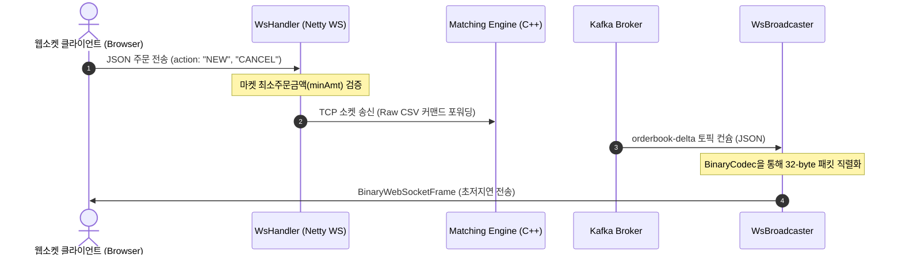

# Java 웹소켓 게이트웨이 시스템 (adapter-ws)

고성능 Netty 프레임워크를 기반으로 수천 명의 동시 접속 클라이언트에게 실시간 호가 정보(Order Book Delta)를 초저지연 브로드캐스트하고, 클라이언트의 주문 및 취소 커맨드를 매칭 엔진으로 고속 전달하는 게이트웨이 컴포넌트다.

---

## 🏗️ 1. 아키텍처 및 내부 구조 분석

`adapter-ws`는 비동기 이벤트 루프 기반의 Netty 서버 구조를 취한다. Kafka로부터 호가 변경 스트림을 컨슘하여 브라우저 및 클라이언트 단말에 바이너리 패킷으로 송신하는 브로드캐스터와 클라이언트 요청을 수신하는 핸들러로 구성된다.

### 📂 디렉토리 구조 및 핵심 파일 역할

```text
adapter-ws/
├── src/main/java/exchange/ws/
│   ├── WsServer.java            # 🚀 Netty 웹소켓 서버 구동 및 서비스 라이프사이클 관리 엔트리
│   ├── WsHandler.java           # 🔌 클라이언트 소켓 수발신, PING-PONG, 매칭 엔진 커맨드 포워딩
│   ├── WsBroadcaster.java       # 📢 Kafka(orderbook-delta)를 컨슘하여 바이너리 호가창 델타 전송
│   ├── BinaryCodec.java         # 🔢 호가 데이터를 32바이트 바이너리 패킷으로 고속 직렬화하는 코덱
│   ├── MarketConfigManager.java # ⚙️ admin-api를 통해 마켓 메타데이터(최소 주문금액 등) 60초 주기 갱신
│   ├── WsMetricsServer.java     # 📊 프로메테우스 연동을 위한 게이트웨이 성능 지표(TPS, 커넥션 수) 수집 서버
│   └── ConfigLoader.java        # 🛠️ 환경 변수 및 프로필(.env.[profile]) 통합 로더
├── src/main/resources/
│   └── logback.xml              # 📝 Netty 이벤트 루프 성능 보호를 위한 비동기(Async) 로깅 설정
└── build.gradle                 # 🔨 Netty, Kafka Client, SLF4J/Logback 의존성 및 빌드 구성
```

---

## 🔄 2. 실시간 데이터 흐름 및 브로드캐스트 아키텍처

게이트웨이는 매칭 엔진의 쓰기 성능 극대화를 지원하고 사용자의 브라우저 렌더링 부하를 줄이기 위해 이원화된 데이터 파이프라인을 운영한다.



---

## 💾 3. 핵심 모듈 기술적 상세

### 1) 초저지연 바이너리 직렬화 코덱 (`BinaryCodec`)
* JSON 포맷은 파싱 오버헤드가 크고 메시지 용량이 크다. 네트워크 대역폭과 프론트엔드 디코딩 지연을 최소화하기 위해 호가창 델타 데이터를 **32바이트 고정 바이너리 패킷**으로 수동 패킹한다.
* 구조: `Symbol ID (4B) | Sequence (8B) | Price (8B) | Delta Quantity (8B) | Side (4B)`

### 2) 비동기 비블로킹 로깅 (SLF4J + Logback)
* 100만 TPS가 넘는 하이 트래픽 상황에서 동기 로깅(`System.out.println`)을 실행하면 Netty의 I/O 전담 스레드인 **이벤트 루프(Event Loop)가 블로킹**되어 네트워크 마비가 발생한다.
* 이를 예방하기 위해 `logback.xml`에 **`AsyncAppender`**를 내장하여 모든 로그 작성을 비동기 스레드 풀로 위임, 게이트웨이의 패킷 중계 성능을 온전히 유지한다.

### 3) 동적 마켓 메타데이터 및 호가 단위(Tick Size) 캐시 (`MarketConfigManager`)
* 어드민 API 백엔드([admin-api](file:///d:/exchange_be/admin-api))의 `/admin/stats/markets` 엔드포인트를 **60초 주기**로 비동기 HTTP 호출하여 마켓별 가격 소수점 자릿수(`priceDecimals`), 최소 주문금액(`minAmt`), 그리고 가격대별 호가 단위 정책 목록(`tickSizeLevels`) 정보를 갱신한다.
* 클라이언트가 웹소켓을 통해 주문을 제출할 때 백엔드 DB 조회 없이 메모리 캐시 데이터를 활용하여 가격이 해당 틱 크기의 정확한 배수인지 실시간 유효성을 검증하고 비정상 주문을 차단한다.

### 4) 게이트웨이 성능 계측기 (`WsMetricsServer`)
* 프로메테우스(Prometheus) Scraper와 통합하기 위해 내장 초경량 HTTP 서버를 구동한다.
* `/metrics` 경로를 통해 **현재 활성 소켓 접속수**, **누적 메시지 전송량**, **실시간 브로드캐스트 초당 전송률(TPS)** 지표를 OpenMetrics 표준 규격으로 실시간 제공한다.

---

## 🛠️ 4. 개발 및 실행 가이드

### 환경 변수 설정

`ConfigLoader`가 관리하는 웹소켓 게이트웨이 설정 파일 명세다. `.env.[profile]` 파일 또는 OS 환경 변수를 통해 커스텀 튜닝할 수 있다.

| 환경 변수명 | 기본값 | 설명 |
| :--- | :--- | :--- |
| `ENV_PROFILE` | `dev` | 로드할 환경 파일 지정 (`local`, `dev`, `qa`, `prd`) |
| `PORT` | `8088` | 웹소켓 클라이언트가 접속할 게이트웨이 포트 번호 |
| `KAFKA_BROKER` | `localhost:9092` | 호가 델타 수신을 위한 Kafka 브로커 주소 |
| `ENGINE_HOST` | `localhost` | 비트코인 매칭 엔진 명령 포트 호스트 주소 |
| `COMMAND_PORT` | `9999` | 비트코인 매칭 엔진 명령 포트 번호 |
| `ADA_ENGINE_HOST` | `localhost` | 에이다 매칭 엔진 명령 포트 호스트 주소 |
| `ADA_COMMAND_PORT` | `9997` | 에이다 매칭 엔진 명령 포트 번호 |
| `ADMIN_API_URL` | `http://localhost:8181` | 마켓 메타데이터를 동적 갱신할 어드민 API 호스트 주소 |
| `METRICS_ENABLED` | `false` | 프로메테우스 메트릭 노출 HTTP 서버 활성화 여부 |
| `METRICS_PORT` | `9102` | 메트릭 서버 호스트 포트 번호 |
| `LOG_LEVEL` | `INFO` | 로깅 필터링 기준 레벨 (`DEBUG`, `INFO`, `WARN`, `ERROR`) |

### 구동 방법
```bash
# 로컬 의존성 빌드 및 컴파일 실행
./gradlew :adapter-ws:build

# 어플리케이션 기동
./gradlew :adapter-ws:run

# 단위 테스트 실행 (JUnit 5 + AssertJ)
./gradlew :adapter-ws:test
```
