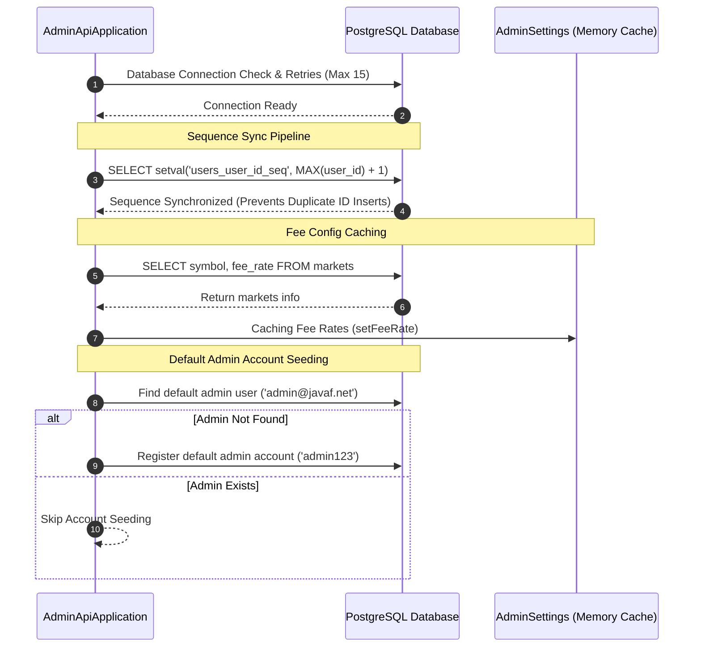

# JavaF 거래소 관리자 API 서비스 (admin-api)

Spring Boot 3 및 Spring Data JPA 기반의 거래소 통합 관리 및 어드민 비즈니스 로직 제공 REST API 서버. 

---

## 🏗️ 1. 아키텍처 및 내부 구조 분석

`admin-api`는 거래소 회원 현황, 자산 원장, 수수료 정책 제어, 거래 성능 메트릭 통계, 로컬 EVM(Ganache) 지갑 배포 및 감사를 처리하는 REST API 서버입니다.

### 📂 디렉토리 구조 및 핵심 파일 역할

```text
admin-api/
├── src/main/java/exchange/admin/
│   ├── AdminApiApplication.java    # 🚀 애플리케이션 진입점 및 DB 시퀀스 동기화/시드 데이터 로더
│   ├── config/                     # CORS, 글로벌 인메모리 설정(AdminSettings), 스케줄러 설정
│   ├── controller/                 # REST API 엔드포인트 제어 계층
│   │   ├── AuthController.java     # 관리자/회원 로그인 및 RTR(Refresh Token Rotation) 토큰 갱신
│   │   ├── CryptoWalletController.java # 로컬 EVM(Ganache) 기반 가상 자산 지갑 및 배포 관리
│   │   ├── LedgerController.java   # 입출금/거래 원장(Ledger) 이력 관리
│   │   ├── MarketController.java   # 마켓 활성화 여부 및 수수료 설정 제어
│   │   ├── SettingsController.java # 글로벌 점검, 서킷브레이커(주문 제한 등) 세이프티 제어
│   │   ├── StatsController.java    # 거래소 TPS, Latency, 활성 사용자(DAU/MAU) 실시간 메트릭 통계
│   │   ├── UserController.java     # 회원 조회, 계정 잠금 및 해제
│   │   └── WalletController.java   # 법정화폐(Fiat) 및 가상자산 지갑 CRUD
│   ├── dto/                        # 요청/응답 페이로드 변환용 데이터 전송 객체(DTO)
│   ├── exception/                  # API 예외 통합 제어를 위한 GlobalExceptionHandler
│   ├── model/                      # 데이터베이스 맵핑 JPA 엔티티 (User, Wallet, Ledger, Market, MarketHistory 등)
│   ├── repository/                 # 데이터 조회를 위한 Spring Data JPA Repository 인터페이스 (MarketRepository, MarketHistoryRepository 등)
│   ├── security/                   # JWT 검증 필터, 암호화 인코더 및 Security 설정
│   └── service/                    # 핵심 비즈니스 로직 구현 서비스 계층
│       ├── MarketService.java      # 마켓 구성 수정, 캐시 갱신 및 이력 저장 서비스
│       ├── StatsService.java       # 실시간 지표 분석 및 연산
│       └── WalletDaemonService.java# 블록체인 트랜잭션 동기화 모니터링 및 배치 작업 데몬
├── build.gradle                    # 의존성 빌드 구성
└── Dockerfile                      # 컨테이너화 명세서
```

---

## 🔄 2. 서버 구동 초기화 및 데이터 시딩 파이프라인

데이터 정합성 유지와 첫 로컬 기동 시 충돌 방지를 위해 `AdminApiApplication` 실행 시 순차적으로 자동 시딩 작업이 작동합니다.



---

## 🔐 3. 세션 무중단 보안을 위한 RTR (Refresh Token Rotation) 구조

사용자 및 어드민 인증 시 만료된 Access Token을 백그라운드에서 신속하고 안전하게 갱신하여 세션 끊김 현상을 예방합니다.

* **동작 흐름**:
  1. 클라이언트가 만료된 Access Token과 유효한 Refresh Token으로 API를 요청합니다.
  2. `AuthController`에서 요청에 들어온 Refresh Token을 검증하고 즉시 회전(Rotation)시킵니다.
  3. 기존 Refresh Token은 무효화(Revoke) 처리되며, 새로운 **Access Token + Refresh Token** 쌍을 발급해 세션 가로채기(Replay Attack) 위협을 방어합니다.
  4. 클라이언트는 새로운 Token 쌍을 쿠키/로컬 스토리지에 갱신 저장하여 무중단 서비스를 제공받습니다.

---

## 📈 4. 실시간 거래 통계 및 모니터링 메트릭

`StatsController` 및 `StatsService`에서는 프로메테우스(Prometheus) 지표 외에도 관리자 대시보드 조회를 위한 전용 비즈니스 핵심 지표를 동적으로 연산하여 반환합니다.

* **실시간 거래 활동(Trading Velocity)**: 초당 평균 주문 수(TPS) 및 체결 변동 계수 연산.
* **매칭 엔진 연동 효율**: 전체 주문 건수 대비 체결 완료 건수의 비율(Fill Rate) 계산.
* **사용자 활동(DAU/MAU Ratio)**: 일간 활성 사용자수(DAU)와 월간 활성 사용자수(MAU)의 상대 비율을 계측하여 서비스 활성화 강도를 백분율로 도출.

---

## 💾 5. 인메모리 캐싱 전략 (In-Memory Caching Strategy)

데이터베이스 부하 분산 및 초고속 API 응답 보장을 위해 특정 빈번한 조회 엔드포인트에 실시간 인메모리 캐싱을 구현했습니다.

### ⚡ 실시간 현재가 캐시 (Last Price Cache)
* **대상 메서드**: `StatsService.getLastPrice(String symbol)`
* **구현 방식**: `ConcurrentHashMap` 기반 경량 캐시 구현 (`PriceCacheEntry`)
* **동작 상세**: 
  * 종목별 최근 거래 가격 조회 시 매번 `trades` 테이블 전체를 스캔하지 않고 캐시를 조회합니다.
  * **캐시 유효 기간(TTL)**: **1초 (`1,000ms`)**
  * 캐시 만료 시에만 데이터베이스에서 최신 체결 내역을 `findFirstBySymbolOrderByTradeIdDesc` 쿼리로 조회 후 캐시를 갱신합니다.

### ⚙️ 글로벌 마켓 수수료 캐시 (Market Fee Config Cache)
* **대상 클래스**: `AdminSettings` (Fee Rate Cache Holder)
* **동작 상세**:
  * 구동 시점에 데이터베이스의 `markets` 테이블에 등록된 수수료 정책(`fee_rate`)을 읽어와 `AdminSettings` 내부 static Map에 캐싱해 둡니다.
  * 주문 생성 및 수수료 계산 등 트랜잭션이 집중되는 매커니즘에서 매번 데이터베이스를 조회하는 오버헤드를 배제합니다.
  * **캐시 갱신 및 감사 이력 통합**: 마켓 및 수수료 변경 시 `MarketService`를 통해 데이터베이스를 업데이트하는 즉시 `AdminSettings` 캐시가 실시간 동기화되며, `market_histories` 테이블에 감사 이력이 동시에 안전하게 기록됩니다.

---

## 🛠️ 6. 개발 및 배포 가이드

### 로컬 개발 환경 실행
```bash
# 로컬 빌드 및 의존성 다운로드
./gradlew build -x test

# 로컬 개발 서버 실행 (local 또는 dev 프로파일 활성화)
./gradlew bootRun --args='--spring.profiles.active=dev'
```

### 로컬 도커 메모리 최적화 환경
로컬 환경의 자원을 절약하기 위해 Serial GC 사용 및 힙 크기를 엄격하게 제어하여 작동시킵니다.
* **JVM 최적화 옵션**: `JAVA_OPTS=-Xms128m -Xmx256m -XX:+UseSerialGC`
* **도커 메모리 제한**: 최대 `384M`

### 도커 컨테이너 빌드 및 실행
```bash
# 어드민 API 전용 빌드 및 백그라운드 실행
docker compose up -d --build admin-api
```
