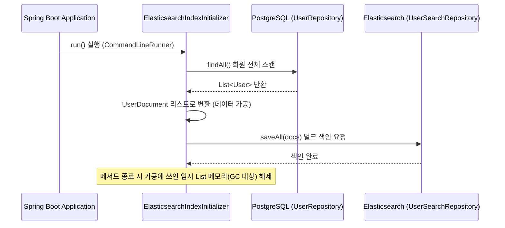
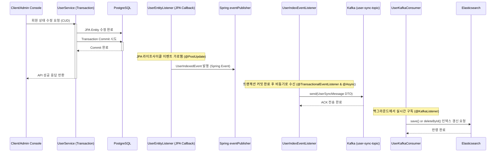

# JavaF 관리자 API 서비스 (admin-api)

Spring Boot 3 및 Spring Data JPA 기반의 거래소 통합 관리 및 어드민 비즈니스 로직 제공 REST API 서버. 

---

## 🆕 최근 업데이트
- **사용자 회원가입 신청 및 어드민 가입 승인 워크플로우 구현**:
  - 신규 가입 신청 API(`POST /admin/auth/signup`)를 추가하여 기본 `PENDING` 상태로 유저를 생성함.
  - `login` 및 `refresh` 시 유저의 상태가 `ACTIVE`가 아닐 경우 로그인을 제한하는 검증 가드를 신설함.
  - E2E 테스트 및 프론트엔드 연동을 위해 어드민 유저 승인 흐름을 정상 연계 검증함.
- **코인별 온체인 입출금 다형성 구현 및 JAF 마켓 거래쌍 신규 추가**:
  - `WalletService` 내부의 JAF 코인 하드코딩 분기 처리를 전면 제거하고, `CoinWithdrawService` 통합 인터페이스 기반 다형성 설계(OCP)를 적용함.
  - `BTC`, `ADA`, `JAF` 자산 출금 시 로컬 EVM 스마트 계약인 `JAFTokenService`를 거치도록 단일화하고, 미지원 자산 출금 요청 시 `IllegalArgumentException` 예외를 던지도록 수정함.
  - `WalletDaemonService` 백그라운드 스케줄러의 임의 난수 가상 입금 시뮬레이션을 전면 폐지하고, `scanOnChainDeposits`를 통해 `JAF`, `BTC`, `ADA` 3종 코인에 대한 실제 Ganache 온체인 Transfer 로그 감지 및 정산으로 일원화함.
  - `V2__seed_data.sql`에 `JAF-KRW` (기준가: 1500) 및 `JAF-USD` (기준가: 1) 마켓 상장 데이터를 신규 주입하여 마켓 활성화를 지원함.
  - `@Autowired` 필드 주입 방식을 생성자 주입 구조(Lombok `@RequiredArgsConstructor`)로 리팩토링하여 안전성을 극대화함.
- **호가 단위(Tick Size) 정책 동적 연동 및 다형성 설계**:
  - 가격 대역에 맞춰 동적으로 호가 단위(Tick Size) 정책을 주입할 수 있도록 DB 스키마(`tick_size_rules`, `tick_size_levels`)를 설계하고 `markets` 테이블과 다 대 일 관계 매핑을 구축함.
  - 마켓 조회 API(`/admin/stats/markets`) 및 DTO(`MarketODT`)에 가격대별 상세 틱 레벨 목록을 동적으로 구성하여 캐싱 서비스에 연계되도록 수정함.

---

## 🏗️ 1. 아키텍처 및 내부 구조 분석

`admin-api`는 거래소 회원 현황, 자산 원장, 수수료 정책 제어, 거래 성능 메트릭 통계, 로컬 EVM(Ganache) 지갑 배포 및 감사를 처리하는 REST API 서버입니다.

### 📂 디렉토리 구조 및 핵심 파일 역할

```text
admin-api/
├── src/main/java/exchange/admin/
│   ├── AdminApiApplication.java    # 🚀 애플리케이션 진입점 및 DB 시퀀스 동기화/시드 데이터 로더
│   ├── config/                     # CORS, 글로벌 인메모리 설정(AdminSettings), 스케줄러 설정
│   ├── controller/                 # REST API 엔드포인트 제어 계층
│   │   ├── AuthController.java     # 관리자/회원 로그인 및 RTR(Refresh Token Rotation) 토큰 갱신
│   │   ├── CryptoWalletController.java # 로컬 EVM(Ganache) 기반 가상 자산 지갑 및 배포 관리
│   │   ├── LedgerController.java   # 입출금/거래 원장(Ledger) 이력 관리
│   │   ├── MarketController.java   # 마켓 활성화 여부 및 수수료 설정 제어
│   │   ├── SettingsController.java # 글로벌 중복 로그인 차단, 온체인 모니터링, 지갑 시뮬레이션 및 수수료 등 전역 설정 변경 제어
│   │   ├── StatsController.java    # 거래/자산/유저 통계 조회, 종목별 현재가(티커) 및 OHLCV 캔들 데이터 조회
│   │   ├── UserController.java     # 회원 조회, 정보 수정, 회원별 체결/원장 내역 조회 및 모의 자산 수동 조정
│   │   ├── UserSearchController.java # 🔍 엘라스틱서치 기반 회원 검색 및 자동완성 제공
│   │   └── WalletController.java   # 법정화폐(Fiat) 및 가상자산 지갑 CRUD
│   ├── document/                   # 엘라스틱서치 문서 모델 (UserDocument)
│   ├── dto/                        # 요청/응답 페이로드 변환용 데이터 전송 객체(DTO)
│   ├── exception/                  # API 예외 통합 제어를 위한 GlobalExceptionHandler
│   ├── listener/                   # 엔티티 라이프사이클 이벤트 리스너 및 초기화 데몬
│   │   ├── ElasticsearchIndexInitializer.java # 애플리케이션 시작 시 DB 유저 데이터 ES 벌크 색인 동기화
│   │   ├── UserEntityListener.java # 회원 생성/변경/삭제 감지하여 Spring Event 발행
│   │   └── UserIndexEventListener.java # 비동기적으로 Spring Event 수신하여 ES 인덱스 갱신
│   ├── model/                      # 데이터베이스 맵핑 JPA 엔티티 (User, Wallet, Ledger, Market, MarketHistory, TickSizeRule, TickSizeLevel 등)
│   ├── repository/                 # 데이터 조회를 위한 Spring Data JPA Repository 인터페이스
│   │   └── es/                     # 엘라스틱서치 전용 리포지토리 레이어 (UserSearchRepository)
│   ├── security/                   # JWT 검증 필터, 암호화 인코더 및 Security 설정
│   └── service/                    # 핵심 비즈니스 로직 구현 서비스 계층
│       ├── CoinNetworkService.java # 코인별 온체인 네트워크 입출금 연동 공통 인터페이스
│       ├── JafCoinService.java     # Ganache EVM 상에 JAF 스마트 계약 배포 및 트랜잭션 전송 서비스
│       ├── BtcCoinService.java     # Ganache EVM 상에 BTC 스마트 계약 배포 및 트랜잭션 전송 서비스
│       ├── AdaCoinService.java     # Ganache EVM 상에 ADA 스마트 계약 배포 및 트랜잭션 전송 서비스
│       ├── MarketService.java      # 마켓 구성 수정, 캐시 갱신 및 이력 저장 서비스
│       ├── StatsService.java       # 시간 해상도별 캔들 데이터 집계, 대시보드 요약 및 KPI 성능 지표 분석 서비스
│       ├── UserService.java        # 회원 등록, 정보 수정, 가상 지갑 수동 조정 및 원장 기록 서비스
│       ├── UserSearchService.java  # 🔍 엘라스틱서치 기반 회원 검색 및 자동완성 비즈니스 로직
│       └── WalletDaemonService.java# 블록체인 가상 입출금 트랜잭션 동기화 모니터링 및 배치 작업 데몬
├── build.gradle                    # 의존성 빌드 구성
└── Dockerfile                      # 컨테이너화 명세서
```

---

## 🔄 2. 서버 구동 초기화 및 데이터 시딩 파이프라인

데이터 정합성 유지와 첫 로컬 기동 시 충돌 방지를 위해 `AdminApiApplication` 실행 시 순차적으로 자동 시딩 작업이 작동합니다.


---

## 🔐 3. 세션 무중단 보안을 위한 RTR (Refresh Token Rotation) 구조

사용자 및 어드민 인증 시 만료된 Access Token을 백그라운드에서 신속하고 안전하게 갱신하여 세션 끊김 현상을 예방합니다.

* **동작 흐름**:
  1. 클라이언트가 만료된 Access Token과 유효한 Refresh Token으로 API를 요청합니다.
  2. `AuthController`에서 요청에 들어온 Refresh Token을 검증하고 즉시 회전(Rotation)시킵니다.
  3. 기존 Refresh Token은 무효화(Revoke) 처리되며, 새로운 **Access Token + Refresh Token** 쌍을 발급해 세션 가로채기(Replay Attack) 위협을 방어합니다.
  4. 클라이언트는 새로운 Token 쌍을 쿠키/로컬 스토리지에 갱신 저장하여 무중단 서비스를 제공받습니다.
* **보안 예외 및 공통 응답 규격 개선**:
  - 클라이언트 개발 편의성 및 상태 조회의 직관성을 강화하기 위해 공통 응답 규격인 `ApiResponse` DTO에 **`success` (boolean)** 필드를 신규 추가 적용함.
  - 인증 토큰이 유실되었거나(401 Unauthorized), 어드민 경로에 일반 사용자 권한으로 접근하려 할 때(403 Forbidden) 발생하는 보안 예외 상황에서도 Spring Boot 기본 오류 JSON 대신 공통 API 규격인 `ApiResponse` 포맷(JSON)으로 일관되게 에러 응답(success=false, status, message)을 제공하도록 예외 처리 핸들러(`AuthenticationEntryPoint`, `AccessDeniedHandler`)를 구현하여 반영함.

---

## 📈 4. 실시간 거래 통계 및 동적 마켓 연동 아키텍처
 
`StatsController` 및 `StatsService`에서는 데이터베이스의 거래(Trades), 주문(Orders), 지갑(Wallets), 원장(LedgerJournal) 내역을 바탕으로 관리자 대시보드 및 지표 분석용 핵심 KPI를 동적으로 집계합니다.
 
특히, 모든 암호화폐 거래 가격 및 대금 통계 연산은 마켓 테이블(`markets`)의 속성을 기반으로 하는 **동적 마켓 연동 및 소수점 스케일링**이 적용되어 작동합니다.
* **마켓 동적 연동**: 기존의 특정 종목 하드코딩(`BTC-USD`, `ADA-KRW` 등)을 완전히 배제하고, `markets` 테이블에서 활성화(`is_active=true`)된 전체 마켓 목록을 기준으로 수익 및 거래량을 자동 합산합니다. 이를 통해 새로운 종목이 상장되어도 코드 수정 없이 통계 대시보드에 즉시 반영됩니다.
* **동적 가격 변환**: `POWER(10, COALESCE(price_decimals, 2))` SQL 함수 또는 `Math.pow(10, priceDecimals)` Java 로직을 통하여 마켓별로 상이한 자릿수 제한(BTC 2자리, ADA 4자리 등)에 맞춰 가치 및 거래 대금을 유연하고 오차 없이 산출합니다.
* **자산 회전 강도 (Trading Velocity)**: 사용자 전체 자산의 KRW 환산 총액 대비 최근 30일간의 총 거래 대금 비율을 계측하여 자산 대비 거래 활성도를 퍼센티지(%)로 도출합니다.
* **주문 체결 및 효율성 (Order Fill Rate)**: 최근 30일간 접수 및 종료된 전체 주문 중 체결 완료(FILLED)된 주문의 비중을 계산하여 매칭 엔진 효율을 측정합니다.
* **사용자 활동 밀도 (DAU/MAU Ratio)**: 24시간 동안 주문 또는 자산 원장 변동이 발생한 고유 사용자 수(DAU)와 30일 동안 발생한 고유 사용자 수(MAU)의 비율을 연산하여 사용자 유지력과 고착도를 모니터링합니다.
* **경쟁사 벤치마크 (Competitor Benchmark)**: 우리 거래소와 해외/국내 주요 거래소(Binance, Coinbase, Upbit 등)의 수수료율, 평균 체결 지연 시간(Latency), 처리량(TPS), 안정성 지표를 모의 대조 분석 지표로 제공합니다.
* **대용량 집계 쿼리 최적화 (CTE 적용)**: `TRADES` 테이블 풀 스캔 및 조인 부하를 방지하기 위해, 시간대 및 심볼 기준으로 1차 단독 합산을 수행하는 CTE(WITH 구문)를 적용하여 통계 추출 성능을 극대화함.
* **통계 전용 인덱스 설계**: 대시보드 조회 시점의 병목을 제거하기 위해 `TRADES`, `ORDERS`, `LEDGER_JOURNAL`, `USERS` 테이블에 날짜(CREATED_AT) 기준 검색 및 그룹핑 전용 B-Tree 인덱스를 구축함.
---

## 5. 인메모리 캐싱 전략 (In-Memory Caching Strategy)

데이터베이스 부하 분산 및 초고속 API 응답 보장을 위해, **Spring Cache Abstraction**과 고성능 캐시 라이브러리인 **Caffeine Cache**를 통합한 중앙 캐싱 관리 체계를 도입했습니다. 모든 캐시 설정은 [CacheConfig.java](file:///d:/exchange_be/admin-api/src/main/java/exchange/admin/config/CacheConfig.java)에서 일관되게 선언 및 관리됩니다.

### ⚡ 실시간 현재가 캐시 (Last Price Cache)
* **대상 메서드**: `StatsService.getLastPrice(String symbol)`
* **구현 방식**: 스프링 AOP 기반 `@Cacheable(value = "lastPrice", key = "#symbol")` 어노테이션 적용
* **동작 상세**: 
  * 종목별 최근 거래 가격 조회 시 매번 `trades` 테이블 전체를 스캔하지 않고 캐싱된 값을 반환합니다.
  * **캐시 유효 기간(TTL)**: **1초 (`1,000ms`)** (`expireAfterWrite` 적용)
  * **최대 엔트리 크기**: **100** (`maximumSize` 적용)
  * 캐시 만료 시에만 데이터베이스에서 최신 체결 내역을 `findFirstBySymbolOrderByTradeIdDesc` 쿼리로 조회 후 캐시를 자동으로 갱신합니다.

### ⚙️ 글로벌 마켓 정책 및 수수료 캐시 (Market Config Cache)
* **대상 클래스**: `AdminSettings` (Fee Rate & Precision Cache Holder)
* **구현 방식**: static 인터페이스 호환을 위한 `CacheManager` 연동 (Caffeine Cache)
* **동작 상세**:
  * 구동 시점에 데이터베이스의 `markets` 테이블에 등록된 수수료 정책(`fee_rate`) 및 소수점 자리수 정책(`price_decimals`)을 읽어와 `AdminSettings` 내부 및 `ws-gateway` 등의 어댑터 캐시에 적재합니다.
  * **최대 엔트리 크기**: **50** (`maximumSize` 적용)
  * 주문 생성 및 수수료 계산 등 트랜잭션이 집중되는 메커니즘에서 매번 데이터베이스를 조회하는 오버헤드를 원천적으로 배제합니다.
  * **캐시 갱신 및 감사 이력 통합**: 마켓 및 수수료 변경 시 `MarketService`를 통해 데이터베이스를 업데이트하는 즉시 `AdminSettings` 캐시가 실시간 동기화되며, `market_histories` 테이블에 감사 이력이 동시에 안전하게 기록됩니다.

---

## 🔍 6. Elasticsearch 기반 고성능 회원 검색 및 자동완성 시스템

회원 이메일 검색 시 DB 부하 및 LIKE 검색 성능 저하를 방지하기 위해 Elasticsearch 8.12.2를 도입하여 역색인 구조의 검색 및 자동완성 기능을 제공한다.

* **동작 흐름**:
  1. **초기 동기화**: `ElasticsearchIndexInitializer`가 애플리케이션 구동 시 DB의 전체 유저 데이터를 읽어 Elasticsearch 인덱스에 벌크 색인한다 (`local`, `dev` 프로파일 적용).
  2. **실시간 변경 감지**: JPA 엔티티 이벤트 리스너인 `UserEntityListener`가 회원의 가입, 수정, 삭제 상태를 감지하여 `UserIndexedEvent`를 발행한다.
  3. **비동기 인덱싱**: `UserIndexEventListener`가 트랜잭션 커밋 완료(`AFTER_COMMIT`) 시점에 이벤트를 수신하여 비동기(`@Async`)로 Elasticsearch 인덱스를 동기화한다.
  4. **검색 및 자동완성 API**:
     - `GET /admin/users/search`: 이메일 키워드에 부합하는 회원을 검색한다 (`edge_ngram` 분석기를 타는 Match Query 사용).
     - `GET /admin/users/autocomplete`: 입력된 접두사 기준 최대 10개의 이메일 추천 검색어를 제공한다.

* **검색 엔진 데이터 추가 가이드**:
  새로운 엔티티나 필드를 검색엔진에 동기화하고 색인하기 위해 다음 단계를 적용한다.
  1. **도큐먼트 클래스 정의**: `exchange.admin.document` 패키지에 `@Document(indexName = "인덱스명")`을 사용한 도큐먼트 클래스를 추가한다. 필요한 경우 형태소 분석 및 자동완성을 위해 `@Setting(settingPath = "elasticsearch/settings.json")` 및 `@Field` 어노테이션에 분석기를 매핑한다.
  2. **레포지토리 생성**: `exchange.admin.repository.es` 패키지에 `ElasticsearchRepository`를 상속하는 인터페이스를 생성한다.
  3. **변경 이벤트 연동**:
     - JPA 엔티티 클래스에 `@EntityListeners`를 지정하여 저장/수정/삭제 라이프사이클을 감지하고 이벤트를 발행한다.
     - 트랜잭션 커밋 완료 후 색인 부하를 격리하기 위해 `@TransactionalEventListener(phase = TransactionPhase.AFTER_COMMIT)`와 `@Async`를 활용하여 비동기로 Elasticsearch 레포지토리에 데이터를 변경 저장/삭제한다.
  4. **초기 벌크 적재 설정**: `ElasticsearchIndexInitializer`에 새 도큐먼트에 대한 벌크 저장 로직을 통합하여 로컬/개발 서버 구동 시 전체 DB 데이터가 자동으로 색인 동기화되도록 한다.

---

## 🛠️ 7. 개발 및 배포 가이드

### 로컬 개발 환경 실행
```bash
# 로컬 빌드 및 의존성 다운로드
./gradlew build -x test

# 로컬 개발 서버 실행 (local 또는 dev 프로파일 활성화)
./gradlew bootRun --args='--spring.profiles.active=dev'
```

### 통합 테스트 실행 및 구조
- 데이터베이스 격리 및 시드 데이터 오염 방지를 위해 DDL 스키마(db/migration)와 시뮬레이션용 시드 데이터(db/seed)의 Flyway 실행 경로를 프로파일별로 분리함.
- 테스트 구동 시 DB(exchange_test)가 비어 있는 상태에서 격리 검증을 수행함.
- 스프링 통합 테스트 시 엘라스틱서치 연결 연결 의존성을 격리하기 위해 `BaseIntegrationTest`에 `@MockBean(UserSearchRepository.class)`를 내장하여 테스트 안정성을 확보함.
- 검증 신뢰도와 보고서 가독성을 높이기 위해 도메인별로 8개의 테스트 클래스로 분리하고 총 46개의 세부 테스트 케이스를 구축함.
  1. `UserAccountIntegrationTest`: 회원 등록, 중복 가입 차단, 정보 수정 및 조회 검증 (8개 테스트)
  2. `UserWalletIntegrationTest`: 지갑 생성, 자산 조정, 잔고 부족 차단, 가상자산 소수점 및 대용량 연산 검증 (10개 테스트)
  3. `UserHistoryIntegrationTest`: 감사용 원장 이력 적재 및 MyBatis 연동 상세 조회 페이징 검증 (4개 테스트)
  4. `UserAuthIntegrationTest`: 로그인 자격 증명 처리, 리프레시 토큰 회전(RTR) 및 재사용 공격 차단 검증 (6개 테스트)
  5. `MarketPolicyIntegrationTest`: 수수료 변경 DB 반영, 캐시 동기화, 마켓 이력 감사 기록 및 호가 단위 정책(TickSizeRule) 연동 검증 (5개 테스트)
  6. `StatsServiceIntegrationTest`: 요약 지표 집계, 1초 Caffeine 캐싱 및 마이바티스 OHLCV 캔들 집계 검증 (6개 테스트)
  7. `AuthControllerTest`: 회원가입 성공/실패, 입력값 오류 및 이메일 중복 가입 신청 차단 검증 (3개 테스트)
  8. `UserControllerTest`: 어드민 회원 목록 조회 인가(ROLE_ADMIN), 가입 승인에 따른 DB 수정자(updated_by) 추적 및 자산 수동 조정 입력 검사 검증 (5개 테스트)

- **테스트 실행 방법**:
  ```bash
  export JAVA_HOME=/home/administrator/.jdks/temurin-17.0.19
  ./gradlew :admin-api:test --no-daemon
  ```**: `TRADES` 테이블 풀 스캔 및 조인 부하를 방지하기 위해, 시간대 및 심볼 기준으로 1차 단독 합산을 수행하는 CTE(WITH 구문)를 적용하여 통계 추출 성능을 극대화함.
* **통계 전용 인덱스 설계**: 대시보드 조회 시점의 병목을 제거하기 위해 `TRADES`, `ORDERS`, `LEDGER_JOURNAL`, `USERS` 테이블에 날짜(CREATED_AT) 기준 검색 및 그룹핑 전용 B-Tree 인덱스를 구축함.
---

## 💾 5. 인메모리 캐싱 전략 (In-Memory Caching Strategy)

데이터베이스 부하 분산 및 초고속 API 응답 보장을 위해, **Spring Cache Abstraction**과 고성능 캐시 라이브러리인 **Caffeine Cache**를 통합한 중앙 캐싱 관리 체계를 도입했습니다. 모든 캐시 설정은 [CacheConfig.java](file:///d:/exchange_be/admin-api/src/main/java/exchange/admin/config/CacheConfig.java)에서 일관되게 선언 및 관리됩니다.

### ⚡ 실시간 현재가 캐시 (Last Price Cache)
* **대상 메서드**: `StatsService.getLastPrice(String symbol)`
* **구현 방식**: 스프링 AOP 기반 `@Cacheable(value = "lastPrice", key = "#symbol")` 어노테이션 적용
* **동작 상세**: 
  * 종목별 최근 거래 가격 조회 시 매번 `trades` 테이블 전체를 스캔하지 않고 캐싱된 값을 반환합니다.
  * **캐시 유효 기간(TTL)**: **1초 (`1,000ms`)** (`expireAfterWrite` 적용)
  * **최대 엔트리 크기**: **100** (`maximumSize` 적용)
  * 캐시 만료 시에만 데이터베이스에서 최신 체결 내역을 `findFirstBySymbolOrderByTradeIdDesc` 쿼리로 조회 후 캐시를 자동으로 갱신합니다.

### ⚙️ 글로벌 마켓 정책 및 수수료 캐시 (Market Config Cache)
* **대상 클래스**: `AdminSettings` (Fee Rate & Precision Cache Holder)
* **구현 방식**: static 인터페이스 호환을 위한 `CacheManager` 연동 (Caffeine Cache)
* **동작 상세**:
  * 구동 시점에 데이터베이스의 `markets` 테이블에 등록된 수수료 정책(`fee_rate`) 및 소수점 자리수 정책(`price_decimals`)을 읽어와 `AdminSettings` 내부 및 `ws-gateway` 등의 어댑터 캐시에 적재합니다.
  * **최대 엔트리 크기**: **50** (`maximumSize` 적용)
  * 주문 생성 및 수수료 계산 등 트랜잭션이 집중되는 메커니즘에서 매번 데이터베이스를 조회하는 오버헤드를 원천적으로 배제합니다.
  * **캐시 갱신 및 감사 이력 통합**: 마켓 및 수수료 변경 시 `MarketService`를 통해 데이터베이스를 업데이트하는 즉시 `AdminSettings` 캐시가 실시간 동기화되며, `market_histories` 테이블에 감사 이력이 동시에 안전하게 기록됩니다.

---

## 6. Elasticsearch 기반 고성능 회원 검색 및 자동완성 시스템

회원 이메일 검색 시 DB 부하 및 LIKE 검색 성능 저하를 방지하기 위해 Elasticsearch 8.12.2를 도입하여 역색인 구조의 검색 및 자동완성 기능을 제공한다.

### 🔄 데이터 동기화 아키텍처 및 흐름

#### 1) 초기 벌크 동기화 흐름 (Application Startup)
`local` 또는 `dev` 환경에서 애플리케이션 시작 시 DB에 보존된 유저 데이터를 Elasticsearch에 동기화하여 인덱스 공백 상태를 방지한다.



#### 2) 실시간 변경사항 비동기 반영 흐름 (CUD Event)
회원 데이터 변경(가입 승인, 상태 수정, 삭제 등) 발생 시 데이터 일관성을 맞추기 위해 트랜잭션이 성공적으로 커밋된 시점에 Kafka 토픽으로 메시지를 발행하고, 이를 비동기로 구독하여 ES 인덱스를 동기화한다.



### 💡 주요 아키텍처 설계 특징
* **비동기 큐잉 및 장애 내성 (Spring Kafka)**: Elasticsearch 직접 호출 시 발생하는 HTTP 통신 지연을 차단하고 Kafka를 사용해 결함을 제어한다. ES 서버 통신 장애가 발생해도 메시지는 Kafka 브로커에 보존되므로 데이터 손실 없이 안전하게 복구할 수 있다.
* **트랜잭션 일관성 보장 (@TransactionalEventListener)**: DB 트랜잭션이 최종 커밋(`AFTER_COMMIT`)된 경우에만 Kafka 메시지를 전송한다. DB 트랜잭션 롤백 시 Kafka 메시지 발행이 전면 취소되어 불일치를 예방한다.
* **순환 참조 및 지연 로딩 방지 (DTO 분리)**: JPA 엔티티를 직접 JSON으로 직렬화하지 않고, 색인에 필요한 필드 정보와 삭제 플래그(`isDelete`)만 담은 `UserSyncMessage` DTO를 사용하여 안정적인 직렬화를 수행한다.

* **동작 흐름**:
  1. **초기 동기화**: `ElasticsearchIndexInitializer`가 애플리케이션 구동 시 DB의 전체 유저 데이터를 읽어 Elasticsearch 인덱스에 벌크 색인한다 (`local`, `dev` 프로파일 적용).
  2. **실시간 감지**: JPA 엔티티 이벤트 리스너인 `UserEntityListener`가 회원 등록, 수정, 삭제 상태를 감지하여 `UserIndexedEvent`를 발행한다.
  3. **메시지 발행**: `UserIndexEventListener`가 트랜잭션 커밋 완료(`AFTER_COMMIT`) 시점에 이벤트를 수신하여 `UserSyncMessage` DTO로 가공한 후 Kafka `user-sync-topic` 토픽으로 전송한다.
  4. **비동기 인덱싱**: `UserKafkaConsumer`가 `@KafkaListener`로 토픽을 실시간 구독하여 Elasticsearch 인덱스를 갱신한다.
  5. **검색 및 자동완성 API**:
     - `GET /admin/users/search`: 이메일 키워드에 해당하는 회원을 검색한다 (`edge_ngram` 분석기를 사용한 Match Query 적용).
     - `GET /admin/users/autocomplete`: 입력된 문자열로 시작하는 최대 10개의 이메일 제안 목록을 검색한다.

* **검색 엔티티 추가 가이드**:
  새로운 엔티티 필드를 검색 기능에 포함시키거나 신규 검색 인덱스를 구성하려면 아래 단계를 수행한다.
  1. **도큐먼트 클래스 정의**: `exchange.admin.document` 패키지에 `@Document(indexName = "인덱스명")`을 사용한 도큐먼트 클래스를 추가한다. 필요한 경우 형태소 분석 및 자동완성을 위해 `@Setting(settingPath = "elasticsearch/settings.json")` 및 `@Field` 어노테이션에 분석기를 매핑한다.
  2. **레포지토리 생성**: `exchange.admin.repository.es` 패키지에 `ElasticsearchRepository`를 상속하는 인터페이스를 생성한다.
  3. **엔티티 이벤트 및 카프카 연계**:
     - 대상 JPA 엔티티 클래스에 `@EntityListeners`를 지정하여 저장/수정/삭제 콜백 메서드에서 이벤트를 발행한다.
     - 트랜잭션 커밋 완료 후 색인 부하를 격리하기 위해 `@TransactionalEventListener(phase = TransactionPhase.AFTER_COMMIT)`와 `KafkaTemplate`을 활용하여 DTO 형태로 Kafka 토픽에 발행한다.
     - 이를 구독하는 `@KafkaListener` Consumer를 생성하여 Elasticsearch 레포지토리에 데이터를 최종 변경 저장/삭제하도록 구성한다.
  4. **초기 벌크 적재 설정**: `ElasticsearchIndexInitializer`에 새 도큐먼트에 대한 벌크 저장 로직을 통합하여 로컬/개발 서버 구동 시 전체 DB 데이터가 자동으로 색인 동기화되도록 한다.

* **분석기(Analyzer) 설정 가이드 (`settings.json`)**:
  Elasticsearch의 N-gram 기반 실시간 부분 검색을 지원하기 위해 `src/main/resources/elasticsearch/settings.json`에 분석 규칙을 정의한다. JSON 구조상 주석이 불가하여 아래에 정책을 명시한다.
  - `autocomplete_filter` (`edge_ngram`): 단어를 앞에서부터 1~20글자 단위로 잘라 다수의 토큰을 생성한다. (예: "admin" -> "a", "ad", "adm", "admi", "admin")
  - `autocomplete_analyzer`: DB 데이터를 ES에 **저장(Index)할 때** 사용된다. 소문자 변환 후 위 필터를 거쳐 잘게 쪼개어 저장함으로써 부분 접두사 검색을 가능하게 한다.
  - `autocomplete_search_analyzer`: 사용자가 **검색(Search)할 때** 사용된다. 소문자로 변환만 하고 단어를 쪼개지 않아, 엉뚱한 문자 매칭을 방지하고 정확한 검색 의도와 일치하는 결과만 반환하도록 제한한다.

---

## 🛠️ 7. 개발 및 배포 가이드

### 로컬 개발 환경 실행
```bash
# 로컬 빌드 및 의존성 다운로드
./gradlew build -x test

# 로컬 개발 서버 실행 (local 또는 dev 프로파일 활성화)
./gradlew bootRun --args='--spring.profiles.active=dev'
```

### 통합 테스트 실행 및 구조
- 데이터베이스 격리 및 시드 데이터 오염 방지를 위해 DDL 스키마(db/migration)와 시뮬레이션용 시드 데이터(db/seed)의 Flyway 실행 경로를 프로파일별로 분리함.
- 테스트 구동 시 DB(exchange_test)가 비어 있는 상태에서 격리 검증을 수행함.
- 검증 신뢰도와 보고서 가독성을 높이기 위해 도메인별로 8개의 테스트 클래스로 분리하고 총 45개의 세부 테스트 케이스를 구축함.
  1. `UserAccountIntegrationTest`: 회원 등록, 중복 가입 차단, 정보 수정 및 조회 검증 (8개 테스트)
  2. `UserWalletIntegrationTest`: 지갑 생성, 자산 조정, 잔고 부족 차단, 가상자산 소수점 및 대용량 연산 검증 (10개 테스트)
  3. `UserHistoryIntegrationTest`: 감사용 원장 이력 적재 및 MyBatis 연동 상세 조회 페이징 검증 (4개 테스트)
  4. `UserAuthIntegrationTest`: 로그인 자격 증명 처리, 리프레시 토큰 회전(RTR) 및 재사용 공격 차단 검증 (6개 테스트)
  5. `MarketPolicyIntegrationTest`: 수수료 변경 DB 반영, 캐시 동기화 및 마켓 이력 감사 기록 검증 (4개 테스트)
  6. `StatsServiceIntegrationTest`: 요약 지표 집계, 1초 Caffeine 캐싱 및 마이바티스 OHLCV 캔들 집계 검증 (6개 테스트)
  7. `AuthControllerTest`: 회원가입 성공/실패, 입력값 오류 및 이메일 중복 가입 신청 차단 검증 (3개 테스트)
  8. `UserControllerTest`: 어드민 회원 목록 조회 인가(ROLE_ADMIN), 가입 승인에 따른 DB 수정자(updated_by) 추적 및 자산 수동 조정 입력 검사 검증 (5개 테스트)

- **테스트 실행 방법**:
  ```bash
  export JAVA_HOME=/home/administrator/.jdks/temurin-17.0.19
  ./gradlew :admin-api:test --no-daemon
  ```

### 로컬 도커 메모리 최적화 환경
로컬 환경의 자원을 절약하기 위해 Serial GC 사용 및 힙 크기를 엄격하게 제어하여 작동시킵니다.
* **JVM 최적화 옵션**: `JAVA_OPTS=-Xms128m -Xmx256m -XX:+UseSerialGC`
* **도커 메모리 제한**: 최대 `384M`

### 도커 컨테이너 빌드 및 실행
```bash
# 어드민 API 전용 빌드 및 백그라운드 실행
docker compose up -d --build admin-api
```
