# JavaF 거래소 데이터베이스 ERD (Entity Relationship Diagram)

Flyway 마이그레이션 DDL 스키마(`V1__init_schema.sql`) 기반으로 작성된 거래소 데이터베이스 ERD 및 테이블 상세 명세입니다.

---

## 📊 1. Mermaid ERD 다이어그램

아래 다이어그램은 테이블 간의 관계(1:N, 1:1)와 주요 외래키(FK) 연동을 나타냅니다.

```mermaid
erDiagram
    users ||--o{ wallets : "has"
    users ||--o{ orders : "places"
    users ||--o{ ledger_journal : "logs asset changes"
    users ||--o{ user_crypto_addresses : "owns"
    users ||--o{ crypto_withdrawals : "requests"
    
    markets ||--o{ market_histories : "logs history"
    
    orders ||--o{ trades : "buy_order"
    orders ||--o{ trades : "sell_order"

    users {
        bigint user_id PK "BIGSERIAL"
        varchar email UK "Unique Email"
        varchar password_hash "BCrypt Hash"
        varchar status "ACTIVE / INACTIVE"
        varchar grade "STANDARD / VIP"
        varchar refresh_token "JWT RTR Token"
        timestamp created_at
        timestamp updated_at
    }

    wallets {
        bigint wallet_id PK "BIGSERIAL"
        bigint user_id FK "users.user_id"
        varchar currency "KRW, BTC, USD, ADA"
        numeric balance "Available Balance"
        numeric locked_balance "Locked in Orders"
        timestamp created_at
        timestamp updated_at
    }

    orders {
        bigint order_id PK "Generated by Matching Engine"
        bigint user_id FK "users.user_id"
        varchar symbol "BTC-USD, ADA-KRW"
        varchar side "BUY / SELL"
        bigint price "Scaled (x100)"
        bigint qty "Integer Qty"
        bigint remaining_qty "Unfilled Qty"
        varchar status "NEW, FILLED, CANCELLED"
        timestamp created_at
        timestamp updated_at
    }

    trades {
        bigint trade_id PK "Generated by Matching Engine"
        varchar symbol "BTC-USD, ADA-KRW"
        bigint buy_order_id FK "orders.order_id"
        bigint sell_order_id FK "orders.order_id"
        bigint price "Execution Price (x100)"
        bigint qty "Execution Qty"
        numeric fee_rate "Applicable Fee Rate"
        numeric fee_amount "Calculated Fee"
        timestamp created_at
        timestamp updated_at
    }

    ledger_journal {
        bigint journal_id PK "BIGSERIAL"
        bigint user_id FK "users.user_id"
        varchar currency "Asset Code"
        numeric amount "Signed Delta Amount"
        varchar type "DEPOSIT, TRADE_SETTLE, etc."
        bigint reference_id "Related Order/Trade ID"
        timestamp created_at
        timestamp updated_at
    }

    user_crypto_addresses {
        bigint address_id PK "BIGSERIAL"
        bigint user_id FK "users.user_id"
        varchar currency "Coin Symbol"
        varchar crypto_address UK "EVM/Deposit Address"
        timestamp created_at
        timestamp updated_at
    }

    crypto_withdrawals {
        bigint withdrawal_id PK "BIGSERIAL"
        bigint user_id FK "users.user_id"
        varchar currency "Coin Symbol"
        numeric amount "Withdrawal Amount"
        varchar to_address "Destination Address"
        varchar status "PENDING, SUCCESS, FAILED"
        int confirmations "EVM Confirmation Count"
        varchar tx_hash "Transaction Hash"
        timestamp created_at
        timestamp updated_at
    }

    markets {
        varchar symbol PK "BTC-USD, ADA-KRW"
        varchar base_currency "BTC, ADA"
        varchar quote_currency "USD, KRW"
        numeric fee_rate "Default Fee Rate"
        int price_decimals "Decimal limit"
        numeric min_qty "Minimum Order Qty"
        varchar status "ACTIVE / INACTIVE"
        timestamp created_at
        timestamp updated_at
    }

    market_histories {
        bigint history_id PK "BIGSERIAL"
        varchar symbol FK "markets.symbol"
        numeric fee_rate
        int price_decimals
        numeric min_qty
        varchar status
        timestamp created_at
        timestamp updated_at
    }

    system_hot_wallets {
        bigint wallet_id PK "BIGSERIAL"
        varchar currency UK "Unique Currency"
        varchar crypto_address "Hot Wallet Address"
        numeric balance "Available Balance"
        timestamp created_at
        timestamp updated_at
    }
```

---

## 🗂️ 2. 테이블별 주요 역할 명세

1. **`users` (사용자 테이블)**: 회원 정보를 관리하며 로그인 및 JWT/RTR(Refresh Token Rotation) 인증 세션의 루트가 됩니다.
2. **`wallets` (자산 지갑 테이블)**: 회원의 자산별(KRW, BTC 등) 사용 가능 잔액(`balance`) 및 주문 대기용 잠금 잔액(`locked_balance`) 상태를 저장합니다.
3. **`orders` (주문 원장 테이블)**: 매칭 엔진에서 생성되어 접수된 주문 내역 및 진행 상태를 기록합니다. 가격과 수량은 오차를 없애기 위해 정수 스케일링 상태로 유지됩니다.
4. **`trades` (체결 내역 테이블)**: 매칭 엔진이 실시간으로 체결시킨 매수/매도 주문 쌍의 거래 결과 및 거래 수수료 내역을 기록합니다.
5. **`ledger_journal` (자산 변경 이력 분개장)**: 입출금, 체결 정산, 주문 보류 등 회원의 모든 자산 잔액 변동 내역을 double-entry 원장 기록 형태로 추적하여 신뢰성을 확보합니다.
6. **`user_crypto_addresses` (입금 주소 매핑)**: 입금을 처리하기 위해 회원별, 가상자산별 매핑된 로컬 EVM(Ganache) 생성 지갑 주소를 보관합니다.
7. **`crypto_withdrawals` (출금 요청 내역)**: 회원의 블록체인 자산 출금 요청 상태 및 블록체인 검증 상태(컨펌 횟수, 트랜잭션 해시 등)를 트래킹합니다.
8. **`system_hot_wallets` (시스템 핫월렛)**: 거래소의 블록체인 네트워크 입출금을 중계하고 가스비를 지불하기 위한 공용 핫월렛 상태를 보관합니다.
9. **`markets` / `market_histories` (마켓 정책 및 이력)**: 거래 가능한 마켓 쌍과 기본 수수료율, 소수점 처리 등 제어 속성을 담고 있으며 변경 시 이력이 아카이빙됩니다.
