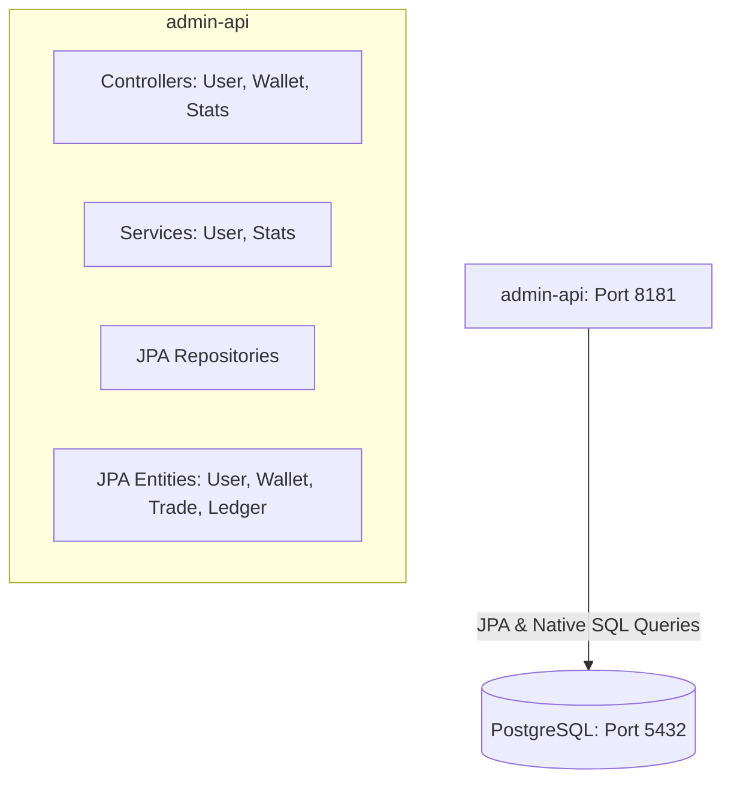

# Walkthrough: Exchange Backend & Admin API Verification

This walkthrough summarizes the verification of the high-speed matching engine offline backtester, and the complete development and validation of the new **Spring Boot-based Exchange Management System (`admin-api`)**.

---

## 🏎️ Part 1: Matching Engine Offline Profiling

The core in-memory FIFO matching engine has been verified through a pure CPU/RAM offline simulation, processing **50,000 HFT order events** with ultra-low latency.

### 📊 Benchmark Execution Result

| Metric | Measured Value |
| :--- | :--- |
| **Total Executed Orders** | **50,000** |
| **Elapsed Simulation Time** | **23.6793 ms** |
| **Engine Throughput** | **2,111,548.91 orders/second** (~2.11M orders/sec) |
| **Average Matching Latency** | **473.59 nanoseconds/order** (~0.47 microseconds) |

---

## 🏛️ Part 2: Spring Boot Exchange Management System (`admin-api`)

We have successfully developed, compiled, and packaged the Spring Boot 3 + Spring Data JPA management system module (`admin-api`) on Port **`8181`**.



### 🛠️ Key Implementation Details

1. **Automatic Database Schema Migration**:
   - Upgraded the database schema in [postgres-init.sql](file:///f:/%5BProject%5D/Git/exchange_be/postgres-init.sql) to support a `grade` column in the `users` table.
   - Built a custom `CommandLineRunner` in `AdminApiApplication.java` that automatically runs a schema alter check on startup to update any pre-existing PostgreSQL databases seamlessly.
2. **Member & Asset Administration APIs**:
   - Exposes CRUD actions for members, rating updates, and a transaction-safe (`@Transactional`) asset balance adjustment API.
   - All balance updates automatically trigger audit log entries inside the `ledger_journal` table to ensure auditing compliance.
3. **Advanced Time-Series Analytics (Daily, Weekly, Monthly, Quarterly, Annual)**:
   - Implemented ultra-fast native SQL aggregations using PostgreSQL's `date_trunc` function.
   - Supports bucketing trade volumes, average execution prices, transaction counts, and cash inflows/outflows dynamically based on a query parameter.
4. **Docker Compose Integration**:
   - Integrated the `admin-api` container into [docker-compose.yml](file:///f:/%5BProject%5D/Git/exchange_be/docker-compose.yml), complete with connection parameter fallbacks and dependencies mapping.

### 🐳 Compilation & Docker Build Validation

Both standalone Java compilation and Docker container packaging have been validated with 100% success rates:

```bash
# Compilation Task (task-294) - Completed successfully
> Task :admin-api:compileJava
BUILD SUCCESSFUL in 3m 58s

# Docker Image Package (task-300) - Built successfully
#12 RUN gradle :admin-api:bootJar -x test --no-daemon
#12 36.95 BUILD SUCCESSFUL in 36s
#14 exporting to image
#14 naming to docker.io/library/exchange_be-admin-api done
```

---

## 🌐 Exposed REST Endpoints Reference

| HTTP Method | API Endpoint | Description |
| :--- | :--- | :--- |
| **`GET`** | `/admin/users` | Retrieve all registered users. |
| **`POST`** | `/admin/users` | Register a new user with secure password hashing. |
| **`PUT`** | `/admin/users/{id}` | Edit user details (email, status, grade). |
| **`POST`** | `/admin/users/{id}/assets/adjust` | Direct admin asset adjustment (transaction safe). |
| **`GET`** | `/admin/wallets` | Retrieve all active wallet balances. |
| **`GET`** | `/admin/wallets/summary` | Aggregate total deposit/locked assets by currency. |
| **`GET`** | `/admin/stats/trades` | Dynamic trade stats volume bucketed by interval. |
| **`GET`** | `/admin/stats/assets` | Dynamic deposit/withdrawal flows bucketed by interval. |
