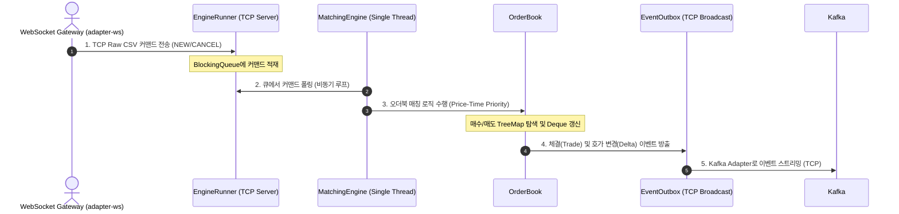

# 🌌 Java Matching Engine Core (engine-core)

순수 자바(Java) 표준 라이브러리만 사용하여 서드파티 의존성 없이 구현한 초저지연(Low-Latency) 체결 매칭 엔진 코어 모듈이다.

---

## 🏗️ 1. 아키텍처 및 내부 구조 분석

`engine-core`는 GC 오버헤드를 극소화하기 위해 객체 생성을 통제하며, 싱글 스레드 이벤트 루프를 기반으로 `TreeMap`과 `ArrayDeque`를 조합하여 오더북의 가격 시간 우선 매칭(Price-Time Priority) 로직을 처리한다.

### 📂 디렉토리 구조 및 핵심 패키지 역할

```text
engine-core/
├── src/main/java/exchange/engine/
│   ├── core/
│   │   ├── EngineRunner.java   # 🚀 엔진 메인 진입점. TCP 명령어 수신 및 이벤트 브로드캐스트 서버 구동
│   │   ├── MatchingEngine.java # ⚙️ 주문 큐(BlockingQueue)에서 명령을 꺼내 매칭하고 이벤트를 방출하는 코어 루프
│   │   └── MetricsServer.java  # 📊 프로메테우스 메트릭(/metrics) 및 스냅샷(/snapshot) 제공 HTTP 서버
│   ├── book/
│   │   └── OrderBook.java      # 📖 매수(내림차순)/매도(오름차순) 호가창 관리 및 핵심 매칭 알고리즘 구현
│   ├── command/
│   │   └── Command.java        # 📥 엔진 입력 명령어 프로토콜 (NewOrderCmd, CancelOrderCmd)
│   ├── domain/
│   │   └── Order.java          # 📦 주문, 주문 방향, 체결 결과를 정의하는 데이터 모델
│   └── event/
│       └── EventOutbox.java    # 📤 엔진에서 발생한 체결 및 변경 이벤트를 외부로 밀어내는 인터페이스
└── build.gradle                # 🔨 의존성 없는 순수 Java 기반 빌드 구성
```

---

## 🔄 2. 실시간 데이터 흐름 및 매칭 아키텍처

주문 수신부터 매칭, 이벤트 전파까지 싱글 스레드를 통해 Lock-Free에 가까운 고속 처리를 수행한다.



---

## 💾 3. 핵심 모듈 기술적 상세

### 1) 인메모리 오더북 알고리즘 (`OrderBook`)
* 매수(Bid) 호가는 가격이 높은 순서(내림차순), 매도(Ask) 호가는 가격이 낮은 순서(오름차순)가 최우선이다. 이를 위해 **`TreeMap`**을 사용하여 가격대(Price Level)를 정렬 관리한다.
* 동일 가격대 내에서는 먼저 접수된 주문이 먼저 체결되는 시간 우선 원칙을 적용하기 위해 **`ArrayDeque`**를 큐로 사용한다.

### 2) 락 프리(Lock-Free) 큐 기반 아키텍처 (`MatchingEngine`)
* 매칭 로직은 철저하게 **단일 스레드(Single Thread)**에서 동기적으로 실행된다. 멀티스레딩 환경에서 발생하는 컨텍스트 스위칭과 Lock 경합 비용을 제거하여 응답 시간을 마이크로초(µs) 단위로 단축시킨다.
* 외부 컴포넌트(게이트웨이)의 다중 요청은 스레드 안전한 `BlockingQueue`를 통해 메인 엔진 스레드로 순차 전달된다.

### 3) 이벤트 기반 아웃박스 패턴 (`EventOutbox`)
* 상태의 변경(`ACCEPT`, `DELTA`, `TRADE`, `CANCEL`)이 일어날 때마다 엔진은 데이터베이스나 외부 시스템에 직접 접근하지 않고 아웃박스 인터페이스로 이벤트를 쏴준다.
* 브로드캐스터가 이 이벤트를 모아 Kafka나 기타 메시지 브로커로 비동기 전파함으로써 메인 엔진의 성능 저하를 차단한다.

---

## 🛠️ 4. 개발 및 실행 가이드

### 네트워크 포트 명세

| 환경 변수명 | 포트 | 프로토콜 | 설명 |
| :--- | :--- | :--- | :--- |
| `COMMAND_PORT` | `9999` | TCP | 주문 및 취소 명령 접수 포트 |
| `ENGINE_PORT` | `9998` | TCP | 매칭 이벤트 브로드캐스트 스트리밍 포트 |
| `METRICS_PORT` | `9100` | HTTP | 메트릭 및 호가 스냅샷 포트 |
| `ENV_PROFILE` | `dev` | - | 로드할 환경 파일 지정 (`local`, `dev`, `qa`, `prd`) |

### 구동 방법
```bash
# 로컬 의존성 빌드 및 컴파일 실행
./gradlew :engine-core:build

# 어플리케이션 기동
./gradlew :engine-core:run
```
