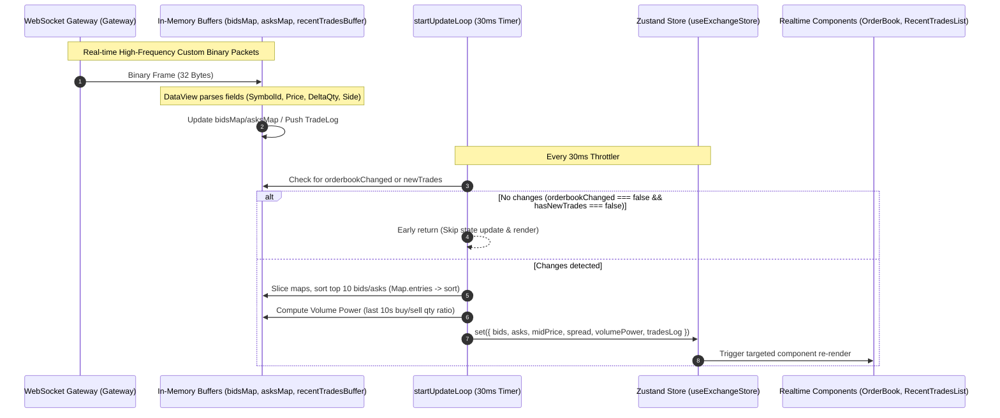
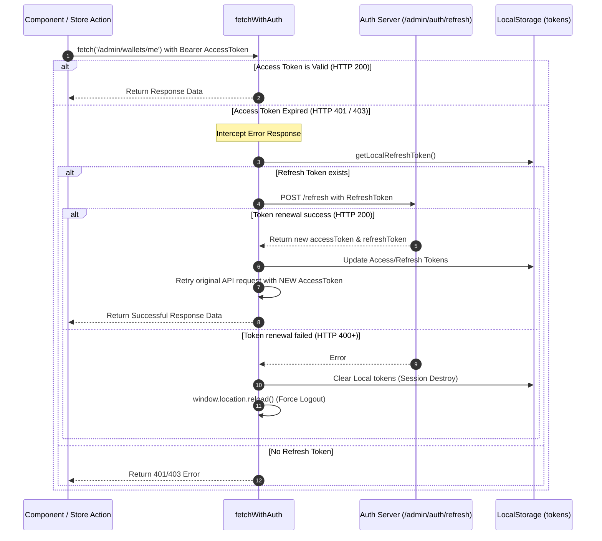
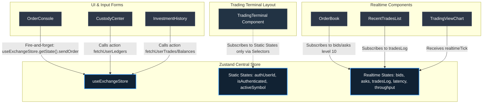

# JavaF 거래소 사용자단 웹 클라이언트 (frontend-user)

JavaF 고성능 매칭 엔진 및 실시간 게이트웨이 연동 React + TypeScript + Vite 기반 사용자 전용 고성능 웹 터미널.

---

## 🏗️ 1. 아키텍처 및 내부 구조 분석

`frontend-user` 프로젝트는 초고속 매칭엔진에서 발생하는 대규모 바이너리 시세 스트림을 효율적으로 소화하고, 렌더링 지연(Lag) 없이 사용자에게 반응형 주문 환경을 제공하기 위해 설계.

### 📂 디렉토리 구조 및 핵심 파일 역할

```text
frontend-user/
├── public/                 # 정적 리소스 및 런타임 설정 파일
│   └── config.json         # API_BASE_URL 등 브라우저 환경 호스트 동적 연동 구성
├── src/
│   ├── assets/             # 로고, 아이콘, 히어로 이미지 등 미디어 자원
│   ├── components/         # 사용자단 웹 인터페이스 독립 컴포넌트 목록
│   │   ├── TradingTerminal.tsx      # 터미널 전체 레이아웃 설계 및 오케스트레이터 (메인 콘텐트)
│   │   ├── OrderBook.tsx            # ⚡ 10단 매수/매도 실시간 호가판 및 플래시 변동 효과
│   │   ├── OrderConsole.tsx         # 📝 매수/매도 입력창 (지정가, 시장가, 예약 스탑주문)
│   │   ├── RecentTradesList.tsx     # ⚡ 실시간 거래소 전체 체결 목록 및 체결 강도 계측
│   │   ├── TradingViewChart.tsx     # 📈 Lightweight-charts 연동 실시간 시세 봉(Candle) 차트
│   │   ├── CustodyCenter.tsx        # 🔐 안전한 자산 입출금(Deposit/Withdraw) 및 거래 원장
│   │   └── InvestmentHistory.tsx    # 💼 사용자 보유 지갑 잔고, 체결 이력, 미체결 예약주문 목록
│   ├── store/              # 고성능 상태 관리 폴더
│   │   └── useExchangeStore.ts      # ⚡ 바이너리 파싱, 30ms 스로틀, RTR이 내장된 Zustand 전역 스토어
│   ├── App.css             # 터미널 레이아웃 글래스모피즘 및 다크테마 네온 스타일링
│   ├── App.tsx             # 라우팅 가드 및 로그인 모달 배치
│   ├── index.css           # 글로벌 테일윈드/CSS 변수 정의
│   ├── main.tsx            # 리액트 렌더링 부트스트랩 진입점
│   ├── tsconfig.json       # 컴파일 구성
│   └── vite.config.ts      # 빌드 최적화 및 빌드 타겟 번들 설계
```

---

## 🔄 2. 실시간 시세 및 배치 스로틀링

웹소켓을 통해 초당 수천 개씩 유입되는 시세 변경 패킷을 매번 Zustand 상태로 설정하고 React 컴포넌트를 리렌더링하면 극심한 화면 끊김과 브라우저 행(Hang) 현상이 발생. 이를 최적화하기 위해 **인메모리 버퍼링 및 30ms 주기의 스로틀 업데이트 기법** 적용.

### ⚡ 웹소켓 바이너리 처리 및 30ms 배치 스로틀링 흐름



### 📦 32바이트 바이너리 패킷 레이아웃 구조
웹소켓 성능 극대화를 위해 JSON 포맷 대신 고밀도 바이너리 ArrayBuffer 스키마 수신:

| 오프셋 (Offset) | 크기 (Size) | 타입 (Type) | 의미 (Description) |
|:---|:---|:---|:---|
| `00 ~ 03` | 4 bytes | `Int32` | **Symbol ID** (예: "BTC-USD"의 고유 자바 해시코드) |
| `04 ~ 11` | 8 bytes | `Int64` | **Timestamp** (매칭 엔진 타임스탬프) |
| `12 ~ 19` | 8 bytes | `BigInt64` | **Price** (가격 정보, 소수점 보존을 위해 원본 x100 정수형) |
| `20 ~ 27` | 8 bytes | `BigInt64` | **Delta Qty** (호가 잔량 변동분, 체결 시 음수 형태 전달) |
| `28 ~ 31` | 4 bytes | `Int32` | **Order Side** (0 = Bid/매수, 1 = Ask/매도) |

---

## 🔐 3. Refresh Token Rotation(RTR) 기반 세션 유지 및 복구 인증 구조

보안 강화를 위해 Access Token이 만료(401/403)되었을 때 사용자의 세션을 유지하며 백그라운드에서 만료 토큰을 새 토큰 쌍으로 자동 갱신하는 RTR 래퍼 내장.

### 🔐 Refresh Token Rotation(RTR) 흐름



---

## 🎯 4. 컴포넌트 간 데이터 의존성 및 Zustand 구독 최적화

불필요한 리렌더링 전파를 방지하기 위해, 상태 성격(정적 상태 vs 실시간 상태)에 맞춰 컴포넌트 단위로 구독 셀렉터(`Selector`)가 세분화되어 구성

### 📊 컴포넌트간 의존성 및 상태 흐름 최적화



---

## 🛠️ 5. 개발 및 프로덕션 운영 가이드

### 실행 및 빌드 명령어
```bash
# 의존성 패키지 설치
npm install

# 로컬 개발 서버 기동 (핫 리로딩 제공)
npm run dev

# 타입 검사 및 프로덕션 빌드 컴파일
npm run build
```

### 도커(Docker) 기반 컨테이너 배포
```bash
# 프론트엔드 유저 웹 어플리케이션 전용 백그라운드 무중단 배포
docker compose up -d --build frontend-user
```

### 💡 프론트엔드 핵심 성능 튜닝 내역
1. **Zustand Selector 완전 적용**: `const { authEmail } = useExchangeStore()`와 같이 구조분해 할당으로 전체 스토어를 무한 루프 구독하던 구조를 `const authEmail = useExchangeStore(state => state.authEmail)` 셀렉터 구문으로 교체, 실시간 데이터가 30ms 단위로 요동칠 때 정적 컴포넌트들이 불필요하게 렌더링되던 비효율을 완벽히 잡음.
2. **ResizeObserver 무한 루프 우회**: 차트 크기가 변할 때 브라우저가 레이아웃을 다시 연산하면서 `ResizeObserver loop completed with undelivered notifications` 에러를 뿜는 현상을 예방하기 위해, 차트 렌더 컨테이너의 부모 엘리먼트(`parentElement`) 크기를 동적 감시 및 제어하도록 안전 장치를 더함.
3. **Zustand `.getState()` 사용**: 주문 전송 폼(`OrderConsole.tsx`)에서 주문 전송 등 단순 호출용 일회성 액션을 사용할 때는 컴포넌트 자체를 구독하지 않고 `useExchangeStore.getState().sendOrder(...)` 인터페이스를 직접 활용해 리렌더링 유발 점수를 0으로 통제하고 있음.
4. **TypeScript verbatimModuleSyntax 준수 및 Lightweight Charts v5 최적화**: 타입스크립트의 엄격한 ESM 모듈 번들 컴파일 규격(`verbatimModuleSyntax`)을 충족하기 위해 value 임포트와 type-only 임포트를 완전 분리하고, Lightweight Charts v5 스펙에 부합하도록 통합 시리즈 API(`addSeries`)로 선언함으로써 컴파일 속도와 안정성을 대폭 끌어올림.

