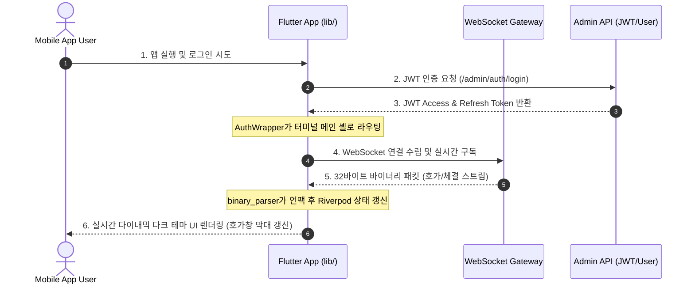

# 📱 JavaF 모바일 클라이언트 (mobile-user)

JavaF 고성능 매칭 엔진과 실시간 웹소켓 게이트웨이에 연동하여 거래 서비스를 모바일 앱(Android/iOS) 및 크로스 플랫폼 환경에서 이용할 수 있도록 구축한 Flutter 애플리케이션이다.

---

## 🏗️ 1. 아키텍처 및 내부 구조 분석

Flutter와 Riverpod 상태 관리를 기반으로 구축되었으며, 실시간 바이너리 웹소켓 통신과 JWT 기반 인증을 통해 빠르고 안전한 모바일 트레이딩 환경을 제공한다.

### 📂 디렉토리 구조 및 핵심 패키지 역할

```text
mobile-user/
├── android/            # 🤖 Android 네이티브 빌드 파일 설정
├── ios/                # 🍏 iOS 네이티브 빌드 파일 설정
├── linux/              # 🐧 Linux 데스크톱 빌드 파일 설정
├── lib/
│   ├── main.dart       # 🚀 앱 메인 진입점. 테마 설정 및 전역 라우팅(인증 분기) 처리
│   ├── providers/      # 📦 Riverpod 전역 상태 관리 (exchange_provider.dart 등)
│   ├── screens/        # 🖥️ UI 화면 구성 (Exchange, Assets, My Page 등 탭 화면)
│   └── utils/          # ⚙️ 유틸리티 모음 (binary_parser.dart 등 바이너리 언팩 기능)
└── pubspec.yaml        # 📦 Flutter 패키지 의존성 및 프로젝트 메타 정보 관리
```

---

## 🔄 2. 실시간 데이터 흐름 및 핵심 아키텍처

로컬 또는 원격 게이트웨이와 웹소켓을 통해 양방향 통신을 수행하며, UI를 60fps로 부드럽게 렌더링한다.



---

## 💾 3. 핵심 모듈 기술적 상세

### 1) 실시간 32바이트 바이너리 패킷 파싱 (`binary_parser.dart`)
* 게이트웨이에서 초고속으로 전송되는 바이너리 스트림 데이터를 수신한다.
* Dart의 `ByteData`를 활용해 빅 엔디안(Big Endian) 포맷의 32바이트 바이너리를 파싱하여 메모리 점유와 역직렬화 병목을 극도로 최적화했다.

### 2) Riverpod 상태 관리 기반 동적 렌더링 (`exchange_provider.dart`)
* 실시간 호가 정보, 체결 히스토리, 웹소켓 연결 상태를 반응형으로 관리한다.
* 최초 기동 시 HTTP 호가 스냅샷 API를 호출하여 베이스라인을 맞추고, 이후 웹소켓 델타 이벤트를 누적한다. 
* 매 프레임별 체결강도(Volume Power) 등 복잡한 실시간 지표도 부드럽게 재연산한다.

### 3) JWT 인증 및 무상태 자산 연동 아키텍처
* **인가 보안 강화**: Access Token의 `userId` 클레임을 로컬 디코딩하여 서버의 본인 인증 무상태 API(`/admin/wallets/me`)만 호출하도록 설계했다. 일반 권한자의 데이터 월권 조회를 원천 차단한다.
* **프리미엄 UI/UX**: 모바일 다크 터미널 테마를 바탕으로 거래소 탭, 자산 자동 환산(KRW/USD) 탭, 마이 페이지 탭을 제공하여 사용성을 극대화했다.

---

## 🛠️ 4. 개발 및 실행 가이드

크로스 플랫폼 앱이므로 Flutter SDK 환경에서 플랫폼에 관계없이 단일 코드베이스(`lib/`)로 빌드 및 실행한다.

> [!NOTE]
> **백엔드 접속 IP 자동 감지**:
> - 기본 실행 시 기기에 맞춰 로컬 백엔드로 자동 연결된다. (데스크톱/웹: `127.0.0.1`, 안드로이드 에뮬레이터: `10.0.2.2`)
> - **외부 서버 연동 시**: `flutter run --dart-define=API_HOST=<호스트_IP>` 옵션을 부착해야 한다.

### 🐧 WSL (Linux) 환경 가이드
```bash
# 위젯 단위 테스트
/home/administrator/sdk/flutter/bin/flutter test

# 앱 실행 (개발/디버그 모드)
/home/administrator/sdk/flutter/bin/flutter run

# 리눅스 네이티브 창 구동 (최초 1회 create 후)
/home/administrator/sdk/flutter/bin/flutter run -d linux
```

### 💻 Windows 호스트 PC 환경 가이드
```cmd
# 의존성 패키지 설치
flutter pub get

# 연결된 디바이스/에뮬레이터에서 실행
flutter run

# PC 데스크톱 독립 창 구동
flutter run -d windows
```
